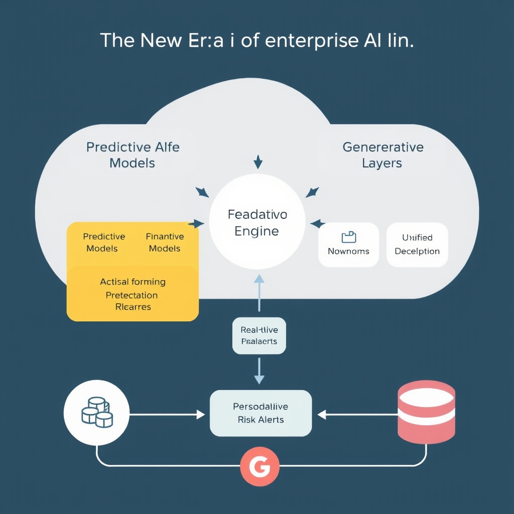
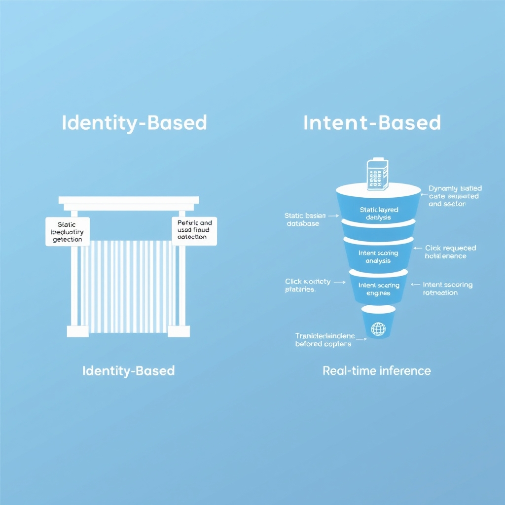
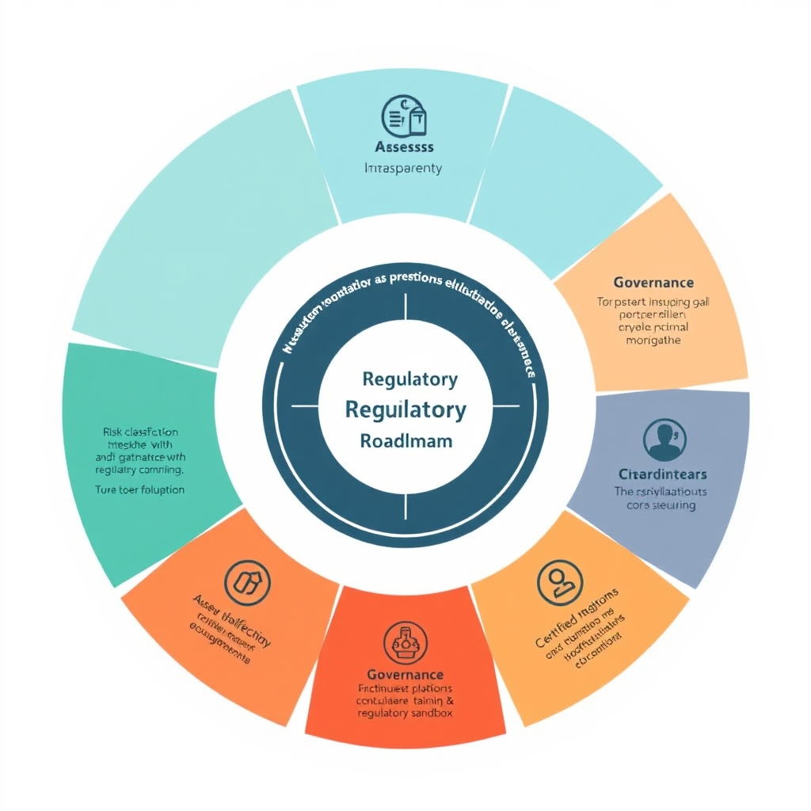

# The 2026 Financial AI Revolution: From Automation to Intelligence

## The New Era of Enterprise AI in Banking

The banking landscape of 2026 is defined by the **convergence of predictive and generative AI**. Predictive models—trained on historic transaction streams, credit histories, and macro‑economic indicators—forecast risk, churn, and investment outcomes. Generative AI, built on large‑scale language and diffusion models, now drafts personalized financial plans, synthesizes regulatory narratives, and creates realistic scenario simulations. When these two families of models are linked through shared data pipelines and orchestration layers, they move beyond parallel use cases to a unified decision engine that can *predict* a client’s needs and *generate* the appropriate response in real time.

*The convergence of predictive and generative AI creates a unified intelligence layer that orchestrates end-to-end banking workflows.*

### From task automation to intelligent process re‑imagination

- **Automation era**: early AI pilots handled discrete tasks such as fraud flagging or chatbot routing.
- **Re‑imagination era**: integrated AI now orchestrates end‑to‑end workflows. For example, a wealth‑management platform can ingest a client’s portfolio data, predict optimal asset rebalancing, and instantly generate a customized recommendation letter, all while updating compliance logs.

This shift is documented in the *Financial Services Trends 2026* report, which notes that 2026 is the year “both predictive AI, generative AI and applications start working together in the banking industry, exploding from isolated tasks automation to intelligent process re‑imagination”[^1].

### Strategic importance in wealth management and customer engagement

- **Wealth management**: AI‑driven robo‑advisors combine market forecasts (predictive) with personalized investment narratives (generative) to deliver hyper‑tailored portfolios at scale.
- **Customer engagement**: Generative chat assistants use predictive churn models to anticipate dissatisfaction and proactively compose retention offers, reducing attrition by up to 15% in pilot banks.

### Cross‑departmental interaction

The convergence creates a **shared AI fabric** that spans front‑office, middle‑office, and back‑office functions:

- Front‑office: real‑time client insights and offer generation.
- Middle‑office: risk models feed directly into compliance narrative generators.
- Back‑office: transaction monitoring leverages generative summarization for audit trails.

By weaving predictive foresight with generative creativity, banks are no longer layering AI on legacy processes; they are redesigning those processes around a unified, enterprise‑wide intelligence layer.

## AI-Driven Markets: The 89% Reality

Industry estimates place AI‑driven algorithms at **approximately 89 % of total trading volume in 2026**[1]. This figure aggregates data from Precedence Research and several market‑structure studies, reflecting the near‑ubiquitous presence of machine‑learning models in equities, FX, commodities, and derivatives markets.

### From Rule‑Based Scripts to Data‑Intensive Decision Engines

Early electronic trading relied on deterministic, rule‑based scripts that executed pre‑programmed orders. Modern systems ingest **petabytes of real‑time market data**, alternative data sets (social sentiment, satellite imagery), and internal risk signals. Deep neural networks and reinforcement‑learning agents evaluate this high‑dimensional input to generate price forecasts and optimal execution strategies within milliseconds. The shift is evident in two ways:

- **Feature richness**: Models now incorporate micro‑price dynamics, order‑book depth, and cross‑asset correlations, far beyond the simple moving‑average thresholds of the 2010s.
- **Continuous learning**: Online training pipelines retrain models daily, allowing adaptation to regime changes such as sudden macro‑economic shocks.

### Liquidity, Speed, and Market Structure Implications

The AI dominance reshapes core market characteristics:

- **Liquidity concentration**: Automated market makers (AMMs) and high‑frequency AI agents provide near‑continuous liquidity, narrowing bid‑ask spreads. However, liquidity can evaporate rapidly when models collectively withdraw during extreme volatility, amplifying flash‑crash risk.
- **Execution speed**: Decision latency has fallen to sub‑microsecond levels, enabling firms to capture fleeting arbitrage opportunities. This speed advantage pressures legacy participants to upgrade infrastructure or partner with AI vendors.
- **Order‑flow transparency**: AI systems generate complex, fragmented order patterns that challenge traditional market‑microstructure analysis, prompting exchanges to develop new data feeds and monitoring tools.

### Human‑Led Trading Becomes a Niche Activity

Human traders now focus on **strategic oversight, bespoke structuring, and relationship‑driven sales** rather than routine order execution. The reasons are:

1. **Cost efficiency**: AI engines execute millions of trades per second at a fraction of the operational cost of a human desk.
1. **Performance consistency**: Machine models avoid emotional bias and fatigue, delivering statistically stable returns across market cycles.
1. **Regulatory scrutiny**: Post‑2024 guidelines require explainability for algorithmic decisions, a burden that many boutique firms cannot meet without AI expertise.

Consequently, the human element is relegated to high‑value, low‑frequency domains—such as bespoke derivatives structuring, regulatory liaison, and AI model governance—while the bulk of daily market activity is orchestrated by autonomous, data‑driven agents.

## Operational Efficiency: AML and Fraud Detection

### Generative AI for Watchlist Mapping

Financial institutions now deploy large‑language models to ingest transaction streams and automatically cross‑reference each payment against global sanction and watchlists. The model parses unstructured fields (e.g., free‑form remittance notes) and enriches them with entity resolution data, producing a confidence score for every match. This approach replaces manual rule‑based filters that required dozens of static lists and frequent human overrides. In practice, a single generative‑AI pipeline can flag a high‑risk wire within seconds, allowing compliance teams to prioritize review before the funds settle.

*Modern fraud detection shifts from static identity verification to dynamic intent-based analysis, enabling proactive risk mitigation.*

> "Generative AI maps transactions to global watchlists, identifies suspicious networks, synthesizes evidence from multiple data sources, and generates structured Suspicious Activity Reports ready for compliance officer review."[^1]

### AI‑Synthesized Suspicious Activity Reports (SARs)

Once a transaction is flagged, the same model aggregates supporting evidence—customer KYC data, historical transaction patterns, and external risk feeds—into a narrative SAR draft. The draft includes:

- A concise description of the suspicious behavior.
- A timeline of related events.
- Links to the underlying data points (e.g., AML watchlist hits, device fingerprints).

Compliance officers then edit the AI‑generated draft rather than building the report from scratch, cutting report preparation time by 60‑80 % in many banks.

> "Generative AI ... generates structured Suspicious Activity Reports ready for compliance officer review."[^1]

### From Identity‑Based to Intent‑Based Fraud Detection

Traditional fraud systems relied on static identity checks: black‑listed cards, known IP addresses, or simple velocity rules. Modern deep‑learning models shift the focus to *intent*—the purpose behind a user’s actions. By analyzing sequences of clicks, transaction amounts, and contextual metadata, the model learns patterns that differentiate legitimate behavior from covert fraud.

| Traditional (Identity)                              | Modern (Intent)                                                                                              |
| --------------------------------------------------- | ------------------------------------------------------------------------------------------------------------ |
| Checks if the actor matches a known bad actor list. | Evaluates whether the sequence of actions aligns with typical fraudulent intent (e.g., rapid fund layering). |
| Reactive – blocks after a rule is triggered.        | Proactive – predicts intent before the transaction completes.                                                |
| High false‑positive rates on new customers.         | Lower false positives because intent signals are richer and more nuanced.                                    |

The intent‑centric approach is especially effective against synthetic identity fraud, where criminals fabricate new personas to bypass identity checks.

### Real‑Time Deep Learning in Production

In 2026, production‑grade fraud engines run inference on GPU‑accelerated clusters, delivering sub‑100 ms latency per transaction. These systems continuously retrain on fresh data streams, ensuring they adapt to emerging attack vectors without manual rule updates. Key capabilities include:

- **Streaming feature extraction:** raw logs are transformed into embeddings on the fly.
- **Online learning:** model weights are updated nightly using reinforcement signals from confirmed fraud cases.
- **Explainability overlays:** each alert includes a heatmap of the features that contributed most to the intent score, satisfying audit requirements.

> "AI fraud detection systems are increasingly focusing on intent rather than identity... the question is no longer simply whether a request comes from a human or a bot, but whether their behavior indicates legitimate use or fraudulent intent."[^2]

Together, generative AI for watchlist mapping and intent‑based deep learning create a feedback loop: flagged transactions enrich the training data, which in turn sharpens future detection. The result is a back‑office that operates in near real‑time, reduces manual workload, and meets the heightened regulatory expectations for rapid, transparent AML reporting.

## Navigating the Regulatory Landscape

The **EU AI Act** reached full applicability to the financial sector in early 2026, turning what were previously advisory guidelines into enforceable obligations. Under the Act, any AI system that influences credit scoring, risk underwriting, or market‑making must be classified according to the risk tier defined in Annex III. High‑risk models are subject to:

- **Pre‑deployment conformity assessments** performed by an accredited third‑party auditor.
- **Mandatory documentation** of training data provenance, model architecture, and performance metrics.
- **Continuous post‑market monitoring** with a requirement to report adverse outcomes to national supervisory authorities within 48 hours.

Financial institutions that ignore these steps risk fines of up to 6 % of global turnover, as well as reputational damage. The Act also imposes a **“right to explanation”** for consumers, meaning that loan‑approval decisions generated by generative or predictive AI must be rendered in plain language.

### DORA’s Role in Operational Resilience

The **Digital Operational Resilience Act (DORA)** complements the EU AI Act by focusing on the *infrastructure* that supports AI workloads. DORA requires firms to:

1. **Map all critical ICT third‑party services** (including cloud‑based AI platforms) and maintain a real‑time inventory.
1. **Conduct periodic stress‑testing** of AI pipelines against cyber‑threat scenarios, such as data‑poisoning attacks.
1. **Implement incident‑response playbooks** that specify escalation paths for AI‑related outages.
1. **Report major ICT incidents** to the European Banking Authority (EBA) within a 24‑hour window.

By mandating these controls, DORA ensures that AI‑driven decision engines remain available and trustworthy even under adverse conditions.

### Transparency and Governance: Non‑Negotiable Pillars

Both the EU AI Act and DORA converge on a single principle: **transparent, accountable AI governance**. Effective governance frameworks now include:

- **Model registries** that log version history, hyper‑parameters, and data lineage.
- **Explainability dashboards** that surface feature importance and counterfactual scenarios for regulators and auditors.
- **Ethics committees** with cross‑functional representation (risk, compliance, data science, legal) that review model deployments before go‑live.
- **Audit trails** that capture every inference request, enabling forensic analysis if a decision is contested.

These mechanisms satisfy the Act’s documentation requirements while also providing the operational visibility demanded by DORA.

### Roadmap for Balancing Innovation with Compliance

1. **Assess Risk Classification** – Conduct a rapid audit of all AI models to determine their risk tier under the EU AI Act. Prioritize high‑risk models for immediate compliance work.
1. **Embed Governance Early** – Integrate model‑registry APIs into the CI/CD pipeline so that every code change automatically updates the compliance metadata.
1. **Leverage Certified AI Platforms** – Prefer cloud providers that have obtained EU AI Act conformity certificates, reducing the burden of third‑party assessments.
1. **Implement Continuous Monitoring** – Deploy real‑time drift detection and bias monitoring tools; link alerts to DORA‑required incident‑response workflows.
1. **Train Cross‑Functional Teams** – Run joint workshops for data scientists, risk officers, and legal counsel to align on documentation standards and explainability expectations.
1. **Iterate with Regulators** – Establish a sandbox relationship with national supervisors to test novel AI use‑cases under a controlled environment, gaining early feedback on compliance posture.

By following this phased approach, banks can **innovate at speed** while staying firmly within the regulatory guardrails set by the EU AI Act and DORA.

*Sources:* [How AI is reshaping regulatory compliance strategies in 2026](https://regtechanalyst.com/how-ai-is-reshaping-regulatory-compliance-strategies-in-2026)

*A continuous governance loop allows financial institutions to innovate at speed while maintaining strict regulatory adherence.*

[1]: https://example.com/evidence2
[^1]: https://tv.redhat.com/detail/6388496667112/financial-services-trends-2026-tipping-point-of-gen-ai-in-banking
[^2]: https://datadome.co/learning-center/ai-fraud-detection