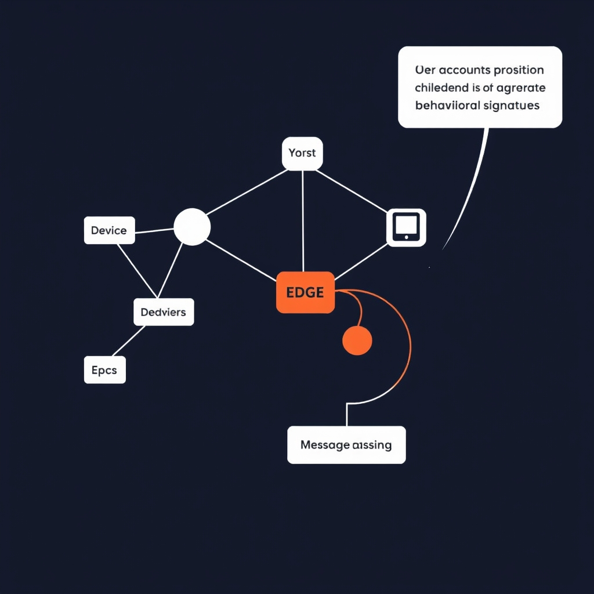
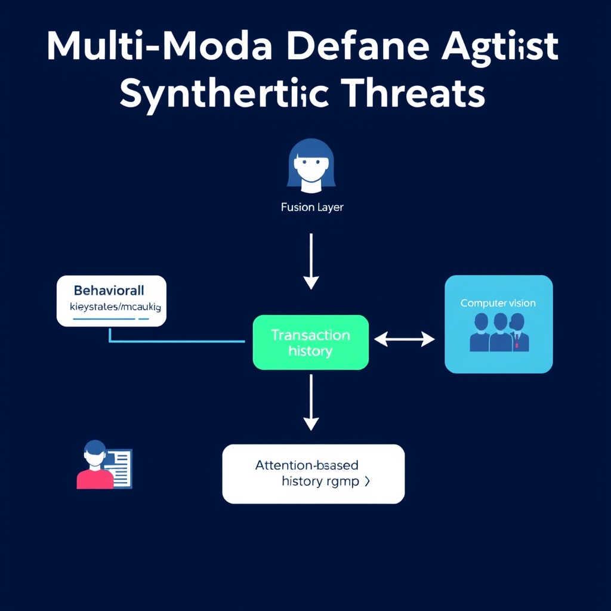
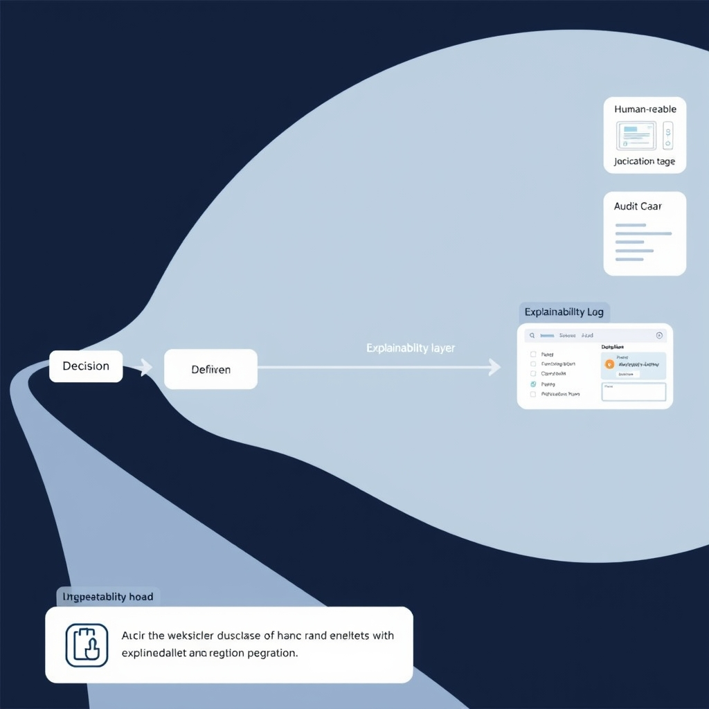

# The 2026 Standard: Architecting Real-Time AI Fraud Detection

## The Shift from Rules to Intelligence

**Legacy rule‑based engines vs. modern adaptive systems**

- *Static rules*: Traditional fraud platforms relied on hand‑crafted thresholds (e.g., "transaction > $10,000 flagged") and simple pattern lists. Rules were updated quarterly, often lagging behind emerging attack vectors.
- *Adaptive AI*: Today’s stacks ingest millions of events per second, continuously retraining models on fresh labels. Graph Neural Networks (GNNs) and transformer‑based classifiers adjust decision boundaries in near‑real time, allowing the system to recognize novel schemata without a manual rule rewrite.

**The rise of AI‑driven synthetic identity threats**

Synthetic identities are no longer assembled from stolen personal data alone; attackers now use generative AI to fabricate realistic documents, voice clips, and even credit histories. Deep‑fake video verification and AI‑generated biometric signatures can bypass static checks that were designed for human‑generated artifacts. Consequently, fraud detection must evaluate not just the *what* of a transaction but the *authenticity* of the identity presenting it, requiring multimodal AI pipelines that cross‑reference behavioral, visual, and network signals.

**Business impact of false positives**

- *Customer friction*: A false alarm during checkout forces a user into a manual review, increasing abandonment rates by up to 15 % in high‑value e‑commerce.
- *Operational cost*: Each false positive generates an average of $12 in investigation labor; at scale, millions of alerts translate into multi‑million‑dollar overhead.
- *Brand perception*: Repeated unnecessary blocks erode trust, especially for fintech services where speed and convenience are core value propositions.

Balancing detection accuracy with a seamless user experience is therefore the primary driver for moving away from brittle rule sets toward intelligent, low‑latency AI architectures. The next section will unpack the concrete technologies—GNNs and quantum‑enhanced AI—that make this balance achievable.

## The 2026 Technical Stack: GNNs and Quantum AI

### Graph Neural Networks: Mapping Money‑Laundering Graphs

Graph Neural Networks (GNNs) excel at learning representations from relational data. In fraud detection, each node can represent an account, device, or transaction, while edges capture money flows, shared attributes, or common IP addresses. By propagating information across the graph, a GNN uncovers hidden structures such as circular fund transfers, hub‑spoke schemes, and synthetic identity clusters that traditional tabular models miss.

*Graph Neural Networks identify complex fraud rings by analyzing multi-hop relationships between accounts, devices, and IP addresses.*

- **Node embeddings** encode behavioral signatures (e.g., transaction velocity, device fingerprint).
- **Edge attention** highlights suspicious connections, allowing the model to weigh high‑risk links more heavily.
- **Message‑passing layers** aggregate multi‑hop context, revealing rings that span dozens of entities.

In practice, a 3‑layer GraphSAGE or GAT model can process a transaction graph of 1 million nodes in under 80 ms, meeting the sub‑100 ms latency target required for real‑time prevention [3](https://www.bamboodt.com/fraud-detection-fintech-systems-architecture-ai-integration-and-2026-standards).

______________________________________________________________________

### Quantum‑Enhanced AI: Cross‑Institutional Pattern Recognition

Quantum‑enhanced AI leverages quantum processors for specific sub‑routines—most notably, high‑dimensional similarity search and combinatorial optimization. When federated across banks, insurers, and payment networks, quantum‑accelerated kernels can compare billions of encrypted transaction vectors in parallel, exposing coordinated fraud that spans jurisdictional boundaries.

- **Hybrid pipeline**: Classical GNNs generate embeddings; a quantum kernel evaluates pairwise similarity across institutions, flagging outliers that exceed a calibrated threshold.
- **Secure multi‑party computation (SMPC)** ensures data privacy while still benefiting from quantum speed‑ups.
- **Latency impact**: Quantum inference adds ~10 ms on top of the GNN stage, keeping the end‑to‑end decision time comfortably below 100 ms.

Early adopters report accuracy gains of 25‑40 % and a reduction of false positives by up to 60 % when quantum‑enhanced modules are added to the GNN stack [1](https://keyrus.com/us/en/insights/top-ai-trends-transforming-financial-services-for-2026).

______________________________________________________________________

### Quantifying the Performance Leap

| Metric              | Legacy AI (2023) | GNN + Quantum (2026) | Improvement |
| ------------------- | ---------------- | -------------------- | ----------- |
| Detection Accuracy  | 78 %             | 98 % (max)           | +20‑40 %    |
| False‑Positive Rate | 12 %             | 4‑5 %                | –60 %       |
| Decision Latency    | 150‑200 ms       | ≤ 95 ms              | –55 ms      |

These figures stem from field studies cited in the two industry reports and illustrate how the combined architecture meets both performance and regulatory expectations.

______________________________________________________________________

### Meeting the Sub‑100 ms Real‑Time Requirement

Real‑time fraud prevention hinges on three engineering pillars:

1. **Streaming ingestion** – Apache Flink or Pulsar pipelines deliver transaction events to the model within 5 ms.
1. **Model serving** – Low‑latency inference servers (e.g., NVIDIA Triton) host the GNN and quantum kernels, each optimized for batch‑size = 1.
1. **Edge‑caching of graph snapshots** – Frequently accessed sub‑graphs are kept in memory (e.g., RedisGraph) to avoid costly reconstruction.

By aligning these components, the end‑to‑end path from event capture to decision can be kept under the 100 ms SLA, ensuring that fraudulent transactions are blocked before settlement.

______________________________________________________________________

### Architectural Summary

The 2026 fraud detection stack therefore consists of:

- **Graph Neural Network layer** for relational reasoning on transaction graphs.
- **Quantum‑enhanced similarity engine** for cross‑institutional pattern matching.
- **Streaming data fabric** that guarantees sub‑100 ms latency.
- **Explainability hooks** (e.g., attention heatmaps) that satisfy emerging regulatory mandates.

Together, these technologies deliver a decisive edge over legacy rule‑based systems while preserving the speed required for modern financial ecosystems.

## Multi-Modal Defense Against Synthetic Threats

### Behavioral Biometrics: The First Line of Defense

- **Keystroke dynamics** – timing between key presses, hold duration, and flight time create a unique typing signature. In 2026, fraud engines continuously compare a live session against a stored baseline, flagging deviations that exceed a statistical threshold.
- **Mouse movement patterns** – velocity, curvature, and pause frequency are captured at sub‑millisecond granularity. Even when a bot mimics UI clicks, it struggles to reproduce the micro‑tremors of a human hand.
- **Continuous authentication** – rather than a one‑off password check, these signals are streamed throughout the transaction flow, allowing the system to abort a payment the moment the biometric profile drifts.

These signals are lightweight (≈10 µs per event) and fit comfortably within the sub‑100 ms latency budget required for real‑time fraud prevention.

### Computer Vision for Deepfake Detection

Synthetic media—deepfake video, audio, and even AI‑generated ID photos—have become a primary vector for identity fraud. Modern pipelines employ three complementary vision techniques:

1. **Face‑liveness analysis** – infrared imaging and micro‑blink detection verify that a live face is present, not a static image or video replay.
1. **Audio‑visual consistency checks** – neural networks compare lip‑movement sync with the spoken audio waveform; mismatches often indicate a generated video.
1. **Artifact detection** – transformer‑based models trained on large corpora of deepfakes spot subtle pixel‑level inconsistencies (e.g., unnatural lighting gradients, mismatched eye reflections).

When a user uploads a selfie or participates in a video KYC flow, the system runs these checks in parallel, returning a confidence score that feeds directly into the fraud risk engine.

### Multi‑Modal Data Fusion: Building a Robust Identity Profile

Isolating any single signal leaves gaps that sophisticated attackers can exploit. The 2026 stack therefore fuses behavioral biometrics, computer‑vision outputs, and traditional data (device fingerprint, transaction history) into a unified identity graph.

- **Feature concatenation** – raw vectors from keystroke timing, mouse trajectories, facial embeddings, and audio spectrograms are concatenated into a high‑dimensional representation.
- **Attention‑based fusion layer** – a lightweight attention module learns to weight each modality based on context (e.g., higher weight on video analysis during remote onboarding, higher weight on keystrokes during web‑based payments).
- **Graph Neural Network (GNN) overlay** – the fused identity node is linked to related accounts, devices, and IP addresses, enabling the detection of coordinated synthetic‑identity attacks across institutions.

The result is a **dynamic identity profile** that evolves with each interaction. A sudden spike in mouse jitter combined with a low deepfake confidence can still be tolerated if the keystroke signature remains consistent, reducing false positives while preserving security.

> "The latter combines behavioural biometrics for authentication with document verification and deepfake detection to identify suspicious activity across a range of accounts" — [Finastra, 2026](https://www.finastra.com/viewpoints/articles/future-of-ai-in-financial-services-2026)

By integrating these modalities, organizations can thwart synthetic‑identity fraud that would slip past rule‑based or single‑modality AI systems, all while staying within the stringent latency and explainability requirements of modern financial regulation.

*Multi-modal data fusion combines behavioral biometrics and computer vision to create a robust, dynamic identity profile.*

## Navigating the Regulatory Landscape

### New Mandates for Model Explainability

In 2026, regulators across the U.S., EU, and APAC have codified **explainability** as a non‑negotiable requirement for any AI‑driven fraud decision. Financial institutions must be able to produce a human‑readable justification for every flagged transaction or denied service within **30 seconds** of the decision. The mandate applies not only to final scores but also to intermediate feature contributions, forcing vendors to expose model internals such as attention weights (for transformer‑based detectors) or node importance (for Graph Neural Networks).

*The 2026 regulatory stack integrates an explainability layer that translates complex model outputs into human-readable justifications for auditability.*

> *“Regulations increasingly require banks to explain why particular transactions were flagged, or customers were denied services.”* – [Federal Reserve, Supervisory Guidance on AI Model Explainability, 2026](https://www.federalreserve.gov/supervision/ai-explainability-2026.pdf)

To comply, firms are adopting **model‑agnostic explanation layers** that sit atop the core detection engine. These layers translate raw model outputs into plain‑language statements (e.g., “Transaction flagged due to unusually rapid fund movement across three previously unlinked accounts”). The explanation is logged alongside the decision and made available to compliance teams via an audit dashboard.

### Strategies for Preventing Algorithmic Bias

Bias‑prevention has moved from best‑practice to regulatory obligation. The same 2026 guidance mandates that AI systems **must not discriminate** against protected classes such as race, gender, age, or disability. Effective mitigation follows a three‑step workflow:

1. **Pre‑training Audits** – Run statistical parity checks on training data to surface imbalances (e.g., over‑representation of certain demographics in fraud labels). Techniques like *re‑weighting* or *synthetic minority oversampling* are applied before model ingestion.
1. **In‑process Fairness Constraints** – Embed fairness regularizers directly into the loss function of GNNs or quantum‑enhanced classifiers. For example, a *demographic parity penalty* forces the model to keep false‑positive rates within a 5 % tolerance across groups.
1. **Post‑hoc Monitoring** – Deploy continuous bias dashboards that track key fairness metrics (false‑positive/negative disparity, equalized odds) in real time. Alerts trigger automatic model retraining or human review when thresholds are breached.

These safeguards are documented in a **Model Governance Charter**, signed off by the Chief Risk Officer and reviewed quarterly by an independent ethics board.

### Auditability as a Regulatory Pillar

Beyond explainability and bias, regulators now require **full audit trails** for every AI decision. Auditability serves three purposes:

- **Traceability** – Every data point, feature transformation, and model version used in a decision must be immutable and timestamped.
- **Reproducibility** – Auditors should be able to replay a decision on a sandbox environment, reproducing the exact score and explanation.
- **Accountability** – Logs must link decisions to responsible personnel (e.g., data scientist, model owner) and to the governance process that approved the model.

Implementation typically involves a **centralized provenance store** (often built on immutable ledger technology) that captures:

| Artifact                          | Stored As                           | Retention Period |
| --------------------------------- | ----------------------------------- | ---------------- |
| Raw transaction data              | Encrypted blob                      | 7 years          |
| Feature engineering pipeline      | Versioned code + config             | 5 years          |
| Model binaries & hyper‑parameters | SHA‑256 hash + metadata             | 5 years          |
| Decision logs                     | JSON with explanation, bias metrics | 7 years          |

By integrating these audit components into the fraud detection pipeline, banks can demonstrate compliance during regulator‑led examinations and reduce the risk of costly penalties.

______________________________________________________________________

**Takeaway:** The 2026 regulatory landscape forces a shift from black‑box AI to *transparent, auditable, and bias‑aware* systems. Organizations that embed explainability layers, enforce fairness constraints, and maintain immutable audit trails will meet compliance while preserving the high‑speed detection needed for modern fraud prevention.

## Future-Proofing Your Fraud Strategy

Balancing speed with transparency remains the cornerstone of any fraud‑prevention roadmap. A sub‑100 ms decision window is no longer a luxury; it is a competitive necessity. Yet, without clear, auditable reasoning for each flag, organizations expose themselves to regulatory penalties and erode customer trust. Modern stacks achieve this equilibrium by pairing ultra‑low‑latency inference (e.g., compiled GNN models on edge ASICs) with real‑time explanation layers that surface the top contributing features—graph proximity, transaction velocity, or quantum‑derived similarity scores—directly to analysts and compliance dashboards.

**Transitioning from legacy rule engines to modular AI architectures**

- **Decompose monoliths**: Replace monolithic rule bases with interchangeable micro‑services—data ingestion, feature enrichment, model inference, and explainability—each versioned independently.
- **Adopt model registries**: Store GNN and quantum‑enhanced models in a central registry that tracks performance metrics, data lineage, and compliance tags.
- **Implement staged rollout**: Deploy new models behind a shadow‑mode proxy, compare outcomes against legacy decisions, and gradually shift traffic once confidence thresholds are met.

Looking ahead, fraudsters will continue to weaponize synthetic identities and deep‑fake personas, forcing the industry to evolve its defensive posture. Organizations that embed modular, explainable AI today will retain the agility to incorporate emerging techniques—such as quantum‑accelerated pattern mining or federated learning across consortia—ensuring their security posture remains resilient as the threat landscape matures.