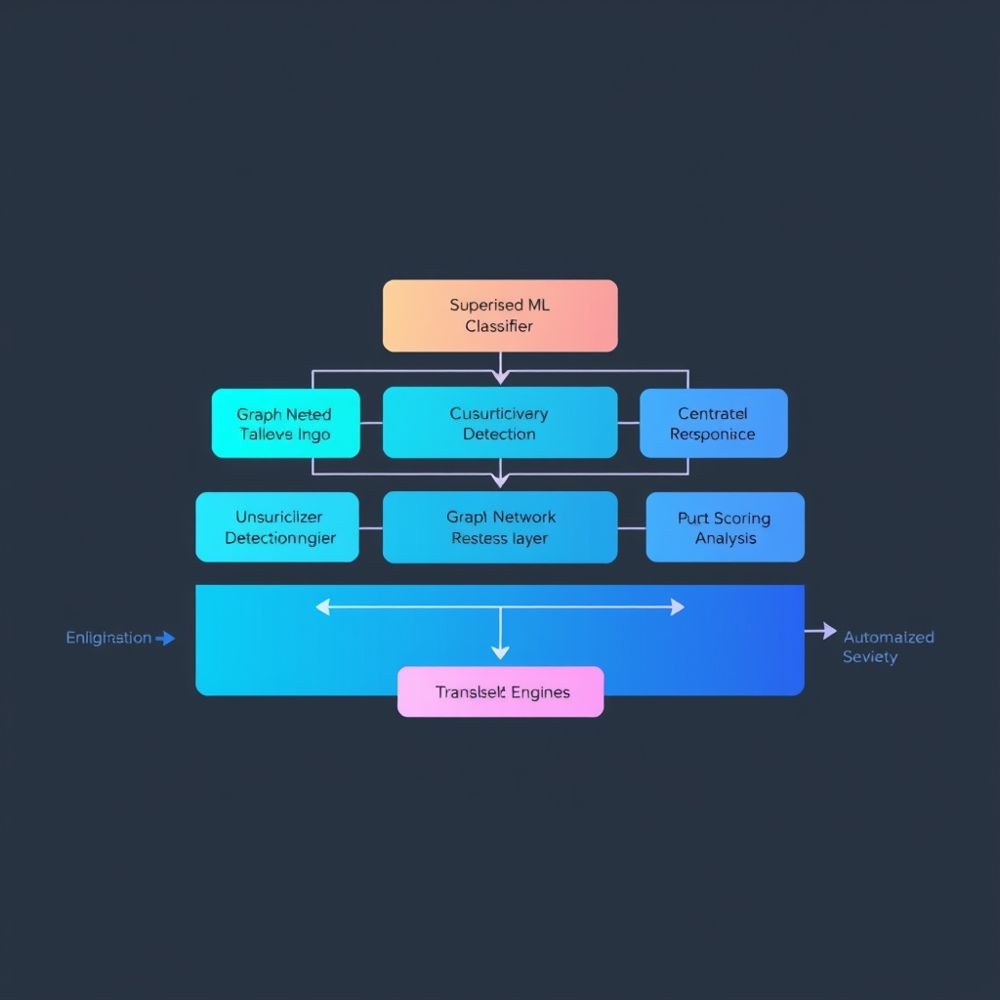
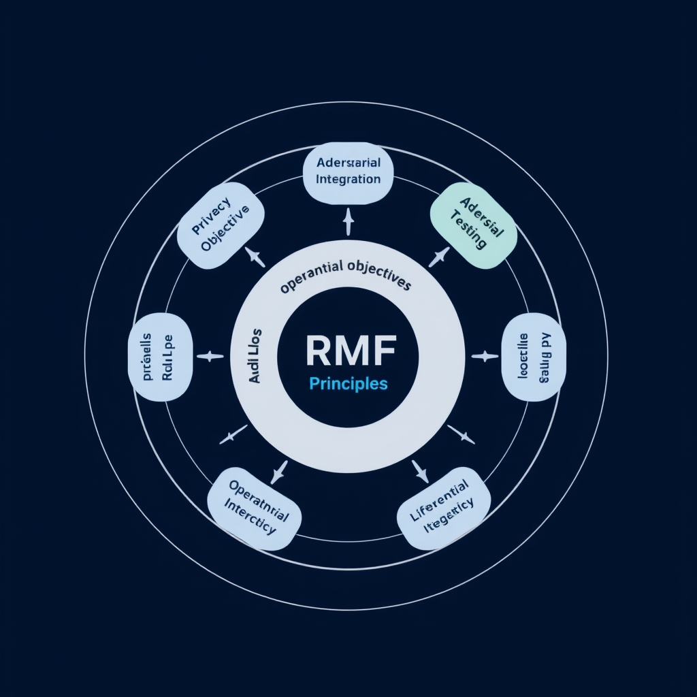

# The AI Arms Race: Modern Fraud Detection and Defense in 2026

## The Evolving Landscape of AI Fraud

**The $6 trillion problem**

In 2026, global fraud losses are projected to hit **$6 trillion**—a figure that dwarfs the combined GDP of many nations. The Nilson Report, cited in a LinkedIn analysis of AI trends, notes that AI‑driven detection can shave **30‑50 %** off that total, underscoring both the scale of the threat and the economic incentive for automation.

**A surge in AI‑powered attacks**

A Trustpair survey found that **71 % of firms** experienced a rise in AI‑enabled fraud tactics last year, ranging from synthetic identity creation to deep‑fake voice phishing. These attacks exploit the same generative models that power legitimate risk engines, turning AI into a double‑edged sword.

**From manual rule‑sets to real‑time intelligence**

Traditional fraud controls relied on static rule‑bases and human analysts reviewing transaction batches after the fact. Modern platforms now ingest millions of events per second, applying **machine‑learning classifiers** and **behavioral scores** in milliseconds. For example, a large payments processor can flag a suspicious cross‑border transfer within 200 ms, allowing an automated block before funds settle. This shift reduces latency, improves customer experience, and limits loss exposure.

**The AI arms race**

As defenders deploy adaptive models, adversaries respond with **adversarial AI**—techniques that subtly perturb inputs to evade detection or generate convincing fraudulent content. The battlefield is no longer a static list of fraud patterns but a dynamic contest where each side continuously retrains models to outmaneuver the other. This escalation demands a **governance‑first mindset**, ensuring that model updates are auditable, bias‑checked, and aligned with regulatory expectations.

*Sources:* [LinkedIn AI Trends 2026](https://www.linkedin.com/pulse/top-15-ai-trends-revolutionizing-financial-services-2026-mjdyc) | [Trustpair 2026 Fraud Trends](https://trustpair.com/resources/fraud-in-the-cyber-era-2026-fraud-trends-insights)

## Technical Pillars of Modern Defense

### Machine Learning & Deep Learning for Real‑Time Anomaly Detection

Modern fraud engines treat each transaction as a high‑dimensional data point. Supervised models—such as gradient‑boosted trees or convolutional neural networks—are trained on historic labeled fraud cases, learning complex non‑linear decision boundaries that flag outliers within milliseconds. Complementary unsupervised techniques (e.g., autoencoders, isolation forests) continuously scan for deviations from the learned normal behavior, catching novel attack vectors that have never been labeled as fraud before. Together, these approaches enable **real‑time anomaly detection** with latency low enough for inline authorization checks, a capability highlighted in recent research on U.S. financial transactions \[[AI‑Driven Approaches for Real‑Time Fraud Detection](https://eajournals.org/ejcsit/vol11-issue-6-2023/ai-driven-approaches-for-real-time-fraud-detection-in-us-financial-transactions-challenges-and-opportunities)\].

*A multi-layered defense architecture: supervised and unsupervised models work alongside graph analysis to provide comprehensive fraud detection.*

### Graph Network Analysis: Illuminating Fraud Rings

Fraudsters increasingly operate as coordinated networks, sharing devices, IP addresses, or synthetic identities. Graph neural networks (GNNs) and traditional graph analytics map these relationships into a connectivity graph where nodes represent entities (accounts, devices, IPs) and edges capture interactions. By applying community‑detection algorithms (e.g., Louvain, label propagation) or embedding‑based similarity scores, the system surfaces **fraud rings** that would be invisible to point‑wise scoring models. Backbase’s 2026 survey confirms that banks leveraging graph analysis can surface coordination patterns at the network level, dramatically reducing false negatives in ring‑based attacks \[[5 AI fraud detection techniques banks use in 2026](https://www.backbase.com/blog/ai-fraud-detection-banking)\].

### Behavioral Profiling for Account Takeover Prevention

Beyond transaction‑level signals, behavioral profiling builds a continuous user fingerprint—encompassing login times, device fingerprints, mouse dynamics, and typical spend categories. When a login deviates from the established profile (e.g., a new device from an unusual geography combined with atypical transaction amounts), a risk score spikes, prompting step‑up authentication or automated account lockdown. Deep recurrent models (LSTM, GRU) excel at modeling temporal sequences of actions, detecting subtle drifts that indicate credential compromise.

### Supervised vs. Unsupervised Learning in an Evolving Threat Landscape

| Aspect                 | Supervised Learning                                                 | Unsupervised Learning                                                               |
| ---------------------- | ------------------------------------------------------------------- | ----------------------------------------------------------------------------------- |
| **Data Requirement**   | Labeled fraud examples; costly to maintain as fraud evolves.        | No labels; relies on statistical deviation from normal patterns.                    |
| **Adaptability**       | Strong on known fraud patterns; slower to detect novel schemes.     | Naturally surfaces emerging anomalies; may generate higher false‑positive rates.    |
| **Typical Algorithms** | Random Forest, XGBoost, CNNs for tabular or image‑based fraud cues. | Autoencoders, Isolation Forest, clustering (DBSCAN), GNN‑based community detection. |
| **Operational Use**    | Primary engine for high‑confidence decisions (e.g., auto‑decline).  | Supplemental layer for alert enrichment and early‑warning of new attack vectors.    |

A hybrid architecture—**supervised models for precision, unsupervised models for discovery**—offers the best defense against the rapid evolution of AI‑powered fraud tactics. Continuous model retraining, drift monitoring, and feedback loops from analyst investigations keep both model families aligned with the latest threat intelligence.

______________________________________________________________________

By integrating these pillars—real‑time ML/DL anomaly detection, graph‑based network analysis, behavioral profiling, and a balanced supervised/unsupervised strategy—organizations build a resilient, multi‑layered fraud defense capable of countering both known and emerging AI‑driven adversaries.

## Navigating the Regulatory Frontier

### U.S. Treasury Department’s 2026 AI Governance Framework

The Treasury Department released a comprehensive AI governance framework in February 2026 that targets the financial services sector. It translates the five NIST AI Risk Management Framework (AI RMF) principles—**governance, transparency, robustness, privacy, and accountability**—into **230 distinct operational control objectives**. These controls span the entire model lifecycle, from data sourcing and identity resolution to model deployment, continuous monitoring, and incident response. By aligning AI-specific controls with existing standards such as SOC 2 and the NIST Cybersecurity Framework, the Treasury’s approach forces organizations to embed governance directly into their DevSecOps pipelines rather than treating AI as an after‑thought.

*Operationalizing the NIST AI RMF: Mapping high-level principles to concrete, auditable controls across the AI lifecycle.*

### Mapping NIST AI RMF Principles to Concrete Controls

| NIST AI RMF Principle | Example Operational Controls (selected)                                                                                                                         |
| --------------------- | --------------------------------------------------------------------------------------------------------------------------------------------------------------- |
| **Governance**        | • Formal AI governance board with chartered authority • Periodic risk assessments tied to model versioning                                                   |
| **Transparency**      | • Model documentation (datasheets, model cards) stored in immutable audit logs • Explainability APIs that surface feature importance for high‑risk decisions |
| **Robustness**        | • Adversarial testing suites integrated into CI/CD • Automated rollback triggers when drift exceeds predefined thresholds                                    |
| **Privacy**           | • Differential privacy budgets tracked per training run • Data lineage records linking raw inputs to derived features                                        |
| **Accountability**    | • Role‑based access controls for model training environments • Incident‑response playbooks that include AI‑specific forensic steps                           |

These controls illustrate how the Treasury’s framework operationalizes abstract AI‑RMF concepts, giving auditors concrete evidence of compliance.

### The Rise of “Provable Security” Across the AI Lifecycle

Regulators are increasingly demanding **provable security**—formal, verifiable assurances that AI systems meet defined safety and privacy criteria at every stage. As noted by industry analysts, this shift is driven by the recognition that traditional security assessments (e.g., pen‑tests) cannot fully capture AI‑specific risks such as model poisoning or inference attacks. Organizations are therefore adopting techniques like:

- **Formal verification** of model properties (e.g., monotonicity, bounded output) before deployment.
- **Zero‑knowledge proofs** that demonstrate compliance with data‑usage policies without exposing raw data.
- **Continuous certification** pipelines that automatically re‑evaluate security proofs whenever a model is retrained or its data pipeline changes.

The expectation is that these proofs become part of the audit trail, enabling regulators to verify compliance without needing to inspect proprietary model internals.

### Leveraging Existing Frameworks to Scrutinize AI Security

Even in the absence of AI‑specific legislation, existing regulatory regimes—**NIST CSF, ISO/IEC 27001, SOC 2, and sector‑specific guidelines like the FFIEC**—are being extended to cover AI. Auditors now map AI‑related controls to the same control families used for traditional IT systems (e.g., Access Control, Configuration Management, Incident Response). For example:

- **Access Control**: Enforce MFA and least‑privilege for model training environments, mirroring IAM controls for critical infrastructure.
- **Configuration Management**: Treat model hyper‑parameters and training scripts as configuration items subject to change‑control processes.
- **Incident Response**: Include AI‑specific triggers (e.g., sudden spikes in model error rates) in the organization’s security‑operations playbook.

By anchoring AI governance to these well‑established frameworks, firms can demonstrate **regulatory diligence** while the legislative landscape continues to evolve.

> **Key takeaway:** The 2026 Treasury framework provides a granular, control‑based blueprint that aligns NIST AI‑RMF principles with existing compliance regimes. Coupled with the industry’s move toward provable security, it equips financial institutions to meet regulator expectations today and future‑proof their AI deployments.

**Sources**: [U.S. Treasury AI framework 2026](https://verifywise.ai/blog/state-of-ai-governance-regulations-united-states-2026), [Provable security outlook 2026](https://www.wsgr.com/en/insights/2026-year-in-preview-ai-regulatory-developments-for-companies-to-watch-out-for.html)

## Conclusion: Building Resilient Systems

A resilient AI‑driven fraud defense cannot rely on a single technique; it must be **multi‑layered**. Combining real‑time anomaly detection, graph‑based ring analysis, and behavioral profiling creates overlapping safeguards that make it harder for adversaries to find a blind spot. Each layer compensates for the others' blind spots, turning isolated failures into rare exceptions.

Equally critical is **continuous monitoring** throughout the AI model lifecycle. Data drift, concept drift, and emerging attack vectors demand automated health checks, periodic retraining, and audit trails that capture who changed what and when. Governance processes should be baked into CI/CD pipelines so that model updates trigger risk assessments before deployment.

Organizations should **proactively align** their controls with the NIST AI Risk Management Framework (RMF). Mapping the framework’s principles—such as transparency, robustness, and accountability—to concrete operational controls ensures that compliance is not a after‑thought but a driver of system design.

Finally, the financial sector must strike a balance between **innovation and security**. Leveraging AI’s speed and scale can unlock new services, but those gains are only sustainable when protected by disciplined, governance‑first practices. By embedding layered defenses, relentless monitoring, and NIST‑aligned governance, firms can turn AI from a potential liability into a strategic advantage in the fight against fraud.