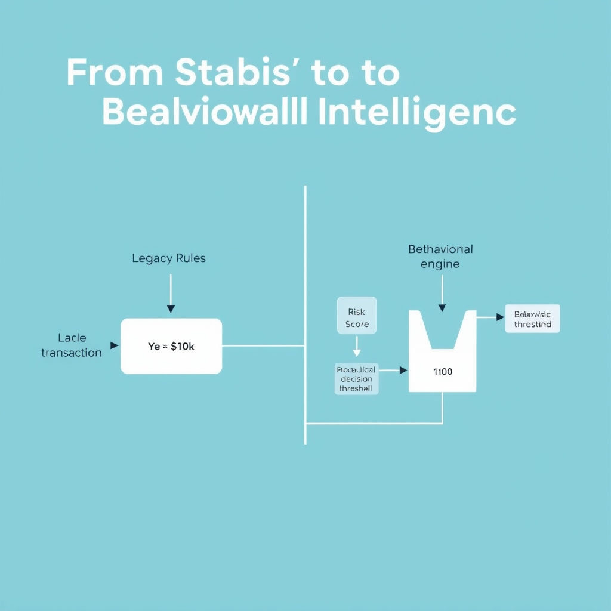
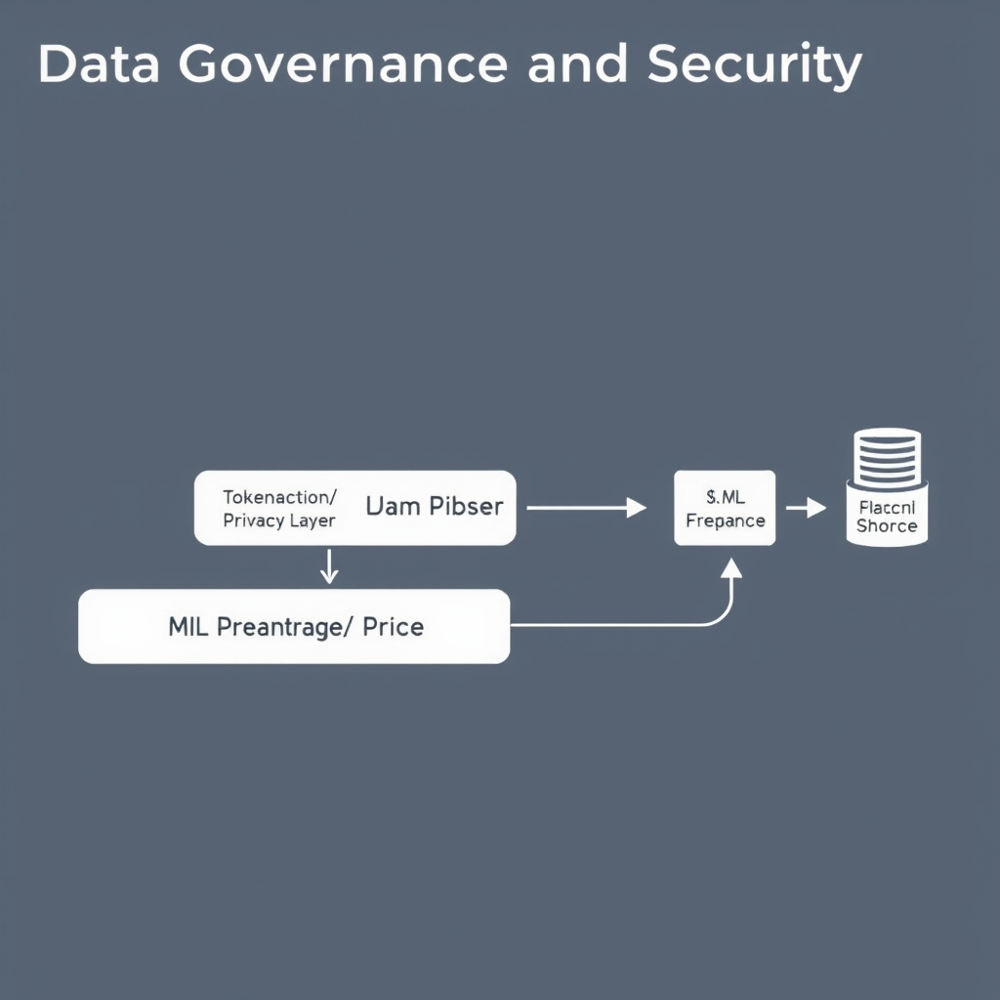
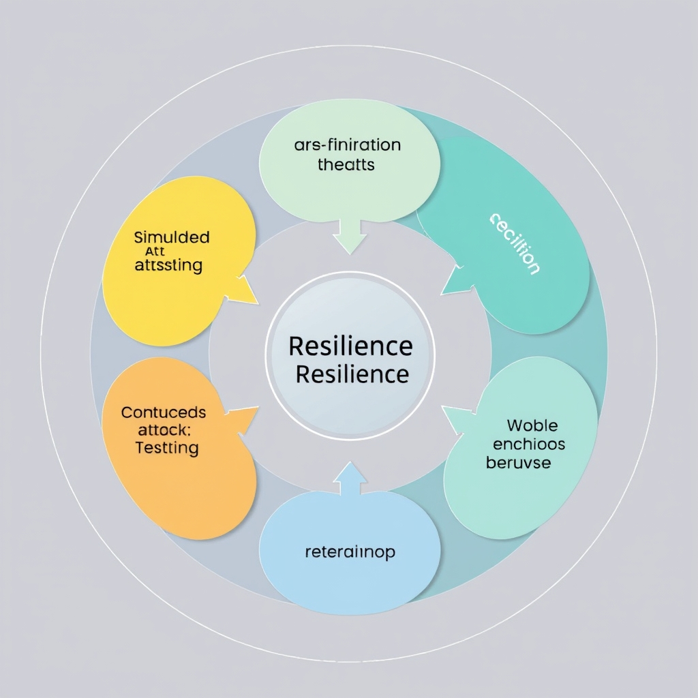

# The AI Arms Race: Modernizing Fraud Detection for 2026

## The New Frontier: Industrialized Deception

The rise of **synthetic identities** has turned identity theft from a niche crime into a mass‑production problem. A single AI model can spin up thousands of believable personas in minutes—complete with fabricated government IDs, credit histories, and even social‑media footprints. Fraudsters then flood onboarding pipelines, exploiting the same verification steps that once protected legacy systems. *[Protegrity, 2026](https://www.protegrity.com/blog/ai-fraud-detection-in-2026-what-leaders-must-know)*

**Deepfake audio and video** are now weaponized to bypass biometric controls that rely on voice or facial recognition. In a recent proof‑of‑concept, attackers generated a convincing video of a senior executive authorizing a wire transfer; the deepfake passed both liveness detection and voice‑print checks, leading to a multi‑million‑dollar loss before the fraud was discovered. The underlying generative models can adjust lighting, background noise, and speech cadence in real time, making static biometric thresholds ineffective. *[Protegrity, 2026](https://www.protegrity.com/blog/ai-fraud-detection-in-2026-what-leaders-must-know)*

**Automated social engineering** scripts amplify phishing at scale. AI‑driven language models craft personalized lure messages, adapt tone based on recipient behavior, and iterate instantly based on open‑rate feedback. Campaigns now deliver tens of thousands of tailored emails per hour, each mimicking a trusted colleague or vendor with human‑like variability that defeats rule‑based keyword filters. *[Protegrity, 2026](https://www.protegrity.com/blog/ai-fraud-detection-in-2026-what-leaders-must-know)*

### Why static defenses crumble

- **Pattern rigidity** – Traditional rule sets look for known signatures (e.g., fixed IP ranges, static keyword lists). AI‑generated attacks continuously mutate these signatures, rendering static thresholds obsolete.
- **Speed of generation** – Synthetic identities and deepfakes can be produced faster than any manual review process, overwhelming manual and automated checks alike.
- **Contextual awareness** – AI scripts incorporate real‑time contextual data (e.g., recent transactions, user behavior) to tailor attacks, slipping past defenses that lack behavioral insight.

In short, the industrialization of deception means fraud is no longer a handful of clever tricks but a high‑throughput manufacturing line powered by AI. Organizations that continue to rely on static, rule‑based defenses are effectively fighting yesterday’s battles while the adversary builds tomorrow’s weapons. The next sections will explore how real‑time behavioral intelligence can restore the balance.

## From Static Rules to Behavioral Intelligence

### Limitations of legacy rules‑based fraud engines

Traditional fraud detection systems rely on static rule sets—e.g., "block transactions over $10,000 from IP X". While easy to implement, these engines suffer from three fundamental drawbacks:

*Legacy systems rely on rigid, binary rules, whereas behavioral intelligence uses multi-dimensional data to calculate a dynamic risk score.*

- **Static thresholds lag behind attacker speed.** Rules are updated only after a breach is detected, allowing AI‑driven fraudsters to iterate faster than the rule‑change cycle.
- **High false‑positive rates.** Rigid conditions cannot distinguish between legitimate outliers (e.g., a user traveling abroad) and malicious activity, leading to friction for customers and operational overhead for investigators.
- **Inability to capture multi‑dimensional behavior.** Rules typically examine a single attribute (amount, location, device) in isolation, missing the nuanced patterns that emerge when attributes are correlated over time.

These shortcomings are explicitly noted in recent industry analysis, which observes that “fraud moves too fast for static thresholds and legacy rules” and calls for a shift to continuous behavioral intelligence [1].

### Defining behavioral intelligence

Behavioral intelligence is the practice of modeling *normal* user, device, and channel activity in real time and flagging deviations that suggest fraud. It differs from rule‑based detection in two key ways:

1. **Temporal context.** Instead of evaluating a single transaction, the model continuously updates a profile based on recent actions (login times, device fingerprints, transaction velocity).
1. **Multi‑modal correlation.** Machine‑learning algorithms ingest heterogeneous signals—geolocation, keystroke dynamics, network latency—and learn how they interact under benign conditions.

The resulting profile is a probabilistic representation of “behavioural health”. When a new event falls outside the learned confidence envelope, the system raises an alert with a risk score rather than a binary block.

### The importance of real‑time processing

Real‑time processing is essential because the window to prevent loss is often seconds. Consider a credit‑card purchase that triggers a fraud alert after the merchant has already captured funds; the damage is done. By evaluating each event against the live behavioural model **before** transaction completion, organizations can:

- **Stop fraud in‑flight.** Immediate denial or step‑up authentication prevents the monetary transfer.
- **Reduce investigation latency.** High‑confidence alerts can be auto‑resolved, freeing analysts to focus on ambiguous cases.
- **Maintain customer experience.** Legitimate users experience seamless transactions because the model adapts to their evolving habits.

### How machine‑learning models adapt to evolving threat signatures

Unlike static rules, ML models are designed to learn continuously:

- **Online learning pipelines** ingest new data streams and update model parameters incrementally, ensuring the detection logic evolves with emerging fraud tactics.
- **Feedback loops** from analyst decisions (e.g., confirming a false positive) are fed back into the training set, refining the model’s discrimination capability.
- **Ensemble approaches** combine multiple sub‑models—such as sequence‑based RNNs for click‑stream analysis and graph‑based detectors for network relationships—allowing the system to capture both micro‑behavioural shifts and macro‑level fraud campaigns.

Together, these capabilities enable a detection posture that is *proactive* rather than reactive, aligning with the industry’s 2026 outlook that organizations must “shift to continuous behavioral intelligence” to keep pace with AI‑enabled attackers [1].

______________________________________________________________________

## Data Governance and Security Integration

### Clean, Governed Data Pipelines are the Bedrock of Model Accuracy

AI‑driven fraud detectors learn patterns from every signal they ingest—transaction timestamps, device fingerprints, user‑behaviour logs, and even unstructured text. If any of these inputs are noisy, duplicated, or improperly labeled, the model’s statistical confidence erodes, leading to higher false‑positive rates and missed fraud. A governed pipeline enforces:

*A secure, governed data pipeline ensures that sensitive information is tokenized before it reaches the machine learning model, maintaining both accuracy and compliance.*

- **Schema validation** at ingestion, catching malformed records before they reach the training set.
- **Data lineage tracking**, so auditors can trace a prediction back to the exact source fields.
- **Access controls** that prevent unauthorized alterations, preserving the integrity of historical baselines.

Studies of high‑performing AI fraud programs show that treating data protection as a core performance factor—rather than an after‑thought—yields measurable gains in detection precision. [Protegrity, 2026](https://www.protegrity.com/resources/blog/ai-fraud-detection-in-2026-what-leaders-must-know)

### Tokenization and Privacy‑Preserving AI Techniques

Sensitive identifiers (e.g., Social Security numbers, credit‑card PANs) must be shielded to meet compliance and to avoid bias leakage. Tokenization replaces these values with irreversible surrogates while preserving relational integrity for model training. Privacy‑preserving AI, such as federated learning or differential privacy, enables the model to learn from encrypted or locally‑computed gradients without exposing raw data. This approach is highlighted as essential for maintaining model accuracy while protecting data. [Protegrity, 2026](https://www.protegrity.com/resources/blog/ai-fraud-detection-in-2026-what-leaders-must-know)

By embedding tokenization at the edge of the pipeline, organizations keep the raw PII out of the training store, reducing the attack surface and ensuring that the model’s feature space remains consistent across jurisdictions.

### Continuous Monitoring to Prevent Model Drift

Fraud tactics evolve faster than static rule‑sets; consequently, the statistical distribution of input features shifts—a phenomenon known as model drift. Real‑time data quality dashboards should monitor:

- **Feature distribution histograms** compared against a baseline window.
- **Missing‑value rates** that may indicate upstream collection failures.
- **Anomaly scores** for sudden spikes in rare attribute combinations.

When drift thresholds are breached, automated retraining pipelines can pull the latest clean data slice, re‑fit the model, and redeploy without manual intervention. This closed‑loop ensures that detection efficacy does not degrade over time.

### Aligning Fraud Prevention with Regulatory Compliance

Regulators increasingly require demonstrable data‑governance controls for AI systems that make high‑impact decisions. Key alignment points include:

- **GDPR/CCPA data minimization** – retain only the features necessary for fraud detection, discarding excess PII after tokenization.
- **Model auditability** – maintain versioned datasets and model artifacts to satisfy audit requests.
- **Risk‑based controls** – classify data streams by sensitivity and apply stronger encryption or access restrictions to high‑risk feeds.

Integrating governance, security, and compliance into a unified data fabric lets fraud teams leverage richer signals without exposing the organization to legal or reputational risk.

## Operationalizing Resilience

A resilient fraud defense hinges on bringing together security analysts, fraud investigators, and data‑science engineers in a single, accountable unit. A 2026 industry overview notes that financial institutions are increasingly adopting cross‑functional teams to improve detection robustness, allowing threat intelligence, model development, and operational response to share context in real time ([source](https://datadome.co/learning-center/ai-fraud-detection)). By co‑locating expertise, teams can:

*Operational resilience is achieved through a continuous cycle of cross-functional collaboration, rigorous simulated testing, and automated model retraining.*

- Align model feature engineering with the latest fraud tactics.
- Streamline escalation paths when anomalous behavior is flagged.
- Ensure compliance and privacy considerations are baked into model pipelines.

Static validation is insufficient for AI‑driven adversaries. Regular **simulated attack testing**—including red‑team exercises, adversarial example generation, and penetration testing of the detection stack—helps surface weaknesses that would otherwise remain hidden. The same 2026 source highlights that regularly testing fraud detection systems through simulated attacks is a proven practice for hardening defenses ([source](https://datadome.co/learning-center/ai-fraud-detection)). Effective testing programs should:

1. Define realistic attacker personas (e.g., synthetic‑identity generators, deep‑fake phishing bots).
1. Execute automated attack scripts against live transaction flows.
1. Capture false‑negative and false‑positive rates for post‑mortem analysis.

**Continuous feedback loops** are commonly recommended to address model drift as fraudsters evolve. A practical loop may include:

- Real‑time ingestion of flagged events into a secure data lake.
- Automated labeling by fraud analysts.
- Scheduled retraining cycles (e.g., nightly or weekly) with versioned model deployment.
- Monitoring of drift metrics to trigger immediate retraining when performance thresholds slip.

**Preparing for the next wave of AI‑driven attacks** involves anticipating that adversaries will leverage generative models for hyper‑personalized phishing, automated account‑takeover bots, and adaptive deep‑fake media. Organizations might:

- Explore adversarial‑robust training techniques such as gradient masking and ensemble defenses.
- Maintain a threat‑intelligence feed that captures emerging AI‑fraud tactics.
- Conduct quarterly scenario‑planning workshops to simulate future attack vectors and test response playbooks.
- Allocate budget for research partnerships with academic labs focused on AI security.

By institutionalizing cross‑functional collaboration, rigorous simulated testing, and perpetual learning cycles, enterprises can transition from reactive rule‑sets to a proactive, AI‑enhanced resilience posture.

[1]: https://www.protegrity.com/resources/blog/ai-fraud-detection-in-2026-what-leaders-must-know