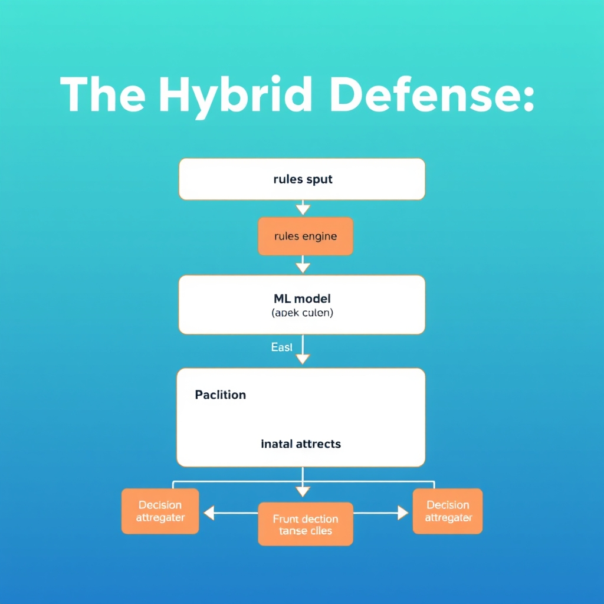
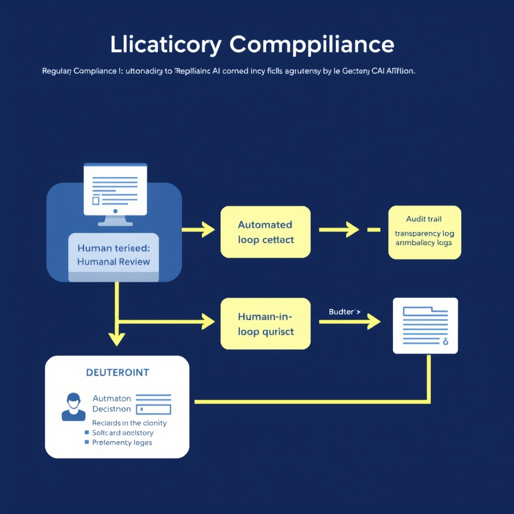

# The AI Arms Race: Modernizing Fraud Detection in 2026

## The New Threat Landscape: Generative AI at Scale

The landscape of fraud detection has undergone a significant shift with the advent of generative AI. Traditional rule-based systems, which once relied on static thresholds and predefined rules to identify fraudulent activities, are now being outsmarted by sophisticated AI-powered attacks. One of the primary challenges is the rise of synthetic identity creation using generative models. Fraudsters can generate thousands of synthetic identities, complete with realistic documents and deepfake audio confirmations, in a matter of minutes. This has made it increasingly difficult for rule-based systems to distinguish between legitimate and fraudulent activities.

Credential stuffing, another tactic employed by fraudsters, now operates with human-like variability, making it harder to detect. This is achieved through the use of AI algorithms that can mimic the behavior of real users, including variations in typing speed, mouse movements, and other factors. As a result, static rules that once flagged such activities as suspicious are now being bypassed with ease.

The danger of deepfake audio and video in social engineering is also on the rise. With the ability to create convincing fake audio and video content, fraudsters can now trick even the most cautious individuals into divulging sensitive information or performing certain actions that compromise security.

Furthermore, static thresholds are easily bypassed by adaptive attackers who continually evolve their tactics to evade detection. This has led to a situation where traditional rule-based systems are no longer effective in combating modern AI-powered fraud.

According to a report by Thomson Reuters Institute, [AI-powered fraud: 5 trends financial institutions need to understand in 2026](https://www.thomsonreuters.com/en/institute/articles/ai-powered-fraud-5-trends), a single fraudster with a capable model can generate thousands of synthetic identities, realistic documents, or deepfake audio confirmations in minutes.

The need for a more dynamic and intelligent approach to fraud detection has never been more pressing. As we move forward, it's essential to understand the limitations of traditional systems and the potential of new technologies, such as machine learning and real-time behavioral intelligence, in combating the evolving threat landscape of AI-powered fraud.

## Architecting for Behavioral Intelligence

The shift from traditional, transaction-based rules to continuous user-pattern analysis is crucial in combating modern AI-powered fraud. This change in approach moves the focus from simple threshold checks, such as 'is this transaction over $X?' to a more nuanced understanding of user behavior, asking 'is this behavior normal for this user?' This paradigm shift integrates multi-channel data points including device information, location data, and transaction velocity to create a comprehensive profile of user behavior.


*Moving from static rules to behavioral intelligence requires a streaming pipeline that evaluates user context in real-time.*

Integrating **multi-channel data points** is essential for effective behavioral intelligence. This includes:

- Device information: Understanding the devices used by customers can help identify anomalies. For example, a user who normally logs in from a desktop in New York but suddenly logs in from a mobile device in a different country may indicate a potential security issue.
- Location data: Analyzing location data can help identify transactions that occur outside of a user's normal geographic area.
- Transaction velocity: Monitoring the speed at which transactions are made can help identify potential fraud. For instance, a high number of transactions in a short period may indicate automated activity.

The role of **real-time streaming data** in detecting anomalies cannot be overstated. By analyzing data as it is generated, financial institutions can identify and respond to potential threats in a timely manner. This is particularly important in high-volume environments where the speed of detection is critical.

### Designing for Low-Latency Inference

Designing systems for **low-latency inference** in high-volume environments is a significant challenge. To achieve this, institutions can leverage technologies such as streaming feature pipelines. A conceptual implementation might involve:

```python
import pandas as pd
from sklearn.ensemble import IsolationForest
from sklearn.pipeline import Pipeline
from sklearn.preprocessing import StandardScaler

# Define a pipeline for real-time feature processing and anomaly detection
def create_pipeline():
    pipeline = Pipeline([
        ('scaler', StandardScaler()),
        ('iforest', IsolationForest(n_estimators=100, random_state=0))
    ])
    return pipeline

# Example usage with streaming data
def process_streaming_data(stream_data, pipeline):
    # Assuming stream_data is a generator yielding batches of data
    for batch in stream_data:
        # Process each batch through the pipeline
        predictions = pipeline.predict(batch)
        # Handle predictions, e.g., alert on anomalies
        yield predictions

# Create a pipeline for real-time inference
pipeline = create_pipeline()

# Simulate streaming data (in a real scenario, this would be replaced with actual streaming data)
stream_data = (
    pd.DataFrame({
        'transaction_amount': [100, 200, 50],
        'device': ['desktop', 'mobile', 'desktop'],
        'location': ['New York', 'Los Angeles', 'New York']
    }),
    pd.DataFrame({
        'transaction_amount': [300, 400, 500],
        'device': ['mobile', 'desktop', 'mobile'],
        'location': ['Chicago', 'New York', 'Chicago']
    })
)

# Process the streaming data through the pipeline
for predictions in process_streaming_data(stream_data, pipeline):
    print(predictions)

```

This example demonstrates how machine learning models, such as Isolation Forest, can be integrated into a streaming feature pipeline for real-time anomaly detection in high-volume environments. By leveraging such pipelines, financial institutions can enhance their ability to detect and prevent fraud.

In conclusion, architecting for behavioral intelligence is a critical step in the evolution of fraud detection systems. By moving beyond static rules and embracing a more dynamic, user-centric approach, financial institutions can better protect themselves and their customers from the evolving threats posed by generative AI-powered fraud.

## The Hybrid Defense: Rules Engines Meet Machine Learning

The technical implementation of a layered security stack is crucial for effective fraud detection. This involves **using rules engines for known, high-confidence threat patterns**. Rules engines are particularly useful for identifying well-documented fraud patterns where the threat vectors are clearly understood. By codifying these patterns into rules, financial institutions can efficiently filter out a significant portion of known fraud attempts.


*A hybrid defense stack leverages the speed of rules for known threats and the adaptability of ML for emerging patterns.*

### Integrating Machine Learning

However, the evolving nature of fraud requires more than just static rules. **Deploying ML models to identify unknown, evolving fraud vectors** is essential for staying ahead of adaptive attackers. Machine learning can analyze vast amounts of data, including real-time transactional data, user behavior, and other relevant information, to identify patterns that may indicate fraud but do not fit into predefined rules.

### Managing Hand-off Between Rules and Models

**Managing the hand-off between deterministic rules and probabilistic models** is a critical aspect of this hybrid approach. This involves designing a system where rules engines and ML models work in tandem, with clear criteria for when a transaction or behavior should be evaluated by a rule, an ML model, or both. This hand-off ensures that the strengths of each approach are leveraged appropriately, maximizing the detection of legitimate fraud attempts while minimizing false positives.

### Retraining Models and Managing False Positives

Finally, **strategies for model retraining and managing false positive rates** are vital for the long-term effectiveness of the fraud detection system. As fraud patterns evolve, ML models must be regularly retrained on new data to maintain their accuracy. Additionally, managing false positive rates is crucial to avoid unnecessary friction for legitimate users. This can involve implementing feedback loops where false positives are identified and used to improve the models over time.

```python
# Example of integrating a rules engine with an ML model
import pandas as pd
from sklearn.ensemble import IsolationForest

# Sample transaction data
data = {
    'user_id': [1, 2, 3],
    'transaction_amount': [100, 200, 5000],
    'location': ['New York', 'Los Angeles', 'Paris']
}
df = pd.DataFrame(data)

# Rules engine example: Flag transactions over $1000
df['rule_flag'] = df['transaction_amount'].apply(lambda x: 1 if x > 1000 else 0)

# ML model example: Isolation Forest for anomaly detection
if_model = IsolationForest(contamination=0.1)
if_model.fit(df[['transaction_amount']])

df['ml_flag'] = if_model.predict(df[['transaction_amount']])

# Combine flags for final assessment
df['final_flag'] = df.apply(lambda row: 1 if row['rule_flag'] == 1 or row['ml_flag'] == -1 else 0, axis=1)
```

This hybrid approach, combining the precision of rules engines with the adaptability of machine learning, offers a robust defense against the evolving landscape of fraud. By continuously updating and refining both the rules and the models, financial institutions can stay ahead of fraudsters and protect their users' assets.

## Regulatory Compliance: Navigating the EU and Colorado AI Acts

As financial institutions move toward integrating real-time behavioral intelligence with strict regulatory compliance, understanding the regulatory landscape becomes crucial. The EU AI Act and Colorado AI Act impose significant requirements on high-risk AI systems, including those used for fraud detection. By August 2, 2026, high-risk AI systems in the financial sector must comply with the EU AI Act's specific requirements for **transparency** and **traceability**, as well as implement **human oversight** for high-stakes decisioning. Similarly, the Colorado AI Act, effective June 30, 2026, requires developers of high-risk AI systems affecting financial services to conduct **impact assessments** and take reasonable care to prevent **algorithmic discrimination**.


*Human-in-the-loop workflows are essential for meeting regulatory requirements for transparency and accountability in high-stakes decisions.*

### Key Regulatory Requirements

- **Transparency and Traceability**: High-risk AI systems must provide clear information about their decision-making processes and maintain records of their operations to ensure accountability.
- **Mandatory Impact Assessments**: Developers must assess the potential risks and benefits of their AI systems, including the risk of algorithmic discrimination and bias.
- **Human-in-the-Loop**: For high-stakes decisioning, human oversight is necessary to review and correct AI-driven decisions, ensuring that they are fair and unbiased.
- **Public Disclosure and Consumer Notification**: Institutions must disclose their use of AI in decision-making processes and notify consumers about how their data is used in these systems.

Compliance with these regulations is not only a legal requirement but also a strategic imperative for building trust with customers and maintaining a competitive edge in the financial services sector. By prioritizing transparency, accountability, and human oversight, financial institutions can ensure that their AI-powered fraud detection systems are both effective and responsible.

## Building Resilient Fraud Detection Systems

To effectively combat the evolving landscape of AI-driven fraud, it's crucial to synthesize the technical and regulatory requirements into a cohesive strategy. This involves recognizing that security is a continuous process, not a static deployment. As fraudsters adapt and generative AI capabilities advance, financial institutions must stay vigilant and innovative. The necessity of balancing innovation with ethical AI practices is paramount. This balance ensures that while leveraging AI for fraud detection, institutions also prioritize transparency, fairness, and accountability. Preparing for future regulatory shifts in AI governance is also essential, as emerging laws and regulations set new standards for high-risk AI systems, emphasizing transparency, traceability, and human oversight. Furthermore, these regulations often require impact assessments and measures to prevent algorithmic discrimination. Finally, maintaining human oversight in an automated world is critical. This oversight ensures that AI systems, which can identify patterns and anomalies at scale and speed, are complemented by human judgment and ethical considerations. By combining these elements, financial institutions can build resilient fraud detection systems that not only protect against current threats but are also adaptable to future challenges.