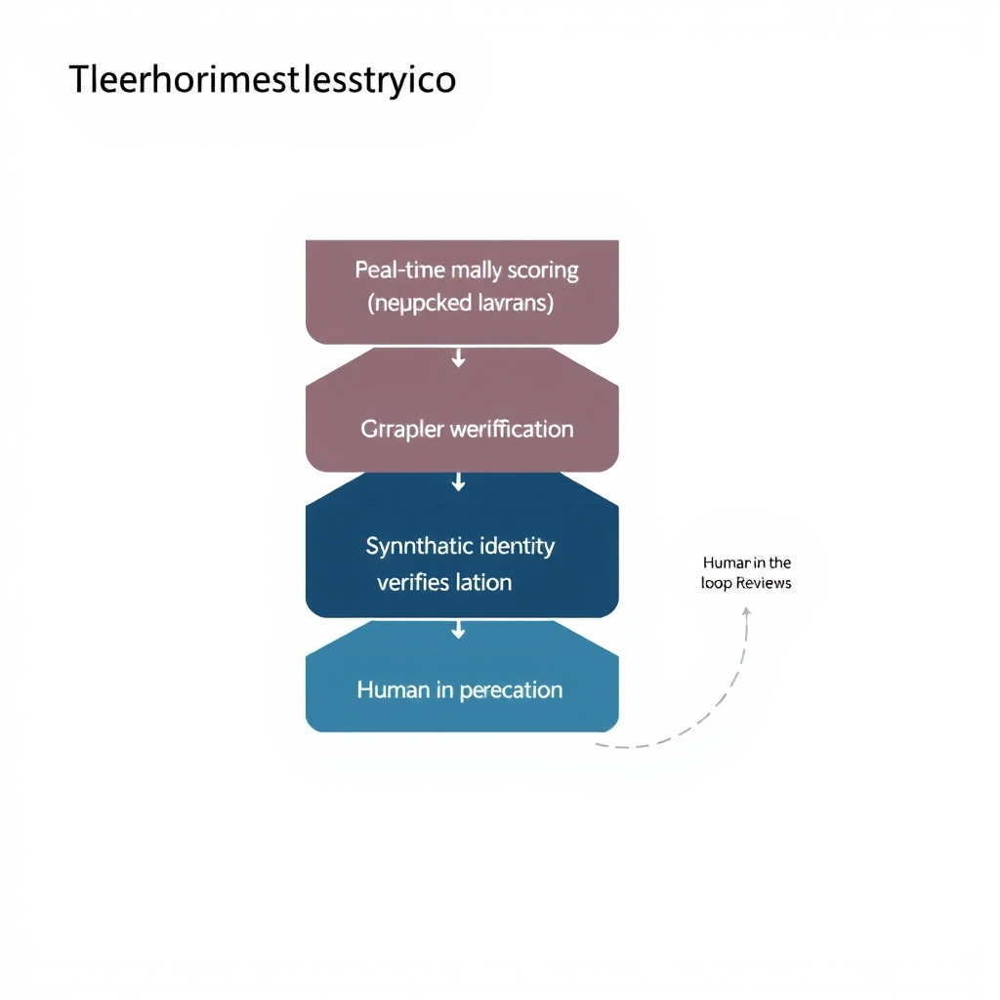
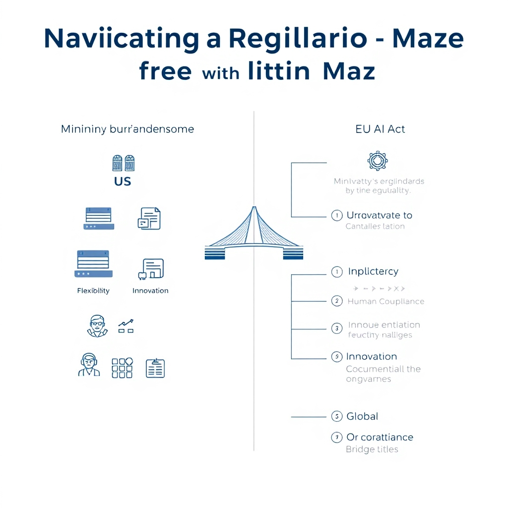
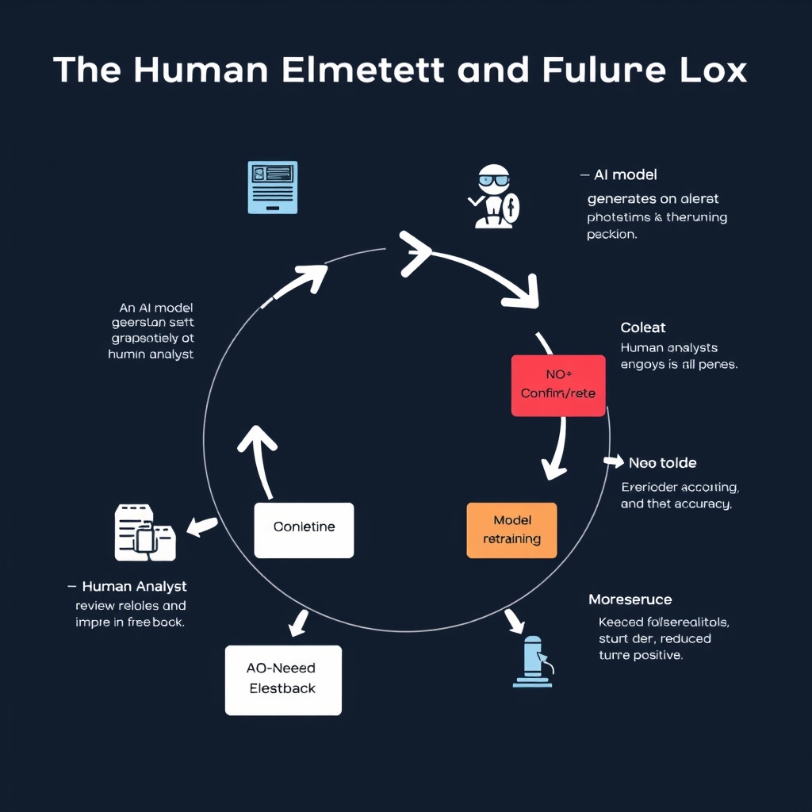

# The AI Arms Race: Navigating Fraud Detection in 2026

## The Escalating Threat Landscape

In 2026, **71% of surveyed companies reported a rise in AI‑powered fraud** (source: [Trustpair](https://trustpair.com/resources/fraud-in-the-cyber-era-2026-fraud-trends-insights)) – a stark signal that malicious actors are increasingly weaponizing machine learning to outpace traditional defenses.

### Scaling attacks with AI

- **Automated credential generation** – Generative models can produce plausible login details, phishing content, or synthetic identities at a volume no human team could match.
- **Adaptive decision‑making** – Reinforcement‑learning agents test multiple attack vectors in real time, learning which tactics evade existing detection rules and iterating within seconds.
- **Distributed botnets** – AI‑enhanced bots coordinate across geographies, dynamically routing transactions to exploit regional compliance gaps.

These capabilities allow fraudsters to **scale operations from isolated incidents to coordinated campaigns** that target thousands of accounts simultaneously, dramatically reducing the cost per successful breach.

### From classic scams to automated assaults

Traditional fraud relied on manual social engineering, limited by the attacker’s time and expertise. Today, the landscape has shifted toward **sophisticated, automated attacks**:

- **Synthetic identity fraud** merges fabricated personal data with AI‑generated behavior patterns, making it harder for rule‑based systems to flag anomalies.
- **Deep‑fake audio/video** enables real‑time impersonation of executives, facilitating business‑email‑compromise (BEC) schemes at unprecedented speed.
- **Algorithmic transaction laundering** uses AI to route funds through complex, rapidly changing pathways, evading static monitoring tools.

The convergence of these trends means that a single AI‑driven tool can launch multi‑vector attacks, blending credential stuffing, account takeover, and money‑laundering in a single, seamless operation. Financial institutions must therefore treat AI‑enabled fraud not as a series of isolated threats, but as an **integrated, evolving adversary** that can adapt faster than legacy defenses.

## Technical Defenses: How Institutions Fight Back

### Unsupervised Machine Learning for Anomaly Detection

Unsupervised models—such as autoencoders, isolation forests, and clustering algorithms—learn the normal statistical profile of transaction streams without needing labeled fraud examples. When a new transaction deviates significantly from this learned baseline, the model flags it as an anomaly for further review. Because fraudsters constantly evolve their tactics, the ability to detect out‑of‑distribution behavior in real time is crucial. In practice, banks feed millions of daily events into a streaming pipeline; the model continuously updates its internal representation, allowing it to surface novel attack vectors that signature‑based rules would miss.

### Graph Network Analysis to Uncover Fraud Rings

Graph‑based approaches treat entities (accounts, devices, IP addresses) as nodes and their relationships (transactions, logins) as edges. By applying community‑detection algorithms (e.g., Louvain, label propagation) and graph neural networks, institutions can identify tightly‑connected sub‑graphs that exhibit suspicious patterns—such as rapid fund transfers among a cluster of newly created accounts. This method excels at exposing coordinated schemes that span multiple channels and jurisdictions, which traditional linear models often overlook.

### Specialized Tools for Synthetic Identity Detection

Synthetic identities combine real‑world personal data (e.g., a valid Social Security number) with fabricated attributes to create a “ghost” profile. Detection tools leverage a blend of feature engineering and deep learning:

- **Device fingerprinting** compares the device’s hardware and software signatures against known legitimate patterns.
- **Behavioral biometrics** analyze keystroke dynamics and mouse movements during onboarding.
- **Cross‑source verification** cross‑checks applicant data against multiple external databases (credit bureaus, government registries) using probabilistic matching.

When inconsistencies exceed a risk threshold, the system either blocks the application or routes it to a human analyst for manual verification.

### Adoption Landscape

Adoption of AI‑driven fraud detection is widespread. Industry observations suggest that a large majority of financial institutions—some reports cite figures as high as 90%—have deployed at least one AI‑based solution across their product lines, driven by regulatory pressure and the cost‑savings of automated risk controls.

### Putting It All Together

Modern fraud defenses are rarely a single model; they are an orchestrated stack:

1. **Real‑time anomaly scoring** via unsupervised learning flags outliers.
1. **Graph enrichment** correlates flagged events with broader network activity to surface rings.
1. **Identity verification layers** apply synthetic‑identity detectors to high‑risk onboarding flows.
1. **Human‑in‑the‑loop escalation** ensures that high‑severity alerts receive expert review, reducing false positives.

This layered architecture enables institutions to stay ahead of AI‑enabled adversaries while maintaining compliance with evolving regulatory expectations.

*Modern fraud defense is an orchestrated stack that combines automated detection with human oversight.*

## Navigating the Regulatory Maze

Recent policy signals indicate that the United States is moving away from a patchwork of state‑level AI rules. The White House has urged Congress to adopt a **national standard that is “minimally burdensome,”** to pre‑empt divergent state regulations while still addressing security and innovation concerns[^4]. For financial institutions, this approach promises a single compliance baseline, reducing the operational overhead of tracking multiple jurisdictions. The emphasis on low regulatory friction, however, may leave many detailed safeguards optional, placing more responsibility on firms to self‑govern.

*Financial institutions must navigate two distinct regulatory philosophies: the US focus on flexibility and the EU's comprehensive compliance framework.*

In contrast, the European Union has codified a **comprehensive AI governance regime** through the AI Act. The legislation classifies AI systems used for fraud detection as “high‑risk” and establishes a compliance framework that includes requirements for data quality, transparency, and post‑deployment monitoring[^5]. Financial entities operating in the EU must conduct conformity assessments, maintain documentation, and embed human‑oversight mechanisms in their AI pipelines. The Act also mandates reporting of adverse outcomes to supervisory authorities, creating a robust audit trail for cross‑border investigations.

### Implications for Global Financial Operations

- **Compliance Architecture:** Firms must design dual‑track compliance programs—one that satisfies the U.S. preference for flexibility and another that meets the EU’s prescriptive standards. This often leads to adopting the stricter EU controls as a baseline, then scaling back where permissible in the U.S.
- **Data Residency and Governance:** The EU’s stringent data‑handling rules may restrict the transfer of transaction data to U.S.-based AI platforms, prompting the deployment of localized model instances or the use of privacy‑preserving techniques such as federated learning.
- **Regulatory Arbitrage Risks:** A “minimally burdensome” U.S. regime could attract AI vendors seeking a lighter compliance environment, potentially creating competitive imbalances if European firms are constrained by higher compliance costs.
- **Cross‑Border Supervision:** Divergent reporting obligations require coordinated oversight between U.S. and EU regulators. Joint supervisory forums are emerging to share insights on AI‑driven fraud patterns, but the lack of a unified legal framework can delay coordinated enforcement actions.

Overall, the regulatory split forces financial institutions to balance agility with rigor. While the U.S. approach may accelerate innovation, the EU’s comprehensive framework offers stronger consumer protections and clearer accountability—factors that increasingly influence global risk‑management strategies.

\[^4\]: [White House’s “minimally burdensome” national standard recommendation](https://www.whitecase.com/insight-our-thinking/ai-watch-global-regulatory-tracker-united-states)
\[^5\]: [AI Act as a comprehensive compliance framework (2026 guide)](https://www.articsledge.com/post/ai-fraud-detection-banking)

## The Human Element and Future Outlook

### The "Black Box" Challenge

Even the most accurate fraud‑detection models can become liabilities when they cannot explain *why* a transaction was flagged. A deep‑learning classifier might assign a high fraud probability to a cross‑border payment, yet provide no insight into the features that triggered the alert. This opacity hampers compliance teams, who must justify decisions to regulators and customers. Without interpretable outputs, false positives can erode trust and increase operational costs as analysts spend extra time investigating ambiguous alerts.

*Human-in-the-loop systems turn opaque AI decisions into actionable insights, improving model accuracy over time.*

### Human‑in‑the‑Loop (HITL) Verification

To mitigate the black‑box risk, leading banks embed human expertise directly into the detection pipeline:

- **Alert triage dashboards** surface model scores alongside key transaction attributes (e.g., velocity, device fingerprint, historical behavior), allowing analysts to confirm or override decisions.
- **Feedback loops** capture analyst corrections and feed them back into model retraining, improving future precision.
- **Continuous monitoring** teams audit model drift, ensuring that performance does not degrade as fraud tactics evolve.

A real‑world example is a major U.S. bank that reduced false‑positive rates by 15 % after introducing a HITL review stage, where senior fraud analysts validated high‑risk alerts before automated blocks were applied.

### The Ongoing AI‑Fraud Arms Race

Looking ahead, the contest between fraudsters and defenders will intensify:

- **Adversarial AI** will enable attackers to craft synthetic identities that mimic legitimate customer profiles, forcing detection systems to become more nuanced.
- **Generative models** can automate the creation of phishing content at scale, demanding faster, more adaptive defenses.
- **Collaborative intelligence**—shared threat feeds and joint model research across institutions—will become essential to keep pace with rapidly evolving attack vectors.

In this environment, AI will remain a critical tool, but its effectiveness hinges on transparent models, rigorous human oversight, and a proactive stance toward emerging threats.