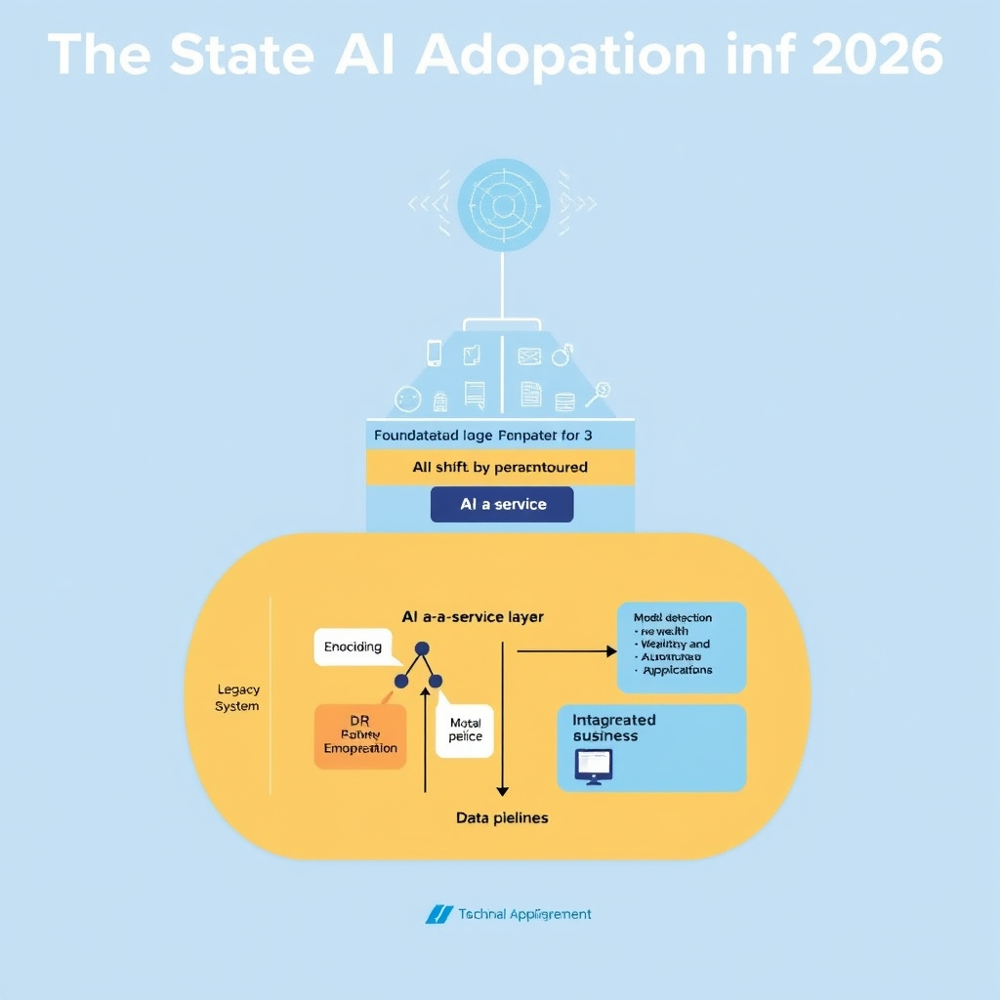
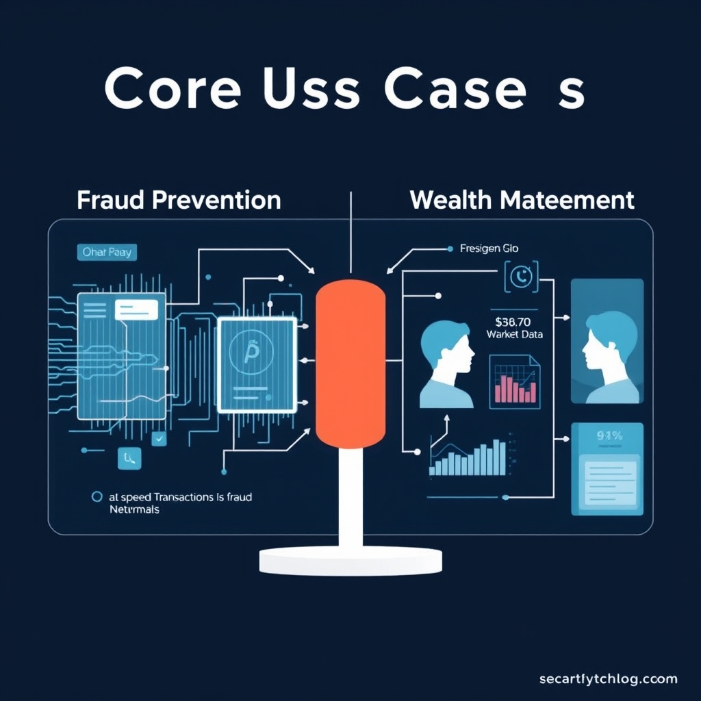
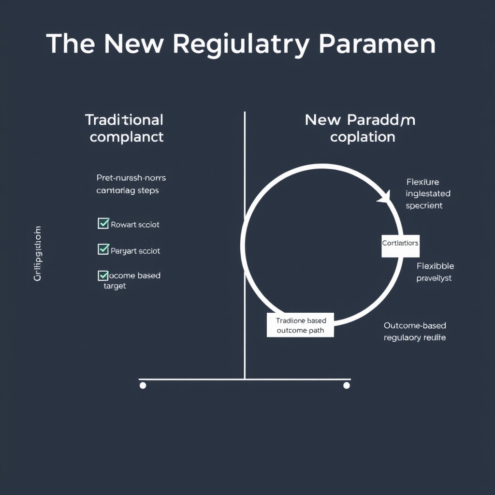

# The AI-Driven Financial Frontier: Navigating the 2026 Landscape

## The State of AI Adoption in 2026

The financial services landscape in 2026 marks a decisive move from **pilot‑phase experiments** to **enterprise‑wide AI deployment**. Early‑stage proof‑of‑concepts that once lived in isolated labs have been superseded by platform‑level integrations that touch every line of business—from front‑office client interaction to back‑office risk processing. This transition is driven by three converging forces:

*AI has evolved from a peripheral experiment into a core operational layer, integrated directly with legacy systems and business applications.*

- **Maturing model reliability** – Large language models (LLMs) and foundation models now meet stringent latency and accuracy thresholds required for transaction‑critical workloads.
- **Strategic cost incentives** – AI‑driven automation reduces manual processing costs by up to 30 % in large banks, prompting C‑suite buy‑in.
- **Regulatory clarity** – Updated guidance on model governance has lowered compliance friction, encouraging broader roll‑outs.

### Generative AI as a daily collaborator

A recent LexisNexis Future of Work 2026 report shows that **60 % of banking professionals** regularly rely on generative AI tools for drafting client communications, generating risk narratives, and synthesising market research. These assistants are embedded directly into core applications such as CRM dashboards, trade‑order systems, and compliance consoles, turning what was once a novelty into a **standard productivity layer**.

### Autonomous AI agents gain traction

Equally striking, **63 % of financial organizations** have deployed autonomous AI agents that can execute end‑to‑end processes without human intervention. Typical use cases include:

- **Real‑time fraud detection loops** that flag anomalous transactions and trigger automated remediation.
- **Dynamic pricing engines** that adjust loan rates based on evolving risk signals.
- **Self‑service onboarding bots** that verify KYC documents and open accounts within minutes.

These agents operate under continuous monitoring frameworks, ensuring auditability while delivering **sub‑second decision speeds** essential for modern markets.

### From peripheral tools to core operational components

The cumulative effect is a redefinition of the technology stack: AI models now sit alongside traditional databases and middleware as **foundational services**. Banks treat model endpoints as micro‑services, subject to the same SLAs, versioning, and observability standards as any other critical system. This shift has turned AI from an experimental add‑on into a **core pillar of operational resilience and competitive advantage**.

*Source: [LexisNexis Future of Work 2026 Financial Services Industry Report](https://www.lexisnexis.com/community/insights/professional/b/industry-insights/posts/how-ai-is-changing-banking)*

## Core Use Cases: Fraud Prevention and Wealth Management

AI’s most visible impact in finance today lies in two high‑value domains: fraud prevention and wealth management. Both have moved from pilot projects to core services, driven by the ability of modern models to ingest massive data streams, detect subtle patterns, and generate actionable insights in real time.

*AI serves as a strategic engine in finance, simultaneously securing assets through real-time fraud detection and deepening client relationships via hyper-personalized wealth advisory.*

### AI‑Powered Fraud Prevention Dominates the Market

- **Market share**: In 2026, AI‑driven fraud prevention solutions command **57.3 %** of the global fraud‑management software market, outpacing rule‑based and statistical approaches.
- **Growth trajectory**: The same segment is projected to expand at an **18.5 % compound annual growth rate (CAGR)** through 2036, reflecting banks’ escalating spend on automated loss‑prevention tools.
- **Why AI wins**: Machine‑learning classifiers can process billions of transactions per day, flagging anomalies that would be invisible to static rule sets. Deep‑learning networks further reduce false‑positive rates by learning contextual cues such as device fingerprinting, geolocation drift, and behavioral biometrics.
- **Real‑world example**: A major North American bank integrated an AI engine that reduced charge‑back losses by **42 %** within six months, while cutting manual review effort by half. The system continuously retrains on newly labeled fraud cases, keeping pace with evolving attack vectors.

These figures come from a market‑research report that tracks solution adoption across continents and outlines the competitive landscape of vendors offering end‑to‑end AI fraud suites【https://www.futuremarketinsights.com/reports/ai-in-fraud-management-market】.

### Growth Projections for AI‑Driven Fraud Management

Analysts expect the **global spend on AI fraud tools** to surpass **$12 billion** by 2030, driven by three forces:

1. **Regulatory pressure** – stricter AML and KYC mandates push institutions toward automated monitoring.
1. **Digital transaction volume** – the shift to contactless payments and real‑time settlements creates a larger attack surface.
1. **Cost efficiency** – AI reduces the need for large fraud‑operations teams, delivering a clear ROI.

The projected CAGR of 18.5 % implies that every five‑year period the market roughly doubles, underscoring how quickly AI is becoming a non‑negotiable component of risk infrastructure.

### Generative AI Transforms Wealth Management

Generative models are now embedded in advisor‑facing platforms to deliver **real‑time portfolio analysis** and **dynamic rebalancing**:

- **Instant scenario modeling** – An AI assistant can ingest a client’s risk tolerance, market data, and tax considerations, then generate multiple allocation scenarios within seconds.
- **Automated rebalancing** – When market movements push a portfolio outside its target bands, the system proposes trade orders that respect transaction costs and regulatory limits, often executing them without human intervention.
- **Personalized strategy narratives** – The same model drafts client‑ready explanations, translating complex quantitative adjustments into plain‑language insights.

A 2026 case study highlights how **UBS** deployed generative AI assistants across its wealth‑management division. Advisors reported a **30 % reduction** in time spent on routine analysis and a measurable uptick in client satisfaction scores, attributed to faster, more transparent recommendations【https://www.ideas2it.com/blogs/generative-ai-in-banking】.

### Hyper‑Personalization Elevates Client Engagement

Beyond speed, AI enables **hyper‑personalization**:

- **Behavioral profiling** – Continuous learning from client interactions tailors product suggestions to life‑stage events (e.g., buying a home, planning retirement).
- **Dynamic content delivery** – Email, portal dashboards, and even voice‑assistant briefings adapt in real time to market news relevant to each client’s holdings.
- **Retention impact** – Wealth managers using AI‑driven personalization report **15‑20 % higher client retention** compared with traditional advisory models.

Together, these capabilities illustrate why AI is no longer a peripheral experiment but a strategic engine that safeguards assets and deepens relationships in finance.

## Operational Hurdles and Technical Debt

While AI‑driven fraud detection and wealth‑management tools are reshaping banking, the path to full‑scale optimization is obstructed by three inter‑related operational hurdles.

### Security and privacy concerns

Financial institutions guard trillions of dollars and personal data, making any AI deployment a potential attack surface. Models that ingest transaction streams or customer communications must comply with regulations such as GDPR, CCPA, and sector‑specific standards like the NYDFS Cybersecurity Regulation. A 2026 RSM US survey found that **33 % of respondents cite security and privacy concerns as the primary inhibitor** to AI rollout. The risk matrix includes:

- **Model leakage** – inadvertent exposure of proprietary algorithms or training data through APIs.
- **Adversarial attacks** – manipulation of input data to evade fraud detection or bias portfolio recommendations.
- **Regulatory penalties** – fines for mishandling personally identifiable information (PII) or failing to provide explainable outcomes.

Mitigation strategies—such as homomorphic encryption, differential privacy, and robust model‑monitoring pipelines—add layers of complexity and cost, often slowing projects to proof‑of‑concept stages.

### Data quality and availability

AI performance is directly proportional to the cleanliness and completeness of its training data. In banking, data resides in siloed legacy databases, legacy mainframes, and emerging cloud warehouses, each with differing schemas and update frequencies. The same RSM US study reports that **32 % of institutions struggle with data quality and availability**. Key pain points include:

- **Incomplete historical records** – gaps in transaction logs hinder model accuracy for anomaly detection.
- **Inconsistent labeling** – manual tagging of fraud cases varies across regions, leading to noisy supervised signals.
- **Latency constraints** – real‑time risk scoring demands sub‑second data pipelines, which many legacy ETL processes cannot meet.

Addressing these issues typically requires a data‑fabric overhaul, investment in data‑governance frameworks, and the establishment of a unified data catalog—efforts that compete with day‑to‑day operational priorities.

### Integration with legacy banking systems

Banks have historically built their core processing engines on mainframe technologies (e.g., COBOL, IBM Z) that were never designed for AI workloads. Integrating modern AI services—such as generative assistants for customer service or autonomous trading agents—requires bridging APIs, data adapters, and often a complete re‑architecture of transaction processing pipelines. According to the RSM US findings, **27 % of firms identify legacy‑system integration as a barrier**. Typical challenges are:

- **API incompatibility** – legacy systems expose only batch interfaces, while AI models need streaming data.
- **Performance bottlenecks** – synchronous calls to monolithic cores can degrade latency, undermining AI‑driven decision speed.
- **Technical debt accumulation** – patchwork adapters increase maintenance overhead and obscure root‑cause analysis.

### Quantitative breakdown

| Inhibitor                   | Percentage of organizations reporting it |
| --------------------------- | ---------------------------------------- |
| Security & privacy concerns | 33 %                                     |
| Data quality & availability | 32 %                                     |
| Legacy‑system integration   | 27 %                                     |

These figures illustrate that no single hurdle dominates; instead, banks must orchestrate a coordinated response across security, data engineering, and systems integration to unlock AI’s full potential.

> **Source:** RSM US, *How financial services organizations are using AI in 2026* – [https://rsmus.com/insights/industries/financial-services/ai-for-financial-services-organizations-in-2026.html](https://rsmus.com/insights/industries/financial-services/ai-for-financial-services-organizations-in-2026.html)

## The New Regulatory Paradigm

### From Procedural Mandates to Outcome‑Based Oversight

Historically, regulators required banks to follow detailed, prescriptive checklists for AI systems—specific model‑validation steps, fixed data‑governance workflows, and mandatory audit trails. Compliance teams spent weeks mapping internal processes to these static rules, often stifling experimentation. In 2026 the paradigm has shifted: regulators now articulate *desired outcomes*—such as “no unjustified bias in credit scoring” or “maintain a false‑positive fraud detection rate below 0.2%”—and leave the *how* to the institution. This transition reduces the burden of ticking procedural boxes and aligns oversight with business objectives.

*The shift to outcome-based governance replaces rigid, prescriptive checklists with flexible, goal-oriented frameworks that prioritize measurable results and ethical standards.*

### Flexibility for Financial Institutions

Outcome‑based guidance lets banks choose the most suitable AI architecture for a given problem. For example, a regional bank can deploy a lightweight transformer‑based risk model that meets the bias‑mitigation target, while a global insurer may opt for a federated‑learning framework that satisfies the same outcome. The flexibility accelerates time‑to‑value, as firms no longer need to retrofit legacy compliance steps onto novel AI pipelines. Moreover, it encourages cross‑functional collaboration: data scientists, risk officers, and legal teams co‑design solutions that meet the regulator‑defined result rather than adhering to a one‑size‑fits‑all process.

### Traceability and Ethical AI as Core Requirements

Even with flexibility, regulators demand *traceability*: every model decision must be auditable, with clear provenance of training data, feature engineering, and version control. Ethical considerations—fairness, explainability, and privacy—are now embedded in the outcome statements. A practical implementation is the use of model‑cards that capture performance metrics across demographic slices, automatically generated during each deployment. This ensures that any deviation from the expected outcome is quickly detectable and remediable.

### Rewarding Innovation While Preserving Safety

The new framework incentivizes innovation by linking compliance to performance. Institutions that consistently meet or exceed outcome thresholds gain regulatory “innovation credits,” which can translate into reduced supervisory intensity or faster approval for pilot projects. At the same time, safety nets remain: regulators retain the authority to intervene if systemic risk indicators rise, but the trigger is based on measurable outcomes rather than arbitrary procedural breaches. This balanced approach fosters a dynamic AI ecosystem where banks can experiment responsibly, knowing that adherence to transparent, outcome‑driven standards protects both consumers and the financial system.

*Source: [2026 Trends: AI and Compliance in Financial Services](https://saifr.ai/blog/2026-trends-ai-and-compliance-in-financial-services)*