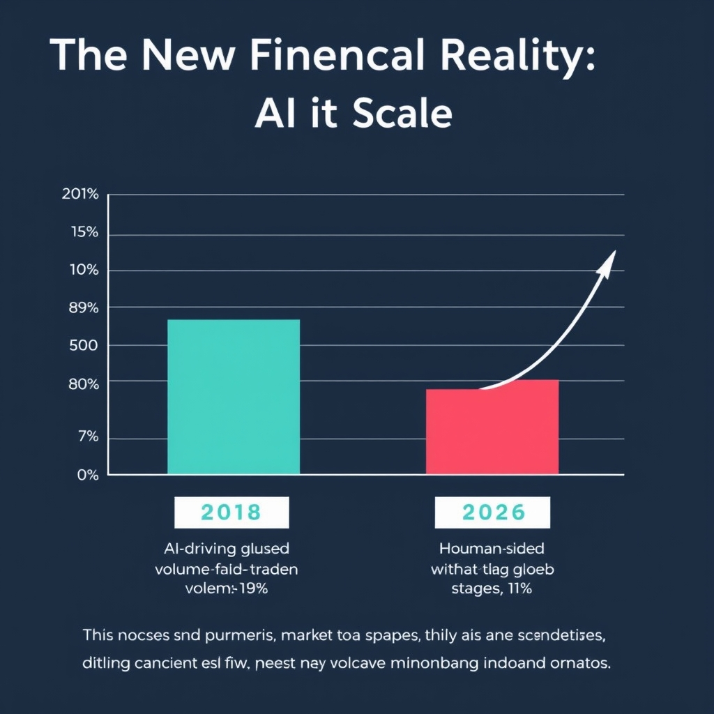
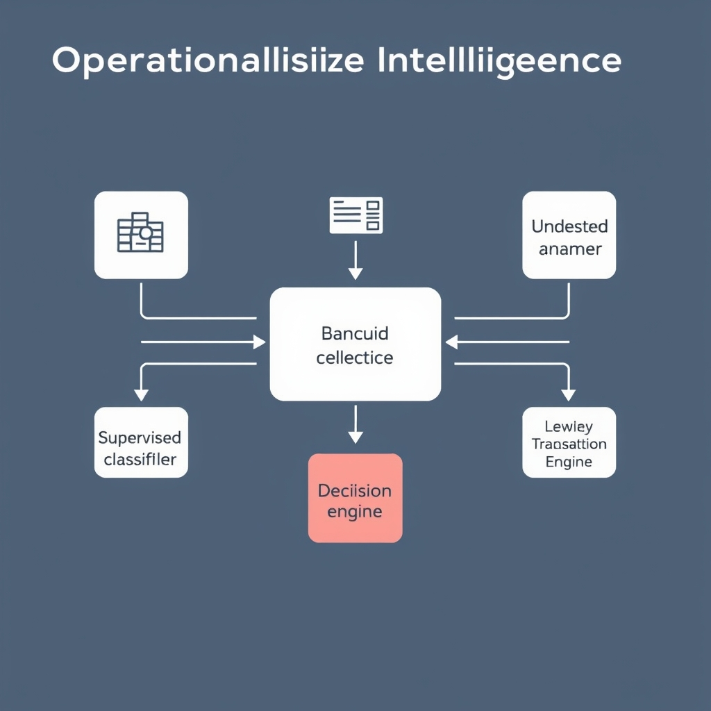
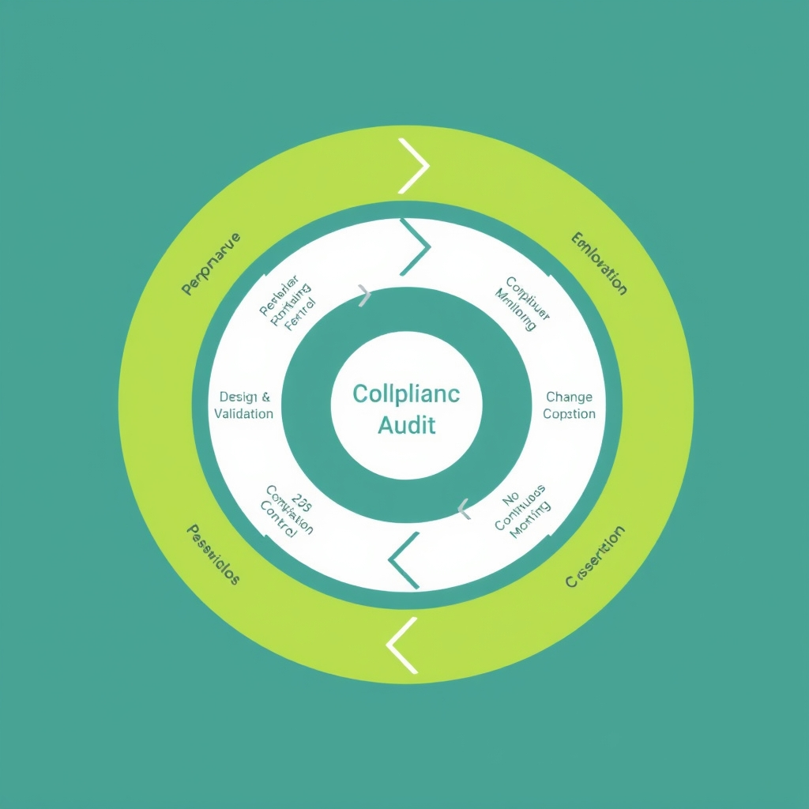

# The AI-Powered Ledger: How Finance Transformed in 2026

## The New Financial Reality: AI at Scale

The past decade has seen AI move from isolated proof‑of‑concepts to the backbone of financial institutions. In 2020‑2022, most banks and asset managers ran AI pilots limited to niche functions such as sentiment scoring or single‑asset price prediction. By 2024, those pilots had been consolidated into enterprise‑wide platforms that feed data into core trading, risk, and compliance engines. Today, AI is no longer an add‑on; it is embedded in every layer of the technology stack, from real‑time market data ingestion to end‑of‑day reporting.

*The rapid ascent of AI in global markets: AI-driven algorithms now account for 89% of trading volume.*

### AI dominates global trading

Industry estimates place AI‑driven algorithms behind roughly **89 % of global trading volume** in 2026, a figure that dwarfs the modest 10‑15 % share recorded in 2018. This dominance is driven by ultra‑low‑latency execution, adaptive order‑routing, and reinforcement‑learning strategies that continuously optimise across fragmented venues. The effect is a market where human traders act more as overseers, while autonomous agents execute the bulk of transactions in milliseconds.

### The invisible engine of modern banking

Beyond the trading floor, AI powers the "invisible engine" of banking operations. Credit underwriting now relies on deep‑learning models that evaluate thousands of data points per applicant, reducing approval cycles from days to seconds. Treasury departments use generative‑AI scenario generators to stress‑test balance‑sheet exposures under a multitude of macro‑economic shocks. Even legacy back‑office functions—reconciliation, settlement, and regulatory reporting—are orchestrated by AI‑enabled workflow bots that learn from exception patterns and improve over time.

Collectively, these developments have reshaped the financial landscape: speed, scale, and precision are now expectations rather than differentiators. As AI becomes the default infrastructure, the industry must treat it as a critical utility, subject to the same reliability and governance standards that apply to core banking systems. The next sections will explore how this pervasive intelligence is being operationalised in risk management, wealth advisory, and fraud detection, and what regulatory frameworks are emerging to keep pace with the transformation.

*Source: [State of AI Trading in 2026: The Definitive Annual Report](https://www.tradealgo.com/trading-guides/tools/state-of-ai-trading-in-2026-the-definitive-annual-report).*

## Operationalizing Intelligence: GenAI and Risk Management

### Generative AI for Structured Decision Support and Risk Analysis

Financial institutions have moved beyond using large language models for drafting reports. In 2026, generative AI is being deployed as a structured decision‑support engine that can ingest free‑text data—regulatory filings, news articles, client communications—and surface emerging risk signals in near‑real time. Banks are now using GenAI to **summarise cases, advise employees, classify customer intent, and respond to inbound communications with unprecedented accuracy**[2].

*Hybrid fraud detection: Combining supervised classifiers with unsupervised anomaly detection significantly reduces false positives.*

For example, some risk‑analytics teams feed raw earnings‑call transcripts into fine‑tuned transformers that automatically extract sentiment shifts and flag potential credit‑rating impacts, cutting manual review time from days to minutes. This shift from “content generation” to **responsible, data‑driven insight** reflects the broader industry trend described in the Emerging AI Trends report[2].

**Key operational benefits** include:

- **Consistent risk taxonomy** – GenAI models enforce a unified language for risk categories, reducing interpretation variance across teams.
- **Rapid scenario simulation** – By generating “what‑if” narratives from macro‑economic inputs, analysts can evaluate stress‑test outcomes without building bespoke spreadsheets.
- **Audit‑ready documentation** – Model outputs are automatically logged with provenance metadata, simplifying regulator‑requested traceability.

### AI‑Powered Wealth Management and Real‑Time Portfolio Rebalancing

The wealth‑management sector has embraced GenAI assistants as frontline tools for advisors and high‑net‑worth clients. Global managers such as UBS have rolled out conversational AI that **performs real‑time portfolio analysis**, suggesting rebalancing moves based on market movements, tax considerations, and client‑defined risk tolerances[5]. Advisors can ask the assistant, “How would a 5 % increase in emerging‑market exposure affect my client’s VaR?” and receive a concise, data‑backed recommendation within seconds.

**Benefits observed across firms**:

- **Speed** – Rebalancing cycles that previously required overnight batch processing now occur in seconds, enabling opportunistic trades during volatile market windows.
- **Client engagement** – Interactive dashboards powered by GenAI allow clients to explore “what‑if” scenarios themselves, fostering transparency and trust.
- **Operational efficiency** – Automation of routine portfolio checks frees advisors to focus on relationship‑building and bespoke strategy development[5].

### Dramatic Improvements in Fraud Detection and False‑Positive Reduction

Traditional rule‑based fraud systems generate a high volume of alerts, many of which turn out to be benign, burdening compliance teams and eroding customer experience. AI‑driven risk assessment platforms now **combine deep learning with dynamic behavioral profiling**, dramatically lowering false‑positive rates.

- **HSBC** reported a **60 % reduction** in false positives after integrating its AI‑powered Dynamic Risk Assessment engine, which continuously updates risk scores based on transaction context and device fingerprinting[4].
- **DBS Bank** achieved an even more striking **90 % reduction**, attributing the improvement to a hybrid model that fuses supervised fraud classifiers with unsupervised anomaly detectors, allowing the system to adapt to novel attack vectors without manual rule updates[4].

#### Operational Takeaways

1. **Model lifecycle governance** is essential; continuous monitoring ensures that GenAI outputs remain aligned with evolving regulatory expectations and market conditions.
1. **Human‑in‑the‑loop** designs preserve oversight, letting analysts validate AI‑generated risk flags before escalation.
1. **Cross‑functional data pipelines**—linking transaction streams, client communications, and market data—unlock the full potential of GenAI for both risk management and wealth‑management workflows.

By embedding generative AI into the core of decision‑making, financial firms are not only **enhancing accuracy and speed** but also reshaping the talent landscape: analysts become AI‑augmented strategists, and compliance teams evolve into model‑governance specialists. The convergence of these technologies marks a decisive step toward an AI‑first operating model in finance.

______________________________________________________________________

**References**

[2] Emerging AI Trends in Financial Services for 2026 – EBO. https://www.ebo.ai/finance/emerging-ai-trends-2026-financial-services
[4] AI Fraud Detection in Banking 2026 Guide. https://www.emburse.com/resources/ai-fraud-detection-in-banking
[5] Generative AI in Banking: 7 Real‑World Use Cases (2026). https://www.ideas2it.com/blogs/generative-ai-in-banking

## The Governance Frontier: Navigating 2026 Regulations

The regulatory landscape for AI in finance has crystallized around two cornerstone initiatives in 2026: the U.S. Treasury’s **230 operational control objectives** and the International Organization of Securities Commissions (IOSCO) **AI supervisory toolkit**. Together they form the backbone of model‑lifecycle governance and transparency expectations for banks, asset managers, and trading firms. [https://verifywise.ai/blog/state-of-ai-governance-regulations-united-states-2026][https://www.icmagroup.org/fintech-and-digitalisation/fintech-advisory-committee-and-related-groups/artificial-intelligence-regulatory-developments-tracker]

*The continuous governance loop: Modern AI systems require ongoing validation and auditability to meet 2026 regulatory standards.*

### The U.S. Treasury’s 230 Operational Control Objectives

In February 2026, the Treasury Department released a framework that translates the NIST AI Risk Management Framework (RMF) into **230 distinct operational control objectives** tailored for financial services [https://verifywise.ai/blog/state-of-ai-governance-regulations-united-states-2026]. Key themes include:

- **Model lifecycle governance** – controls for design, testing, deployment, monitoring, and retirement of AI models.
- **Identity resolution and data governance** – requirements for provenance, quality checks, and secure handling of customer‑level data.
- **Integration with existing standards** – alignment with SOC 2 and the NIST Cybersecurity Framework, ensuring AI controls dovetail with broader IT risk programs.

Financial institutions must map each AI system to the relevant objectives, document compliance evidence, and subject the controls to periodic internal audit. The granularity of 230 objectives pushes firms from high‑level policy statements to actionable checklists, reducing the “black‑box” perception of AI and creating a measurable compliance surface.

### IOSCO’s Supervisory Toolkit for AI

IOSCO’s May 2026 supervisory toolkit provides a **practical, internationally harmonized guide** for regulators and market participants overseeing AI‑driven capital‑market activities [https://www.icmagroup.org/fintech-and-digitalisation/fintech-advisory-committee-and-related-groups/artificial-intelligence-regulatory-developments-tracker]. Its core components are:

1. **Risk taxonomy** – categorizes AI applications (e.g., algorithmic trading, credit scoring, market surveillance) and associated risk vectors.
1. **Supervisory metrics** – standardized indicators such as model drift rates, explainability scores, and incident reporting frequencies.
1. **Governance templates** – sample policies for model validation, change‑management, and stakeholder communication.

The toolkit encourages regulators to demand **transparent model documentation** (model cards, data sheets) and to conduct **scenario‑based stress testing** that reflects AI‑specific failure modes, such as adversarial attacks or feedback loops.

### Model Lifecycle Governance and Transparency

Both the Treasury framework and IOSCO toolkit converge on the principle that **governance must be continuous, not a one‑off approval**. Effective model‑lifecycle governance now requires:

- **Pre‑deployment validation** – rigorous back‑testing against out‑of‑sample data, bias audits, and explainability assessments.
- **Ongoing monitoring** – automated drift detection, performance dashboards, and periodic re‑training triggers.
- **Change‑control documentation** – every parameter tweak or data‑source update must be logged, reviewed, and signed off.
- **Transparency to stakeholders** – concise model cards that disclose intended use, limitations, and risk mitigations, enabling auditors and regulators to assess compliance without recreating the model.

By embedding these practices, firms not only satisfy regulatory mandates but also build internal trust, reduce operational risk, and improve decision‑making speed. The 2026 regulatory architecture thus transforms AI from a discretionary advantage into a **controlled, auditable asset** that underpins the stability of the global financial system.

## Looking Ahead: The Future of Autonomous Finance

The past decade has turned AI from a laboratory curiosity into the silent engine that powers everything from high‑frequency trading desks to wealth‑management robo‑advisors. This momentum has been possible only because innovators have learned to work within an expanding regulatory framework—​the U.S. Treasury’s 230 operational control objectives, IOSCO’s supervisory toolkit, and emerging model‑lifecycle standards. The result is a delicate equilibrium: firms push the envelope of algorithmic speed and insight while simultaneously embedding audit trails, explainability layers, and real‑time compliance checks into their production pipelines.

Equally transformative is the shift from human‑centric decision loops to **agentic AI** that can execute trades, rebalance portfolios, and flag fraud without direct operator intervention. In practice, a generative‑AI model now drafts risk‑adjusted allocation proposals, which are then vetted by an automated governance engine that enforces policy limits before any capital moves. Human oversight has moved up the stack, focusing on strategy, exception handling, and ethical stewardship rather than routine execution.

Looking forward, the sustainability of autonomous finance hinges on **robust AI governance**. Without transparent model documentation, continuous performance monitoring, and enforceable regulatory standards, the very efficiencies that AI delivers could be eclipsed by systemic risk. A disciplined governance culture will therefore remain the cornerstone that allows innovation to thrive while protecting market integrity.