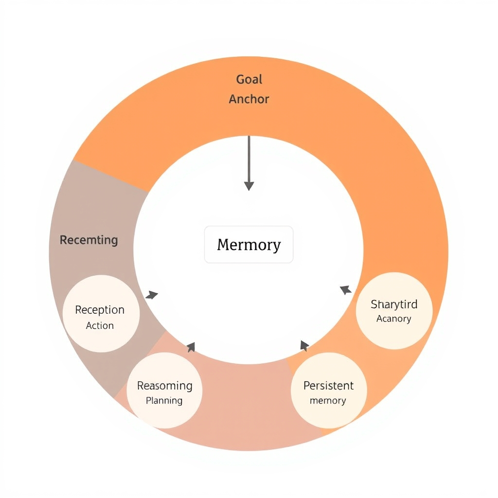
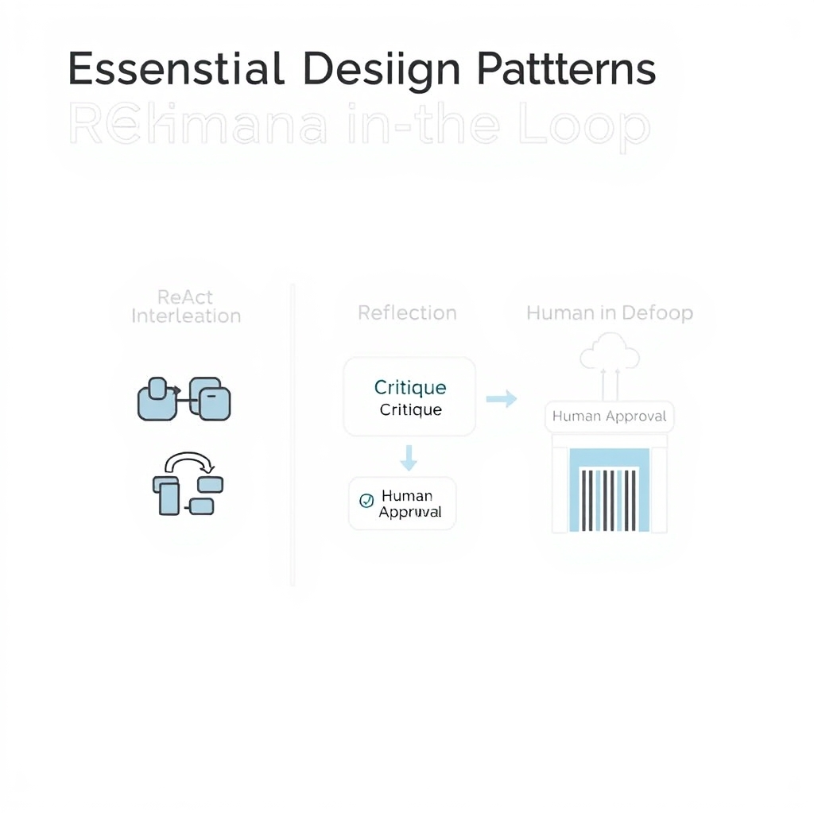
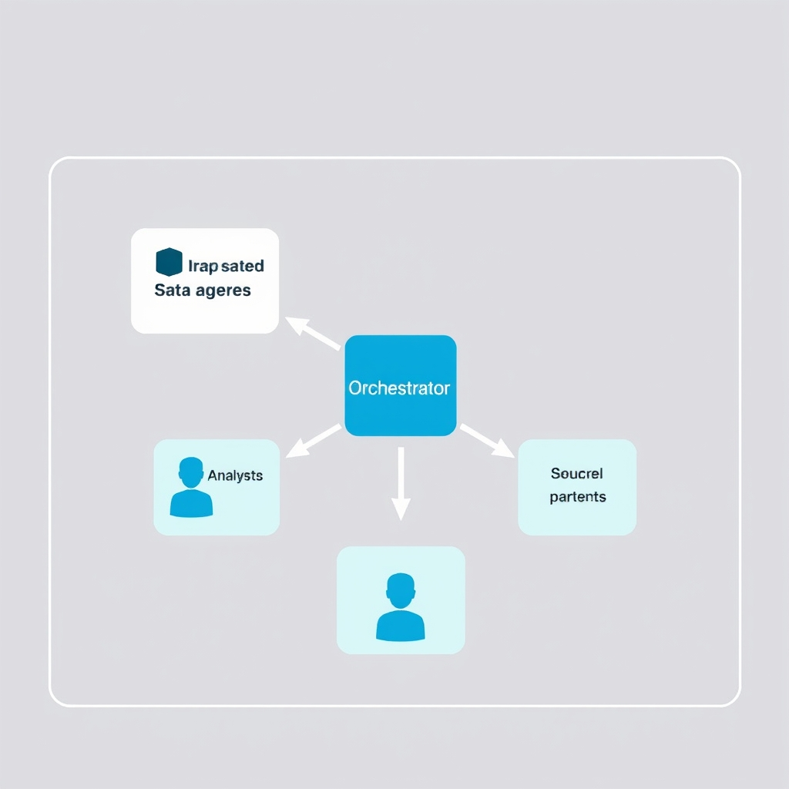

# The Architecture of Autonomy: How AI Agents Work in 2026

## The Anatomy of an Agentic Loop

### The Continuous Agentic Loop

An AI agent is driven by a **goal** that remains the north‑star for every cycle. The goal is supplied once—either by a user prompt or a higher‑level planner—and the agent repeatedly executes the following stages until the goal is satisfied:


*The agentic loop: A continuous cycle where the agent uses memory and observations to refine its actions toward a specific goal.*

1. **Perception** – The agent ingests raw inputs (text, sensor data, API responses) and converts them into an internal representation.
1. **Reasoning** – Using its language model, the agent interprets the perceived state, infers constraints, and generates hypotheses about how to proceed.
1. **Planning** – Based on the reasoning output, a concrete plan is assembled (e.g., a sequence of tool calls or sub‑tasks).
1. **Action** – The agent carries out the plan, invoking external tools, APIs, or performing environment manipulations.
1. **Observation** – Results of the action are observed and fed back as new perceptual data.

After observation, the agent **updates its memory**—a persistent store of context, past actions, and outcomes. This memory is consulted in the next reasoning step, allowing the system to learn from earlier iterations and avoid repeating mistakes. The loop therefore closes on itself: *Goal → Perception → Reasoning → Planning → Action → Observation → Memory Update → Reasoning* (see [AI Agents: Complete Overview (2026)](https://cogitx.ai/blog/ai-agents-complete-overview-2026)).

______________________________________________________________________

### Why This Loop Matters Compared to Plain LLM Inference

A vanilla large language model performs a single forward pass: given a prompt, it returns a completion and stops. There is no notion of state, feedback, or iterative refinement. In contrast, an agentic loop **re‑enters** the model multiple times, each pass informed by updated memory and fresh observations. This enables:

- **Dynamic adaptation** to changing environments.
- **Error correction** through subsequent reasoning cycles.
- **Goal‑driven persistence**, where the agent continues working until success criteria are met, rather than halting after one output.

______________________________________________________________________

### The Goal as the Anchor

The goal functions as the loop’s anchor, providing a stable reference point that prevents drift. Every perception, reasoning, and planning step is evaluated against the goal’s success conditions. If an action does not bring the system closer to the goal, the next reasoning cycle can re‑plan, effectively implementing a feedback‑controlled controller.

By structuring AI behavior around this loop, developers transform a static LLM into an autonomous problem‑solver capable of tackling complex, multi‑step tasks.

## Essential Design Patterns for Reliability

### ReAct: Reasoning + Acting in a Single Loop

The **ReAct** pattern intertwines chain‑of‑thought reasoning with immediate tool execution. Instead of a pure generate‑then‑execute cycle, the LLM produces a reasoning step, decides whether a tool call is needed, invokes the tool, observes the result, and continues reasoning. This tight feedback loop reduces latency and prevents the classic *hallucination‑then‑act* failure where an agent acts on an unverified assumption.

*Example*: An itinerary‑planning agent receives the goal *"Book a three‑day trip to Kyoto"*. It first reasons about travel dates, then calls a flight‑search API, observes the options, refines the plan, and finally triggers a hotel‑booking tool. Each iteration updates the internal state, ensuring the final plan reflects real‑world constraints.

______________________________________________________________________

### Reflection: Self‑Correction and Quality Control

**Reflection** introduces a meta‑cognitive step where the agent reviews its own output before committing to an action. After generating a response, the model is prompted to *"critique the answer for completeness, factual accuracy, and alignment with the goal"*. If deficiencies are detected, the agent re‑enters the reasoning phase to amend the answer.

This pattern mitigates two common failure modes:

1. **Premature execution** – acting on incomplete reasoning.
1. **Goal drift** – deviating from the original objective due to ambiguous intermediate steps.

*Concrete scenario*: A financial‑analysis agent drafts a risk assessment. Before sending the report, it runs a reflection prompt that flags missing market‑volatility data, prompting a second pass that fetches the required metrics via an external API.

______________________________________________________________________

### Human‑in‑the‑Loop (HITL): Guardrails for High‑Stakes Decisions

When the cost of error is high—e.g., medical triage, legal advice, or financial compliance—**Human‑in‑the‑Loop** becomes essential. The pattern inserts a manual approval checkpoint after the agent produces a candidate action. The human reviewer can:

- Validate the reasoning trace.
- Adjust parameters or provide missing context.
- Override or abort the action entirely.

HITL not only catches edge‑case failures but also provides a data source for continual learning: approved actions can be logged as high‑quality demonstrations for future fine‑tuning.

______________________________________________________________________

### Mitigating Coordination Errors

Coordination errors arise when multiple reasoning or tool‑use steps interfere, leading to duplicated calls, deadlocks, or contradictory actions. The three patterns above address these issues in complementary ways:

- **ReAct** ensures that each tool call is immediately contextualized, preventing redundant requests.
- **Reflection** adds a verification layer that can spot contradictory decisions before they propagate.
- **HITL** offers an external sanity check, catching coordination failures that the model’s internal logic might miss.

Collectively, they form a reliability stack that transforms a brittle LLM into a robust autonomous agent capable of handling complex, multi‑step goals.

______________________________________________________________________

> **Reference**: The seven design patterns that matter most—including Reflection, ReAct, and Human‑in‑the‑Loop—are outlined in *The 7 Design Patterns Every AI Agent Developer Should Know in 2026* [[source]](https://pub.towardsai.net/the-7-design-patterns-every-ai-agent-developer-should-know-in-2026-c77f28b51565).


*Reliability patterns: ReAct, Reflection, and Human-in-the-Loop act as guardrails to prevent common agent failure modes.*

## Orchestration and Multi-Agent Collaboration

### From Solo Agents to Collaborative Teams

Early AI agents were built around a single LLM that performed the entire perception‑reasoning‑action loop. While simple to prototype, a monolithic design quickly hits scalability limits: the model must encode all domain knowledge, handle every tool, and manage complex state transitions. Multi‑agent architectures address these constraints by decomposing a task into **specialized agents** that can operate **in parallel** or **in sequence**, each optimized for a narrow sub‑problem. This shift mirrors micro‑service patterns in software engineering—individual services are easier to test, replace, and scale.


*Multi-agent orchestration: Specialized agents collaborate via a shared state, allowing for parallelized and modular workflows.*

### Parallel and Sequential Collaboration

- **Parallel execution**: When a workflow requires independent data streams—e.g., gathering market data while simultaneously summarizing recent news—two agents can run side‑by‑side, each invoking its own toolset. The orchestrator merges their outputs once both finish, reducing overall latency.
- **Sequential pipelines**: Some tasks demand a strict order, such as extracting entities, then validating them, and finally generating a report. Here, the output of the *extraction* agent becomes the input for the *validation* agent, forming a chain of responsibility. The orchestrator tracks the hand‑off, ensuring that each step receives the correct context.

Both patterns rely on a **shared state store** (often a lightweight vector database or a JSON‑based context object) that agents read from and write to. By persisting intermediate results, the system can recover from failures, replay steps, or allow human‑in‑the‑loop interventions without restarting the entire loop. This approach is highlighted in the design‑pattern overview for multi‑agent systems [Design Patterns 2026](https://pub.towardsai.net/the-7-design-patterns-every-ai-agent-developer-should-know-in-2026-c77f28b51565).

### Frameworks that Tame the Complexity

Modern orchestration frameworks abstract away the boilerplate of state management, routing, and error handling:

- **CrewAI** provides a declarative DSL to define *crew members* (agents) and their communication protocols, automatically handling context propagation and result aggregation.
- **LangGraph** builds on LangChain’s graph model, allowing developers to sketch directed acyclic graphs where nodes represent agents and edges encode data flow. It includes built‑in checkpointing to resume interrupted runs.
- **AutoGen** focuses on dynamic role‑playing between agents, enabling them to negotiate task division at runtime and synchronize via a shared memory buffer.

These tools are among the most mature solutions identified in the 2026 survey of AI agent frameworks [Lindy AI Agent Frameworks](https://www.lindy.ai/blog/best-ai-agent-frameworks).

### Benefits of Domain‑Specific Optimization

Specialized agents can be fine‑tuned on narrow corpora, dramatically improving accuracy and inference speed. For example, a legal‑analysis agent trained on statutes can answer regulatory questions faster than a general‑purpose LLM that must retrieve and reason over the same information. When such agents are combined, the overall system inherits the **best‑of‑both‑worlds** advantage: high precision in each domain and the flexibility to compose them for complex, cross‑domain objectives.

Moreover, isolating domains reduces **catastrophic forgetting**—updates to one agent’s model do not unintentionally degrade performance in another area. This modularity also simplifies compliance audits, as each agent’s data handling can be inspected independently.

### The Bottom Line

Orchestrating multiple, purpose‑built agents transforms a monolithic AI pipeline into a scalable, resilient ecosystem. By leveraging frameworks like CrewAI, LangGraph, and AutoGen for state management, and by exploiting parallel and sequential collaboration patterns, developers can tackle sophisticated workflows while maintaining reliability and domain expertise.

## Interacting with the World: Tool Use

### Function Calling as the Core Tool Interface

In modern agent architectures, *function calling* is the canonical bridge between a language model's textual reasoning and concrete actions in the external world. The model emits a structured JSON payload that describes the name of a function, its arguments, and the expected return type. The orchestration layer then invokes the corresponding implementation—often an HTTP request, a database query, or a local utility—before feeding the result back into the next reasoning step. This pattern is explicitly highlighted as the primary mechanism for tool interaction in contemporary frameworks [Function Calling and Tool Use - Interactive - Michael Brenndoerfer](https://mbrenndoerfer.com/writing/function-calling-tool-use-practical-ai-agents).

### From LLM Reasoning to API Calls

An agent’s reasoning loop produces a *plan* that may include calls to external services. The LLM does not issue raw HTTP requests; instead, it selects a predefined function that encapsulates the desired operation (e.g., `get_weather`). The orchestration layer translates the model’s intent into a concrete API call, handling authentication, request formatting, and error handling. By isolating the LLM from low‑level networking, developers keep the model’s prompt space small and maintain a clear contract between reasoning and execution.

### Why Standardized Interfaces Matter

Standardizing function signatures—consistent naming, typed arguments, and deterministic return schemas—prevents coordination failures. When every tool adheres to a shared OpenAPI‑like description, the agent can validate arguments before invocation, catch mismatches early, and reliably compose multiple tools in a single session. This reliability is essential for high‑stakes applications where unexpected API responses could cascade into incorrect decisions.

### High‑Level Selection and Execution Flow

1. **Goal formulation** – The agent receives a user goal (e.g., "Plan a weekend trip").
1. **Reasoning** – The LLM decides which tool(s) are needed (e.g., `search_flights`, `get_weather`).
1. **Function call generation** – The model outputs a JSON call specification.
1. **Orchestration** – The runtime matches the specification to a concrete implementation, executes the call, and captures the response.
1. **Observation** – The result is injected back into the loop as context for the next reasoning step.

### Example: Python Stub Using OpenAI Function Calling

```python
import openai
import json

# Define the tool the agent can call
functions = [{
    "name": "get_weather",
    "description": "Retrieve current weather for a city",
    "parameters": {
        "type": "object",
        "properties": {
            "city": {"type": "string", "description": "Name of the city"}
        },
        "required": ["city"]
    }
}]

response = openai.ChatCompletion.create(
    model="gpt-4o-mini",
    messages=[{"role": "user", "content": "Will it rain in Seattle tomorrow?"}],
    functions=functions,
    function_call="auto"
)

# Extract the function call request
call = response.choices[0].message.function_call
if call:
    args = json.loads(call.arguments)
    # Simulated API call – replace with real HTTP request
    weather = f"Light rain expected in {args['city']} tomorrow."
    # Feed observation back to the model
    follow_up = openai.ChatCompletion.create(
        model="gpt-4o-mini",
        messages=[
            {"role": "assistant", "content": f"Calling get_weather with {args}"},
            {"role": "function", "name": call.name, "content": weather}
        ]
    )
    print(follow_up.choices[0].message.content)
```

The snippet demonstrates the full cycle: the LLM decides to call `get_weather`, the orchestration layer executes a stubbed API request, and the result is re‑introduced as a *function* message, allowing the model to produce a final, informed answer.