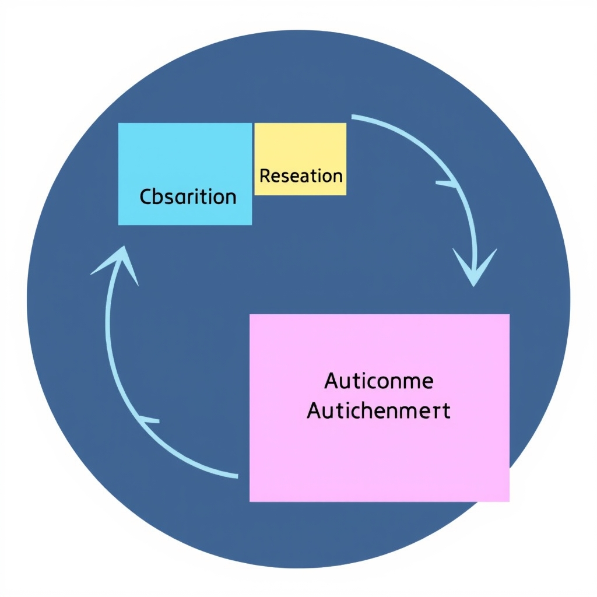
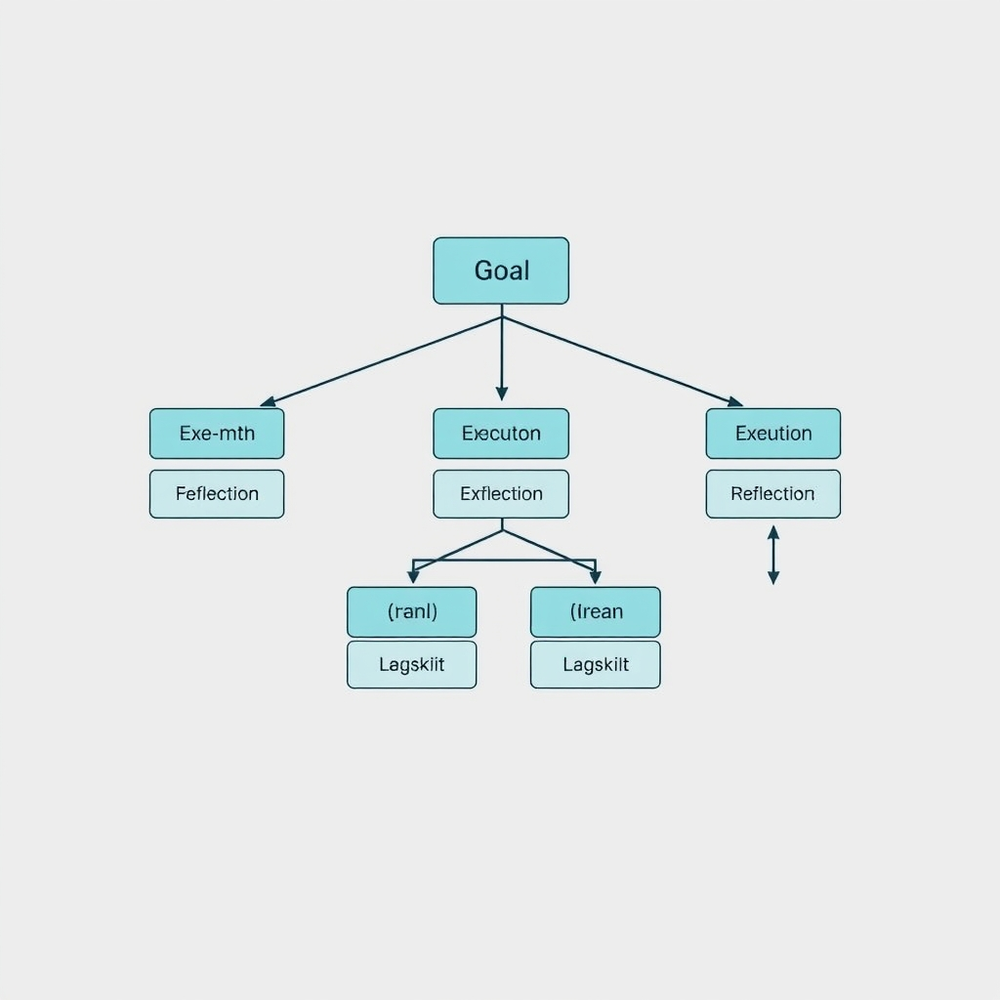
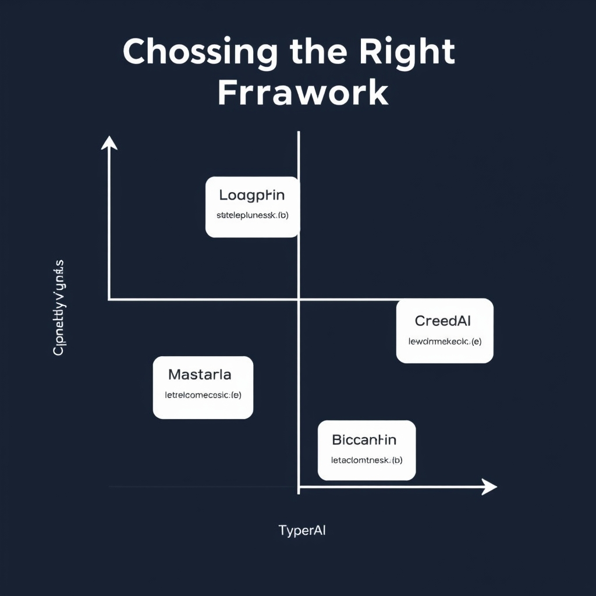

# The Architecture of Autonomy: How AI Agents Work in 2026

## The Anatomy of an Autonomous Agent

### Observation‑Reasoning‑Action Cycle

An autonomous AI agent differs from a traditional LLM by running a **continuous loop** rather than a single prompt‑response exchange. When a goal is presented, the agent first **observes** its environment—pulling data from APIs, databases, or user inputs. This observation stage establishes the current state and surfaces any constraints (e.g., rate limits, data privacy rules). The agent then **reasons** over the gathered context, selecting a plan that aligns with the goal while respecting the identified constraints. Finally, it **acts** by invoking tools, sending messages, or updating records, after which the loop repeats to incorporate the outcome of the action.

*The agentic loop: Unlike static LLMs, agents continuously observe their environment, reason about the state, and execute actions to achieve a goal.*

### Gathering Context and Identifying Constraints

Context acquisition is more than fetching raw text; it involves **semantic filtering** (e.g., retrieving only records that match a date range) and **constraint detection** (e.g., recognizing that a financial transaction must stay under a regulatory threshold). By explicitly modeling constraints, the agent can prune infeasible actions early, reducing wasted computation and preventing downstream errors.

### Static Prompt‑Response vs. Continuous Agentic Loops

A static LLM operates in a **single-shot** fashion: a prompt is sent, a response is returned, and the interaction ends. This model works well for isolated Q&A but struggles with multi‑step tasks that require stateful tracking or iterative refinement. In contrast, an autonomous agent maintains **persistent state** across iterations, allowing it to:

- Refine its plan based on intermediate results.
- Re‑query external systems when new information emerges.
- Adjust its behavior dynamically if constraints change.

### Goal‑Oriented Behavior

The loop is anchored by a **goal definition**—a concise, measurable objective such as "generate a quarterly sales report" or "schedule a cross‑team meeting within 48 hours." The agent continuously evaluates progress against this goal, using the observation‑reasoning‑action cycle to close the gap. This goal‑centric focus prevents drift, ensuring that each action contributes directly to the intended outcome rather than wandering into unrelated territory.

By embedding observation, reasoning, and action into a self‑reinforcing loop, autonomous agents transform raw language models into purposeful executors capable of handling complex, real‑world workflows.

## Architectural Patterns for Reliable Reasoning

### The ReAct (Reasoning + Acting) Pattern

ReAct intertwines chain‑of‑thought reasoning with immediate tool invocation. After the LLM generates a reasoning step, it checks whether an external action—such as a database query, API call, or file operation—is required. If so, the agent executes the action, feeds the result back into the prompt, and continues reasoning. This tight loop prevents the model from hallucinating answers that depend on up‑to‑date information because every decision point is grounded in a concrete observation.

*Plan-and-Execute architecture: Complex tasks are decomposed into sub-goals, executed, and validated through reflection to prevent reasoning drift.*

> "The seven patterns that matter most are: Reflection, ReAct, Plan and Execute, Tool Use, Multi‑Agent Collaboration, Memory Management, and Human‑in‑the‑Loop."[^1]

By structuring prompts to explicitly request a *reason* followed by an *action* token, developers can enforce a deterministic execution order, making debugging and audit trails much clearer.

______________________________________________________________________

### Plan‑and‑Execute Patterns for Complex Tasks

When a goal exceeds a single reasoning step—e.g., drafting a multi‑section report or orchestrating a cross‑system workflow—agents adopt a two‑phase approach:

1. **Planning** – The LLM produces a hierarchical task list, often expressed as a directed acyclic graph (DAG). Each node represents a sub‑goal with its own input and expected output.
1. **Execution** – A scheduler iterates over the DAG, invoking the appropriate tool for each node and feeding the result back into the next planning step if dynamic replanning is needed.

This decomposition reduces reasoning drift because the agent repeatedly validates intermediate outputs against explicit sub‑goals rather than relying on a single, monolithic chain of thought.

______________________________________________________________________

### Reflection: Self‑Correcting Agent Outputs

Reflection adds a meta‑cognitive layer: after completing a reasoning‑action cycle, the agent reviews its own answer for consistency, completeness, and alignment with the original objective. If discrepancies are detected, the agent can:

- **Re‑prompt** with a refined question that highlights the gap.
- **Adjust** the plan by inserting additional steps.
- **Escalate** to a human‑in‑the‑loop for verification.

The pattern is especially valuable in long‑running tasks where early mistakes can compound. By periodically invoking a reflection step, the system maintains a bounded error rate and provides a natural hook for logging and observability.

______________________________________________________________________

### Memory Management for Long‑Running Tasks

Agents that operate over extended sessions must retain relevant context without overwhelming the LLM's token window. Effective memory management combines:

- **Short‑term episodic memory** – Stores the most recent observations and actions, typically in a sliding window.
- **Long‑term semantic stores** – Vector databases or knowledge graphs that index past interactions, enabling retrieval‑augmented generation.
- **Selective forgetting** – Policies that prune stale or low‑relevance entries to keep the context concise.

When memory is mis‑managed, agents either lose critical constraints (causing drift) or exceed token limits, leading to truncation errors. Implementations often expose a *memory manager* component that abstracts these concerns, allowing the reasoning core to request "relevant facts" without worrying about storage details.

______________________________________________________________________

### Putting It All Together

A robust autonomous agent typically layers these patterns: it begins with a **ReAct** loop to ground each decision, escalates to a **Plan‑and‑Execute** framework for multi‑step objectives, inserts periodic **Reflection** checkpoints to self‑audit, and relies on a disciplined **Memory Management** subsystem to preserve context. This architecture yields coherent, reliable behavior even when the underlying LLM is a probabilistic model.

______________________________________________________________________

\[^1\]: The 7 Design Patterns Every AI Agent Developer Should Know in 2026, *Towards AI*, https://pub.towardsai.net/the-7-design-patterns-every-ai-agent-developer-should-know-in-2026-c77f28b51565

## Choosing the Right Framework

### Mastra – TypeScript‑first production agents

Mastra is positioned as the *best full‑stack framework for TypeScript teams* that need to ship production‑grade agents. It bundles a typed prompt‑builder, a built‑in ReAct loop, and first‑class support for serverless deployment (e.g., Vercel, Cloudflare Workers). Because the entire stack is written in TypeScript, developers benefit from static type checking across prompt templates, tool wrappers, and the agent’s internal state. This reduces runtime errors that often arise when mixing loosely typed JavaScript with LLM responses.

Key strengths:

- **Typed orchestration** – actions, observations, and memory objects are defined as interfaces, enabling IDE autocompletion and compile‑time validation.
- **Built‑in observability** – Mastra emits OpenTelemetry traces for each reasoning step, simplifying monitoring in production.
- **Plug‑and‑play tool adapters** – pre‑configured connectors for common APIs (REST, GraphQL, databases) accelerate integration.

These features make Mastra a natural choice when the engineering culture revolves around TypeScript and when strict type safety is a non‑negotiable requirement. [(source)](https://www.agentmail.to/blog/best-ai-agent-frameworks-2026)

______________________________________________________________________

### LangGraph – Stateful Python workflows

LangGraph excels at *complex, stateful workflows* written in Python. It introduces a graph‑based abstraction where each node represents a reasoning or acting step, and edges encode data flow. This model lets developers compose long‑running agents that maintain mutable state across many LLM calls—ideal for tasks such as document summarisation pipelines, multi‑turn negotiations, or iterative data enrichment.

Salient capabilities:

- **Explicit graph definition** – developers declare nodes with Python functions and connect them declaratively, giving clear visualisation of the execution path.
- **Persistent memory layers** – LangGraph integrates with vector stores (e.g., Pinecone, Chroma) and relational databases, enabling agents to retrieve and update context over days or weeks.
- **Python ecosystem leverage** – seamless access to scientific libraries (NumPy, pandas) and ML frameworks (PyTorch, TensorFlow) allows agents to perform on‑the‑fly data processing before or after LLM calls.

When the team’s expertise is Python‑centric and the use case demands sophisticated state handling, LangGraph provides the most expressive foundation. [(source)](https://www.agentmail.to/blog/best-ai-agent-frameworks-2026)

______________________________________________________________________

### CrewAI – Rapid multi‑agent prototyping

CrewAI is marketed as the *best framework for fast multi‑agent prototypes*. It abstracts away the boilerplate of spawning, coordinating, and synchronising multiple agents that each specialise in a sub‑task (e.g., research, synthesis, reporting). The framework supplies a declarative “crew” DSL where roles, tools, and communication protocols are defined in a few YAML blocks.

Advantages for quick iteration:

- **Role‑centric configuration** – define each agent’s purpose, prompt, and toolset without writing custom orchestration code.
- **Automatic task delegation** – CrewAI’s scheduler routes sub‑tasks to the most suitable agent based on capability tags.
- **Lightweight runtime** – the core engine runs on a single process, making local development and debugging straightforward.

CrewAI shines in hackathon‑style projects or internal proof‑of‑concepts where speed outweighs the need for deep type safety or long‑term state persistence. [(source)](https://www.agentmail.to/blog/best-ai-agent-frameworks-2026)

______________________________________________________________________

### Decision Matrix

| Criterion                 | Mastra (TS)                                 | LangGraph (Python)                           | CrewAI (Multi‑agent)              |
| ------------------------- | ------------------------------------------- | -------------------------------------------- | --------------------------------- |
| Primary language          | TypeScript                                  | Python                                       | Python (DSL)                      |
| Type safety               | ✅ Compile‑time checks                      | ❌ Runtime only                              | ❌ Runtime only                   |
| State management          | Basic session memory                        | ✅ Persistent graph state                    | Limited per‑task state            |
| Multi‑agent orchestration | Manual composition                          | Manual composition                           | ✅ Built‑in crew DSL              |
| Production observability  | OpenTelemetry built‑in                      | Custom instrumentation needed                | Basic logging                     |
| Learning curve            | Moderate (TS ecosystem)                     | Moderate‑high (graph concepts)               | Low (YAML DSL)                    |
| Ideal use case            | Enterprise services, strict CI/CD pipelines | Long‑running pipelines, data‑heavy workflows | Rapid prototyping, internal tools |

**How to choose**

1. **Team language expertise** – If your engineers are comfortable with TypeScript and value compile‑time guarantees, start with Mastra. If Python is the lingua franca, LangGraph offers richer state handling.
1. **Complexity of the workflow** – For linear or modestly branching tasks, Mastra or CrewAI suffice. When the workflow resembles a directed acyclic graph with many intermediate states, LangGraph’s graph model reduces boilerplate.
1. **Speed vs. robustness** – CrewAI accelerates prototype delivery; however, for production‑grade agents that must meet SLA and compliance requirements, Mastra’s observability and type safety are decisive.
1. **Future scaling** – Consider whether you will later need persistent memory or multi‑agent coordination. Selecting a framework that aligns with the anticipated growth path avoids costly rewrites.

By mapping your project constraints to the matrix above, you can make an evidence‑backed decision that balances development velocity with long‑term reliability. [(source)](https://www.agentmail.to/blog/best-ai-agent-frameworks-2026)

*Framework selection matrix: Choosing between frameworks depends on the trade-off between development speed and the need for robust, stateful production systems.*

## Enterprise Integration and Governance

### Automating Document Generation and Administrative Tasks

AI agents are now routinely employed to produce contracts, policy documents, and routine reports without human intervention. By pulling data from internal databases, the agent can populate templates, apply business rules, and perform quality checks before handing the draft to a reviewer. In practice, enterprises report that such automation reduces document turnaround time by 30‑50% and frees staff for higher‑value work.

### Integration with Core Enterprise Systems

| System                                       | Typical Integration Point                          | Benefit                                                                 |
| -------------------------------------------- | -------------------------------------------------- | ----------------------------------------------------------------------- |
| **HRMS** (e.g., Workday, SAP SuccessFactors) | Employee profile lookup, benefits enrollment forms | Pre‑fills forms with up‑to‑date employee data, eliminating manual entry |
| **CRM** (e.g., Salesforce, HubSpot)          | Customer interaction history, opportunity data     | Generates personalized proposals and follow‑up emails in real time      |
| **ERP** (e.g., Oracle, Microsoft Dynamics)   | Purchase order status, inventory levels            | Triggers procurement documents and compliance checks automatically      |

These connections are usually realized through secure APIs or middleware platforms that expose standard REST/GraphQL endpoints. The agent’s reasoning loop queries the relevant system, incorporates the returned data into its plan, and then executes the next action—whether that is drafting a document, sending an email, or updating a record.

### Human‑in‑the‑Loop Governance

Even with sophisticated reasoning, agents can produce outputs that violate policy or miss nuanced business constraints. A governance layer inserts a human checkpoint at critical stages:

- **Review before finalization** – The agent flags generated content for a subject‑matter expert to approve.
- **Policy enforcement** – Automated rule engines validate that outputs comply with regulatory or internal standards.
- **Escalation triggers** – If confidence scores fall below a threshold, the task is rerouted to a human operator.

This hybrid approach preserves the speed of automation while safeguarding against costly errors, a practice highlighted in recent enterprise case studies.

### Observability and Monitoring

Production‑grade agents must be observable to ensure reliability and to diagnose drift. Key observability signals include:

- **Execution traces** – Log each observation, reasoning step, and action with timestamps.
- **Performance metrics** – Track latency, success rates, and resource consumption per workflow.
- **Anomaly detection** – Alert on deviations such as unexpected API response codes or repeated retries.

Dashboards that aggregate these metrics enable ops teams to spot bottlenecks, audit decision paths, and maintain compliance documentation.

> "AI agents streamline document creation, integrate with HRMS and other enterprise systems to pre‑fill forms, and help employees manage schedules efficiently."[^1]

______________________________________________________________________

[^1]: https://www.atomicwork.com/blog/ai-agent-use-cases