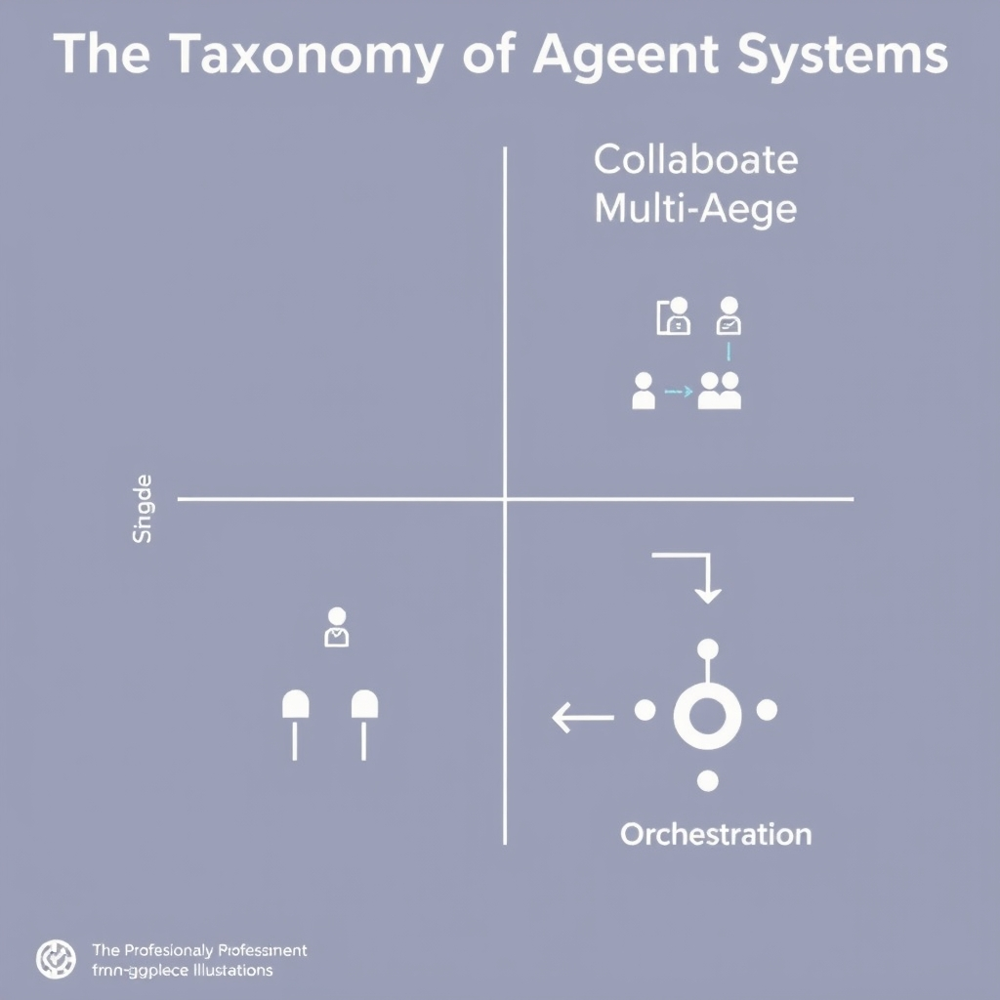
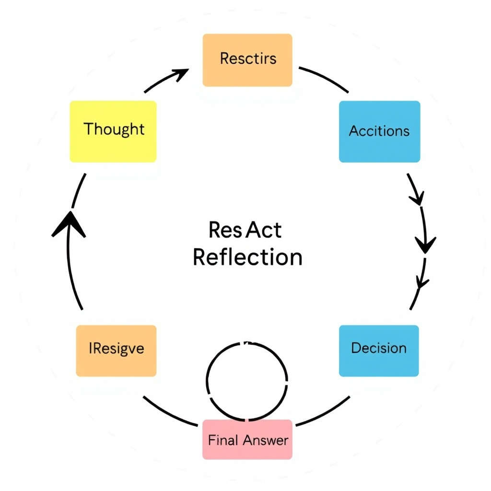
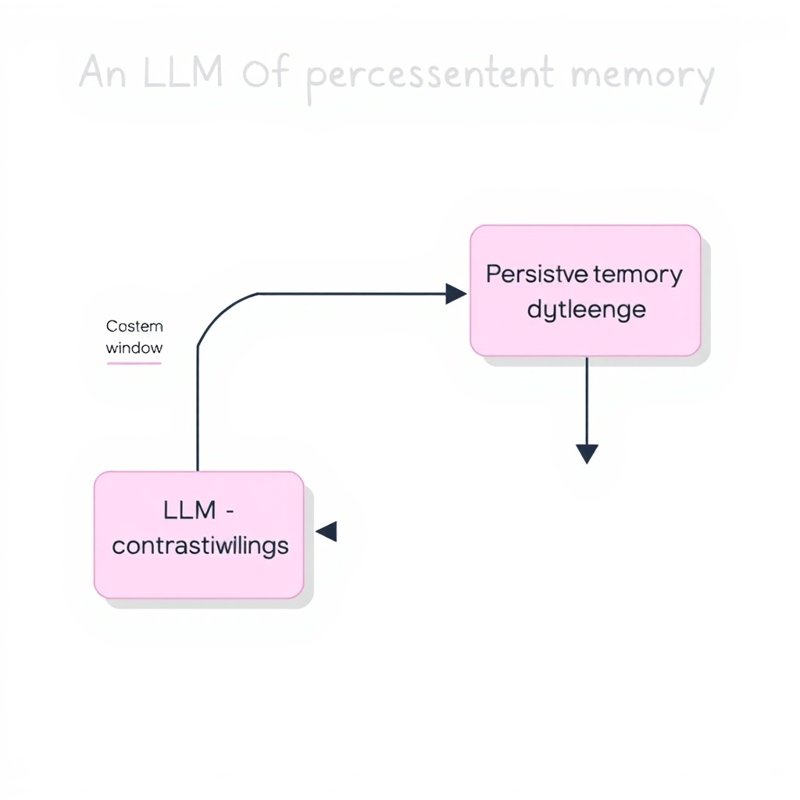

# The Architecture of Autonomy: How AI Agents Work in 2026

## The Taxonomy of Agentic Systems


*The 2026 taxonomy of agentic systems, categorizing architectures by their interaction and control models.*

The modern landscape of AI agents can be visualized as a **four‑quadrant taxonomy** that groups the eight canonical patterns emerging in 2026 [Digital Applied](https://www.digitalapplied.com/blog/agent-architecture-patterns-taxonomy-2026). Each quadrant reflects a distinct interaction model:

| Quadrant                      | Core Idea                                                                           | Typical Use‑Case                                                                  |
| ----------------------------- | ----------------------------------------------------------------------------------- | --------------------------------------------------------------------------------- |
| **Single‑Agent**              | One LLM orchestrates a task end‑to‑end.                                             | Personal assistants, single‑step data extraction.                                 |
| **Collaborative Multi‑Agent** | Multiple agents share responsibilities, passing data or subtasks.                   | Complex workflows like research‑assist + summarizer pipelines.                    |
| **Competitive Multi‑Agent**   | Agents vie for the best answer, often via voting or adversarial prompting.          | Decision‑support systems where diverse perspectives improve robustness.           |
| **Orchestration**             | A higher‑level controller (often a meta‑agent) schedules and monitors other agents. | Enterprise‑scale automation platforms that coordinate dozens of specialized bots. |

### Why Architectural Stability Matters

Production‑grade AI services demand **predictable behavior** across releases. A stable architecture provides:

- **Deterministic routing** of requests, making latency and cost forecasting reliable.
- **Observability hooks** (logging, tracing) that survive component upgrades.
- **Isolation of failure modes**, so a malfunctioning sub‑agent does not cascade through the entire system.
- **Regulatory compliance**, because a well‑defined data flow simplifies audit trails.

Without a stable scaffold, teams resort to ad‑hoc prompt chaining, which quickly becomes brittle as model APIs evolve.

### From Simple LLM Calls to Structured Agentic Workflows

Early prototypes treated an LLM as a glorified function: a single prompt → a single response. Modern agents embed the LLM within **workflow primitives**—state machines, graph‑based planners, and memory layers—that enforce sequencing, error handling, and context retention. For example, a collaborative multi‑agent pipeline might:

1. Invoke a *retriever* agent to gather documents.
1. Pass results to a *reasoner* agent that applies the ReAct pattern.
1. Hand the synthesized answer to a *validator* agent that cross‑checks factuality.

This shift from flat calls to **structured orchestration** reduces hallucinations, improves scalability, and aligns AI behavior with traditional software engineering practices, setting the stage for the deeper reasoning and planning patterns discussed next.

## Core Reasoning and Planning Patterns

### ReAct (Reasoning and Acting)

ReAct is the de‑facto standard for prompting autonomous agents. The technique forces the language model to **first generate a chain of reasoning** and then **explicitly observe the environment** before issuing an action command. By separating thought from execution, the model avoids premature actions that stem from hallucinated confidence. In practice, a ReAct prompt interleaves `Thought:` and `Action:` blocks, allowing the underlying LLM to iterate until a satisfactory answer emerges.[^1]


*The ReAct and Reflection loop: agents reason, act, observe, and critique their own output before finalizing.*

> "ReAct prompting technique combines the ‘reasoning’ and ‘acting’ capabilities of an LLM to help with tasks like action planning, verbal reasoning, decision‑making, and knowledge integration. It does so by forcing the model to reason and observe before acting."

The pattern shines in retrieval‑augmented QA, tool‑driven workflows, and any scenario where the cost of a wrong action is high.

______________________________________________________________________

### Reflection

Reflection extends ReAct by adding a **self‑critique loop** after each action. The agent reviews its previous output, asks *"Was this correct? What could be improved?"*, and optionally revises its plan. This meta‑cognitive step has been shown to raise answer fidelity, especially on multi‑step problems where early mistakes propagate.[^2]

Typical implementation steps:

1. Execute a ReAct cycle.
1. Capture the result and feed it back into a `Reflection:` prompt.
1. If the reflection flags an issue, the agent re‑enters the ReAct loop with a revised hypothesis.

______________________________________________________________________

### Plan‑and‑Execute

Complex, long‑horizon tasks (e.g., project planning, multi‑day data pipelines) exceed the capacity of a single reasoning step. The Plan‑and‑Execute pattern decomposes the problem into a **high‑level plan** followed by **iterative execution of sub‑tasks**.[^2]

1. **Planning phase** – The agent produces a structured outline (often as a numbered list) describing the required steps.
1. **Execution phase** – Each step is fed back to the LLM as a new prompt, optionally invoking tools or external APIs.
1. **Monitoring** – After each sub‑task, the agent checks progress against the original plan, adjusting as needed.

This approach mitigates context‑window limits and provides a natural checkpointing mechanism, making it easier to debug and audit agent behavior.

______________________________________________________________________

### Tool Use

Tool use bridges the gap between abstract reasoning and concrete impact. An agent equipped with tool‑use capabilities can **invoke APIs, run code, query databases, or manipulate files** directly from its reasoning loop.[^2]

A typical tool‑use cycle looks like:

```text
Thought: I need the current weather in Paris.
Action: call_api(weather_service, location="Paris")
Observation: {"temp": 18, "condition": "Cloudy"}
Thought: Based on the temperature, suggest a light jacket.
Answer: Wear a light jacket.
```

Key benefits include:

- **Reduced hallucination**: The model grounds its answers in real data.
- **Extended capability**: Agents can perform calculations, fetch up‑to‑date information, or modify external systems without hard‑coding logic.
- **Modular extensibility**: New tools can be added without retraining the underlying model.

______________________________________________________________________

### Integrating the Patterns

In production‑grade agents, these patterns are rarely used in isolation. A robust workflow often follows this scaffold:

1. **Plan** the overall objective.
1. **Iterate with ReAct** for each sub‑task, inserting **Reflection** after critical actions.
1. **Invoke tools** whenever the reasoning step requires external data or side‑effects.
1. **Re‑plan** if observations diverge significantly from expectations.

By layering ReAct, Reflection, Plan‑and‑Execute, and Tool Use, developers obtain agents that reason transparently, self‑correct, handle long‑term goals, and act on the real world.

______________________________________________________________________

## The Necessity of Persistent Memory

### Context Windows vs. Persistent Memory

Large language models (LLMs) operate on a *context window*—a fixed‑size token buffer (typically 4 k–32 k tokens) that holds the prompt and recent dialogue. Once the window is full, older tokens are discarded, meaning the model forgets anything that happened earlier in the conversation. This limitation is acceptable for short, single‑turn interactions but becomes a bottleneck for agents that must reason over days, weeks, or even months of activity.


*Persistent memory architecture: moving beyond the transient context window to enable long-term, relational knowledge retention.*

A **persistent memory layer** sits outside the LLM and stores information indefinitely. It can be queried and updated across calls, allowing the agent to retrieve facts, decisions, or intermediate results that lie far beyond the transient context window. As noted by Cognee, “the difference between a prototype and a production‑grade agent is not the model it uses — it is whether the agent can remember” [1].

### Graph‑Native Databases for Long‑Term Context

When memory must capture relationships—not just isolated text snippets—graph‑native databases excel. Unlike flat vector stores, graph databases model entities as nodes and their interactions as edges, preserving the topology of knowledge. This structure enables:

- **Semantic traversal**: an agent can follow a chain of related concepts (e.g., *customer → purchase → support ticket*) without reconstructing the path from raw vectors.
- **Efficient updates**: adding a new fact merely inserts a node or edge, leaving existing connections intact.
- **Rich queries**: languages such as Cypher or Gremlin let agents ask “What unresolved issues does user X have that are linked to product Y?”

Cognee’s guide highlights the use of graph‑native systems like **Cognee** to index and retrieve long‑term context, providing both fast similarity search and relational reasoning in a single store [1].

### Cross‑Session Continuity

Persistent storage transforms an agent from a *stateless* chatbot into a *stateful* collaborator. Key benefits include:

1. **Session stitching** – When a user returns after days, the agent can pull the prior session’s summary, decisions, and pending actions, delivering a seamless experience.
1. **Learning from history** – Agents can aggregate performance metrics, error patterns, and user preferences over time, enabling continuous improvement without retraining the underlying model.
1. **Regulatory compliance** – Auditable logs of interactions are stored immutably, satisfying data‑retention policies.

Implementation patterns often combine a **vector store** for fast similarity lookup with a **graph layer** for relational context. For example, an agent might embed a new document, store the embedding in a vector index, and simultaneously create a node linking the document to relevant entities in the graph. Subsequent queries first retrieve the most similar embeddings, then enrich results by traversing the graph to assemble a coherent answer.

### Bottom Line

Without persistent memory, agents are confined to the fleeting scope of the LLM’s context window, limiting their usefulness in real‑world workflows. Graph‑native databases provide the relational scaffolding needed for long‑term, structured knowledge, while persistent storage ensures continuity across sessions, turning experimental prototypes into production‑ready systems.

**References**

1. "I'm Building an AI Agent — What's the Best Persistent Memory Layer?" (2026). https://www.cognee.ai/blog/guides/building-an-ai-agent-best-persistent-memory-layer

## Implementing Agentic Workflows

### Comparing Leading Agentic Frameworks

| Framework     | Core Strengths                                                               | Orchestration Model                                                           | Built‑in Memory Support                                                       | Typical Use Cases                                                         |
| ------------- | ---------------------------------------------------------------------------- | ----------------------------------------------------------------------------- | ----------------------------------------------------------------------------- | ------------------------------------------------------------------------- |
| **CrewAI**    | Simple declarative DSL; strong focus on task decomposition                   | Hierarchical task trees that are auto‑expanded at runtime                     | Optional integration with vector stores; explicit `Memory` node               | Small‑to‑medium single‑agent pipelines, rapid prototyping                 |
| **LangGraph** | Graph‑native representation; seamless chaining of LLM calls                  | Directed acyclic graph (DAG) where each node can be a tool, LLM, or sub‑graph | Native graph‑database adapters (e.g., Neo4j, Weaviate) for persistent context | Complex multi‑step reasoning, long‑horizon planning, collaborative agents |
| **AutoGen**   | Emphasis on multi‑agent dialogue; auto‑generation of communication protocols | Agent‑to‑agent message passing with configurable routers                      | Provides a `ChatHistory` buffer; can be swapped for external stores           | Competitive or cooperative multi‑agent simulations, negotiation bots      |

*Source: [Agentic AI Frameworks: Top 10 Options in 2026](https://www.instaclustr.com/education/agentic-ai/agentic-ai-frameworks-top-10-options-in-2026)*

### How These Frameworks Abstract Orchestration

All three frameworks hide the boilerplate that would otherwise be required to:

- **Instantiate LLM clients** with correct temperature, token limits, and API keys.
- **Route tool calls** (e.g., database queries, web searches) based on the agent’s intent.
- **Maintain execution state** across asynchronous steps, ensuring that retries or back‑off logic does not corrupt the workflow.

For example, in LangGraph a developer defines a node that calls an external API and simply connects it to a downstream reasoning node. The framework automatically serialises the request, handles rate‑limit errors, and injects the response into the next node’s context. In CrewAI, the same pattern is expressed as a `Task` object with a `tool` attribute; the runtime engine schedules tasks, resolves dependencies, and aggregates results without the developer writing explicit orchestration loops.

### Choosing the Right Framework for Your Failure Mode Profile

| Failure Mode                                               | Why Framework Choice Matters                                                             | Recommended Framework                                     |
| ---------------------------------------------------------- | ---------------------------------------------------------------------------------------- | --------------------------------------------------------- |
| **State Explosion** (many intermediate results)            | Graph‑native storage prevents memory bloat by persisting only node edges.                | LangGraph                                                 |
| **Tool Latency / Unreliable APIs**                         | Built‑in retry policies and circuit‑breaker patterns reduce cascading timeouts.          | CrewAI (its task scheduler includes exponential back‑off) |
| **Inter‑Agent Conflict** (e.g., contradictory suggestions) | Explicit message routing and conflict‑resolution hooks let you define arbitration logic. | AutoGen                                                   |
| **Rapid Prototyping Needs**                                | Minimal configuration and a high‑level DSL accelerate iteration.                         | CrewAI                                                    |
| **Long‑Term Context Across Sessions**                      | Integration with external graph databases enables persistent memory beyond a single run. | LangGraph                                                 |

When evaluating a framework, map the dominant failure modes of your target application to the capabilities listed above. A chatbot that must remember user preferences across weeks will benefit from LangGraph’s persistent graph layer, whereas a short‑lived data‑extraction pipeline can stay lightweight with CrewAI.

### Practical Tips for Adoption

- **Start with a minimal example**: instantiate a single `Task` or `Node` that calls an LLM and a tool. Verify that the framework correctly captures input/output before scaling.
- **Instrument orchestration hooks**: most frameworks expose callbacks for `on_success`, `on_error`, and `on_retry`. Use them to log latency and error rates, which are essential for production monitoring.
- **Benchmark tool latency**: run the same tool call through each framework’s wrapper to see the overhead introduced by built‑in retry logic.
- **Plan for migration**: because the abstraction layers are similar (tasks → nodes → agents), you can prototype in CrewAI and later port to LangGraph if you hit graph‑related limits.

By aligning the architectural strengths of CrewAI, LangGraph, and AutoGen with the specific reliability and scalability challenges of your project, you can avoid reinventing orchestration logic and focus on the unique reasoning capabilities of your AI agents.

[^1]: https://www.mercity.ai/blog-post/react-prompting-and-react-based-agentic-systems
[^2]: https://pub.towardsai.net/the-7-design-patterns-every-ai-agent-developer-should-know-in-2026-c77f28b51565