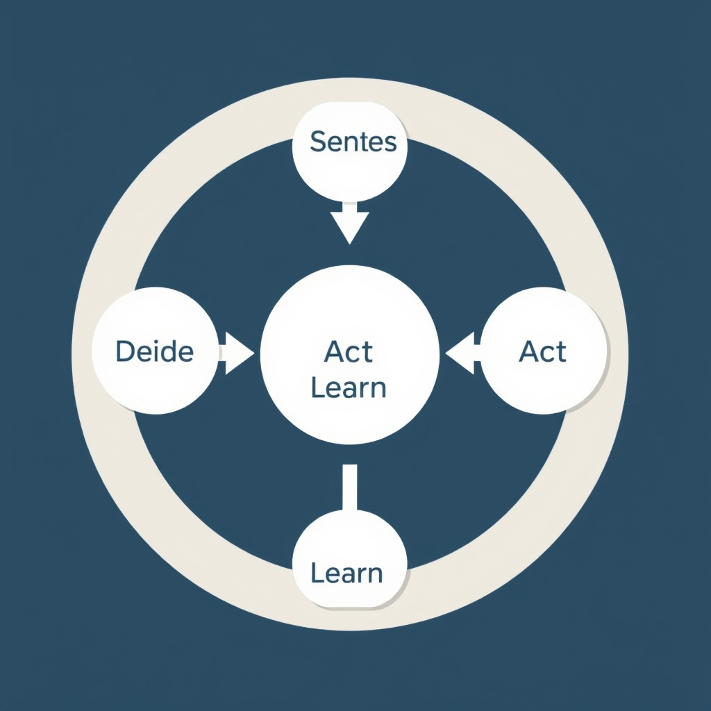
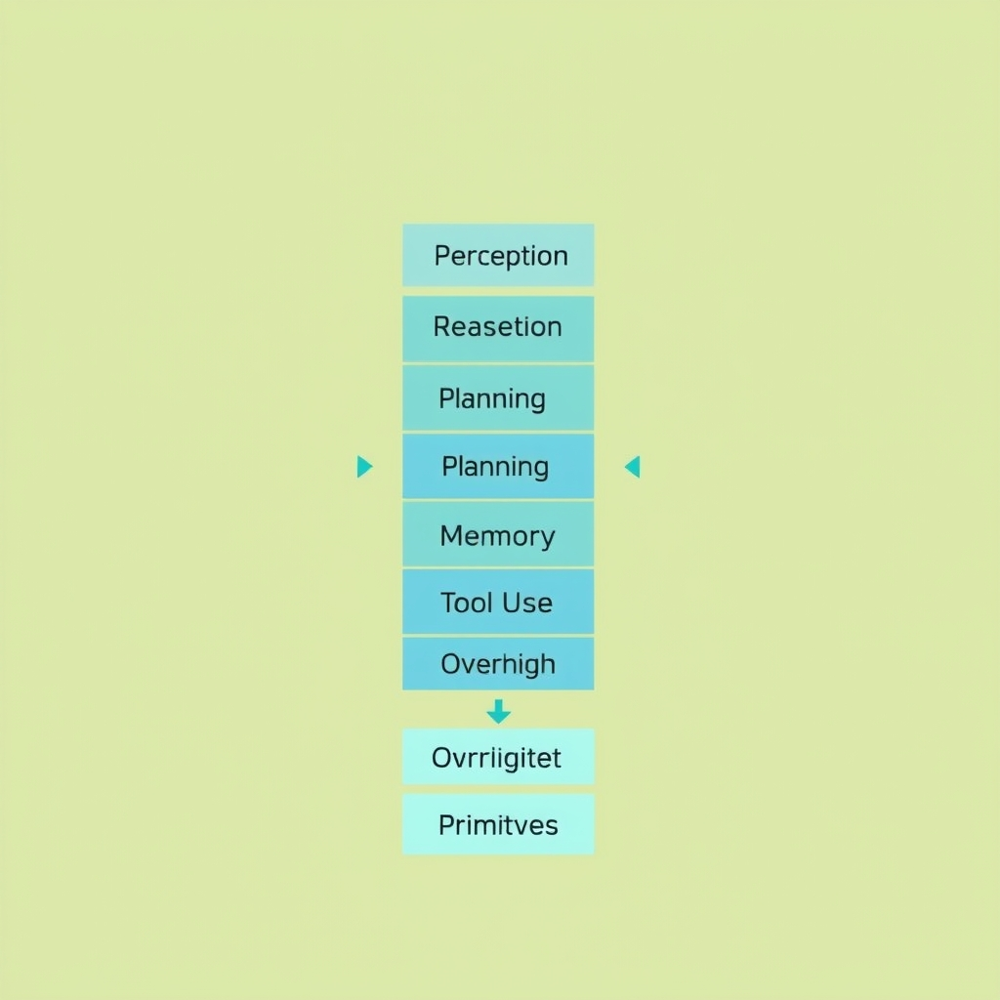
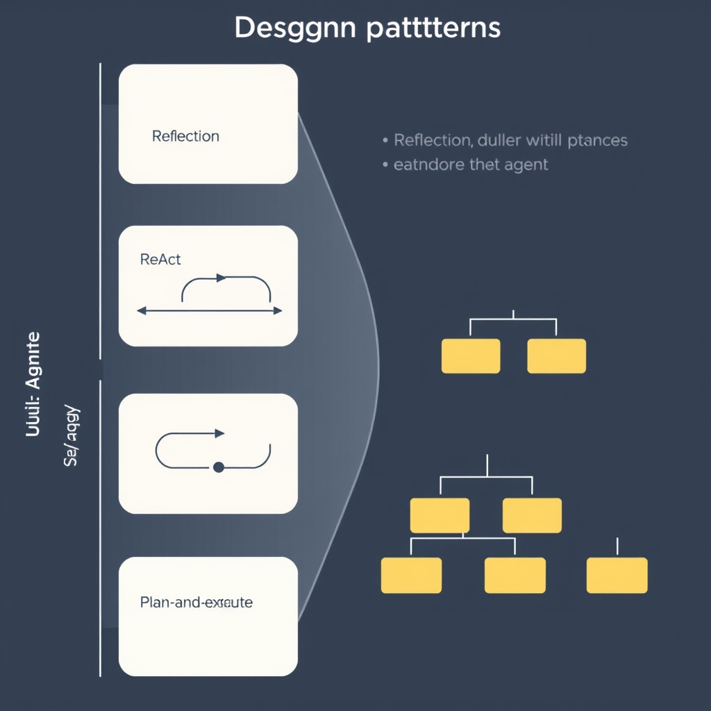

# The Architecture of Autonomy: How AI Agents Work in 2026

## The Evolution of Agentic Systems

The first generation of language models was built around *static* prompt‑response cycles. A user supplied a text prompt, the model generated a completion, and the interaction ended. This paradigm works well for conversational Q&A or single‑turn tasks, but it cannot sustain **goal‑oriented** behavior that requires monitoring, planning, and adaptation over time.

*The sense-decide-act-learn loop enables agents to maintain state and adapt to new information autonomously.*

Modern AI agents have shifted from this static interaction model to **autonomous workflows**. Instead of treating the model as a mere text generator, developers now embed it within a control loop that continuously evaluates the environment, decides on actions, and updates its internal state. The agent is no longer waiting for a new prompt; it *generates* its own sub‑goals, invokes tools, and iterates until the overarching objective is satisfied.

### The "sense‑decide‑act‑learn" loop

At the heart of contemporary agents lies a cognitive loop often described as **sense‑decide‑act‑learn**. The loop mirrors human reasoning:

1. **Sense** – The agent ingests observations from external sources (APIs, sensors, user feedback) and updates its perception of the world.
1. **Decide** – Using a reasoning engine (often a large language model), it selects the next logical step, which may involve planning, tool invocation, or delegating to a human.
1. **Act** – The chosen action is executed—sending an API request, writing to a database, or prompting a downstream model.
1. **Learn** – Results of the action are fed back into the system, allowing the agent to refine its internal representations and improve future decisions.

This loop enables agents to **maintain state**, handle multi‑step tasks, and recover from errors without external prompting. As noted by CrossML, the continuous “sense–decide–act–learn” loop *"mimics human reasoning and enables AI agents to manage complex workflows autonomously"*【https://www.crossml.com/agentic-ai-is-redefining-enterprise-workflows】.

### Why autonomy exceeds a single prompt

A lone prompt can only encode a snapshot of intent. Autonomous agents must:

- **Persist context** across dozens or hundreds of interactions.
- **Dynamically acquire tools** (e.g., database queries, web browsing) based on evolving needs.
- **Self‑evaluate** outcomes and adjust strategies in real time.
- **Incorporate feedback** from users or other agents to correct course.

Without the sense‑decide‑act‑learn infrastructure, an agent would be unable to orchestrate these capabilities, limiting it to reactive, one‑off responses rather than proactive, goal‑driven execution.

## Core Architectural Components

*The six-layer architecture provides a modular framework for building robust, production-grade AI agents.*

### Six Core Layers of a Modern AI Agent

| Layer          | Primary Responsibility                                                                                      | Typical Implementation                                                                                      |
| -------------- | ----------------------------------------------------------------------------------------------------------- | ----------------------------------------------------------------------------------------------------------- |
| **Perception** | Ingest raw inputs (text, images, sensor data) and convert them into structured representations.             | Prompt templates, multimodal encoders, or API wrappers that surface data as JSON.                           |
| **Reasoning**  | Perform chain‑of‑thought or ReAct‑style inference to turn perceptions into intermediate conclusions.        | LLM calls with chain‑of‑thought prompting, tool‑augmented reasoning loops.                                  |
| **Planning**   | Generate a sequence of actions that achieve a high‑level goal, often using hierarchical task decomposition. | Plan‑and‑execute patterns, tree‑of‑thought planners, or external schedulers.                                |
| **Memory**     | Persist short‑term context (conversation turn) and long‑term knowledge (facts, user preferences).           | Vector stores, key‑value caches, or episodic logs that are queried during reasoning.                        |
| **Tool Use**   | Invoke external capabilities—search APIs, databases, code interpreters, or custom functions.                | **Tool calling primitives** provided by agent frameworks (e.g., function calls in OpenAI, LangGraph hooks). |
| **Oversight**  | Monitor execution, enforce safety constraints, and enable human‑in‑the‑loop (HITL) interventions.           | Hooks for human review, policy checkers, or fallback prompts.                                               |

### Primitives that Glue the Layers Together

Modern frameworks expose a small set of **primitives** that developers compose to build the layers above. The most critical are:

- **Tool calling** – a standardized interface that lets the reasoning layer request external actions and receive structured results. This eliminates ad‑hoc string parsing and ensures type‑safe data flow.
- **Human‑in‑the‑loop control** – callbacks or UI widgets that pause the autonomous loop, present the agent’s proposed action, and allow a user to approve, modify, or reject it. This is essential for high‑risk domains such as finance or healthcare.
- **State hooks** – lightweight callbacks that automatically persist intermediate outputs to the memory layer, guaranteeing that subsequent reasoning steps have access to the latest context.

These primitives are deliberately **framework‑agnostic**; the 2026 survey of top‑tier libraries reports that every leading SDK (LangGraph, Microsoft Agent Framework, CrewAI, etc.) provides them out‑of‑the‑box【1†https://alicelabs.ai/en/insights/best-ai-agent-frameworks-2026】.

### Interaction Flow: Maintaining State and Context

1. **Perception** captures input and emits a structured payload.
1. The **reasoning** layer consumes this payload, possibly querying **memory** for relevant history.
1. Based on its inference, the reasoning component produces a **plan** or directly invokes a **tool** via the tool‑calling primitive.
1. The tool returns data, which is immediately stored in **memory** through a state hook.
1. **Oversight** intercepts the tool call; if HITL is enabled, the system presents the proposed action to a human for confirmation.
1. Once approved, the action executes, and the loop repeats, preserving a coherent context across iterations.

By treating each layer as a modular service that communicates through these primitives, agents achieve **robust state management**: context never disappears, and every decision can be traced back to the originating perception, reasoning trace, and memory snapshot. This architecture also simplifies testing and scaling, as developers can swap out individual layers (e.g., replace a vector store) without rewriting the entire agent.

______________________________________________________________________

*The six‑layer model and the emphasis on tool‑calling and HITL primitives reflect the consensus across 2026 AI agent frameworks, which converge on these building blocks to support reliable, production‑grade agents.*

## Essential Design Patterns for Reliability

### ReAct: Reasoning + Action Interleaving

The **ReAct** pattern couples chain‑of‑thought reasoning with immediate tool calls, allowing an agent to *think* and *act* in the same loop. Instead of generating a full answer before invoking a tool, the model emits a reasoning step, decides whether a tool is needed, calls it, and then incorporates the result into the next reasoning step. This tight feedback reduces hallucination because the agent validates its assumptions against real‑world data before proceeding.

*Example*: A travel‑booking agent receives the query “Find the cheapest round‑trip flight from New York to Tokyo next month.” Using ReAct, it first reasons about date constraints, then calls a flight‑search API, receives price options, re‑evaluates the best choice, and finally composes the response. The pattern is highlighted in the 2026 design‑pattern survey as a core reliability technique【https://pub.towardsai.net/the-7-design-patterns-every-ai-agent-developer-should-know-in-2026-c77f28b51565】.

______________________________________________________________________

### Reflection and Self‑Correction

**Reflection** asks the agent to review its own output before finalizing it. After producing a draft answer, the model runs a second pass that checks for logical consistency, factual accuracy, and alignment with the original goal. If discrepancies are found, the agent revises its answer or re‑executes relevant tool calls.

Self‑correction is especially valuable when the initial reasoning chain is long or when external data may have changed. In practice, developers implement reflection as a separate LLM call with a prompt such as “Identify any errors in the previous response and suggest corrections.” The NVIDIA blog notes that self‑reflection is one of the techniques that enable **scaling test‑time compute**, letting models “think longer” and improve solution quality【https://developer.nvidia.com/blog/an-easy-introduction-to-llm-reasoning-ai-agents-and-test-time-scaling】.

______________________________________________________________________

### Multi‑Agent Collaboration

Complex tasks often exceed the capabilities of a single agent. **Multi‑Agent Collaboration** decomposes a problem into sub‑tasks, assigns each to a specialized agent, and orchestrates their interactions. For instance, building a data‑pipeline might involve:

1. A data‑ingestion agent that fetches raw logs.
1. A transformation agent that cleans and normalizes data.
1. A validation agent that checks schema compliance.
1. A reporting agent that generates visual dashboards.

The coordination layer tracks state, passes intermediate results, and resolves conflicts. By leveraging distinct expertise, the system mitigates failure modes such as tool misuse or context loss. The pattern appears in the same 2026 design‑pattern list as a critical reliability strategy【https://pub.towardsai.net/the-7-design-patterns-every-ai-agent-developer-should-know-in-2026-c77f28b51565】.

______________________________________________________________________

### Plan‑and‑Execute for Long‑Horizon Tasks

Long‑horizon objectives—e.g., “Launch a new product line in six months”—require a **Plan‑and‑Execute** workflow. The agent first generates a high‑level plan, breaking the goal into ordered milestones. Each milestone becomes a sub‑goal that the agent executes, often using ReAct or tool calls. After completing a sub‑goal, the agent updates the plan based on new information, allowing dynamic replanning.

A concrete scenario: an autonomous research assistant tasked with writing a literature review. It plans to (1) collect relevant papers, (2) summarize each, (3) synthesize themes, and (4) draft the manuscript. If the search step yields insufficient papers, the agent revises the search criteria before proceeding, ensuring the overall objective remains achievable.

Plan‑and‑Execute mitigates drift and resource exhaustion by keeping the agent anchored to a concrete roadmap while still permitting flexibility. This pattern, together with ReAct and Reflection, forms the backbone of reliable, production‑grade AI agents【https://pub.towardsai.net/the-7-design-patterns-every-ai-agent-developer-should-know-in-2026-c77f28b51565】.

______________________________________________________________________

### Integrating the Patterns

In practice, robust agents weave these patterns together:

- **ReAct** handles immediate reasoning‑action cycles.
- **Reflection** validates each output before it propagates.
- **Multi‑Agent Collaboration** distributes workload across specialized modules.
- **Plan‑and‑Execute** provides a strategic scaffold for long‑term goals.

By combining them, developers address the most common failure modes—hallucination, state loss, and unbounded execution—while preserving the autonomy that defines modern AI agents.

*Design patterns like ReAct and Multi-Agent Collaboration solve common failure modes by structuring how agents reason and act.*

## Frameworks and Implementation

The AI agent ecosystem has coalesced around a handful of mature SDKs that are widely adopted in production. As of August 2026 the top‑tier frameworks are LangGraph 1.x, Microsoft Agent Framework 1.0, Claude Agent SDK, OpenAI Agents SDK, Google ADK 2.0, CrewAI 1.14.7, LlamaIndex Workflows 1.0, Pydantic AI 2.0, Mastra, and AG2 [Best AI Agent Frameworks 2026](https://alicelabs.ai/en/insights/best-ai-agent-frameworks-2026).

### Quick reference table

| Framework                 | Primary focus area                         |
| ------------------------- | ------------------------------------------ |
| LangGraph                 | Graph‑based workflow orchestration         |
| Microsoft Agent Framework | Enterprise integration & compliance        |
| Claude Agent SDK          | Safety‑oriented reasoning & alignment      |
| OpenAI Agents SDK         | Tool calling & multimodal extensions       |
| Google ADK                | Scalable multimodal pipelines              |
| CrewAI                    | Team‑based task decomposition              |
| LlamaIndex Workflows      | Data‑grounded retrieval & indexing         |
| Pydantic AI               | Type‑safe schema definition & validation   |
| Mastra                    | Modular plug‑in architecture               |
| AG2                       | Autonomous governance & policy enforcement |

### Why a standardized framework matters

1. **Consistent lifecycle management** – A unified SDK provides a single entry point for provisioning, versioning, and retiring agents, reducing operational drift across services.
1. **Built‑in observability** – Modern frameworks expose telemetry hooks (logs, traces, metrics) out of the box, enabling rapid debugging of the sense‑decide‑act‑learn loop.
1. **Safety and compliance primitives** – Features such as sandboxed tool calling, rate limiting, and policy enforcement are baked into the SDK, shielding production systems from unexpected actions.
1. **Interoperability** – Standardized data models (e.g., Pydantic schemas) and common messaging contracts make it straightforward to swap components or integrate third‑party tools without rewriting core logic.
1. **Community and support** – The listed frameworks are backed by active open‑source communities and commercial support plans, ensuring timely patches and compatibility with emerging LLM releases.

Choosing a framework that aligns with your organization’s stability requirements—whether that means prioritizing enterprise‑grade compliance (Microsoft Agent Framework) or rapid prototyping with rich orchestration (LangGraph)—lays the foundation for reliable, scalable AI agents.

## Future Outlook: Scaling Test-Time Compute

### Scaling Test‑Time Compute

Modern agents increasingly treat inference as an *elastic* process. Rather than a single forward pass, they allocate additional compute at test time to explore richer reasoning paths. This **scaling of test‑time compute** means the model can generate longer chains of thought, evaluate multiple alternatives, and iteratively refine answers—all within a single request. Techniques such as chain‑of‑thought prompting, ReAct, and self‑reflection exemplify this approach by prompting the model to “think aloud” and then act on its own reasoning, effectively trading latency for higher quality outcomes [https://developer.nvidia.com/blog/an-easy-introduction-to-llm-reasoning-ai-agents-and-test-time-scaling].

### Tree‑of‑Thought and Self‑Reflection

Two innovations illustrate how extra compute translates into better planning:

- **Tree‑of‑Thought (ToT)** expands a linear chain into a branching search. The agent generates multiple candidate reasoning steps, evaluates each branch with a scoring function, and prunes sub‑optimal paths. By allocating more compute to explore the tree, agents can discover solutions that a single chain would miss.
- **Self‑reflection** closes the loop: after an initial answer, the model reviews its own output, identifies gaps, and issues corrective steps. This meta‑reasoning layer consumes additional cycles but yields higher consistency, especially in multi‑step tasks.

Both patterns rely on the same principle—*more compute at inference time enables deeper, more systematic exploration* of the solution space.

### Outlook for Agentic Intelligence

Looking ahead, three trends will shape the trajectory of AI agents:

1. **Dynamic compute budgeting** – frameworks will expose APIs that let developers specify compute caps, allowing agents to adapt their reasoning depth based on task urgency.
1. **Hybrid search strategies** – combining ToT with best‑of‑N sampling will become standard, giving agents the ability to both breadth‑search and depth‑search efficiently.
1. **Standardized self‑audit modules** – built‑in reflection components will be packaged as reusable primitives, making self‑correcting behavior a default feature rather than a custom add‑on.

As these capabilities mature, agents will move from reactive assistants to proactive planners capable of handling complex, long‑horizon objectives with reliability comparable to human experts. The continued scaling of test‑time compute, paired with robust design patterns, promises a future where autonomous AI systems can reason, adapt, and collaborate at unprecedented levels of sophistication.