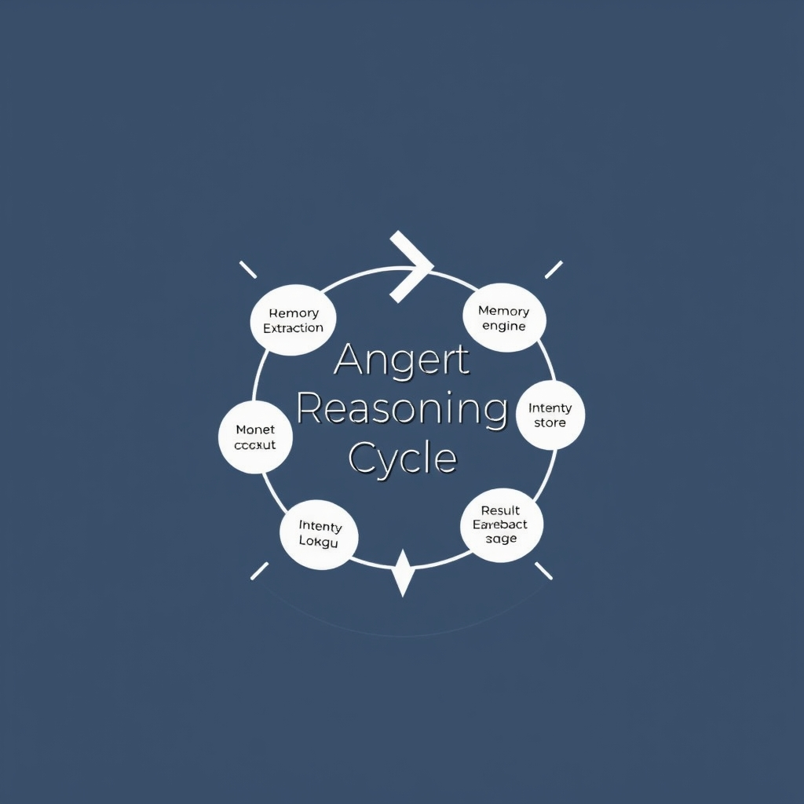
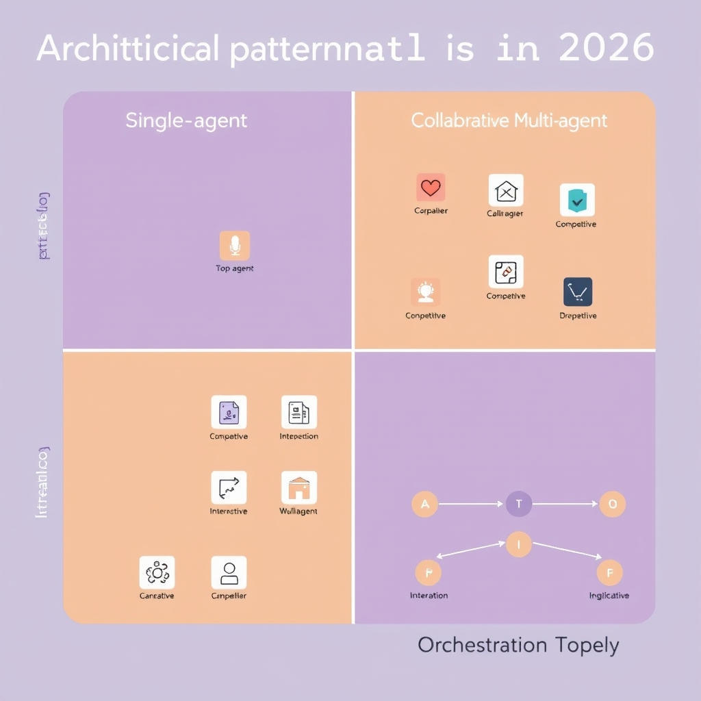
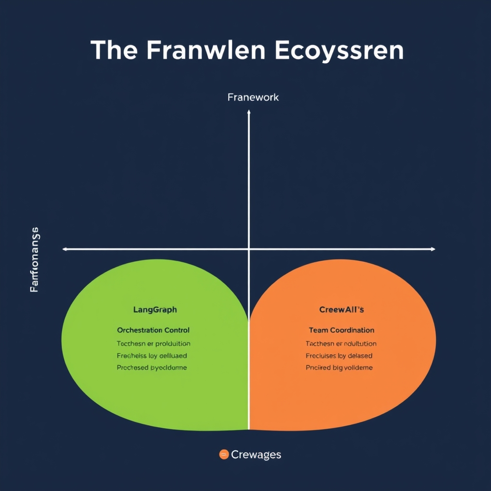

# The Architecture of Autonomy: How AI Agents Work in 2026

## Defining the AI Agent

An **AI agent** is best understood as a thin orchestration layer that wraps one or more large language models (LLMs) and augments them with stateful capabilities. Rather than exposing a single, stateless inference endpoint, the agent bundles the LLM with:

- **Memory** – a persistent store that retains observations, intermediate results, and user intent across turns. This enables the system to reference prior context without re‑prompting the model each time.
- **Orchestration logic** – deterministic code that decides when to invoke the LLM, which tool to call, and how to combine outputs into a coherent plan. It acts as the agent’s “brain” for sequencing actions.
- **Tool access** – APIs, databases, or external services that the agent can call to act on the world (e.g., fetching real‑time data, sending emails, or manipulating files). Without such tools, the agent remains confined to text generation.

The distinction from a traditional LLM becomes clear when we compare **stateless inference** with **multi‑step workflow execution**. A stateless LLM receives a prompt, produces a single response, and discards all context. It cannot retain knowledge of earlier interactions or coordinate a series of dependent actions. In contrast, an AI agent maintains runtime state, allowing it to:

1. Observe the environment (e.g., user query, sensor data).
1. Reason using the LLM to generate a plan.
1. Execute tools to gather new information or perform actions.
1. Update its memory with results and iterate until the goal is satisfied.

This loop transforms raw language generation into purposeful behavior, turning a model that merely predicts text into a goal‑oriented system capable of solving complex tasks.

> According to a JetBrains article (a vendor blog), an AI agent is a system that wraps one or more models with tools, memory, orchestration logic, permissions, and runtime state to execute multistep workflows. The LLM is typically one component inside the broader agent system, not the system itself.[^1]

## The Agent Reasoning Cycle

The Agent Reasoning Cycle is the engine that turns a static language model into an autonomous problem‑solver. It can be broken down into a repeatable observation‑reasoning‑action loop that continuously nudges the system toward its goal.

*The Agent Reasoning Cycle: A continuous loop of observation, reasoning, and action that enables autonomous problem-solving.*

### 1. Observation (Goal Reception & Intent Extraction)

- **Goal reception** – The agent starts by ingesting a high‑level objective, e.g., *"prepare a quarterly sales report"*.
- **Intent extraction** – A lightweight parsing step interprets the user's intent, distinguishing between informational requests, data‑gathering tasks, or actions that require external tools. This step often re‑phrases the goal into a structured representation that downstream components can consume.

### 2. Reasoning (Planning & Memory Check)

- **Memory lookup** – Before planning, the agent queries its short‑term or long‑term memory stores for relevant context (previous steps, cached data, or domain knowledge). This prevents redundant work and preserves continuity across turns.
- **Plan generation** – Using the LLM’s reasoning capabilities, the agent drafts a step‑by‑step plan. The plan outlines which observations are needed, which tools should be invoked, and the expected intermediate results.

### 3. Action (Tool Selection, Execution, and Evaluation)

- **Tool selection** – The plan is mapped to concrete tool calls (e.g., a database query, a web‑search API, or a spreadsheet writer). Selection criteria include tool availability, cost, and the specificity of the required output.
- **Execution** – The chosen tool is invoked, and its raw output is captured.
- **Result evaluation** – The agent assesses whether the tool’s output satisfies the sub‑goal. Evaluation may involve confidence scoring, schema validation, or a quick sanity check performed by the LLM.
- **Loop continuation** – If the result is insufficient, the agent revisits the reasoning stage, updating its memory with the new observation and refining the plan. This cycle repeats until the overarching goal is marked complete.

#### Putting It All Together

The cycle can be visualized as:

1. **Receive goal** → 2. **Interpret intent** → 3. **Check memory** → 4. **Create plan** → 5. **Select tool** → 6. **Execute** → 7. **Evaluate** → 8. **Repeat**

This eight‑step sequence matches the standard execution loop described in the AI Agent Architecture guide, which defines the Agent Reasoning Cycle as receiving a goal, understanding intent, checking memory, planning, selecting tools, executing, and evaluating results【https://koows.com/@Tech_article/ai-agent-architecture-(2026):-a-deep-research-guide-for-building-autonomous-ai-systems】.

By maintaining a tight feedback loop between observation, reasoning, and action, agents can decompose complex objectives into manageable micro‑tasks, adapt to new information, and reliably converge on the desired outcome.

## Architectural Patterns in 2026

*The Four-Quadrant Taxonomy of AI Agent Architectures in 2026.*

### The Four‑Quadrant Taxonomy

Modern AI agent architectures have coalesced around **eight canonical patterns** that fall neatly into a **four‑quadrant taxonomy** — *single‑agent*, *collaborative multi‑agent*, *competitive multi‑agent*, and *orchestration topology* [Digital Applied, 2026](https://www.digitalapplied.com/blog/agent-architecture-patterns-taxonomy-2026). Each quadrant groups patterns that share a common interaction model, making it easier for architects to reason about system behavior and choose the right composition strategy.

#### 1. Single‑Agent Quadrant

A single‑agent system wraps a large language model (LLM) with memory, tool‑use, and orchestration logic, but it does not spawn additional agents. The pattern excels when the problem domain is **well‑bounded** and can be solved through a deterministic sequence of observations, reasoning, and actions. Typical use‑cases include personal assistants that manage a user's calendar or a chatbot that handles a specific support ticket type.

#### 2. Collaborative Multi‑Agent Quadrant

In collaborative setups, multiple agents **share a common goal** and coordinate their efforts. They may specialize (e.g., one agent handles data retrieval, another performs analysis) and exchange intermediate results via a shared memory store or message bus. This division of labor reduces latency for complex pipelines and improves robustness because the failure of one specialist can be mitigated by others.

#### 3. Competitive Multi‑Agent Quadrant

Competitive architectures pit agents against each other, each pursuing its own objective while the system evaluates outcomes against a global metric. Techniques such as **self‑play**, **adversarial prompting**, or **market‑based bidding** drive agents to explore diverse solution spaces, often yielding higher‑quality results for tasks like code synthesis or strategic planning.

#### 4. Orchestration Topology Quadrant

Orchestration topologies act as a **meta‑controller** that dynamically spawns, routes, and retires agents based on workload and performance signals. The orchestrator maintains a global view of resources, balances load, and can switch between collaborative and competitive modes on the fly. This pattern is the backbone of large‑scale AI services that must handle thousands of concurrent user requests.

### Significance for System Design

- **Modularity** – By classifying patterns into quadrants, designers can isolate concerns (memory handling, tool integration, coordination) and replace components without rewriting the entire stack.
- **Predictable Interaction Models** – Knowing whether agents will cooperate, compete, or be centrally orchestrated informs choices around data contracts, security boundaries, and fault‑tolerance mechanisms.
- **Resource Allocation** – Orchestration topologies enable fine‑grained scaling policies (e.g., spin up additional collaborators only when task complexity exceeds a threshold), optimizing compute costs.

### Solving Complex Task Decomposition

Complex workflows—such as end‑to‑end scientific literature review or multi‑modal content generation—benefit from **task decomposition** across agents:

1. **Specialization** – In the collaborative quadrant, agents can each own a sub‑task (search, summarization, citation formatting), reducing cognitive load on any single LLM.
1. **Exploration** – Competitive agents generate alternative solutions for the same sub‑task, allowing the system to select the best answer based on scoring functions.
1. **Dynamic Routing** – Orchestrators evaluate intermediate results and re‑assign tasks to agents that have demonstrated higher success rates for similar inputs.

By leveraging these patterns, developers avoid monolithic prompt engineering and instead build **composable pipelines** that are easier to test, monitor, and evolve.

### High‑Level Scaling Overview

Scaling an agentic system involves two dimensions:

| Dimension      | Approach                                                                              | Example                                                                              |
| -------------- | ------------------------------------------------------------------------------------- | ------------------------------------------------------------------------------------ |
| **Horizontal** | Replicate agents within a quadrant to handle increased request volume.                | Deploy a pool of collaborative summarizers behind a load balancer.                   |
| **Vertical**   | Enrich agents with additional tools or larger LLM back‑ends as task difficulty grows. | Switch a single‑agent from a 7B model to a 70B model for high‑stakes legal analysis. |

Orchestration topologies tie these dimensions together. They monitor latency, success rates, and cost, then **auto‑scale** both the number of agents and the compute tier they run on. Because the taxonomy is explicit, scaling decisions can be codified per quadrant—e.g., keep competitive agents lightweight to preserve rapid iteration, while allocating more memory to collaborative agents that maintain extensive shared context.

In practice, a production system might start with a single‑agent prototype, evolve to a collaborative cluster for richer functionality, and finally adopt an orchestration layer to serve millions of users while preserving the benefits of specialization and competition. This evolutionary path is a direct consequence of the four‑quadrant taxonomy, which provides a clear roadmap for **incremental complexity** and **scalable reliability**.

By understanding these eight patterns and their placement within the four quadrants, architects can deliberately select the configuration that aligns with their product goals, performance constraints, and long‑term maintenance strategy.

## The Framework Ecosystem

**Industry‑standard frameworks (2026)**

*Framework comparison: Mapping core strengths to architectural requirements.*

- Mastra
- LangGraph
- OpenAI Agents SDK
- Vercel AI SDK
- Pydantic AI
- CrewAI
- Claude Agent SDK
- Google ADK
- AutoGen / AG2\
  [Source: The 9 Best AI Agent Frameworks in 2026](https://www.agentmail.to/blog/best-ai-agent-frameworks-2026)

### Focus‑area comparison

| Framework     | Core Strength                                                                        | Typical Use‑Case                                                                                        |
| ------------- | ------------------------------------------------------------------------------------ | ------------------------------------------------------------------------------------------------------- |
| **LangGraph** | Graph‑based orchestration; explicit node/edge definition for complex reasoning flows | Building deterministic pipelines where each step’s dependencies are visualized and versioned            |
| **Mastra**    | Modular composability; plug‑and‑play components with built‑in memory handling        | Rapid prototyping of agents that need interchangeable toolsets and dynamic context stitching            |
| **CrewAI**    | Team‑oriented coordination; task delegation among multiple specialized agents        | Scaling multi‑agent crews that collaborate on large projects (e.g., research synthesis, product design) |

### Choosing a framework for production

When moving from prototype to production, three practical factors dominate the decision:

1. **Reliability & observability** – Does the framework expose metrics, logs, and tracing hooks that integrate with existing monitoring stacks?
1. **Deployment flexibility** – Can the agent be containerized, run on serverless platforms, or be embedded in edge environments without extensive rewrites?
1. **Ecosystem support** – Availability of maintained adapters for popular LLM providers, vector stores, and authentication mechanisms reduces technical debt.

Frameworks like LangGraph and Mastra have matured their observability APIs, while CrewAI’s recent release adds native Kubernetes operators for scaling crews. Selecting a framework that aligns with your organization’s CI/CD pipeline and cloud provider can shave weeks off the rollout timeline.

### Role of SDKs

SDKs (e.g., OpenAI Agents SDK, Vercel AI SDK) abstract low‑level API calls, handling token management, rate‑limiting, and response parsing. By wrapping these concerns, SDKs let developers focus on the agent’s reasoning logic rather than plumbing. Moreover, SDKs often ship with type‑safe client libraries that integrate seamlessly with the aforementioned frameworks, accelerating both development and debugging.

[^1]: https://www.jetbrains.com/pages/ai-agents/llms-vs-ai-agents