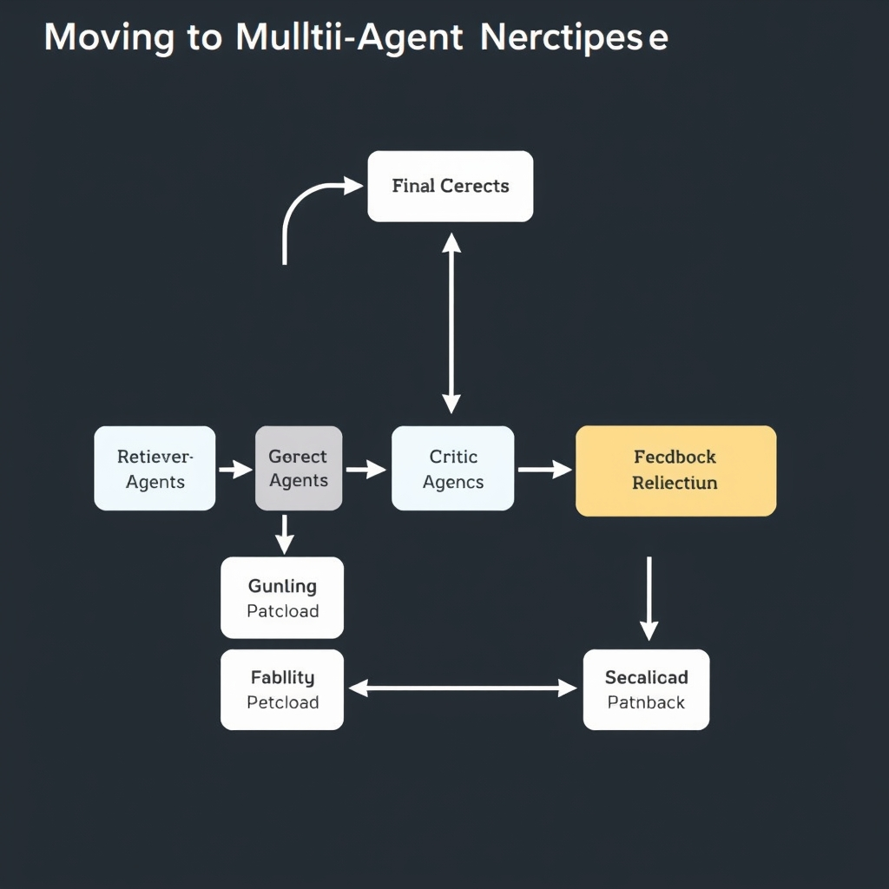
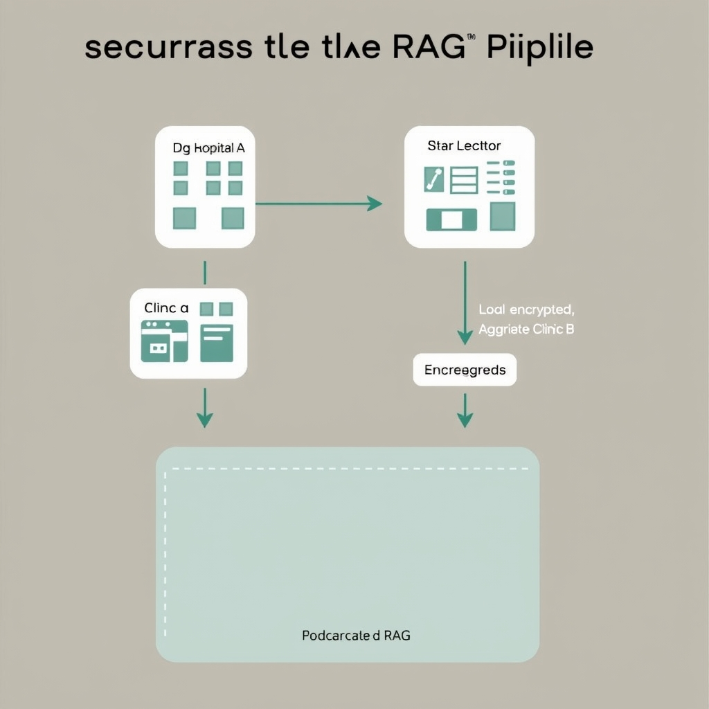
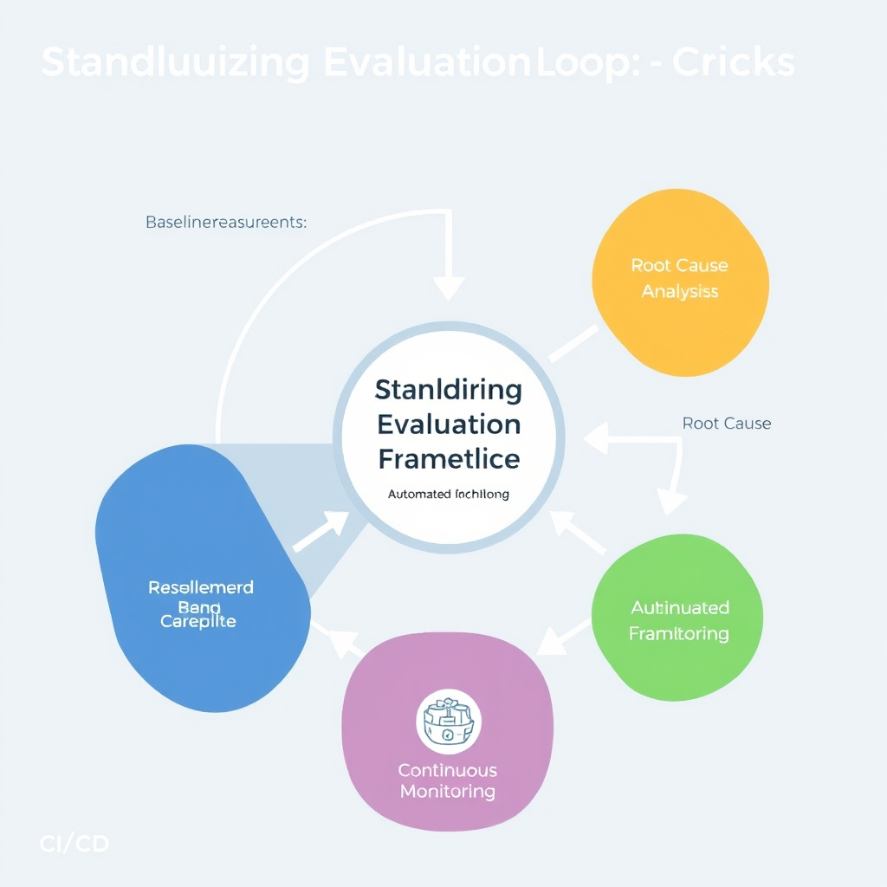

# The Evolution of Enterprise RAG: From Naive Pipelines to Agentic Orchestration

## The State of Enterprise RAG

Enterprise adoption of Retrieval‑Augmented Generation (RAG) has reached a tipping point. A 2026 McKinsey study reported that **73 % of enterprise AI projects now rely on RAG as the primary architecture**[Mazdek Blog](https://mazdek.ch/en/blog/rag-architecture-enterprise-2026). This widespread uptake reflects a shift in how organizations handle knowledge‑intensive workloads.

### Why RAG beats fine‑tuning for enterprise knowledge tasks

- **Freshness of information** – RAG pulls from external document stores at query time, ensuring responses reflect the latest policies, regulations, or product data without costly model re‑training.
- **Compute efficiency** – Instead of training massive models on proprietary corpora, enterprises augment a fixed‑size LLM with a lightweight retriever, reducing GPU spend and shortening development cycles.
- **Reduced hallucination** – By grounding generation in retrieved passages, RAG improves factual consistency, a critical requirement for compliance‑heavy domains such as finance or healthcare.
- **Data governance** – Retrieval layers can enforce document‑level access controls, letting firms keep sensitive content behind internal repositories while still leveraging powerful LLMs.

### From "naïve" to "enterprise‑ready" RAG

| Aspect              | Naïve RAG (early implementations)                                    | Enterprise‑ready RAG (2024‑2026)                                                        |
| ------------------- | -------------------------------------------------------------------- | --------------------------------------------------------------------------------------- |
| Retrieval           | Simple keyword search or BM25 over a static index.                   | Hybrid dense‑sparse retrievers, relevance‑feedback loops, and real‑time index updates.  |
| Prompt construction | Fixed template, no validation.                                       | Dynamic prompt engineering with context windows, safety filters, and compliance checks. |
| Evaluation          | Ad‑hoc testing on a few queries.                                     | Automated metrics (precision@k, nDCG) and continuous monitoring pipelines.              |
| Security            | Little to no access control; data often copied to external LLM APIs. | Document‑level ACLs, encrypted transport, and on‑prem or federated LLM deployments.     |

These evolutions illustrate why modern RAG solutions are no longer experimental add‑ons but core components of enterprise AI stacks.

## Moving to Multi-Agent Orchestration

### Retriever Agent

The Retriever scans indexed corpora, vector stores, or external knowledge bases to surface the most relevant documents for a given query. It operates under strict latency budgets (often sub‑second) and returns a ranked list of passages that downstream agents will evaluate. In enterprise settings the Retriever is typically backed by domain‑specific embeddings and can enforce document‑level access controls before any content leaves the secure store.


*The multi-agent RAG pipeline: Each stage acts as a checkpoint to ensure accuracy, compliance, and formatting before the final response is delivered.*

### Critic Agent

Once candidate passages are retrieved, the Critic assesses their factual alignment with the query. It runs a secondary relevance model or a set of heuristic checks (e.g., citation consistency, temporal validity) and assigns confidence scores. By filtering out noisy or outdated snippets, the Critic reduces hallucination risk before generation begins.

### Compliance Agent

Enterprise regulations (GDPR, HIPAA, FINRA) demand that no protected data be exposed inadvertently. The Compliance Agent inspects both the retrieved passages and the prompt that will be sent to the LLM, redacting or rejecting any content that violates policy. It can also inject provenance metadata so that downstream auditors can trace the origin of each answer.

### Formatting Agent

The final answer must conform to internal style guides, data schemas, or API contracts. The Formatting Agent post‑processes the LLM’s raw output, applying templating, JSON serialization, or markup transformations. This ensures that downstream systems can consume the response without additional parsing logic.

______________________________________________________________________

### Why agentic orchestration boosts accuracy and reliability

Instead of a monolithic "retrieve‑then‑generate" pass, the multi‑agent pipeline introduces checkpoints that isolate failure modes. The Retriever focuses solely on similarity search, the Critic validates relevance, and the Compliance Agent enforces policy—each using models tuned for its specific task. Early filtering of low‑confidence passages has been observed to improve end‑to‑end answer precision, though exact gains vary across implementations. This separation also makes it easier to replace or upgrade individual agents without disrupting the whole system, preserving reliability across version upgrades.

______________________________________________________________________

### Modularity benefits for complex enterprise workflows

Enterprise knowledge work rarely follows a single linear flow. Different business units may require distinct compliance rules, output formats, or retrieval sources. A modular agentic architecture enables:

- **Plug‑and‑play specialization** – swap a medical‑domain Retriever for a legal‑domain one without rewriting the pipeline.
- **Scalable governance** – enforce compliance at the agent level, allowing auditors to certify each component independently.
- **Parallel development** – data engineers can improve indexing while ML teams iterate on the Critic, accelerating overall delivery.
- **Fault isolation** – if the Formatting Agent encounters an unexpected schema, the issue is contained and does not cascade to the Retriever or LLM.

Collectively, these advantages translate into faster time‑to‑value for large organizations that must balance agility with strict regulatory oversight.

______________________________________________________________________

*Source: Defensible RAG: 2026 Enterprise Implementation Best Practices* ([https://techplustrends.com/enterprise-rag-implementation-best-practices-2026](https://techplustrends.com/enterprise-rag-implementation-best-practices-2026))

## Securing the RAG Pipeline

Enterprise RAG pipelines expose two attack surfaces that are rarely present in isolated LLM deployments. First, a malicious user can embed a crafted query that steers the retriever to surface a document containing hostile instructions. Second, an adversary can poison the retrieved context itself, causing the generation model to emit disallowed content or to reveal internal system prompts. These vectors are identified as *Prompt Injection & Response Manipulation* in the study on secure retrieval‑augmented generation [Secure Retrieval‑Augmented Generation (RAG) in Enterprise Environments](https://www.daxa.ai/blogs/secure-retrieval-augmented-generation-rag-in-enterprise-environments). Mitigation strategies include:

- **Input sanitisation** – strip or normalise user‑provided prompts before they reach the retriever.
- **Retriever‑side validation** – run a lightweight critic model that flags retrieved passages containing policy‑violating language.
- **Response guardrails** – enforce post‑generation filters (e.g., regex, policy LLMs) that reject or rewrite unsafe outputs.
- **Isolation of agents** – run the retriever, critic, and generator in separate containers with minimal shared state, limiting the blast radius of a compromised component.

### Document‑level access control

Even with robust prompt handling, data leakage can occur when the retriever returns documents that the requesting user is not authorised to see. Enterprise RAG must therefore enforce *document‑level* access controls that are evaluated **before** any similarity scoring. Practical implementations involve:

1. **Metadata‑driven ACLs** – each indexed chunk carries attributes such as department, clearance level, or GDPR consent flag.
1. **Policy‑aware retrieval** – the query engine filters candidates by matching ACL metadata against the caller's identity token, ensuring that only permissible content participates in the similarity calculation.
1. **Zero‑trust indexing** – store raw documents in encrypted storage; the retrieval service decrypts and scores only after confirming the access policy, preventing accidental exposure through cache dumps.
1. **Audit trails** – log every retrieval request with document IDs and policy decisions to satisfy compliance audits.

These controls directly address the need for strict access controls highlighted in the same security review [Secure Retrieval‑Augmented Generation (RAG) in Enterprise Environments](https://www.daxa.ai/blogs/secure-retrieval-augmented-generation-rag-in-enterprise-environments).

### Federated architectures for data locality

In regulated sectors such as healthcare, moving patient records to a central vector store is often prohibited. Federated RAG solves this by keeping raw data on‑premise while distributing the retrieval and inference workload across multiple nodes. The arXiv review of healthcare RAG confirms that *federated systems represent a prominent architectural approach for preserving data privacy* by maintaining data locality [Privacy Challenges and Solutions in RAG‑Enhanced LLMs for Healthcare Chatbots](https://arxiv.org/html/2511.11347v2). Key design patterns include:

- **Edge indexing** – each hospital or clinic builds its own vector index; a coordinating orchestrator issues a *federated query* that is broadcast to all edge nodes.
- **Secure aggregation** – retrieved scores are encrypted (e.g., using homomorphic encryption) before being merged, so no single node learns the full relevance ranking of another's corpus.
- **Model sharding** – the LLM can be split into inference shards that run locally, with only the final logits transmitted back to a central aggregator, reducing the risk of model leakage.
- **Policy‑driven routing** – queries are routed only to nodes whose data classifications match the requester's jurisdiction, ensuring compliance with regional regulations such as HIPAA or GDPR.

By combining prompt‑injection defenses, fine‑grained document ACLs, and federated computation, enterprises can harden their RAG pipelines against the most common security and privacy threats while still delivering high‑quality, knowledge‑augmented responses.


*Federated RAG architecture: Queries are distributed to local edge nodes, ensuring sensitive data remains on-premise while providing a unified response.*

## Standardizing Evaluation Frameworks

### Retrieval‑focused metrics

Enterprise RAG systems must be judged on how well they surface the right documents before generation. The most widely accepted retrieval indicators are \[1\]:

- **Precision@k** – proportion of the top‑k retrieved chunks that are truly relevant.
- **Recall@k** – proportion of all relevant chunks that appear within the top‑k results.
- **Mean Reciprocal Rank (MRR)** – average of the reciprocal rank of the first relevant document across queries.
- **Normalized Discounted Cumulative Gain (nDCG)** – accounts for the graded relevance of retrieved items and their positions in the list.

These metrics enable a quantitative baseline for comparing vector stores, hybrid retrievers, or any indexing strategy.

### Generation‑focused metrics

After retrieval, the LLM’s answer quality is measured with a different set of criteria. For enterprise use‑cases the following are critical:

- **Faithfulness** – the degree to which the generated text is factually consistent with the retrieved sources.
- **Relevance** – how well the answer addresses the user’s intent and stays on topic.
- **Hallucination rate** – frequency of statements that cannot be traced back to any source document.
- **Citation coverage** – proportion of factual claims that are accompanied by a source reference (often reported alongside faithfulness).

Together, these metrics surface both retrieval gaps and generative drift, guiding iterative improvements.

### Automated evaluation frameworks

Manually scoring every query is infeasible at scale. Two open‑source frameworks have emerged as de‑facto standards for enterprise RAG testing:

| Framework    | Primary focus                  | Key features                                                                                                                                                  |
| ------------ | ------------------------------ | ------------------------------------------------------------------------------------------------------------------------------------------------------------- |
| **RAGAS**    | Retrieval & generation quality | Provides ready‑made implementations of precision@k, recall@k, MRR, nDCG, plus faithfulness and hallucination estimators; integrates with LangChain pipelines. |
| **DeepEval** | End‑to‑end scenario testing    | Allows definition of custom test suites, automatic citation verification, and batch reporting of all metrics above; supports CI/CD hooks.                     |

Both tools expose a Python API that can be invoked after each model update, producing a dashboard of metric trends. For example, a typical DeepEval script might:

```python
from deepeval import RAGEvaluator

evaluator = RAGEvaluator(
    retriever="faiss",
    generator="gpt-4o",
    metrics=["precision@5", "recall@5", "faithfulness", "hallucination_rate"]
)

results = evaluator.run(test_cases)
print(results.summary())
```

By embedding such evaluations into the CI pipeline, teams can enforce service‑level objectives (e.g., precision@5 ≥ 0.85, hallucination rate ≤ 2 %).

### Putting it together

A robust evaluation regimen for enterprise RAG therefore follows a three‑step loop:

1. **Baseline measurement** – Run the full metric suite on a representative query set.
1. **Root‑cause analysis** – Use retrieval metrics to pinpoint indexing or chunking issues; use generation metrics to locate prompt or model drift.
1. **Continuous monitoring** – Automate RAGAS/DeepEval runs on every code or data change, alerting on regressions.

Adopting this disciplined approach ensures that performance gains are measurable, reproducible, and aligned with business risk tolerances.

______________________________________________________________________

\[1\]: RAG Evaluation: 2026 Metrics and Benchmarks for Enterprise AI Systems | Label Your Data (2026).


*The RAG evaluation loop: A continuous process of measurement, analysis, and automated monitoring integrated into the CI/CD pipeline.*

## Conclusion: Building for the Future

Enterprise Retrieval‑Augmented Generation has outgrown the one‑off, "naïve" prototypes that many teams built on a weekend. Modern deployments must treat RAG as a living service, continuously hardened against emerging threats and rigorously benchmarked against evolving business goals.

- **Beyond naive implementations** – Early RAG pipelines simply fetched a document and fed it to a language model. Today, enterprises layer retrieval, relevance scoring, fact‑checking, and compliance checks, turning a single pass into a multi‑stage workflow that reduces hallucinations and aligns outputs with policy.

- **Security and evaluation are ongoing** – Prompt‑injection defenses, document‑level access controls, and periodic bias audits cannot be a one‑time checklist. Organizations should embed automated evaluation suites (e.g., RAGAS, DeepEval) into CI/CD pipelines and schedule regular red‑team exercises to surface new vulnerabilities.

- **Modular, agentic designs for scalability** – By decomposing the pipeline into dedicated agents—Retriever, Critic, Compliance, Formatter—teams can swap components, scale individual services, and reuse logic across projects. This modularity not only accelerates feature rollout but also future‑proofs the architecture as models and regulations evolve.

Adopting these disciplined practices positions enterprise RAG as a resilient, adaptable foundation for knowledge‑intensive applications.