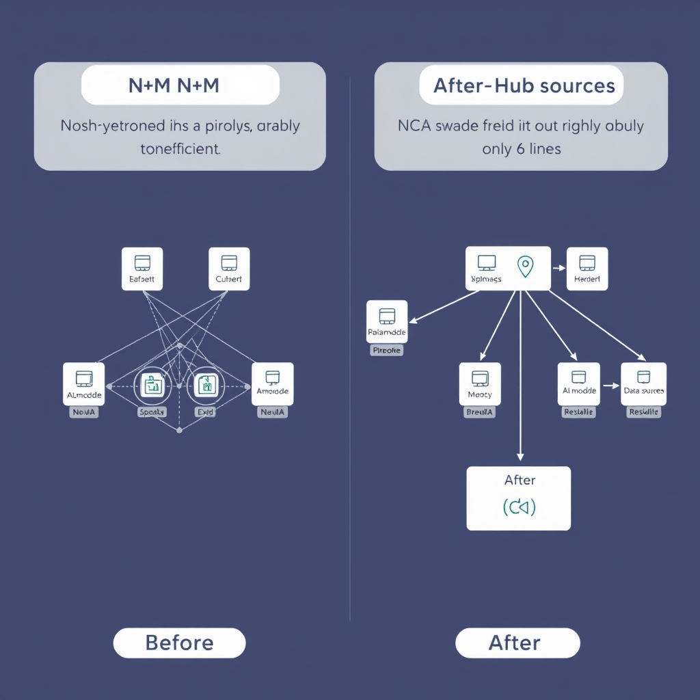
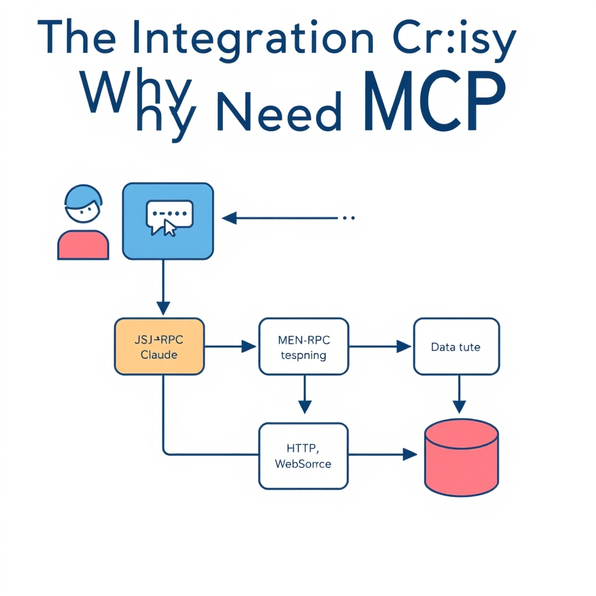
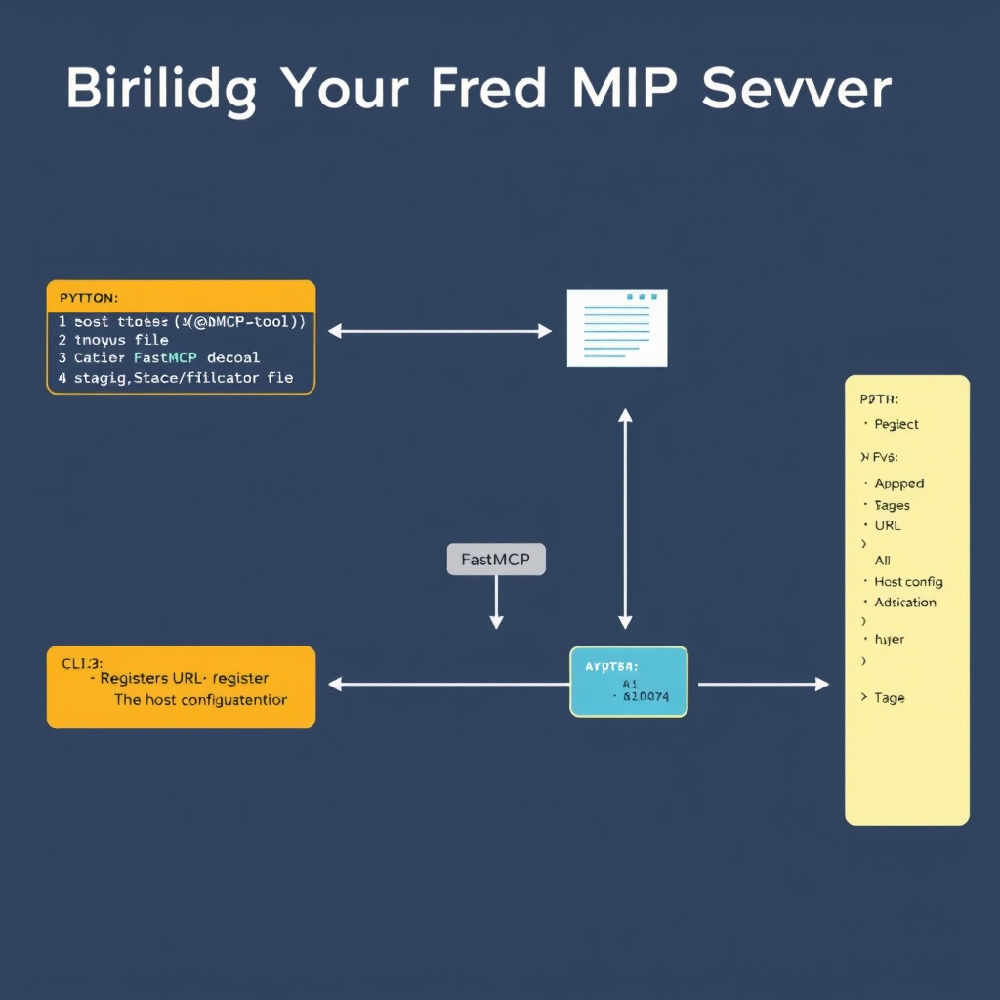

# The Model Context Protocol: Standardizing AI Connectivity

## The Integration Crisis: Why We Need MCP

Connecting AI models to the myriad of enterprise data stores has long been a pain point. Early deployments required a bespoke connector for every model‑to‑source pair: a recommendation engine needed one adapter for a relational database, another for a NoSQL cache, and yet another for a third‑party analytics API. Teams quickly accumulated dozens of thin wrappers, each with its own authentication quirks, schema mappings, and error‑handling logic. Maintenance overhead grew linearly with the number of models (N) and data services (M), creating the classic **N×M integration problem**.


*MCP simplifies integration complexity from a messy N×M mesh to a streamlined N+M hub-and-spoke model.*

Mathematically, the effort scales as the product of models and sources. If an organization runs 10 models and relies on 15 data services, developers must write and sustain 150 distinct integrations. MCP collapses this combinatorial explosion by introducing a **single server per data service** that any MCP‑compatible client can consume. The total integrations drop to **N + M** – ten model clients plus fifteen service servers – cutting the integration count by more than 80% in the example above. This reduction translates directly into lower development cost, fewer bugs, and faster time‑to‑value. [(source)](https://www.databricks.com/blog/what-is-model-context-protocol)

MCP addresses the fragmentation with an open‑source, community‑driven specification. It defines a uniform contract for context exchange, sampling coordination, and stateful sessions, allowing developers to focus on business logic rather than transport details. Because the protocol is freely available and versioned, organizations can adopt it without vendor lock‑in, and contributions from the ecosystem continuously improve interoperability.

At the heart of MCP lies **JSON‑RPC**, a lightweight remote‑procedure‑call protocol that operates over HTTP or WebSocket. JSON‑RPC provides a simple request/response model, automatic method dispatch, and built‑in error handling, making it ideal for the client‑host‑server topology described in the MCP specification. By leveraging JSON‑RPC, MCP ensures that messages are language‑agnostic, human‑readable, and easily debugged, while still supporting high‑throughput, stateful interactions required by modern AI workloads. [(source)](https://modelcontextprotocol.io/specification/2025-03-26/architecture)


*The MCP architecture uses JSON-RPC to standardize communication between AI hosts and data-providing servers.*

## The State of the Ecosystem in 2026

### Rapid Growth of the MCP Developer Community

By May 2026 the Model Context Protocol (MCP) has crossed a critical mass of community contributions. The GitHub Search API reported **15,926 repositories** tagged with `mcp-server` on May 24, 2026, up from just a few hundred in 2023. This surge reflects not only hobbyist experimentation but also the emergence of production‑grade libraries, language bindings, and reference implementations. The sheer volume of open‑source code provides a rich catalog of patterns—authentication wrappers, data‑source adapters, and monitoring hooks—that new adopters can copy or extend, dramatically lowering the barrier to entry.\
[Digital Applied – MCP Adoption Statistics 2026](https://www.digitalapplied.com/blog/mcp-adoption-statistics-2026-model-context-protocol)

### Enterprise Platforms Embrace MCP

The most compelling signal of maturity comes from the integration platform as a service (iPaaS) market. As of mid‑2026, **SnapLogic**, **Workato**, and **MuleSoft** have each shipped production‑ready MCP connectors, allowing their customers to route data through MCP‑exposed AI tools without custom code. These platforms expose MCP endpoints as first‑class components in their visual workflow editors, handling schema negotiation, retry policies, and security token propagation automatically.\
[SnapLogic Blog – The Top 5 Tools for Integrating MCP in 2026](https://www.snaplogic.com/blog/top-tools-for-integrating-mcp)

### Why Broad Adoption Equals Enterprise Safety

Enterprises evaluate new standards against three risk dimensions: **operational stability**, **vendor lock‑in**, and **skill availability**.

- **Operational stability** – With thousands of community‑maintained servers and three major iPaaS vendors offering certified MCP runtimes, the protocol has been stress‑tested across diverse workloads, from real‑time fraud detection to batch analytics.
- **Vendor lock‑in mitigation** – MCP’s JSON‑RPC‑based contract is language‑agnostic. An organization can replace a SnapLogic connector with a Workato one—or roll its own—without rewriting business logic, preserving architectural flexibility.
- **Skill availability** – The explosion of GitHub repositories means developers can find ready‑made examples for common use‑cases, reducing the learning curve and enabling faster onboarding of staff.

Collectively, these factors make MCP a **low‑risk, high‑reward** choice for enterprise architects seeking to embed AI services into legacy ecosystems.

### From Experimentation to Production‑Ready Status

In the early 2020s MCP was largely a research prototype, used in academic demos and niche startups. The 2024 release of the **MCP 1.2 specification** introduced formal versioning, security extensions, and a compliance test suite. By 2025, the first production deployments appeared in pilot projects at large retailers. The 2026 milestone—multiple iPaaS vendors delivering out‑of‑the‑box MCP support—marks the protocol’s transition to a **production‑ready** status recognized across the industry.

This evolution is reflected in the ecosystem’s composition: roughly **70 %** of the top‑100 MCP repositories now include CI pipelines, automated contract validation, and documented SLAs, indicating a shift from hobbyist code to enterprise‑grade services.

## Building Your First MCP Server


*The FastMCP workflow: define tools, run the server, and register the endpoint with your AI host.*

### Introducing FastMCP

FastMCP is a lightweight Python library that implements the Model Context Protocol out‑of‑the‑box. It abstracts the JSON‑RPC plumbing so developers can focus on the *tools* they want to expose to an LLM. Installation is a single command:

```bash
pip install fastmcp
```

Once installed, a FastMCP server runs as a standard HTTP endpoint that any MCP‑compatible host (e.g., Claude, GPT‑4o) can call.

______________________________________________________________________

### Exposing Functions with `@mcp.tool`

The core of an MCP server is a **tool** – a Python callable annotated with the `@mcp.tool` decorator. The decorator registers the function’s name, description, and JSON schema for its parameters, which the host uses to generate prompts and validate calls.

```python
import fastmcp as mcp

@mcp.tool(
    name="search_documents",
    description="Search a corporate knowledge base for relevant documents.",
    parameters={
        "type": "object",
        "properties": {
            "query": {"type": "string", "description": "Search term"},
            "max_results": {"type": "integer", "default": 5}
        },
        "required": ["query"]
    }
)
def search_documents(query: str, max_results: int = 5) -> list:
    """Return a list of document titles matching *query*.
    In a real implementation this would call an internal search API.
    """
    # Placeholder logic for illustration
    return [f"Doc {i+1}: {query}" for i in range(max_results)]
```

The decorator automatically adds the function to the server’s tool registry, making it discoverable by the AI host.

______________________________________________________________________

### Configuring the Server‑to‑Host Connection

FastMCP ships with a minimal configuration file (`fastmcp.yaml`) that defines the listening address and authentication token. A typical file looks like:

```yaml
host: 0.0.0.0
port: 8000
auth_token: "YOUR_SECURE_TOKEN"
```

Start the server with:

```bash
fastmcp run --config fastmcp.yaml
```

The server now awaits JSON‑RPC calls on `http://localhost:8000`. The next step is to tell the AI host where to find this endpoint.

______________________________________________________________________

### Registering the MCP Server in the Host Configuration

Most MCP‑compatible hosts expose a UI or a JSON configuration file where external servers are listed under an `mcpServers` key. For example, Claude Desktop stores its settings in `claude_desktop_config.json`. Adding a FastMCP instance involves editing that file (Settings → Developer → Edit Config) and inserting an entry like:

```json
{
  "mcpServers": {
    "fastmcp_local": {
      "url": "http://localhost:8000",
      "authToken": "YOUR_SECURE_TOKEN",
      "description": "Local FastMCP server for custom tools"
    }
  }
}
```

After saving, the host reloads its configuration and lists *fastmcp_local* among the available tool providers. The LLM can now invoke `search_documents` as part of its reasoning process.

______________________________________________________________________

### Full Minimal Example

Putting the pieces together, the following directory structure demonstrates a working prototype:

```
my_mcp_app/
├─ fastmcp.yaml
├─ tools.py          # contains the @mcp.tool definitions
└─ run_server.sh    # convenience script
```

**run_server.sh**

```bash
#!/usr/bin/env bash
set -e
python -m fastmcp.run --config fastmcp.yaml
```

Running `./run_server.sh` starts the server, and after updating the host’s `claude_desktop_config.json` the new tool becomes instantly usable.

______________________________________________________________________

### What to Do Next

- Extend `tools.py` with additional decorators for data retrieval, transformation, or actuation.
- Secure the endpoint with TLS and rotate the `auth_token` regularly.
- Contribute your tool library back to the FastMCP community to help grow the ecosystem.

By following these steps you have a functional MCP server that can be discovered and called by any compliant AI host, illustrating how the Model Context Protocol reduces integration friction to a handful of declarative lines of code.

## The Future of AI Interoperability

MCP’s commitment to a single, open‑source contract for AI‑to‑data interaction delivers lasting strategic value. By abstracting the transport and serialization layers, developers can swap models, data stores, or inference engines without rewriting glue code. This decoupling reduces technical debt, shortens time‑to‑market for new features, and protects investments against the rapid churn of AI frameworks. In the long run, enterprises benefit from predictable integration costs, easier compliance audits, and the ability to compose heterogeneous AI agents into richer, orchestrated workflows.

The protocol’s open nature thrives on community contributions. Whether you are polishing the JSON‑RPC schema, adding language bindings, or publishing reusable tool libraries, every pull request strengthens the ecosystem. New contributors gain visibility, while seasoned engineers accelerate their projects by reusing vetted components. The MCP governance model encourages transparent decision‑making, making it straightforward for organizations to sponsor enhancements that align with their roadmaps.

Looking ahead, standardized protocols like MCP will be the backbone of increasingly sophisticated, data‑driven AI pipelines. As AI agents evolve from isolated predictors to collaborative orchestrators, the ability to interlink diverse data sources, model types, and execution environments becomes essential. MCP provides the connective tissue that turns isolated intelligence into coordinated, enterprise‑scale decision‑making systems.