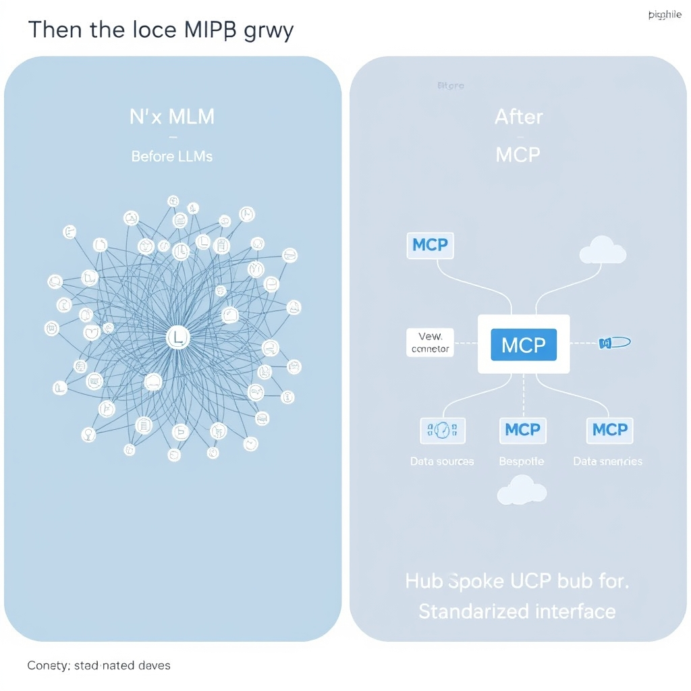
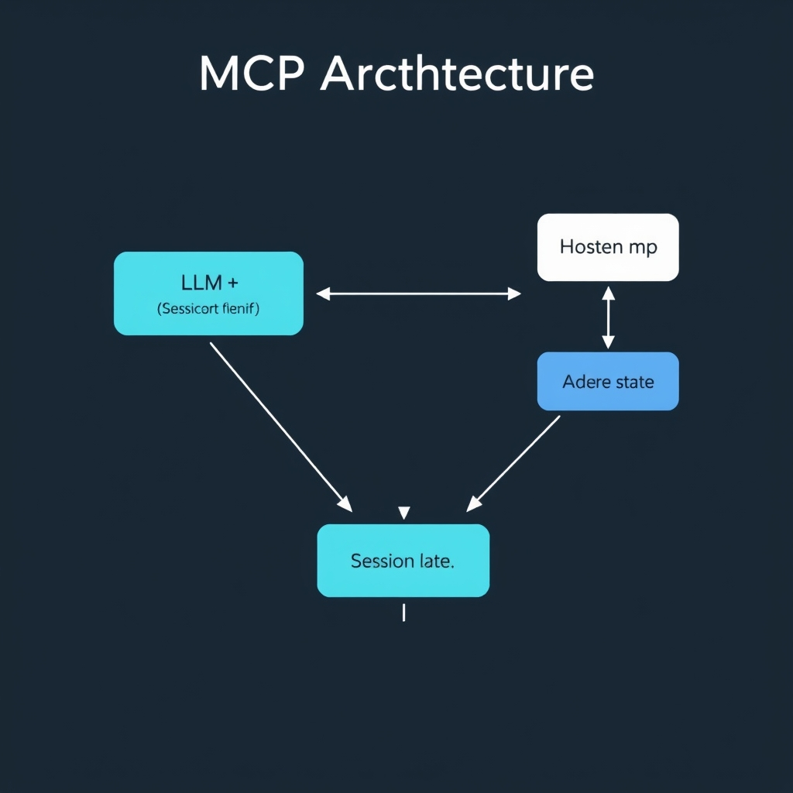
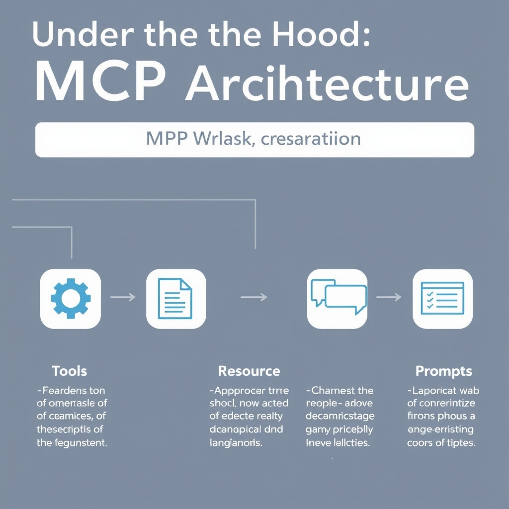

# The Model Context Protocol: Standardizing the Agentic Future

## The Integration Crisis: Why We Needed MCP

Before MCP, AI developers faced an **N × M integration nightmare**: every large language model (LLM) that needed to read a spreadsheet, trigger a webhook, or query a vector store required a **hand‑crafted connector** for that specific data source. A team building a ChatGPT‑based sales assistant had to write one integration for Salesforce, another for Google Sheets, and yet another for a proprietary inventory API. If the same assistant was later ported to Claude or an open‑source LLM, the codebase had to be duplicated or rewritten for the new platform. The effort grew quadratically as the number of agents (N) and external tools (M) increased, leading to brittle pipelines that broke whenever a vendor changed an endpoint or authentication flow.


*The N x M integration problem (left) versus the simplified, standardized MCP architecture (right).*

Maintaining **bespoke APIs across multiple LLM providers** amplified the problem. Each provider exposed a different request‑format, token‑limit handling, and callback mechanism. Developers spent weeks reverse‑engineering vendor SDKs, only to discover that a minor version bump rendered their custom wrappers unusable. The operational overhead—patching security patches, updating OAuth scopes, and handling divergent error‑reporting styles—eaten valuable time that could have been spent on core product features.

Enter the **Model Context Protocol (MCP)**, an open‑source, vendor‑neutral specification that defines a **single JSON‑RPC‑based interface** for agents to discover and invoke external capabilities — tools, resources, and prompts—regardless of the underlying LLM or data service. By abstracting the communication layer, MCP lets a developer write **one connector** for a CRM, then reuse it across any compliant AI assistant. The protocol also standardizes session state, authentication, and error handling, turning a chaotic web of custom code into a predictable, plug‑and‑play ecosystem.

In practice, a developer can now declare a "search‑documents" tool once, register it with an MCP server, and have both Claude‑based research bots and GPT‑4‑driven help desks invoke it without additional code. This dramatic reduction in integration friction is what the industry cites as the primary catalyst for MCP's rapid adoption[^1][^2].

## Under the Hood: The MCP Architecture


*The MCP architecture: The Host mediates communication between the Client and various Servers using JSON-RPC.*

### Roles in the MCP Ecosystem

MCP distinguishes three logical participants:

- **Client** – the LLM or autonomous agent that initiates a task. It sends JSON‑RPC method calls to request external capabilities and receives results that become part of its reasoning loop.
- **Host** – the runtime that mediates between the client and one or more servers. The host maintains the session state, tracks which tools have been loaded, and enforces security policies such as sandboxing or rate limits.
- **Server** – the concrete implementation of a tool, resource, or prompt provider. Servers expose a JSON‑RPC endpoint that the host forwards client requests to, and they return structured responses that the client can immediately consume.

This separation allows a single client to interact with many heterogeneous servers without hard‑coding any integration logic.

______________________________________________________________________

### JSON‑RPC as the Transport Layer

MCP builds on **JSON‑RPC 2.0**, a lightweight, language‑agnostic protocol that carries method names, parameters, and identifiers in plain JSON. The specification notes that MCP "provides a stateful session protocol focused on context exchange and sampling coordination between clients and servers"【https://modelcontextprotocol.io/specification/2025-06-18/architecture】.

Key features that enable statefulness:

1. **Session Identifier** – each client‑host interaction begins with a `session.start` call that returns a UUID. All subsequent calls include this `sessionId`, allowing the server to retain context (e.g., cached authentication tokens or previous tool outputs).
1. **Context Objects** – the `context.update` method lets the client push intermediate reasoning artifacts (like partial LLM completions) to the host, which can then be referenced by later tool invocations.
1. **Sampling Coordination** – the `sample.request` primitive synchronizes token generation across distributed servers, ensuring deterministic output when multiple agents collaborate.

A minimal request/response cycle looks like this:

```json
// Client → Host (JSON‑RPC)
{
  "jsonrpc": "2.0",
  "id": 1,
  "method": "tool.invoke",
  "params": {
    "sessionId": "a1b2c3",
    "tool": "search",
    "arguments": {"query": "MCP architecture"}
  }
}

// Server → Host → Client
{
  "jsonrpc": "2.0",
  "id": 1,
  "result": {
    "status": "ok",
    "output": "The Model Context Protocol (MCP) follows a client-host-server architecture..."
  }
}
```

Because JSON‑RPC is stateless at the transport level, MCP’s session layer adds the necessary persistence without sacrificing the protocol’s simplicity.

______________________________________________________________________

### Core Primitives: Tools, Resources, and Prompts

MCP abstracts external capabilities into three **primitives** that are discoverable at runtime:

| Primitive    | Purpose                                                                           | Example                    |
| ------------ | --------------------------------------------------------------------------------- | -------------------------- |
| **Tool**     | Executes an action (e.g., web search, database query).                            | `search`, `sql_execute`    |
| **Resource** | Provides read‑only data or configuration (e.g., knowledge base, API schema).      | `company_directory.json`   |
| **Prompt**   | Supplies a templated instruction set that can be injected into the LLM’s context. | `summarize_article.prompt` |

Each primitive is described by a JSON‑RPC `metadata` object that lists its name, version, required parameters, and capability flags. Hosts cache this metadata, enabling clients to query the catalog via `catalog.list` and select the most appropriate primitive for a given task.

______________________________________________________________________

### Dynamic Discovery of External Capabilities

Because primitives are **self‑describing**, a client does not need hard‑coded adapters. The discovery flow proceeds as follows:

1. **Catalog Query** – the client calls `catalog.list` on the host, receiving a list of available tools, resources, and prompts, each with version constraints.
1. **Capability Matching** – the client evaluates its current goal against the metadata (e.g., checking that a `search` tool supports the required `region` parameter).
1. **On‑Demand Loading** – when a suitable primitive is identified, the client invokes `session.load` to bind the primitive to the active session. The host establishes a persistent connection to the corresponding server, preserving state for subsequent calls.
1. **Graceful Fallback** – if a server becomes unavailable, the host can automatically switch to an alternative implementation that satisfies the same metadata contract, ensuring robustness.

This pattern eliminates the "N × M" integration nightmare described earlier: instead of writing a bespoke connector for every LLM‑to‑tool pair, developers publish a single server that advertises its primitives, and any MCP‑compliant client can instantly leverage it.

______________________________________________________________________

### Summary

The MCP architecture’s clean separation of **Client**, **Host**, and **Server**, combined with a JSON‑RPC‑based stateful session layer and a trio of discoverable primitives, creates a plug‑and‑play ecosystem. Developers can focus on building capabilities rather than wiring integrations, and agents gain the flexibility to adapt to new tools at runtime.


*The three core MCP primitives: Tools for actions, Resources for data, and Prompts for instructions.*

## The 2026 Ecosystem: Maturity and Governance

In December 2025 Anthropic transferred ownership of the Model Context Protocol to the **Linux Foundation’s Agentic AI Foundation**. This move was more than a symbolic hand‑off; it established MCP as a **vendor‑neutral, community‑governed standard**. By placing the protocol under a neutral umbrella, the foundation can steward open‑source specifications, manage versioning, and coordinate contributions from competing AI firms without any single company dictating the roadmap. The donation also unlocked funding streams for independent maintainers and created a transparent governance model that publishes proposals, votes, and implementation guidelines publicly.

### Broad Platform Support

Since the hand‑off, MCP has been embraced by a wide swath of the AI ecosystem. As of May 2026 the following platforms ship first‑party MCP integrations:

- **Claude** (Anthropic)
- **ChatGPT** (OpenAI)
- **Gemini** (Google)
- **Microsoft Copilot**
- **Cursor**
- **Visual Studio Code** (GitHub)

These integrations are not merely wrappers; they expose the full MCP client‑host‑server contract, allowing developers to register **Tools**, **Resources**, and **Prompts** directly from the IDE or cloud service. The uniformity means a developer can write a single MCP‑compatible plugin and see it operate unchanged across all six environments.

### Scale of the Ecosystem

The Agentic AI Foundation reports **over 10,000 active public MCP servers** handling billions of request cycles each month, and **97 million SDK downloads** in the last year alone【2†https://www.getmaxim.ai/articles/what-is-model-context-protocol-mcp-a-2026-guide】. This scale reflects both the breadth of adoption and the depth of community tooling: open‑source server implementations, language‑specific client libraries, and monitoring dashboards are now commonplace. The sheer number of servers also creates a resilient mesh; if one provider experiences downtime, agents can fall back to alternative hosts without breaking their workflow.

### Why Vendor Neutrality Matters

AI agents are increasingly tasked with **autonomous decision‑making** that spans multiple services—retrieving data from a CRM, invoking a code‑generation tool, or orchestrating cloud resources. When the communication layer is tied to a single vendor, agents become locked into that ecosystem, limiting portability and increasing the risk of **vendor lock‑in**. A neutral protocol like MCP eliminates this friction by:

1. **Standardizing contracts** – every host speaks the same JSON‑RPC schema, so agents can discover capabilities at runtime.
1. **Encouraging competition** – vendors compete on the quality of their Tools and Resources rather than on proprietary integration layers.
1. **Future‑proofing** – as new models or services emerge, they can plug into MCP without renegotiating bespoke APIs.

In practice, this means a developer can build an autonomous workflow today that will continue to operate tomorrow, even if the underlying LLM provider changes. The community‑governed model ensures that the protocol evolves transparently, with input from the very companies that rely on it, preserving the open ecosystem that fuels rapid innovation.

*References:*

- Adoption statistics, May 2026 – Digital Applied blog【1†https://www.digitalapplied.com/blog/mcp-adoption-statistics-2026-model-context-protocol】
- Donation and ecosystem metrics – GetMaxim guide【2†https://www.getmaxim.ai/articles/what-is-model-context-protocol-mcp-a-2026-guide】

## Conclusion: Building the Agentic Future

The Model Context Protocol has become the **foundational layer** upon which modern autonomous agents are built. By abstracting the mechanics of tool discovery, stateful interaction, and context exchange into a single, vendor‑neutral contract, MCP lets developers focus on *behaviour* rather than * plumbing\*. This shift has already lowered the barrier for new agents to tap into existing data stores, APIs, and user interfaces without rewriting bespoke adapters for each LLM.

### Why adopt MCP now?

- **Future‑proof integration** – As the ecosystem expands, any MCP‑compliant server or client will interoperate automatically, protecting your investment against platform churn.
- **Community‑driven evolution** – With governance now under the Linux Foundation’s Agentic AI Foundation, enhancements are vetted openly, ensuring the protocol stays aligned with emerging use‑cases.
- **Rapid prototyping** – The three core primitives (Tools, Resources, Prompts) enable developers to expose new capabilities in minutes, accelerating experimentation cycles.

Looking ahead, MCP’s roadmap includes richer schema support for streaming data, tighter security contracts for zero‑trust environments, and standardized extensions for multimodal agents. As these extensions land, the protocol will continue to act as the glue that binds disparate AI services into cohesive, self‑directed applications. Embracing MCP today positions your projects to ride the next wave of agentic innovation with confidence.

[^2]: https://workos.com/blog/everything-your-team-needs-to-know-about-mcp-in-2026