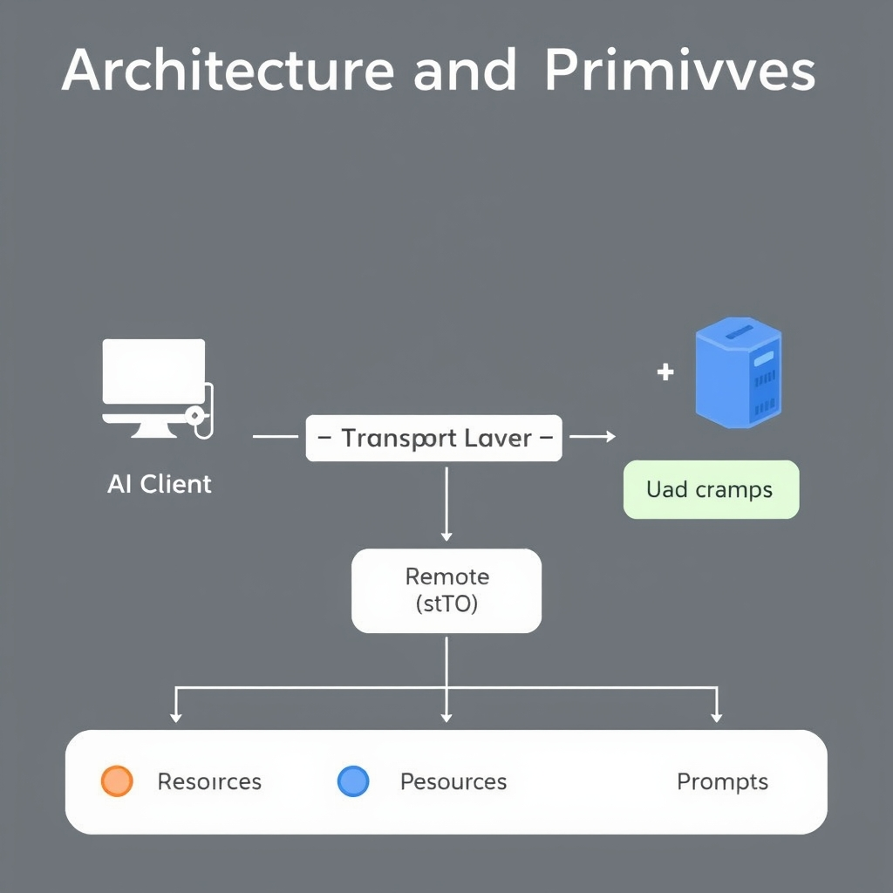
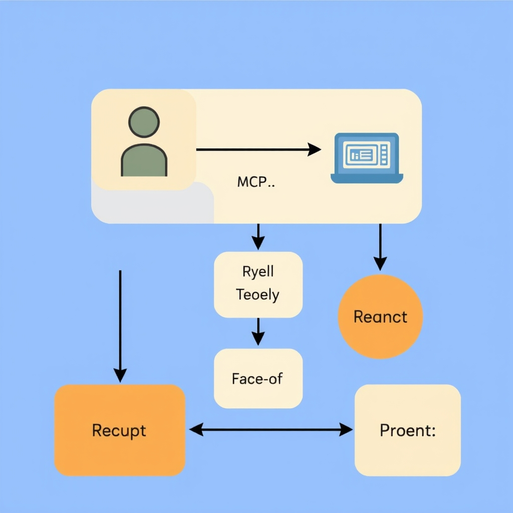
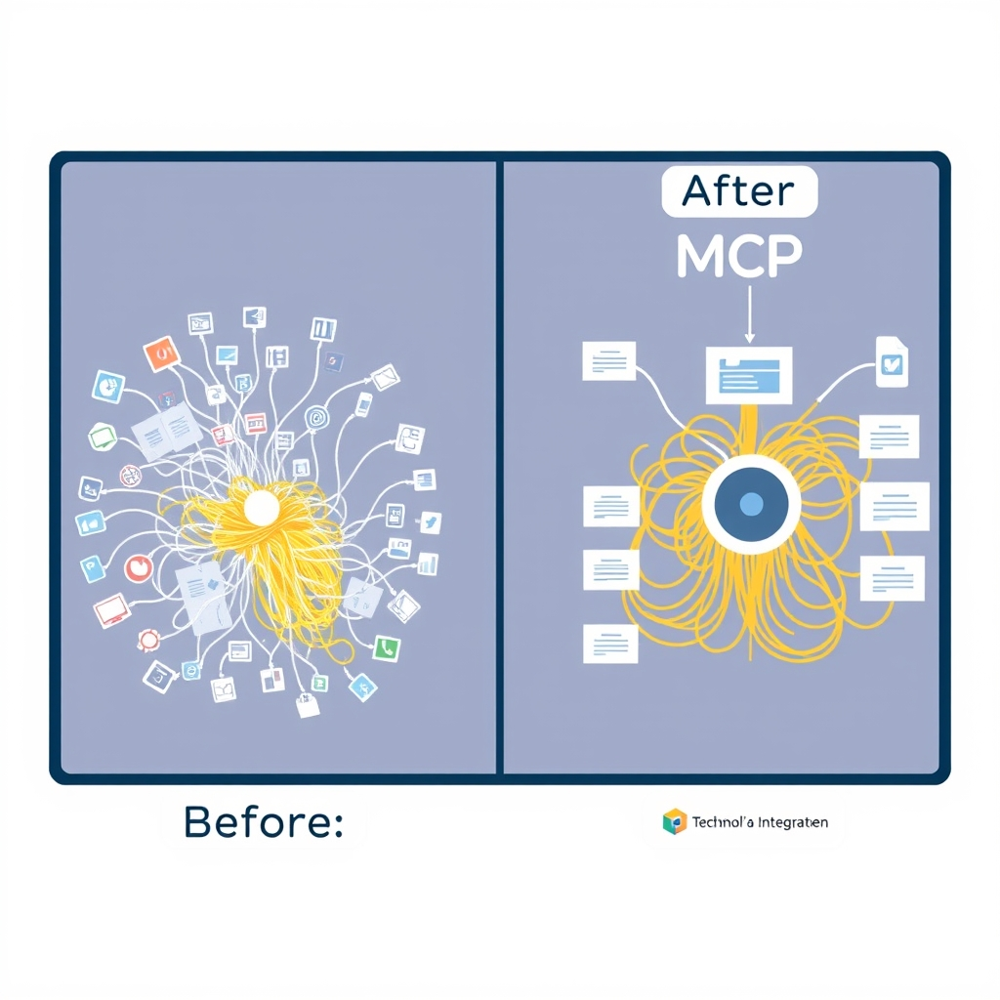

# The Model Context Protocol: Standardizing the AI Agent Ecosystem

## The Problem of Fragmentation

Before the Model Context Protocol (MCP) emerged, developers faced a tangled web of **bespoke integrations**. Each AI model—whether from Anthropic, OpenAI, or a niche startup—required its own connector to reach external tools, databases, or prompt libraries. The result was a *"spaghetti"* architecture: codebases littered with model‑specific adapters, duplicated authentication logic, and ad‑hoc message formats. Teams spent weeks merely keeping these adapters in sync with upstream model updates, and any new tool had to be wired up separately for every supported model.

The **inefficiency** of this approach became stark as the AI ecosystem exploded. A single organization that wanted to support three different language models and five external services could end up maintaining fifteen distinct connectors. Each connector needed version‑specific testing, security reviews, and documentation. When a model provider released a breaking change, every dependent connector had to be patched, often causing service outages. The operational cost of maintaining *"one connector per model per tool"* grew linearly with the number of models and tools, quickly outpacing the value delivered by the AI features themselves.

MCP was introduced to **break this cycle**. Launched in November 2024 by Anthropic, MCP is an *open, vendor‑neutral standard* that defines a single, consistent way for any AI client to talk to any tool, data source, or prompt repository [¹](https://www.teacherandtask.com/blog/what-is-mcp-model-context-protocol-explained). By abstracting the communication layer into a common protocol, developers can write **one connector** that works across all compliant models. The protocol’s small surface area—just a handful of primitives—means fewer moving parts, easier testing, and faster onboarding of new tools. In practice, the shift from a fragmented integration landscape to a unified MCP‑based architecture reduces development time by orders of magnitude and eliminates the maintenance nightmare that previously plagued AI‑enabled applications.

## Architecture and Primitives


*The MCP architecture uses a client-server model with a common transport layer, allowing for local (stdio) or remote (HTTP) communication.*


*The three core primitives work in concert: Tools execute logic, Resources provide data, and Prompts structure the interaction.*

### Client‑Server Architecture

MCP treats every AI‑enabled component as either a **client** that issues requests or a **server** that fulfills them. The client sends a well‑defined message describing the desired operation; the server interprets the message, executes the corresponding primitive, and returns a structured response. This separation keeps integration points minimal and allows the same client code to work with local processes (via `stdio`) or remote services (via HTTP) without modification.

### Core Primitives

MCP’s functionality is expressed through three orthogonal primitives, each represented by a JSON‑serializable schema:

1. **Resources** – immutable data objects that can be referenced by tools or prompts. Examples include model weights, knowledge bases, or configuration files. A resource is identified by a URI and includes metadata such as MIME type and version.
1. **Tools** – executable capabilities that act on resources or external inputs. A tool might be a text‑generation endpoint, an image‑upscaler, or a database query engine. The tool definition lists required input parameters, expected output format, and any resource dependencies.
1. **Prompts** – templated instructions that combine static text with placeholders for dynamic values. Prompts are sent to a tool (typically a language model) and may reference resources to enrich context.

These primitives are deliberately **atomic**; they avoid embedding complex logic inside the protocol itself, which keeps the surface area small and encourages reuse across vendors.

### Transport Layers

MCP supports two transport mechanisms, each suited to a different deployment scenario:

- **`stdio` (standard I/O)** – Used for local, in‑process servers. The client writes a JSON request to the server’s stdin and reads the JSON response from stdout. This mode incurs virtually no network latency and is ideal for development or tightly coupled pipelines.
- **HTTP** – Used for remote or cloud‑hosted servers. Requests are POSTed to a well‑known endpoint (`/mcp`) with a `Content-Type: application/json` header. Responses follow the same JSON schema as the `stdio` mode. HTTP transport enables load‑balancing, authentication, and scaling across multiple instances.

Both transports share the exact same message format, ensuring that switching from a local prototype to a production service is a matter of changing the transport configuration rather than rewriting request logic.

### Design Philosophy: Small Surface Area

The protocol’s designers emphasized a **small surface area** to reduce implementation friction and future‑proof the standard. By limiting MCP to three primitives and two transports, the specification avoids the bloat that plagued earlier proprietary integrations. This minimalism yields several practical benefits:

- **Ease of implementation** – A new server can be written in any language by handling just a handful of JSON schemas.
- **Predictable security** – Fewer entry points simplify threat modeling; the protocol can be sandboxed with well‑defined I/O boundaries.
- **Interoperability** – Clients and servers built by different vendors can interoperate as long as they adhere to the shared primitive definitions.

### Example Interaction (JSON over HTTP)

Below is a concise illustration of a client requesting a text‑generation tool to expand a prompt using a hosted language model:

```json
POST /mcp HTTP/1.1
Content-Type: application/json

{
  "primitive": "Tool",
  "name": "generate_text",
  "inputs": {
    "prompt": {
      "primitive": "Prompt",
      "template": "Write a short story about {{topic}}.",
      "variables": {"topic": "AI ethics"}
    },
    "model": {
      "primitive": "Resource",
      "uri": "mcp://models/openai/gpt-4",
      "type": "application/vnd.openai.model"
    }
  }
}
```

The server processes the request, runs the `generate_text` tool against the specified model, and returns:

```json
{
  "status": "success",
  "output": "...generated story..."
}
```

This interaction works identically over `stdio` by writing the request JSON to the server’s stdin and reading the response from stdout.

______________________________________________________________________

*Source: [What Is MCP (Model Context Protocol)? The 2026 AI Standard Explained](https://www.teacherandtask.com/blog/what-is-mcp-model-context-protocol-explained)*

## Governance and Industry Adoption

**Transition to Linux‑Foundation governance**


*MCP replaces fragmented, bespoke integrations with a standardized hub-and-spoke architecture.*

In December 2025 Anthropic transferred ownership of the Model Context Protocol to the newly created Agentic AI Foundation, a project hosted under the Linux Foundation umbrella, explicitly framing the move as a step toward vendor‑neutral, community‑governed development [source](https://workos.com/blog/everything-your-team-needs-to-know-about-mcp-in-2026).

**Why vendor‑neutral governance matters**

- **Stability for integrators** – When a standard is stewarded by a neutral body, downstream developers can rely on a predictable roadmap and avoid sudden, proprietary changes that would break existing connectors.
- **Broad participation** – Open governance invites contributions from academia, startups, and established AI vendors alike, ensuring the protocol reflects a wide range of use‑cases rather than a single company's product strategy.
- **Legal and compliance clarity** – A Linux‑Foundation‑backed project benefits from the foundation’s well‑defined licensing and trademark policies, reducing the risk of IP disputes for adopters.
- **Future‑proofing** – As AI capabilities evolve (e.g., multimodal models, edge inference), a community‑driven process can more rapidly incorporate new primitives without being bottlenecked by a proprietary roadmap.

**Industry adoption as proof of credibility**

Since the handoff, MCP has been embraced by a growing roster of high‑profile AI platforms and developer tools, reinforcing its status as the de‑facto interoperability layer [source](https://www.teacherandtask.com/blog/what-is-mcp-model-context-protocol-explained):

- **Claude** (Anthropic’s flagship model) – continues to expose MCP endpoints for tool integration.
- **ChatGPT** (OpenAI) – adopted MCP for its plug‑in ecosystem, enabling third‑party tools to share context.
- **Cursor**, **Cline**, **Continue**, **Windsurf**, and **Zed** – coding assistants and IDE extensions that rely on MCP to fetch model outputs, file system state, and user prompts in a uniform way.

**Key players supporting MCP today**

| Category                | Representative supporters                            |
| ----------------------- | ---------------------------------------------------- |
| Cloud AI platforms      | Anthropic (Claude), OpenAI (ChatGPT)                 |
| Development tools       | Cursor, Cline, Continue, Windsurf, Zed               |
| Open‑source foundations | Linux Foundation’s Agentic AI Foundation             |
| Community contributors  | Independent SDK maintainers (Python, TypeScript, C#) |

The convergence of these stakeholders under a neutral governance model signals strong, sustainable momentum for MCP. Developers can therefore invest in MCP‑based integrations with confidence that the protocol will continue to evolve in an open, collaborative manner.

## Getting Started with MCP

### SDKs that get you up and running

MCP ships with first‑party client libraries for the three most common development stacks:

- **Python** – a lightweight package on PyPI (`mcp-sdk`) that wraps the JSON‑RPC protocol and handles the stdio/HTTP transport negotiation.
- **TypeScript/JavaScript** – an npm module (`@mcp/sdk`) that provides both Node.js and browser‑compatible bindings.
- **C#/.NET** – the official SDK is distributed via **NuGet** and includes strongly‑typed models, a fluent builder for servers, and integration helpers for ASP.NET Core. The official C# SDK is documented on [Microsoft Learn](https://learn.microsoft.com/en-us/dotnet/ai/get-started-mcp) and enables building MCP clients and servers for .NET applications.

All three SDKs expose the same core abstractions – **Resources**, **Tools**, and **Prompts** – so code written in one language can be ported to another with minimal changes.

### Community‑built servers for common services

Beyond the core SDKs, the MCP ecosystem relies on a set of open‑source server implementations that provide ready‑made services such as:

- **Embedding stores** (e.g., `mcp-embeddings` written in Rust) that expose a uniform `embed` tool.
- **Vector search back‑ends** (e.g., a Go‑based `mcp‑vectordb`) offering a `search` tool.
- **LLM wrappers** (e.g., a Python `mcp‑openai` server) that translate MCP tool calls into OpenAI API requests.

These servers are deliberately kept small: they implement only the three primitives and communicate over the standard MCP transport (stdio for local development, HTTP for remote deployment). Because the protocol surface is tiny, swapping one server for another—say, replacing a local Llama.cpp instance with a hosted Claude model—requires only a change in the server binary, not in the client code.

### Connecting a local tool – a conceptual walkthrough (Python)

Below is a high‑level example that shows how a developer can expose a simple **file‑system scanner** as an MCP tool and invoke it from a client. The code uses the Python SDK; the same pattern applies to TypeScript and C#.

```python
# scanner_server.py – a minimal MCP server exposing a "scan" tool
from mcp_sdk import Server, Tool
import os

# Define the tool signature expected by MCP
@Tool(name="scan", description="Recursively list files under a directory")
def scan(path: str) -> list[str]:
    result = []
    for root, _, files in os.walk(path):
        for f in files:
            result.append(os.path.join(root, f))
    return result

# Run the server using stdio (ideal for local testing)
if __name__ == "__main__":
    Server().register_tool(scan).serve()
```

```python
# client.py – a consumer that calls the "scan" tool via MCP
from mcp_sdk import Client

# Connect to the local server started above (stdio transport)
client = Client(transport="stdio", command="python scanner_server.py")

# Invoke the tool and print the first five results
files = client.call_tool("scan", {"path": "/tmp"})
print("Found files:", files[:5])
```

**What happens under the hood?**

1. The client serialises the `call_tool` request as a JSON‑RPC message and writes it to the server’s stdin.
1. The server deserialises the request, dispatches to the `scan` function, and returns the result as a JSON array.
1. The client reads the response from stdout and presents it to the developer.

Because the transport layer is abstracted by the SDK, the same client code works unchanged if the server is later moved to a remote host and exposed over HTTP – you only need to change the `transport` argument to `"http"` and point it at the server URL.