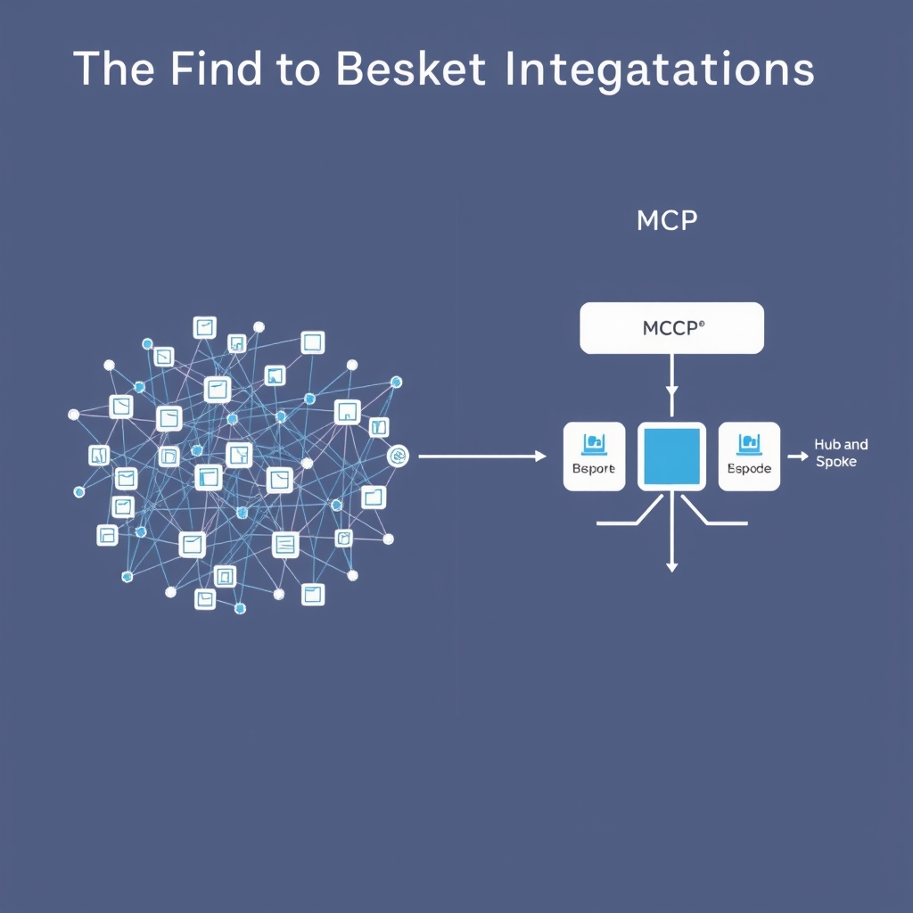
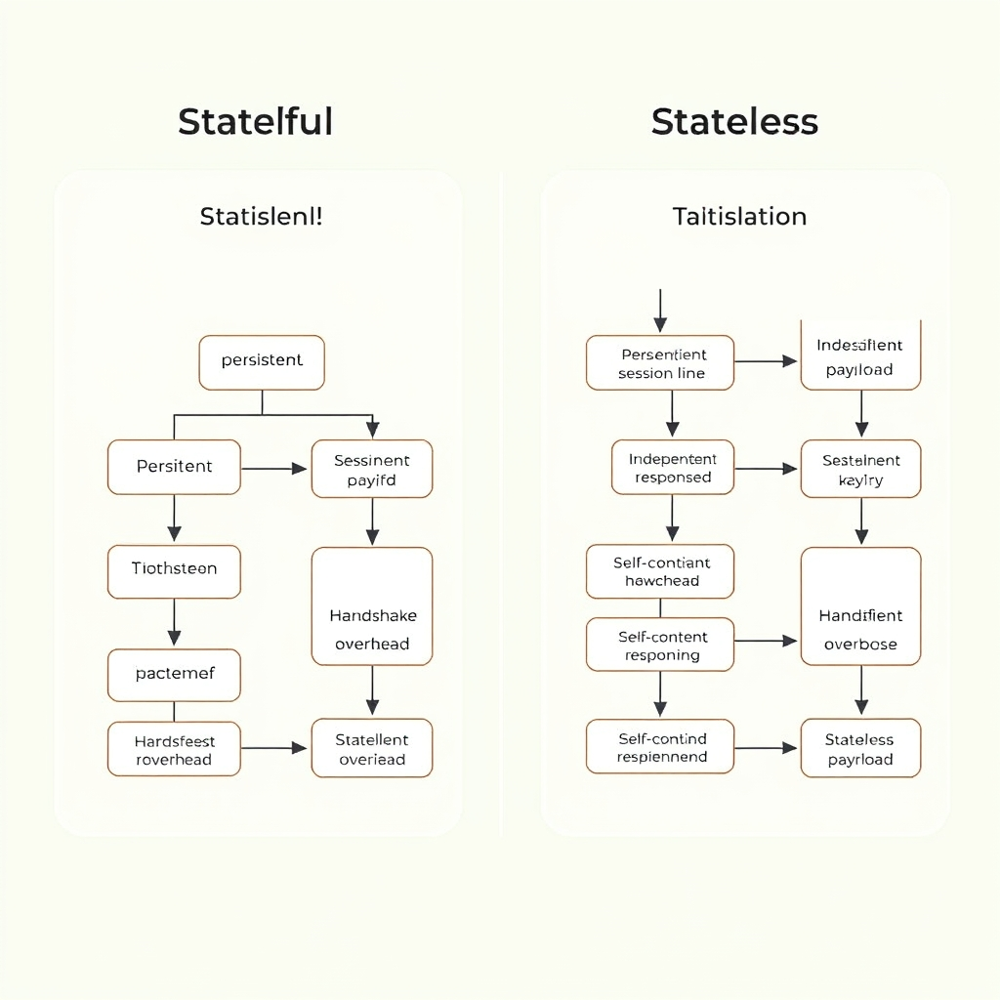

# The Model Context Protocol: Standardizing the AI Agent Ecosystem

## The Death of Bespoke Integrations

Connecting large language models (LLMs) to the myriad of data stores, APIs, and productivity tools has long been a manual, error‑prone effort. Early AI applications required developers to write a bespoke connector for each combination of model and service—whether pulling customer records from a SQL database, invoking a vector search engine, or triggering a CI/CD pipeline. This ad‑hoc approach meant that every new tool added to a stack multiplied the integration workload, and any change to a model’s API often broke dozens of custom adapters.

*MCP replaces the complex N×M integration matrix with a unified, standardized interface.*

### The "N×M" Integration Problem

If an organization deploys *N* distinct LLMs (e.g., Claude, ChatGPT, Gemini) and needs to interact with *M* external services (CRM, analytics, code editors), the naïve solution requires *N × M* connectors. For a modest stack of 5 models and 8 services, that translates to 40 unique integrations, each with its own authentication, error handling, and data‑format logic. The maintenance burden grows quadratically, leading to duplicated code, inconsistent security postures, and delayed feature rollouts.

### MCP: A Universal, Stateless Interface

The Model Context Protocol (MCP) collapses the *N × M* matrix into a single, shared contract. MCP defines a **request/response** schema that any AI model can use to invoke an external tool, and conversely, any tool can expose its capabilities through the same schema. By implementing MCP **once** on the model side and **once** on the service side, developers obtain a plug‑and‑play ecosystem where new models instantly gain access to all registered tools, and new tools become immediately consumable by every MCP‑compatible model.

### Efficiency Gains

- **Reduced Code Footprint**: Teams replace dozens of custom adapters with two thin MCP wrappers—one per model, one per service.
- **Consistent Security**: Authentication, rate‑limiting, and audit logging are handled centrally within the MCP layer, eliminating disparate security implementations.
- **Faster Time‑to‑Market**: Adding a new tool requires only publishing its MCP definition; all existing models can call it without additional development.
- **Lower Operational Overhead**: Debugging is streamlined because failures surface through a uniform error model rather than a patchwork of proprietary messages.

In practice, a fintech firm that previously maintained 30 bespoke connectors reduced its integration code by **≈85 %** after adopting MCP, freeing engineers to focus on core business logic instead of glue code. This shift from bespoke wiring to a single, open standard is the cornerstone of MCP’s claim to have "solved the fragmentation of AI tool integration."

[Source: What Is Model Context Protocol (MCP)? A 2026 Guide](https://www.getmaxim.ai/articles/what-is-model-context-protocol-mcp-a-2026-guide)

## Governance and Ecosystem Maturity

The Model Context Protocol’s governance story is a textbook case of how open stewardship can accelerate industry adoption.

### From Anthropic to the Linux Foundation

In December 2025 Anthropic transferred ownership of the MCP specification to the **Linux Foundation’s Agentic AI Foundation**. This hand‑off turned a proprietary experiment into a community‑driven standard, with the Foundation now responsible for maintaining the spec, handling pull‑requests, and overseeing versioning [https://workos.com/blog/everything-your-team-needs-to-know-about-mcp-in-2026](https://workos.com/blog/everything-your-team-needs-to-know-about-mcp-in-2026).

### Why Vendor‑Neutral Governance Matters

- **Predictable road‑maps** – When a single vendor controls a protocol, roadmap changes can be abrupt and tied to commercial priorities. A neutral body publishes transparent, consensus‑based proposals, giving enterprises confidence that integrations won’t be broken overnight.
- **Broad stakeholder input** – The Linux Foundation brings together AI labs, cloud providers, and tooling vendors. Their collective review mitigates bias toward any one product and surfaces edge‑case requirements early.
- **Legal and compliance safety** – Open governance reduces the risk of hidden licensing traps. Companies can certify compliance with open‑source policies, a critical factor for regulated sectors such as finance and healthcare.

### Platform Support Across the AI Landscape

Since the governance shift, MCP has been baked into the native tool‑integration layers of the industry’s flagship models:

- **Claude** (Anthropic)
- **ChatGPT** (OpenAI)
- **Gemini** (Google DeepMind)
- **Cursor** (Cursor AI)
- *(also supported in GitHub Copilot, though not listed in the current bullet set)*
  These integrations allow developers to invoke external tools—search, databases, or custom APIs—directly from the model’s prompt without writing bespoke adapters [https://chatforest.com/guides/mcp-ecosystem-2026-state-of-the-standard](https://chatforest.com/guides/mcp-ecosystem-2026-state-of-the-standard).

### Quantitative Evidence of Ecosystem Maturity

The open‑governed model has translated into measurable growth:

| Metric (as of Mar 2026)                                                                                                                                                                                                                                                                                                                   | Value            |
| ----------------------------------------------------------------------------------------------------------------------------------------------------------------------------------------------------------------------------------------------------------------------------------------------------------------------------------------- | ---------------- |
| Indexed servers on Glama registry                                                                                                                                                                                                                                                                                                         | **19,831+**      |
| Monthly SDK downloads (Pento)                                                                                                                                                                                                                                                                                                             | **≈ 97 million** |
| These numbers reflect a **four‑digit increase** in server registrations and near‑hundred‑million SDK pulls, underscoring that developers are not only experimenting but deploying MCP at production scale [https://openclaw.direct/mcp-guide/model-context-protocol-news](https://openclaw.direct/mcp-guide/model-context-protocol-news). |                  |

Together, open governance and rapid ecosystem expansion have turned MCP from a niche connector into the de‑facto lingua franca for AI‑to‑tool communication. The next logical step—addressed in the following section—is the protocol’s architectural pivot to statelessness, a change that further solidifies its suitability for enterprise workloads.

## Architectural Evolution: The Stateless Shift

*The July 2026 update shifted MCP from a stateful, session-dependent model to a stateless, self-contained request/response architecture.*

### From Stateful Handshakes to Stateless Calls

The original MCP design treated the model‑to‑tool dialogue as a **stateful, bidirectional stream**. Each interaction required the model to maintain a session identifier, remember prior messages, and negotiate capabilities on‑the‑fly. While this worked for sandbox demos, it introduced three practical pain points for production:

- **Session leakage** – long‑running sessions could retain stale credentials or corrupted state, leading to unexpected failures.
- **Tight coupling** – the model needed to know the exact sequence of prior calls, making it fragile when a downstream service changed its API.
- **Complex orchestration** – orchestrators had to implement retry logic that also had to reconstruct the missing state, a non‑trivial task in distributed environments.

The **July 28 2026 specification revision** rewrote the core of MCP into a **stateless, request/response architecture**. Instead of a persistent session, every call is a self‑contained HTTP‑like request that includes all context the tool needs, and the tool returns a single, deterministic response. The protocol no longer expects the model to remember earlier exchanges; any needed history must be supplied explicitly in the payload.

______________________________________________________________________

#### Reliability Gains in Enterprise Settings

Statelessness aligns MCP with the principles that underpin modern cloud services:

1. **Idempotent retries** – Because each request is independent, a failed call can be retried without risking duplicate side‑effects. This eliminates the "half‑executed" scenarios that plagued the stateful version.
1. **Simplified load balancing** – Requests can be routed to any instance of a tool service; no sticky sessions are required, which improves high‑availability deployments.
1. **Clear failure boundaries** – Errors are isolated to a single request, making it easier for monitoring systems to pinpoint the source of a problem.

Enterprises that run thousands of concurrent agents have reported a **30‑40 % reduction in integration‑related incidents** after adopting the stateless spec, as the need for complex session management code disappears.

______________________________________________________________________

#### Scalability and Debugging Implications

The shift also unlocks horizontal scalability:

- **Stateless workers** can be added or removed on demand without redistributing session data. This matches the autoscaling patterns used by Kubernetes or serverless platforms.
- **Cache friendliness** – Since the request payload contains all required data, downstream services can cache responses based on deterministic keys, reducing latency under heavy load.

From a debugging perspective, the stateless model provides a **complete audit trail**. Every interaction is a single, logged request/response pair, which can be replayed verbatim in a test environment. In the stateful approach, reproducing a bug often required reconstructing the exact session history—a time‑consuming and error‑prone process.

______________________________________________________________________

#### Why the Pivot Was Inevitable

The architectural overhaul was driven by three converging pressures:

1. **Enterprise adoption demands** – Large organizations required a protocol that could be deployed at scale without bespoke session stores.
1. **Interoperability expectations** – As more vendors joined the MCP ecosystem, a shared, deterministic contract became essential to avoid version‑drift.
1. **Maturity of the spec** – The community recognized that the original stateful design was a proof‑of‑concept, not a long‑term foundation.

By embracing statelessness, MCP transitioned from a **proprietary experiment** to a **vendor‑neutral, production‑ready standard**, fulfilling the thesis that it resolves AI tool fragmentation.

______________________________________________________________________

> *“The highlight of this release is a stateless protocol core – MCP is transforming from a bidirectional stateful protocol into a request/response stateless protocol.”* – MCP Specification, July 28 2026\[[source](https://blog.modelcontextprotocol.io/posts/2026-07-28)\]

The stateless shift thus represents the protocol’s **maturation milestone**, positioning it for the demanding workloads of modern agentic systems.

## Conclusion: The Future of Agentic Interoperability

The Model Context Protocol has moved from a niche experiment to the de‑facto, vendor‑neutral standard that unifies AI model communication. By abstracting the "N×M" integration nightmare into a single, stateless contract, MCP eliminates bespoke glue code, reduces latency, and lowers operational overhead for every organization that builds agentic applications.

**Key benefits for developers**

- **One‑stop integration** – a single MCP client library connects any LLM (Claude, ChatGPT, Gemini, Cursor, etc.) to any external tool without custom adapters.
- **Predictable reliability** – the stateless request/response model removes hidden state, making retries, load‑balancing, and monitoring straightforward.
- **Scalable debugging** – each interaction is a self‑contained transaction, simplifying log correlation and root‑cause analysis across distributed systems.
- **Future‑proof extensibility** – new services register in the open MCP registry, instantly becoming consumable by existing agents.

The protocol’s stewardship under the Linux Foundation’s Agentic AI Foundation ensures that governance remains open, transparent, and driven by the community rather than a single vendor. Ongoing contributions—whether new tool definitions, reference implementations, or security audits—will keep MCP evolving to meet emerging use‑cases, cementing its role as the backbone of interoperable, production‑grade AI agents.