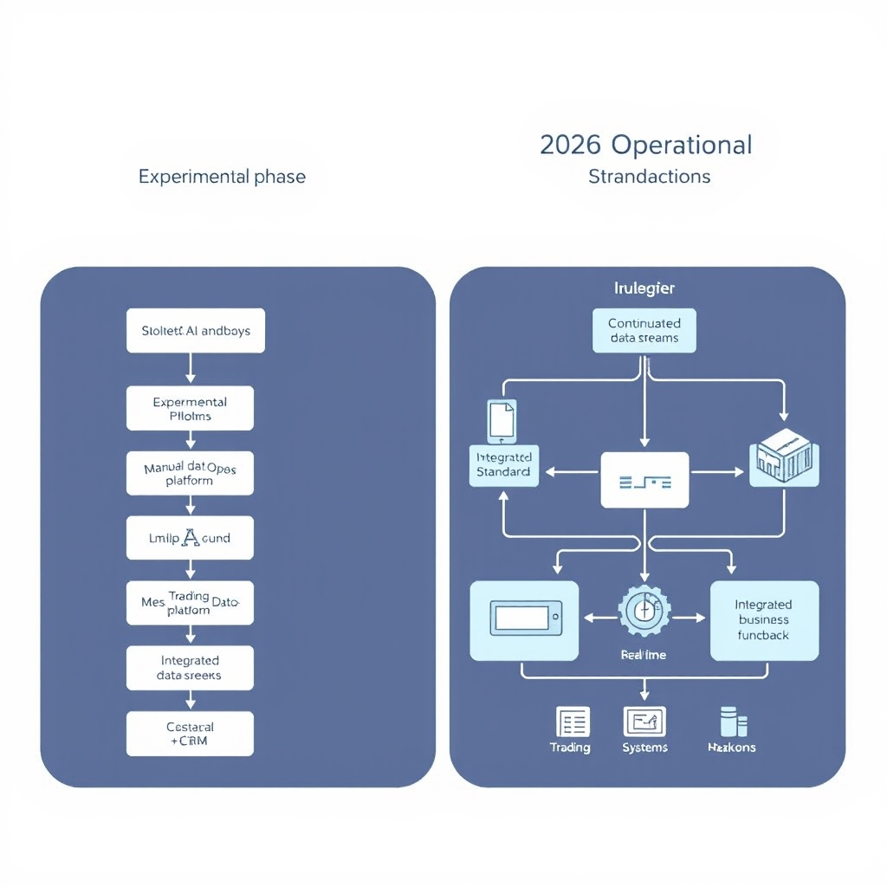
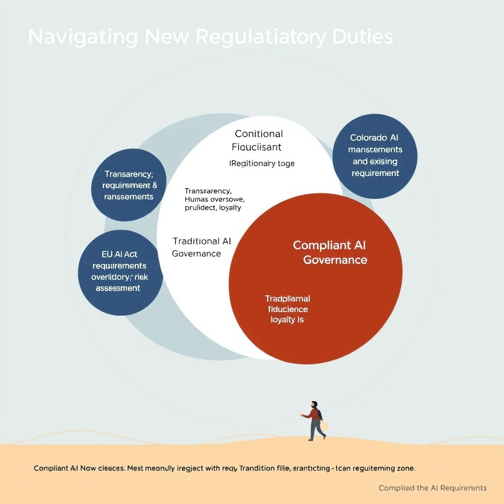
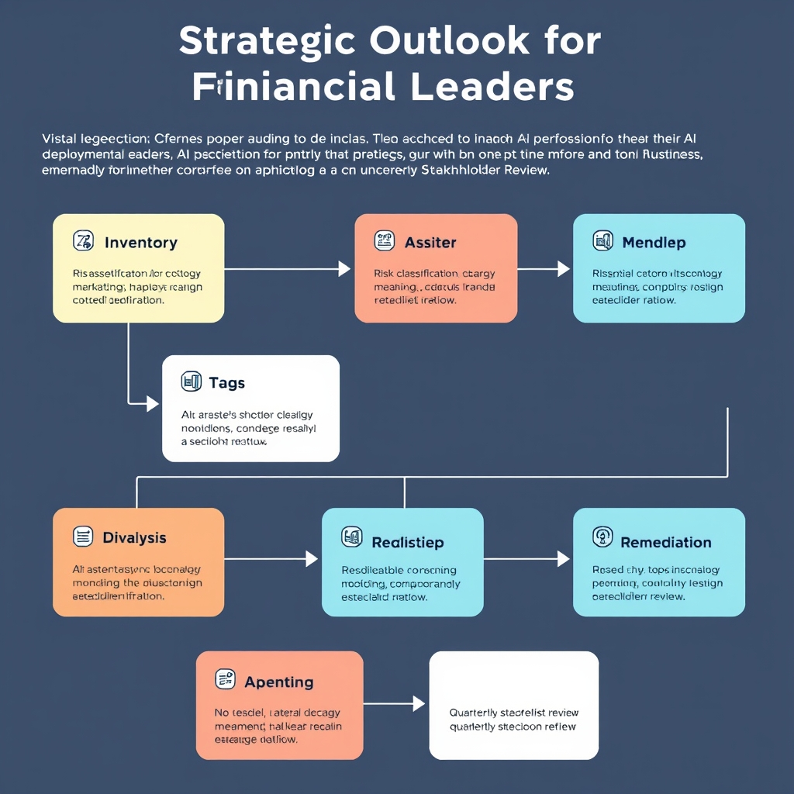

# The New Financial Standard: AI Integration in 2026

## The State of AI Adoption in 2026

By 2026, AI has moved from isolated proof‑of‑concept projects to the backbone of daily banking and investment workflows. Early‑stage pilots—often confined to sandbox environments and limited to a single use case—have been replaced by fully integrated models that feed real‑time data into trading engines, client‑service platforms, and risk‑management dashboards.

*The evolution of AI: From isolated 2022-era experiments to the 2026 standard of integrated, enterprise-wide MLOps.*

- **Broad‑scale adoption**: A 2025 EY survey shows that **95 % of wealth and asset‑management firms have scaled Generative AI (GenAI) across multiple use cases** ([source](https://www.oncehub.com/blog/ai-in-wealth-management-use-cases-tools-and-benefits-in-2026)). This reflects a shift from experimental curiosity to a strategic imperative.
- **Core operational infrastructure**: AI now underpins trade execution, compliance monitoring, and customer‑relationship management. Models are embedded in production pipelines, with automated model‑drift detection and continuous‑learning loops that keep them aligned with market dynamics.
- **Generative AI across functions**:
  - *Client onboarding*: AI‑generated KYC questionnaires and instant document extraction reduce onboarding time from days to minutes.
  - *Portfolio construction*: Large‑language models synthesize macro‑economic data, client risk profiles, and ESG preferences to draft personalized investment proposals.
  - *Marketing and communications*: GenAI drafts market commentary, regulatory disclosures, and personalized outreach, freeing analysts for higher‑value analysis.
  - *Risk reporting*: Automated narrative generation turns raw risk metrics into executive‑ready reports, ensuring consistency and speed.

**Contrast with the experimental phase**: In 2022‑2023, AI deployments were largely sandboxed, required manual data pipelines, and were evaluated on isolated KPI tests. By 2026, firms treat AI as a shared service layer, governed by enterprise‑wide MLOps platforms, with SLAs comparable to legacy IT systems. This evolution marks AI’s transition from a novelty to a foundational pillar of financial operations.

## Key Drivers: Fraud Detection and Operational Efficiency

### AI‑Powered Fraud Prevention Dominates the Market

In 2026, AI‑driven fraud detection solutions have become the de‑facto standard for financial institutions. Market analysis estimates that AI‑powered fraud prevention software accounts for roughly **57 %** of the fraud‑management solution segment, underscoring its dominance over legacy rule‑based tools (see the analysis for details: https://www.futuremarketinsights.com/reports/ai-in-fraud-management-market). The advantage stems from real‑time pattern recognition, adaptive learning models that evolve with emerging fraud tactics, and the ability to process massive transaction streams without latency. As a result, banks and asset managers rely on these platforms to meet both operational efficiency goals and heightened regulatory scrutiny.

### Document Automation Streamlines Back‑Office Operations

Beyond fraud detection, AI is reshaping routine back‑office functions through document automation. Natural‑language processing (NLP) models can extract, classify, and validate data from contracts, KYC forms, and regulatory filings with minimal human intervention. This reduces manual entry errors, accelerates onboarding, and frees staff to focus on higher‑value analysis. While adoption rates differ across firms, the trend is clear: organizations that automate document workflows report faster cycle times and lower operational costs, making automation a priority for scaling efficiency.

### Enhancing Portfolio Risk Analysis for Asset Managers

Portfolio risk analysis has traditionally depended on static statistical models. AI introduces dynamic risk‑assessment engines that ingest market data, macro‑economic indicators, and alternative data sources (e.g., news sentiment) to generate forward‑looking risk metrics. Machine‑learning models can identify non‑linear correlations and stress‑test portfolios under a broader set of scenarios than conventional Value‑at‑Risk (VaR) calculations. Asset managers leveraging these capabilities gain more granular insight into tail‑risk exposures, enabling proactive hedging and richer client reporting.

### Why These Areas Were Prioritized for AI Scaling

The three use cases—fraud prevention, document automation, and portfolio risk analysis—share common drivers that explain their rapid AI adoption:

- **Regulatory pressure:** Regulators demand faster detection of illicit activity and more transparent reporting, pushing firms toward AI solutions that can meet compliance timelines.
- **Cost efficiency:** Automating high‑volume, low‑complexity tasks (e.g., document processing) delivers measurable cost savings, a compelling business case for investment.
- **Competitive differentiation:** Firms that can detect fraud earlier, process client onboarding faster, and provide superior risk insights gain a market edge, prompting senior leadership to allocate resources to AI initiatives.

Collectively, these high‑impact applications illustrate how AI has moved from experimental pilots to core operational pillars, setting the stage for the regulatory challenges explored in the next section.

## Navigating the New Regulatory Frontier

### EU AI Act: Mandatory Controls for High‑Risk Financial Systems

The EU AI Act classifies many financial‑sector AI applications—such as automated credit scoring, algorithmic trading, and fraud‑detection engines—as **high‑risk**. By **2 August 2026** these systems must satisfy four core obligations:

*The intersection of new regulatory mandates and traditional fiduciary duties forms the foundation of compliant AI governance.*

- **Transparency & traceability** – providers must keep detailed logs of data inputs, model version, and decision outcomes, enabling regulators to reconstruct any automated decision.
- **Human oversight** – a designated human must be able to intervene, suspend, or override the AI output in real‑time when the decision materially affects a client’s financial position.
- **Risk management** – a pre‑deployment risk assessment must identify potential biases, security vulnerabilities, and systemic impacts, with mitigation plans documented and periodically reviewed.
- **Data governance** – training data must be high‑quality, representative, and free from prohibited categories (e.g., protected attributes that could lead to discrimination).

Compliance is verified through conformity assessments conducted by notified bodies, and non‑conforming systems cannot be placed on the EU market after the deadline. The Act’s prescriptive language pushes AI from a pilot tool to a regulated component of core banking infrastructure.

______________________________________________________________________

### Colorado AI Act: New Obligations for Developers and Financial Firms

Effective **30 June 2026**, the Colorado AI Act extends liability to developers of high‑risk AI that has a *material effect* on financial services. Key requirements include:

1. **Public disclosures** – developers must publish model cards describing intended use, performance metrics, and known limitations.
1. **Consumer notification** – firms must inform customers when a decision (e.g., loan approval) is generated by an AI system, providing a plain‑language explanation of the factors considered.
1. **Impact assessments** – before deployment, a documented assessment of potential discrimination, privacy risks, and economic impact must be submitted to the state regulator.
1. **Reasonable‑care standard** – both developers and financial institutions are expected to implement safeguards that prevent algorithmic bias and ensure data integrity.

For a regional bank adopting an AI‑driven underwriting engine, this means integrating a compliance layer that automatically generates the required disclosures and flags any deviation from the impact‑assessment parameters. Failure to comply can trigger civil penalties and, in severe cases, bans on the AI system’s use within Colorado.

______________________________________________________________________

### A Shift Toward Technology‑Neutral, Principles‑Based Oversight

Regulators across jurisdictions are converging on a **principles‑based** framework that does not prescribe specific technologies but focuses on outcomes such as fairness, accountability, and systemic stability. This mirrors the broader risk‑based supervision model used for traditional financial products. Key characteristics include:

- **Flexibility** – rules apply to any AI system that meets the high‑risk definition, regardless of whether it uses deep learning, rule‑based logic, or hybrid models.
- **Alignment with existing regimes** – supervisory bodies map AI obligations onto established compliance structures (e.g., anti‑money‑laundering, consumer protection).
- **Iterative guidance** – regulators issue periodic guidance notes that evolve with technological advances, allowing firms to adapt without wholesale system redesigns.

The principles‑based stance reduces regulatory arbitrage, as firms cannot simply switch to a “newer” algorithm to escape oversight. Instead, they must embed governance processes that satisfy the underlying principles across all AI deployments.

______________________________________________________________________

### Adapting Fiduciary Frameworks for AI Compliance

Traditional fiduciary duties—*prudent‑person* standards, duty of care, and duty of loyalty—are being reinterpreted to cover AI‑mediated decisions. Practically, this translates into:

- **Model‑risk committees** that function like investment‑risk committees, reviewing AI model performance, bias metrics, and alignment with client interests.
- **Documentation of “reasonable‑care”** – firms must retain evidence that AI outputs were vetted against fiduciary criteria before execution (e.g., a portfolio manager’s sign‑off on AI‑generated trade recommendations).
- **Audit trails** – continuous monitoring tools record who accessed the AI system, what parameters were changed, and the rationale for any manual overrides, satisfying both fiduciary and regulatory traceability demands.
- **Third‑party vendor oversight** – when outsourcing AI components, financial institutions must conduct due‑diligence analogous to vendor risk assessments, ensuring that third‑party models meet the same fiduciary and regulatory standards.

By embedding these practices, firms can demonstrate that AI does not erode their fiduciary obligations but rather enhances the ability to meet them consistently.

______________________________________________________________________

### Practical Takeaways

- **Map AI inventory**: Identify every AI system classified as high‑risk and align it with the EU and Colorado timelines.
- **Integrate compliance by design**: Build transparency logs, human‑in‑the‑loop controls, and impact‑assessment modules into the development pipeline.
- **Leverage existing governance**: Extend current risk‑management committees and fiduciary oversight processes to cover AI models.
- **Stay informed**: Monitor regulator‑issued guidance for updates to the principles‑based framework, ensuring that compliance remains a continuous, not one‑off, activity.

## Strategic Outlook for Financial Leaders

**Balancing Innovation with Regulation**

*A strategic roadmap for auditing AI deployments to ensure ongoing regulatory compliance.*

Financial institutions can no longer treat AI as a side project. The 2026 landscape demands that every machine‑learning model be evaluated against the EU AI Act, the Colorado AI Act, and emerging fiduciary guidelines. Innovation must proceed, but only within a framework that guarantees compliance, data privacy, and model transparency.

**Human Oversight Remains Essential**

Even the most sophisticated generative models can produce unexpected outputs. A practical safeguard is to embed a *human‑in‑the‑loop* checkpoint for any decision that impacts credit, investment, or client advice. This can be achieved by:

- Defining clear escalation criteria (e.g., confidence score below 85%).
- Assigning domain experts to review flagged decisions before execution.
- Maintaining audit logs that capture both AI inference and human overrides.

**Roadmap for an AI Compliance Audit**

1. **Inventory** – Catalog all AI assets, including models, data pipelines, and third‑party services.
1. **Risk Classification** – Tag each asset as low, medium, or high risk per the EU AI Act definitions for financial systems.
1. **Gap Analysis** – Compare current documentation, testing, and monitoring practices against regulatory requirements (e.g., conformity assessments, post‑market monitoring).
1. **Remediation Plan** – Prioritize fixes for high‑risk gaps, such as adding explainability modules or tightening data governance.
1. **Continuous Monitoring** – Deploy automated compliance dashboards that track model drift, bias metrics, and incident reports in real time.
1. **Stakeholder Review** – Conduct quarterly reviews with legal, risk, and technology teams to validate ongoing adherence.

**Competitive Advantage of Compliant AI**

Firms that embed compliance into their AI lifecycle will reap several benefits:

- **Trust** – Clients and regulators view transparent, auditable AI as lower‑risk, fostering stronger relationships.
- **Speed to Market** – Pre‑approved compliance frameworks reduce the time needed to launch new AI‑driven products.
- **Resilience** – Ongoing monitoring catches performance degradation early, protecting the firm from costly errors.

By treating regulatory adherence as a strategic asset rather than a hurdle, financial leaders can unlock AI’s full potential while safeguarding their reputation and bottom line.