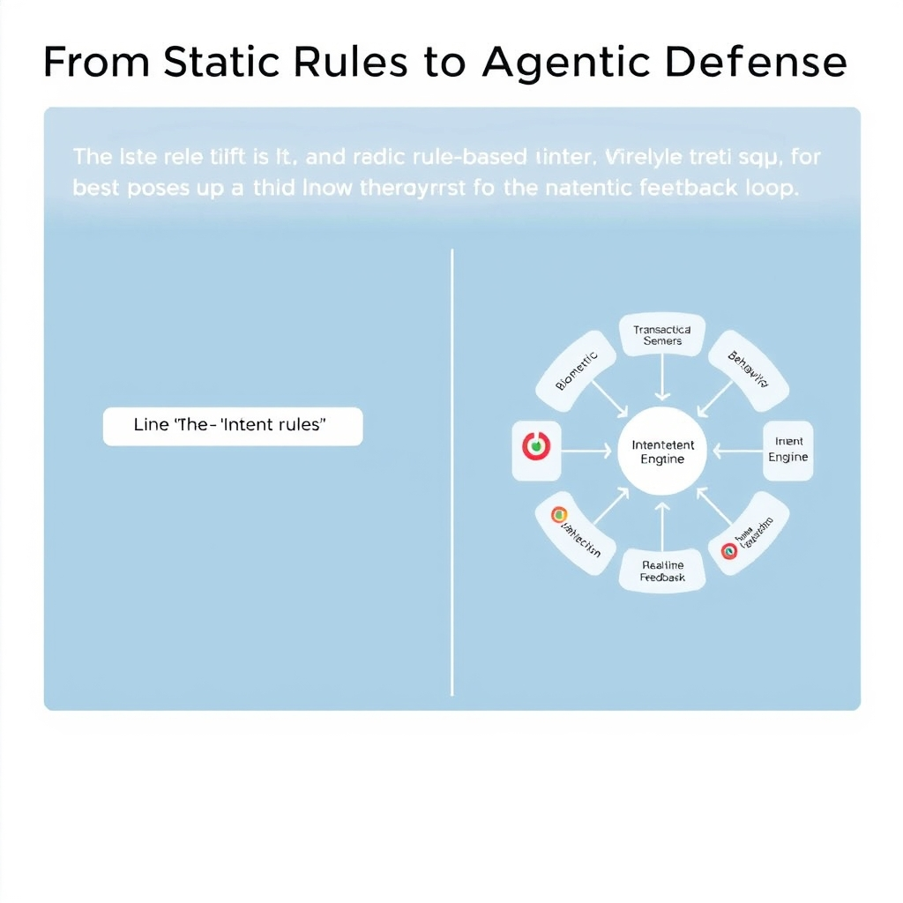
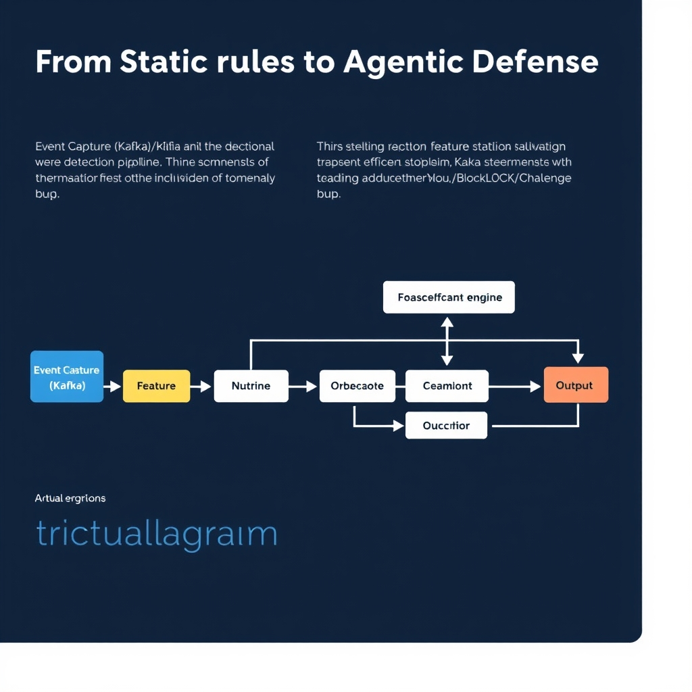
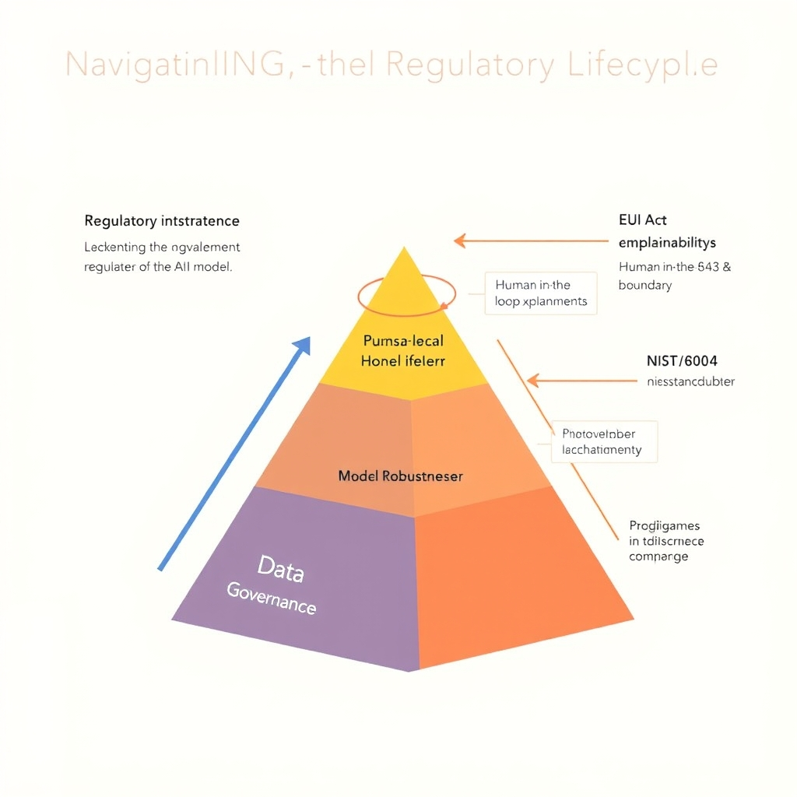

# The New Frontier: AI-Driven Fraud Detection in 2026

## The Escalating Crisis of AI-Enabled Crime

The Federal Bureau of Investigation (FBI) has taken an unprecedented step: for the first time in the 26‑year history of its Internet Crime Complaint Center (IC3) report, it introduced **"AI‑related"** as a distinct crime descriptor. In the 2025 reporting period the agency logged **over 22,000 complaints** tied to artificial‑intelligence‑enabled scams, translating to **nearly $900 million in losses**【https://theworlddata.com/ai-fraud-statistics】.

### Scale of the surge

- **Generative‑AI‑enabled fraud exploded** – Vectra AI’s March 2026 analysis measured a **1,210 % increase** in fraud incidents that leveraged deep‑fake audio, synthetic identity documents, or AI‑crafted phishing content. This growth dwarfs the 2024 baseline and signals a rapid weaponization of large‑language models and image generators.
- **Economic impact** – The $900 M figure represents a 37 % jump from the previous year’s AI‑related losses, underscoring how quickly adversaries are monetizing AI tools.

### Why legacy defenses crumble

Traditional rule‑based fraud engines rely on static signatures (e.g., known bad IP ranges, black‑listed email domains) and deterministic thresholds. AI‑generated attacks defeat these measures in three ways:

1. **Dynamic content** – Deep‑fake voice calls and synthetic documents change with each interaction, rendering signature databases obsolete within minutes.
1. **Contextual mimicry** – Large language models can craft messages that mirror a victim’s prior communication style, bypassing keyword‑based filters.
1. **Speed and scale** – Automated AI bots can launch thousands of unique fraud attempts per second, overwhelming rate‑limiting rules that were designed for slower, human‑driven attacks.

The convergence of massive financial loss, a staggering surge in generative‑AI fraud, and the FBI’s formal recognition of AI‑related crime paints a clear picture: **static, rule‑centric defenses are no longer sufficient**. Organizations must pivot toward adaptive, behavior‑driven architectures that can ingest real‑time signals and evolve alongside the threat landscape.

## From Static Rules to Agentic Defense

The surge in AI‑generated fraud highlighted in the previous section has forced a fundamental redesign of detection architectures. Where legacy systems relied on static rule sets—e.g., "block any transaction over $10,000 from a new IP"—modern defenses operate as autonomous agents that continuously learn, adapt, and coordinate.


*Legacy systems rely on static, linear rules, while agentic networks use interconnected, autonomous agents to evaluate intent in real-time.*

### From Rules to Agents

| Aspect             | Legacy Rule‑Based Systems                                             | Agentic Defense Networks                                                                                      |
| ------------------ | --------------------------------------------------------------------- | ------------------------------------------------------------------------------------------------------------- |
| **Decision Logic** | Hard‑coded thresholds and deterministic if/else branches.             | Probabilistic inference derived from deep neural models that update with each data point.                     |
| **Update Cadence** | Manual rule revisions, often weeks after a new fraud pattern emerges. | Continuous online learning; model weights are refreshed in minutes based on streaming feedback.               |
| **Scalability**    | Limited by the combinatorial explosion of rule permutations.          | Scales horizontally; each agent processes a slice of the feature space and shares insights via a message bus. |
| **Resilience**     | Easily evaded by slight variations in attack vectors.                 | Robust to adversarial perturbations because ensembles of agents cross‑validate anomalies.                     |

In practice, an agentic network consists of several tightly coupled components:

1. **Feature Extraction Layer** – pulls hundreds of signals per transaction (device fingerprint, geolocation velocity, historical spend patterns, etc.).
1. **Deep Anomaly Detector** – a stack of convolutional and recurrent neural networks (CNN‑RNN hybrids) that model temporal dependencies and spatial correlations across these signals.
1. **Intent Engine** – a reinforcement‑learning module that scores the *probability of malicious intent* rather than merely flagging outliers.
1. **Orchestration Hub** – a lightweight microservice that aggregates scores from multiple agents, applies business‑level risk tolerances, and triggers downstream actions (challenge, block, or pass).

### Deep Learning & Neural Networks in Anomaly Detection

Modern fraud detectors treat each transaction as a high‑dimensional vector. A typical architecture might employ:

```python
import torch
import torch.nn as nn

class FraudNet(nn.Module):
    def __init__(self, input_dim):
        super().__init__()
        self.emb = nn.EmbeddingBag(num_embeddings=10000, embedding_dim=64)
        self.rnn = nn.GRU(input_size=64, hidden_size=128, batch_first=True)
        self.fc  = nn.Linear(128, 1)
        self.sig = nn.Sigmoid()

    def forward(self, x):
        x = self.emb(x)
        _, h = self.rnn(x)
        out = self.fc(h.squeeze(0))
        return self.sig(out)
```

The model ingests a sequence of event embeddings (e.g., login, cart add, checkout) and learns to predict a fraud probability in real time. Because the network is trained on millions of labeled transactions, it can capture subtle, non‑linear interactions—such as a sudden shift in device usage patterns combined with a high‑value purchase—that would be invisible to a static rule.

### Real‑Time Transaction Monitoring in Practice

Real‑time monitoring hinges on two engineering pillars:

- **Streaming Ingestion** – platforms like Apache Kafka or Pulsar deliver transaction events to the inference service within milliseconds.
- **Low‑Latency Scoring** – the neural inference engine is containerized with GPU acceleration, achieving sub‑100 ms latency per request.

A typical flow:

1. **Event Capture** – the payment gateway emits a JSON payload to a Kafka topic.
1. **Feature Enrichment** – a stream processor joins the payload with user‑profile data, device risk scores, and recent behavioral vectors.
1. **Scoring Service** – the enriched record is passed to the FraudNet model; the returned probability is compared against a dynamic risk threshold.
1. **Decision Dispatch** – if the score exceeds the threshold, the orchestration hub issues a challenge (e.g., OTP) or blocks the transaction outright.

Because the model updates continuously, the threshold itself can be *intent‑aware*: higher for low‑value, routine purchases and lower for high‑value or cross‑border activities.

### Biometric Liveness Checks Against Deepfakes

Generative AI now produces hyper‑realistic video and audio, enabling synthetic identity attacks. To counter this, agentic systems embed biometric liveness verification directly into the transaction pipeline:

- **Face‑ID with Depth Sensing** – smartphones capture infrared depth maps; a convolutional liveness detector distinguishes a live face from a rendered image.
- **Voice‑Print Challenge** – a short spoken phrase is analyzed by a recurrent network trained on genuine versus synthetic speech patterns.
- **Behavioral Biometrics** – keystroke dynamics and mouse movement entropy are fed into a separate RNN that flags robotic interaction.

When any biometric check fails, the intent engine escalates the risk score, prompting multi‑factor authentication or manual review. This layered approach ensures that even if a fraudster bypasses rule‑based checks, the system still has a high probability of catching synthetic identity attempts.

### The Bottom Line

Transitioning from static rules to agentic defense is not a simple technology swap; it requires re‑architecting the entire fraud detection pipeline around continuous learning, real‑time data streams, and multimodal biometric verification. The result is a dynamic, self‑optimizing network capable of detecting the nuanced, AI‑generated fraud patterns that crippleed legacy defenses.


*The modern fraud detection pipeline: streaming data is enriched and scored by neural networks before an orchestration hub makes a final decision.*

## Navigating the Regulatory Landscape

### EU AI Act: Obligations for High‑Risk Fraud Detection Systems

The EU Artificial Intelligence Act classifies AI used for identity verification and fraud mitigation as **high‑risk**. Providers must:


*Regulatory frameworks act as a governance layer, ensuring that AI fraud detection systems remain transparent, fair, and robust.*

- Conduct a pre‑market conformity assessment, documenting risk management, data governance, and robustness testing.
- Implement **human‑in‑the‑loop** controls for decisions that could materially affect individuals, such as flagging a transaction as fraudulent.
- Ensure **real‑time logging** of model inputs, outputs, and decision rationales to satisfy auditability requirements.
  Failure to meet these obligations can lead to fines up to 6 % of global turnover. The Act thus forces vendors to embed transparency and safety checks directly into their detection pipelines, shifting the focus from ad‑hoc rule updates to systematic compliance.

### NIST SP 800‑63‑4: Strengthening Digital Identity Verification

The U.S. Digital Identity Guidelines (NIST SP 800‑63‑4) overhaul authentication and anti‑spoofing standards. Key updates relevant to AI‑driven fraud detection include:

- **Multi‑factor authentication (MFA) levels** that now require biometric liveness detection for high‑assurance (IAL3) identities, compelling fraud platforms to integrate live‑face or voice analysis.
- **Adaptive risk‑based authentication**, where contextual signals (device fingerprint, geolocation, transaction velocity) trigger dynamic challenges.
- **Enhanced anti‑spoofing metrics**, mandating a minimum **Spoofing Detection Rate (SDR)** of 99 % for biometric modalities.
  These guidelines push organizations to couple AI anomaly detectors with rigorous identity proofing, reducing the attack surface for deep‑fake impersonation.

### Balancing Explainability with Security Performance

Regulators demand **model explainability** for high‑risk AI, yet overly transparent models can expose attack vectors. A practical balance involves:

1. **Hybrid architectures**: Deploy a black‑box deep‑learning detector for raw anomaly scoring, followed by a rule‑based explainable layer that translates scores into human‑readable risk factors (e.g., "unusual device change" or "velocity spike").
1. **Post‑hoc explanation tools** such as SHAP or LIME, applied only to audit logs rather than live decision paths, preserving performance while satisfying audit requirements.
1. **Controlled disclosure**: Release high‑level rationale to compliance teams while keeping detailed model internals confidential.
   This approach satisfies the EU’s transparency mandates without compromising the detection latency critical for real‑time fraud prevention.

### Necessity of Bias Mitigation in Automated Fraud Detection

AI models trained on historical transaction data can inherit systemic biases—e.g., disproportionately flagging certain demographic groups due to legacy risk patterns. Both the EU AI Act and NIST guidelines emphasize **fairness** as a core compliance pillar. Effective bias mitigation strategies include:

- **Diverse training datasets** that represent the full spectrum of user behavior across regions and socioeconomic segments.
- **Fairness metrics** (e.g., demographic parity, equalized odds) monitored continuously; thresholds trigger model retraining.
- **Algorithmic de‑biasing techniques** such as re‑weighting or adversarial debiasing during model optimization.
- **Human oversight**: Periodic review of false‑positive clusters to detect emerging bias trends.
  By embedding these safeguards, organizations not only meet regulatory expectations but also reduce false‑positive costs and reputational risk.

______________________________________________________________________

*Sources: [Sumsub – Top New Identity Fraud Trends 2026](https://sumsub.com/blog/top-new-identity-fraud-trends)*

## Future-Proofing Security Architectures

The shift from reactive rule sets to **proactive, intent‑based detection** marks the next evolutionary step in fraud defense. Modern platforms now model the *purpose* behind a transaction—whether it aligns with a user’s typical behavior, device fingerprint, or business context—allowing the system to flag suspicious activity before any loss occurs. For example, an AI‑driven engine can infer that a rapid series of high‑value transfers from a newly provisioned device is likely an exfiltration attempt, even if each individual transfer passes traditional thresholds.

**Continuous model monitoring** is essential to sustain this advantage. As fraudsters adapt, detection models must be retrained on fresh adversarial data, performance‑tracked for drift, and validated against bias metrics. Automated pipelines that ingest live transaction streams, re‑evaluate feature importance, and redeploy updated weights ensure defenses remain aligned with emerging attack vectors.

Looking ahead, the **arms race between AI‑enabled fraud and defense** will intensify. Generative models will produce ever more convincing synthetic identities, while defenders will counter with federated learning across industry consortia, shared threat intelligence, and intent‑oriented orchestration layers. Organizations that embed adaptive, intent‑driven analytics and rigorous monitoring into their security architecture will be best positioned to stay ahead of the curve.