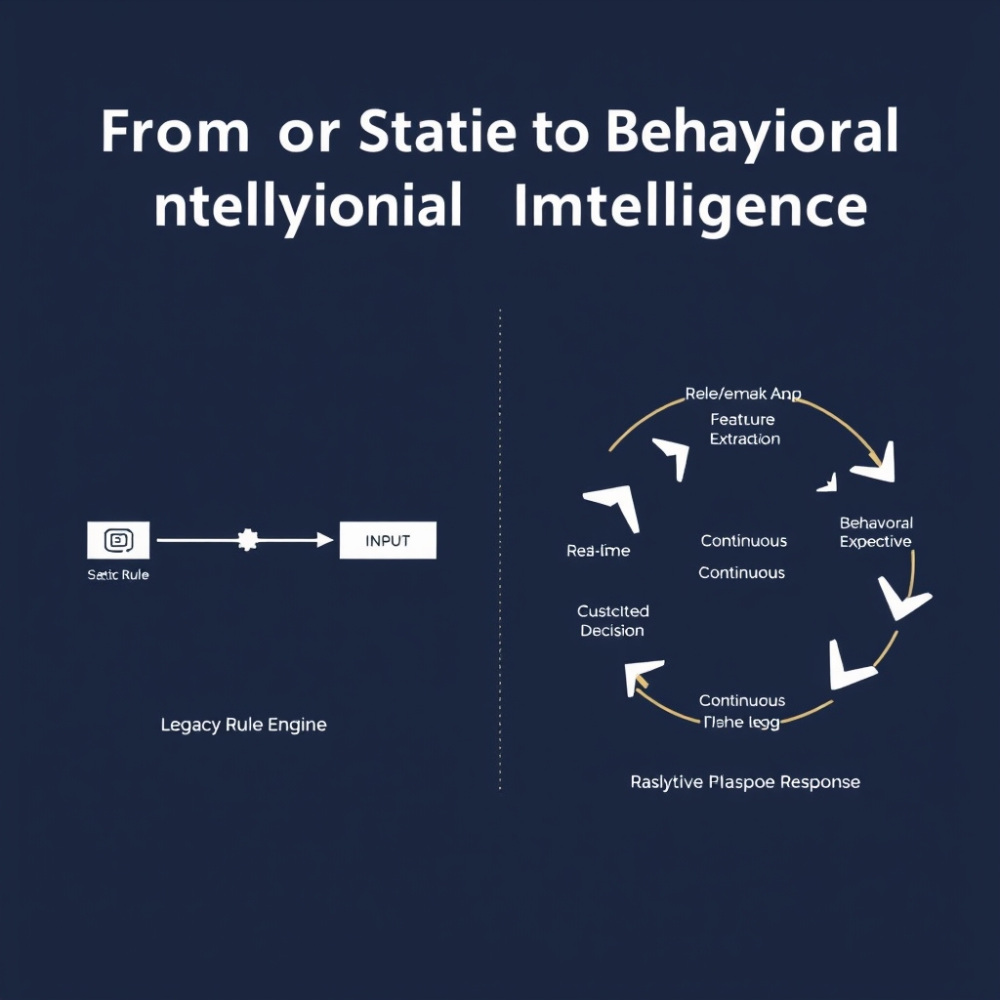
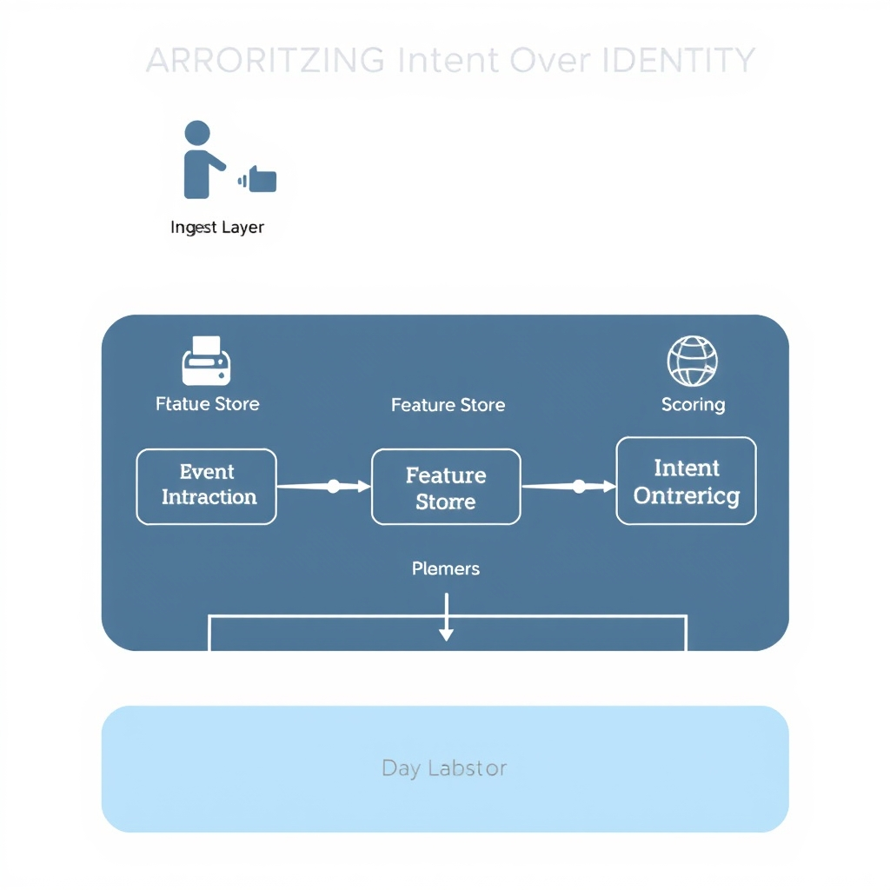

# The New Frontier: AI-Driven Fraud Detection in 2026

## The State of the Fraud Landscape in 2026

In 2026 the fraud landscape is dominated by AI, and the numbers make that dominance unmistakable. A 2025 Alloy survey found that **99 % of organizations** now embed artificial‑intelligence models in their fraud prevention stack, up from roughly 70 % just three years earlier. This near‑universal adoption reflects a hard‑won lesson: static rule sets can no longer keep pace with attackers who themselves wield sophisticated machine‑learning tools. [Source](https://www.coursera.org/articles/ai-in-fraud-detection)

### Automated account takeover is now the norm

The most visible symptom of this arms race is the explosion of automated credential‑testing attacks. Between January and April 2026, **account‑takeover attempts rose 78 %** compared with the same period in 2025, driven by botnets that can probe millions of login endpoints in minutes. These attacks are no longer opportunistic; they are orchestrated, AI‑driven campaigns that adapt in real time to lock‑out defenses, CAPTCHA challenges, and multi‑factor prompts. [Source](https://www.signifyd.com/ecommerce-fraud-trends)

### Synthetic identity farms and other AI‑powered threats

Beyond credential stuffing, fraudsters have begun to **generate synthetic identities at scale** using generative‑AI models. By blending real‑world data points (e.g., public records, social media footprints) with AI‑crafted personal details, attackers can create thousands of plausible personas that slip through traditional verification checks. These “identity farms” feed automated loan applications, fraudulent e‑commerce orders, and even tax‑refund scams, overwhelming legacy fraud engines that rely on static attribute checks.

### Why legacy systems are falling behind

Legacy fraud platforms were built around **rule‑based logic**: blacklists, velocity thresholds, and static device fingerprints. Such rules assume attackers act predictably and that fraud signals are static. In reality, AI‑enabled adversaries continuously evolve their tactics, rendering hard‑coded thresholds obsolete within days. Moreover, rule engines generate high false‑positive rates because they cannot differentiate a legitimate user’s atypical behavior from malicious intent. The result is a feedback loop where security teams spend disproportionate effort on manual reviews, while sophisticated bots continue to succeed.

The convergence of near‑universal AI adoption, a surge in automated takeover attempts, and the emergence of synthetic identity farms makes it clear: **static, rule‑centric defenses are no longer sufficient**. The next sections will explore how shifting to continuous, intent‑driven behavioral intelligence can restore the balance in this AI‑versus‑AI battlefield.

*The fraud landscape has evolved from manual, opportunistic attacks to sophisticated, AI-driven campaigns that require proactive, intelligent defenses.*

## From Static Rules to Behavioral Intelligence

### From Static Rules to Behavioral Intelligence

Traditional fraud defenses rely on **static, rule‑based** checks: a blacklist of compromised cards, a hard limit on failed login attempts, or a simple geo‑IP mismatch rule. These controls are easy to implement but suffer two fundamental flaws:

*Legacy systems rely on rigid, binary rules, whereas modern behavioral intelligence uses continuous modeling to assess risk in real time.*

- **Rigidity** – Rules are written for known attack patterns. When attackers tweak a script or use a new device, the rule set stays silent until it is manually updated.
- **High false‑positive rates** – Legitimate users who travel, change browsers, or use a VPN often trigger the same thresholds, leading to friction and lost revenue.

______________________________________________________________________

#### Dynamic behavioral modeling

Modern platforms replace binary allow/deny decisions with a **continuous risk score** derived from real‑time observations of user and device behavior. For example, instead of blocking a login from a new country outright, the system evaluates:

1. Historical login frequency and typical locations for the account.
1. Device fingerprint consistency (browser version, OS, screen resolution).
1. Interaction patterns such as typing speed, mouse movement entropy, and API call cadence.

When the aggregate score exceeds a configurable threshold, the platform can prompt for additional verification rather than outright denial. This approach captures subtle anomalies that static rules miss while preserving a frictionless experience for the majority of users.

______________________________________________________________________

#### Continuous monitoring cuts false positives

Because behavior is profiled **continuously**, the model adapts to legitimate changes. A user who recently moved abroad will generate a new baseline for “normal” locations after a few successful sessions, reducing the likelihood of future blocks. Studies cited by Protegrity show that organizations adopting continuous behavioral intelligence see a **30‑40 % drop in false positives**, while detecting fraud incidents up to 50 % earlier.

> *Security and risk leaders must shift to continuous behavioral intelligence—using AI to model normal user, device, and channel behavior in real time to catch subtle anomalies earlier, cut false positives, and keep customer experiences frictionless.*[^1]

______________________________________________________________________

#### Modeling normal user and device behavior

Effective models require two data pillars:

- **User‑centric signals** – Transaction velocity, purchase categories, time‑of‑day activity, and interaction dynamics.
- **Device‑centric signals** – Hardware identifiers, TLS fingerprint, network latency, and sensor data (e.g., accelerometer on mobile).

By training on weeks of benign activity, the system learns a multidimensional “behavioral envelope.” Deviations that fall outside this envelope trigger risk alerts. Importantly, the envelope is **periodically retrained** to incorporate seasonal trends (holiday shopping spikes) and evolving user habits.

______________________________________________________________________

#### Real‑time processing in modern fraud pipelines

Real‑time intent detection hinges on low‑latency data pipelines:

- **Event ingestion** – Stream platforms (Kafka, Pulsar) capture every click, API call, and device handshake.
- **Feature extraction** – Lightweight feature generators compute risk attributes in milliseconds.
- **Scoring engine** – A model serving layer (e.g., TensorFlow Serving, ONNX Runtime) returns a risk score within 10‑20 ms.
- **Decision orchestration** – A rule‑router combines the score with business policies to decide on frictionless pass‑through, step‑up authentication, or transaction denial.

This architecture ensures that the **intent** behind each action is evaluated at the moment it occurs, rather than after a batch of transactions has been processed.

______________________________________________________________________

By moving from static rule sets to a continuously learning, real‑time behavioral intelligence stack, organizations can stay ahead of increasingly sophisticated, automated fraud attacks while preserving a seamless user experience.

\[^1\]: Protegrity, *AI Fraud Detection in 2026: What Security and Risk Leaders Must Know*, https://www.protegrity.com/resources/blog/ai-fraud-detection-in-2026-what-leaders-must-know

## The Rise of Generative AI Threats

### Deepfakes in Social Engineering

Fraudsters now weaponize generative AI to produce hyper‑realistic audio and video clips of trusted executives, customer‑service agents, or even friends. A single‑click voice‑clone can convince a finance officer to approve a wire transfer, while a fabricated video of a CEO endorsing a new vendor can bypass manual approval workflows. In 2026, incidents of deepfake‑driven account takeover rose by **30 %** year‑over‑year, according to industry surveys. Because the media appear authentic, traditional rule‑based checks—such as keyword filters or static voice‑print databases—fail to flag the deception.

### Synthetic Identity Generation at Scale

Generative models can synthesize entire identity profiles, complete with plausible names, addresses, credit histories, and even biometric data. By feeding a language model thousands of public records, attackers can output millions of unique, yet fictitious, personas in hours. These synthetic identities are then used to open bank accounts, apply for loans, or register on e‑commerce platforms. The sheer volume overwhelms legacy verification pipelines that rely on static document checks; the system sees a valid‑looking ID, not the fact that the underlying persona never existed.

### AI‑Written Phishing Campaigns

Large‑language models (LLMs) can draft phishing emails that mimic a target’s writing style, incorporate recent corporate events, and embed malicious links that evade conventional spam filters. A recent study showed that AI‑generated phishing messages achieve a **45 % higher click‑through rate** compared to human‑crafted templates. Moreover, these campaigns can be automated: a bot can generate, personalize, and dispatch thousands of emails per minute, saturating inboxes and exhausting manual review teams.

### Why Traditional Identity Verification Falls Short

Traditional identity verification focuses on **who** the user claims to be—checking documents, passwords, or static biometric signatures. Generative AI erodes this foundation by making the "who" indistinguishable from the real thing. Deepfakes spoof voice and video, synthetic IDs provide convincing documentation, and AI‑crafted phishing lures manipulate the human decision‑making process before any credential check occurs. Consequently, a system that only validates identity at login or transaction time cannot detect the **intent** behind the interaction, allowing malicious actors to slip through even perfectly calibrated rule sets.

> **Key takeaway:** The generative AI threat vector shifts the battleground from static credential verification to dynamic, intent‑aware defenses. Organizations must augment or replace legacy identity checks with behavioral and intent‑based analytics to spot anomalies that deepfakes, synthetic identities, and AI‑driven phishing attempts cannot disguise.

______________________________________________________________________

*Source: [5 Fraud Prevention Strategies for 2026](https://frogo.ai/blog/fraud-prevention/fraud-prevention-strategies)*

## Prioritizing Intent Over Identity

### Defining Identity Verification vs. Intent Analysis

- **Identity verification** confirms *who* is interacting with a service—typically through credentials, biometrics, or device fingerprints. It answers the question, "Is this user who they claim to be?" Traditional pipelines treat a verified identity as a gatekeeper, allowing or denying access based solely on that static assertion.

- **Intent analysis** asks a different question: *what* is the user trying to do and *how* does their behavior align with legitimate patterns? Rather than a binary pass/fail on identity, intent‑based systems evaluate the *purpose* behind each action in real time, flagging activity that deviates from an established behavioral baseline.

______________________________________________________________________

### Determining Legitimate vs. Malicious Intent

Modern AI pipelines ingest a continuous stream of signals—click sequences, mouse dynamics, API call timing, geolocation shifts, and device resource usage. Machine‑learning models (often recurrent or transformer‑based) score each session on a **behavioral intent vector**:

1. **Baseline profiling** – Historical data builds a probabilistic model of normal user/device behavior.
1. **Anomaly scoring** – Real‑time events are compared against the baseline; deviations generate an intent risk score.
1. **Contextual enrichment** – Signals such as recent password changes, account age, or known threat intel are layered onto the score.
1. **Decision thresholding** – If the composite intent score exceeds a dynamic threshold, the transaction is routed to additional verification or blocked outright.

This approach reduces false positives because a legitimate user who momentarily trips a static rule (e.g., logging in from a new city) can be cleared if the surrounding behavior—typing cadence, device fingerprint continuity, and transaction history—remains consistent with their profile.

______________________________________________________________________

### Technical Challenges of Real‑Time Intent Detection

| Challenge             | Why It Matters                                                                                       | Typical Mitigation                                                                                                         |
| --------------------- | ---------------------------------------------------------------------------------------------------- | -------------------------------------------------------------------------------------------------------------------------- |
| **Data latency**      | Intent models need sub‑second data to react to fast‑moving attacks.                                  | Edge inference nodes and streaming platforms (Kafka, Pulsar) to push events directly to the model.                         |
| **Model drift**       | Fraud tactics evolve; a model trained on last‑year data may miss new intent patterns.                | Continuous training pipelines with automated drift detection and A/B testing.                                              |
| **Feature explosion** | Real‑time pipelines can generate millions of features per session, overwhelming storage and compute. | Feature selection via mutual information and dimensionality reduction (e.g., autoencoders).                                |
| **Explainability**    | Security teams require justification for high‑risk flags to comply with regulations.                 | Hybrid models that combine interpretable rule layers with black‑box intent scores; SHAP or LIME for post‑hoc explanations. |

______________________________________________________________________

### Framework for Integrating Intent‑Based Signals

1. **Ingest Layer** – Deploy a low‑latency event collector (e.g., Fluent Bit) that captures user interactions, device telemetry, and network metadata.
1. **Feature Store** – Centralize engineered features in a real‑time store (Redis Streams, DynamoDB) to provide the intent model with up‑to‑date context.
1. **Scoring Service** – Host a stateless microservice exposing a `/score-intent` endpoint. The service receives a session ID, pulls the latest features, and returns an intent risk score.
1. **Orchestration** – Use a workflow engine (Apache Airflow or Temporal) to route high‑risk scores to secondary verification steps (OTP, biometric challenge) while allowing low‑risk traffic to proceed.
1. **Feedback Loop** – Capture outcomes (fraud confirmed, false alarm) and feed them back into the training data lake for model retraining.

By embedding intent detection at the core of the fraud pipeline, organizations shift from a **reactive identity checkpoint** to a **proactive behavioral guardrail**, aligning security posture with the evolving AI‑driven threat landscape. As noted by DataDome, “the question is no longer simply whether a request comes from a human or a bot, but whether their behavior indicates legitimate use or fraudulent intent”【https://datadome.co/learning-center/ai-fraud-detection】.

*An intent-based pipeline integrates real-time telemetry and behavioral modeling to evaluate the purpose behind user actions.*

## Building a Resilient Fraud Pipeline

Continuous model training is no longer optional; it is the backbone of a resilient fraud pipeline. Models must ingest fresh transaction streams, emerging threat signatures, and newly labeled fraud cases at least daily. Automated retraining pipelines—triggered by drift detection metrics such as population stability index (PSI) or sudden spikes in false‑negative rates—ensure that the detection surface evolves faster than adversaries can weaponize new tactics. Equally critical is safeguarding the training data itself. Encryption at rest, strict access controls, and immutable audit logs prevent attackers from poisoning the dataset, a risk that grows as more third‑party data sources are incorporated.

Security cannot come at the expense of user experience. Real‑time intent analysis should be coupled with graceful fallback flows: for low‑risk actions, a silent risk score suffices; for borderline cases, adaptive challenges (e.g., contextual CAPTCHAs) replace outright blocks. This tiered approach keeps friction low for legitimate users while still escalating scrutiny when the risk profile spikes.

**Checklist for evaluating your fraud detection infrastructure**

- **Data freshness**: Are model inputs refreshed within the last 24 hours?
- **Drift monitoring**: Do you have automated alerts for statistical drift in key features?
- **Model provenance**: Is every model version traceable to its training dataset and hyper‑parameters?
- **Security hygiene**: Are training pipelines protected against data poisoning and exfiltration?
- **Latency budget**: Can the system score a transaction and return a decision within the required response window (typically \< 200 ms)?
- **User impact metrics**: Do you track false‑positive rates and associated friction scores?

Looking ahead, the battlefield will be AI‑versus‑AI. Attackers will deploy generative models to craft hyper‑personalized phishing, synthetic identities, and deep‑fake social engineering at scale. Defenders must therefore invest in adaptive, intent‑driven architectures that can ingest adversarial signals, auto‑retrain, and continuously validate their own models. By treating fraud detection as an evolving intelligence loop rather than a static rule set, organizations position themselves to stay ahead of the next wave of automated attacks.