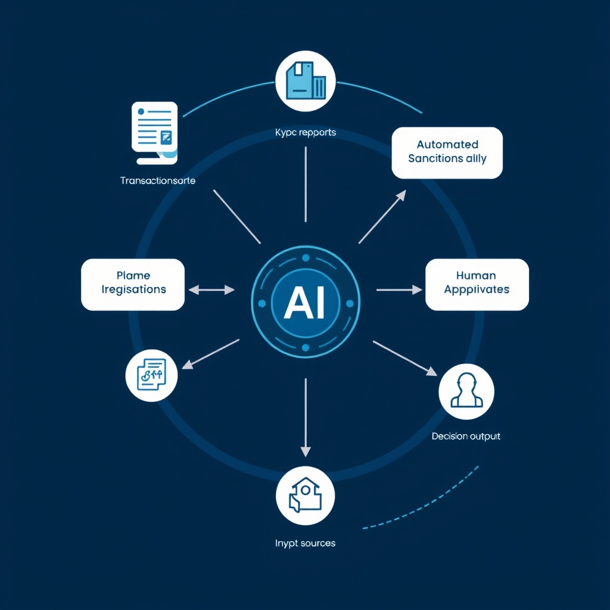
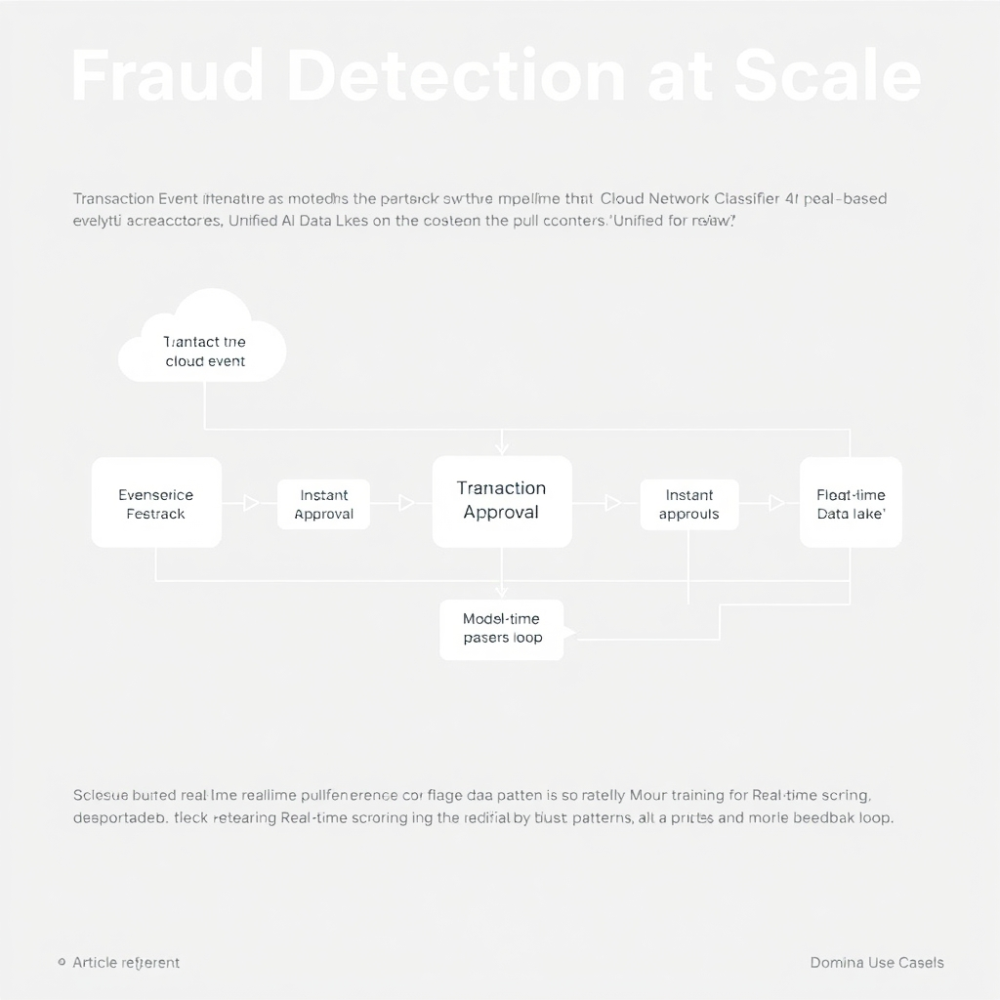
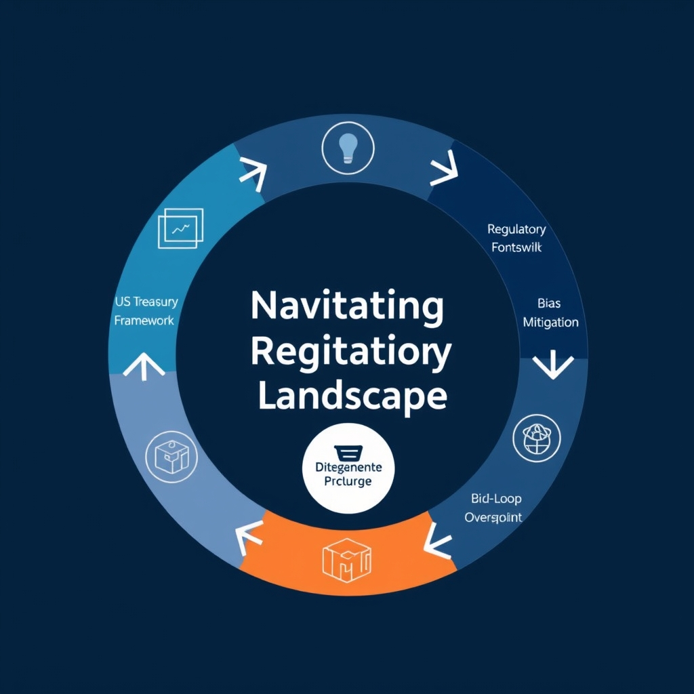

# The State of AI in Finance: From Pilots to Production in 2026

## The New Normal: AI Adoption in 2026

The financial sector has moved beyond the proof‑of‑concept stage that dominated the early 2020s. What were once isolated pilots—such as a language model drafting client memos or a narrow‑scope anomaly detector—are now woven into core processes. Front‑office analysts rely on generative AI to synthesize market commentary, while back‑office teams use AI‑driven bots to reconcile transactions in real time. This integration is reflected in the latest industry survey, which found that **60 % of banking professionals now use generative AI as a work collaborator**[https://www.lexisnexis.com/community/insights/professional/b/industry-insights/posts/how-ai-is-changing-banking] and **63 % of financial institutions have deployed AI agents**[https://www.lexisnexis.com/community/insights/professional/b/industry-insights/posts/how-ai-is-changing-banking] to handle routine tasks.

*AI agents act as autonomous digital assistants, interpreting data and executing tasks while escalating complex issues to human oversight.*

### From pilots to production

- **Embedded workflows:** AI models are no longer sandboxed; they sit inside CRM platforms, trade order systems, and compliance dashboards, triggering actions without manual hand‑off.
- **Continuous learning loops:** Production deployments feed live data back into model retraining pipelines, ensuring that performance improves as market conditions evolve.

### AI agents in daily operations

AI agents—autonomous software entities that can interpret instructions, retrieve data, and execute transactions—have become the digital assistants of the banking floor. Typical use cases include:

- **Automated onboarding:** Agents verify KYC documents, cross‑check sanctions lists, and flag anomalies for human review.
- **Routine reporting:** Daily risk and performance reports are generated and distributed by agents, freeing analysts to focus on interpretation rather than compilation.
- **Customer interaction:** Conversational agents handle routine inquiries, escalating complex issues to human advisors only when necessary.

### A stark contrast to the pre‑2025 era

In 2022‑2024, AI adoption was characterized by fragmented experiments: a handful of banks ran isolated chat‑bot trials, and most fraud‑detection models were still rule‑based. Governance frameworks were nascent, and the cultural perception of AI was one of caution. By 2026, AI is a **foundational operational layer**—standardized APIs, enterprise‑wide model registries, and clear accountability structures have turned what was once a novelty into a predictable, auditable component of daily banking.

## Dominant Use Cases: Fraud Detection at Scale

AI‑driven fraud prevention has become a prominent component of the financial‑services security stack. A market analysis from Future Market Insights—a vendor‑adjacent research firm—states that **AI‑powered fraud prevention software accounts for 57.3% of the fraud‑management solution segment in 2026**【https://www.futuremarketinsights.com/reports/ai-in-fraud-management-market】. This share reflects both the maturity of the technology and the urgency of protecting ever‑larger transaction volumes.

*Modern fraud detection uses cloud-native, event-driven pipelines to score transactions in milliseconds while continuously learning from new data.*

#### Real‑Time, Cloud‑Based Architectures

- **Event‑driven pipelines** – Modern fraud engines ingest transaction events as they occur, applying neural‑network classifiers within milliseconds. Cloud providers supply the elastic compute needed to scale these pipelines during peak periods (e.g., holiday shopping spikes).
- **Unified data lakes** – Consolidating click‑stream, device‑fingerprint, and historical fraud records in a single cloud repository lets models draw on richer context without the latency of cross‑system queries.
- **Serverless inference** – Functions‑as‑a‑Service (FaaS) enables banks to spin up inference endpoints on demand, reducing idle capacity and operational cost.

#### Efficiency Gains from AI‑Driven Models

| Metric                  | Traditional Rule‑Based System | AI‑Powered System (2026)  |
| ----------------------- | ----------------------------- | ------------------------- |
| **Detection latency**   | 2–5 seconds per transaction   | \< 200 ms (potential)     |
| **False‑positive rate** | 12–15%                        | 4–6% (potential)          |
| **Analyst workload**    | 150 alerts/day per analyst    | 30 alerts/day per analyst |

- **Speed** – Real‑time scoring can eliminate batch windows, allowing immediate transaction denial when risk exceeds a dynamic threshold.
- **Accuracy** – Deep‑learning models are able to capture nonlinear patterns that static rules miss, which can reduce false positives by a substantial margin.
- **Cost** – Reduced manual review translates into measurable savings; some mid‑size banks have reported a roughly 20% drop in fraud‑related operational expenses after migrating to an AI platform.

#### Impact on Operational Risk Management

1. **Proactive risk posture** – Continuous model retraining on fresh fraud data keeps detection capabilities ahead of emerging schemes, shifting risk management from reactive to preventive.
1. **Regulatory alignment** – While this section does not cover regulations in depth, the transparency features of many AI models (e.g., SHAP explanations) help institutions satisfy supervisory expectations for model governance.
1. **Business continuity** – Cloud‑native deployments provide built‑in redundancy, ensuring fraud‑detection services remain available even during regional outages.

Overall, the convergence of high market penetration, cloud‑enabled real‑time processing, and measurable efficiency improvements makes fraud detection a flagship use case for AI in finance today.

## Navigating the Regulatory Landscape

### The US Treasury’s 2026 AI Framework

In February 2026 the U.S. Treasury Department released an AI framework for financial services that maps the NIST AI Risk Management Framework (RMF) principles onto **230 operational control objectives** covering the full model lifecycle—data governance, identity resolution, and integration with SOC 2 and the NIST Cybersecurity Framework. This mapping, described in a VerifyWise industry‑blog summary, is intended to give banks, insurers, and asset managers a ready‑to‑implement checklist that aligns AI risk oversight with existing regulatory regimes.

### IOSCO’s Practical Toolkit for AI Supervision

In May 2026 the International Organization of Securities Commissions (IOSCO) issued a **practical toolkit** to help supervisors monitor AI‑driven systems used by regulated entities. The ICMA Group’s regulatory‑tracker notes that the toolkit provides a step‑by‑step methodology for assessing model documentation, validation processes, and ongoing monitoring controls, along with templates for supervisory reporting and guidance on embedding AI oversight into existing prudential frameworks.

### Emphasis on Model Explainability and Bias Mitigation

Regulatory commentary from 2026 highlights **model explainability** and **bias management** as core pillars of AI governance. Supervisors are urging firms to produce clear, auditable explanations for high‑impact decisions—such as credit underwriting or transaction monitoring—so that outcomes can be assessed against fair‑lending and anti‑discrimination statutes. The Treasury framework lists control objectives for “transparent model documentation” and “bias detection mechanisms,” while IOSCO’s toolkit recommends regular bias‑impact assessments and the use of counterfactual analysis to surface hidden disparities.

### Human‑in‑the‑Loop (HITL) Oversight for High‑Risk Models

A consistent theme across 2026 guidance is the **necessity of human‑in‑the‑loop (HITL) oversight** for high‑risk AI applications, including fraud detection, AML screening, and automated investment advice. The Treasury’s control objectives specify “human review checkpoints” at critical decision nodes, and IOSCO’s toolkit outlines a risk‑based approach for determining the frequency and depth of human intervention. In practice, this means AI can flag suspicious activity in real time, but a qualified analyst must validate the alert before any remedial action is taken.

### Putting the Pieces Together

Collectively, the Treasury’s 230‑point control matrix, IOSCO’s supervisory toolkit, and the sector‑wide focus on explainability, bias mitigation, and HITL oversight illustrate a **maturing regulatory ecosystem**. Firms that embed these controls into their AI development lifecycle will not only satisfy compliance checks but also reduce operational risk by ensuring models remain transparent, fair, and subject to human judgment where stakes are highest. Aligning with these foundational documents will be essential for any financial institution seeking to leverage AI in a sustainable, compliant manner.

*Regulatory frameworks provide a structured approach to AI governance, ensuring that model development includes checkpoints for bias, explainability, and human oversight.*

## Overcoming Implementation Hurdles

### Data Quality and Legacy System Integration

Financial institutions still wrestle with fragmented data silos and legacy mainframes that were never designed for AI pipelines. Inconsistent naming conventions, missing timestamps, and legacy batch‑oriented feeds force data engineers to spend up to 70 % of project time on cleansing and schema mapping. A typical workaround is to layer a data‑virtualization layer that normalizes source tables on‑the‑fly, but this adds latency and can obscure provenance, complicating audit trails.

### Security Concerns in Cloud‑Based AI Deployments

Moving fraud‑detection models and credit‑scoring engines to public‑cloud providers introduces attack surfaces that were negligible in on‑prem environments. Misconfigured storage buckets have led to accidental exposure of PII, while container‑orchestrated inference services can become vectors for model‑extraction attacks. Firms now adopt a zero‑trust network architecture, enforce end‑to‑end encryption for model artifacts, and employ hardware‑based attestation (e.g., confidential computing enclaves) to protect inference workloads.

### Roadmap for Balancing Innovation with Governance

1. **Establish a cross‑functional AI governance board** – Include risk, compliance, IT, and business leads to vet model proposals against a risk‑impact matrix.
1. **Implement a staged rollout** – Begin with a sandbox environment, progress to a pilot with limited transaction volume, and only then scale to production after independent model validation.
1. **Automate compliance checks** – Integrate model‑explainability tools (e.g., SHAP, LIME) into CI/CD pipelines to flag bias or drift before deployment.
1. **Document data lineage** – Use metadata catalogs to trace every feature back to its source, satisfying both internal audit and regulator expectations.

### Future Outlook for AI‑Driven Financial Services

As data‑mesh architectures mature and secure‑by‑design cloud services become standard, the friction between rapid AI experimentation and regulatory compliance will diminish. Expect a shift from point‑solutions to platform‑level AI services that embed governance controls natively, enabling banks to deploy adaptive, real‑time models at scale while maintaining the trust of regulators and customers alike.