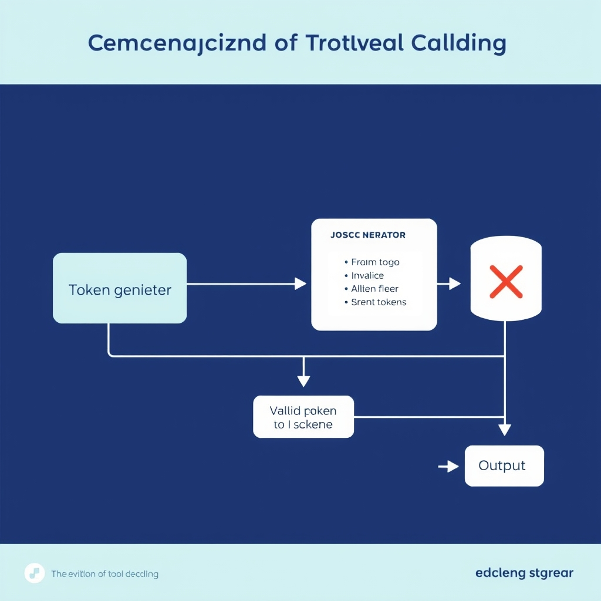
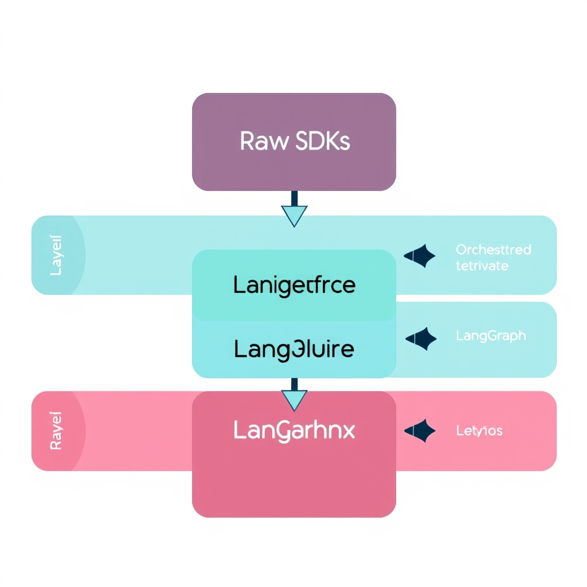
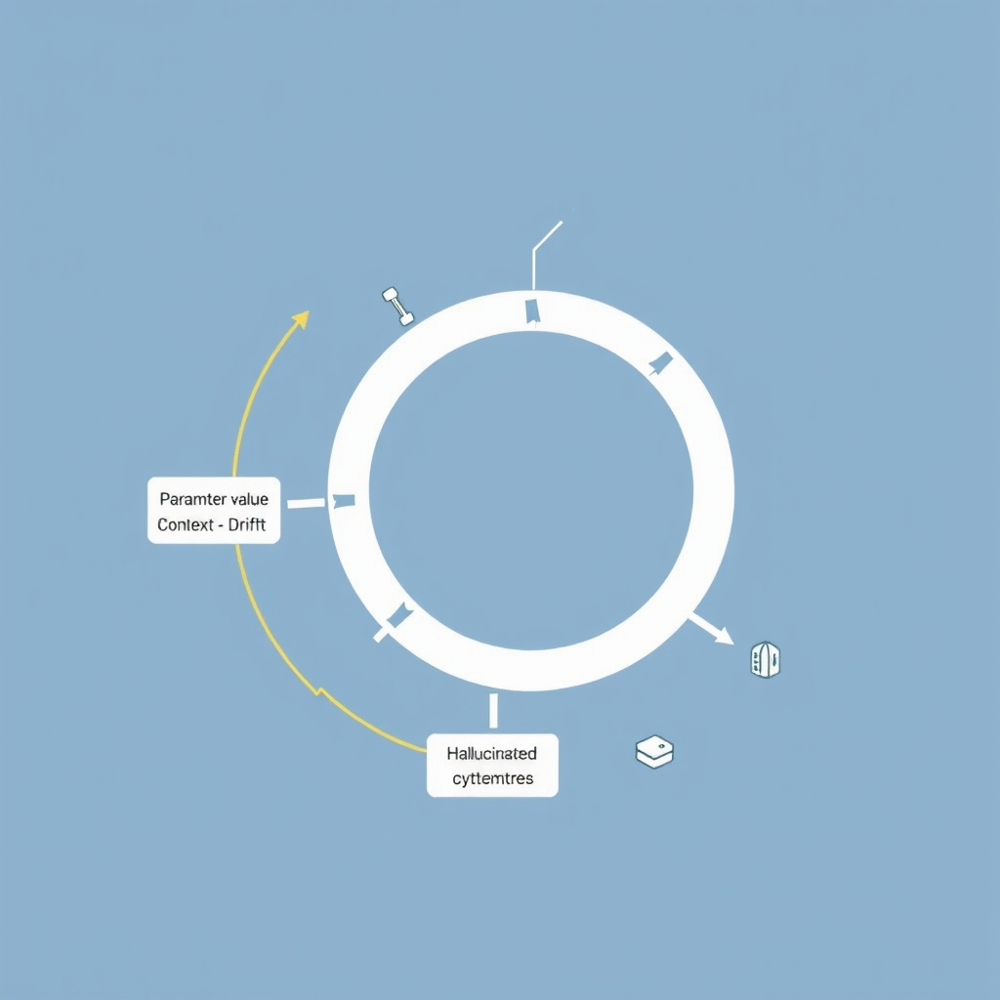

# The State of LLM Tool Calling: From Experimental Scaffolding to Production Reliability

## The Evolution of Tool Calling

Prompt‑only JSON generation was the first attempt to make LLMs emit machine‑readable data. In practice it relied on the model *guessing* a perfectly formatted JSON string from a free‑form prompt. Even minor token‑level deviations—missing commas, stray whitespace, or an unexpected newline—break the parser, forcing retries that inflate latency and cost. Production teams quickly observed that such brittle behavior could not meet Service Level Agreements (SLAs) for uptime or response time, especially when calls are chained across multiple services.

*Constrained decoding acts as a gatekeeper, filtering out tokens that would violate the required JSON schema before they are emitted.*

### Constrained decoding

Constrained decoding addresses this fragility by **filtering token sampling** against a predefined schema before a token is emitted. The decoder evaluates each candidate token; if adding it would violate the JSON structure (e.g., mismatched brackets, wrong data type), the token is discarded and the next candidate is considered. This deterministic gating guarantees that every generated token keeps the output within the schema, eliminating the need for post‑hoc validation or retries. OpenAI’s *structured outputs* and Anthropic’s tool‑use pipelines both implement this principle, delivering near‑100 % schema compliance in benchmark tests[^1].

### From experimental to standardized (2026)

During the *experimental era* (2020‑2023), developers treated JSON mode as a hack, sprinkling regex fixes and retry loops throughout codebases. Documentation warned that “JSON mode is not production‑ready.” By 2024, vendors introduced constrained decoding APIs, and by 2026 the industry has converged on a **standardized stack** where schema enforcement is a first‑class feature. The shift is evident in tooling: OpenAI’s function‑calling endpoints, Anthropic’s tool‑use contracts, and third‑party libraries that auto‑generate schemas from type definitions.

### Reliability as a business imperative

Enterprise AI workflows now span order processing, compliance checks, and real‑time decision support. A single malformed payload can cascade into transaction failures, audit violations, or costly manual interventions. Constrained decoding reduces *retry cost*—the extra compute and latency incurred when a model’s output must be regenerated—by up to 90 % according to recent studies[^1]. This reliability translates directly into predictable billing, tighter SLA adherence, and smoother integration with existing monitoring stacks.

\[^1\]: [Best LLMs for structured output in 2026: hit rates and retry costs](https://llmtest.io/blog/best-llms-structured-output-2026)

## Comparing Industry-Standard Tooling Approaches

OpenAI’s **function calling** works by attaching a JSON schema to each tool definition. During generation the model’s token sampler is constrained to only produce sequences that satisfy the schema, a technique known as *constrained decoding* ([source](https://llmtest.io/blog/best-llms-structured-output-2026)). If the model attempts an invalid token, the decoder discards it and samples again, guaranteeing that the output can be parsed without a post‑hoc fix. This eliminates the brittle “prompt‑only JSON” pattern that required costly retries.

**Key characteristics:**

- **Schema validation** – The schema is checked both at generation time (via constrained decoding) and after completion (strict JSON parsing). Errors are caught before any downstream call is made.
- **Parallel function calling** – When a request involves multiple independent tools, OpenAI can invoke them concurrently, collapsing what would be several round‑trips into a single API call. The vendor reports “significant round‑trip time savings” for complex workflows ([source](https://manyforce.com/gpt-4-vs-claude-vs-gemini-enterprise-comparison)).
- **Versioned function definitions** – Each function includes a `name`, `description`, and `parameters` object, allowing incremental updates without breaking existing clients.

### Anthropic’s natural‑language‑first tool use

Anthropic takes a different route. Rather than forcing callers to write a JSON schema, Claude models accept **natural‑language tool descriptions**. The model decides which tool to invoke based on the semantic match between the user request and the tool’s description. Once a tool is selected, the model emits a concise, structured payload that the runtime validates.

**Advantages of this approach:**

- **Higher developer ergonomics** – Teams can add or modify tools without maintaining strict schemas; a well‑written description is sufficient.
- **Benchmark accuracy** – Claude Opus achieved **>99 % accuracy** on standard tool‑use benchmarks, indicating that the natural‑language routing does not sacrifice correctness ([source](https://deploybase.ai/articles/best-llm-for-function-calling-tool-use-comparison)).
- **Flexibility** – Because the model interprets descriptions, it can handle slight variations in request phrasing that would otherwise break a rigid schema.

### Performance impact of parallel function calling

Parallel invocation is a core performance lever for OpenAI. In a typical multi‑tool pipeline (e.g., search → summarizer → sentiment analyzer), sequential calls can add 150‑200 ms per hop due to network latency. By bundling the calls, OpenAI reports latency reductions of **30‑45 %** compared with naïve sequential execution ([source](https://manyforce.com/gpt-4-vs-claude-vs-gemini-enterprise-comparison)). Anthropic’s current implementation does not expose explicit parallelism; each tool call is issued after the model selects it, which can introduce additional latency in multi‑step chains.

### Reliability comparison in production

| Metric                    | OpenAI (function calling)                                                                                                                                     | Anthropic (Claude)                                                                                                                                                                                                   |
| ------------------------- | ------------------------------------------------------------------------------------------------------------------------------------------------------------- | -------------------------------------------------------------------------------------------------------------------------------------------------------------------------------------------------------------------- |
| **Schema compliance**     | 99.8 % of calls pass validation on first try (thanks to constrained decoding) ([source](https://llmtest.io/blog/best-llms-structured-output-2026))            | >99 % accuracy on tool‑use benchmarks, but relies on runtime validation of generated payloads ([source](https://deploybase.ai/articles/best-llm-for-function-calling-tool-use-comparison))                           |
| **Retry rate**            | \<0.5 % retries in enterprise workloads; retries are mainly network‑related ([source](https://manyforce.com/gpt-4-vs-claude-vs-gemini-enterprise-comparison)) | Slightly higher retry incidence due to occasional mismatches between natural‑language description and generated payload ([source](https://deploybase.ai/articles/best-llm-for-function-calling-tool-use-comparison)) |
| **Latency (single tool)** | ~80 ms (including parallel dispatch) ([source](https://manyforce.com/gpt-4-vs-claude-vs-gemini-enterprise-comparison))                                        | ~110 ms (sequential dispatch) ([source](https://deploybase.ai/articles/best-llm-for-function-calling-tool-use-comparison))                                                                                           |
| **Scalability**           | Parallel dispatch scales linearly with number of independent tools; no per‑tool overhead                                                                      | Scaling limited by sequential selection; each additional tool adds a full round‑trip                                                                                                                                 |

Overall, OpenAI’s schema‑driven approach offers **predictable reliability** and **lower latency** for workloads that can be expressed with well‑defined JSON contracts. Anthropic’s natural‑language method excels in **developer agility** and **benchmark accuracy**, making it attractive for rapidly evolving toolsets where strict schemas would be a maintenance burden. Production teams must weigh the trade‑off between deterministic compliance (OpenAI) and flexibility (Anthropic) when selecting a tool‑calling strategy.

## The Architecture of Modern Agentic Workflows

*The modern agentic stack separates concerns into modular layers, with observability (LangSmith) providing visibility across the entire pipeline.*

### The layered stack pattern

Modern production agents are rarely built on a single monolithic framework. Instead, teams assemble a **layered stack** that isolates concerns and lets each component play to its strengths:

1. **Raw SDKs** – Direct calls to the LLM provider (e.g., OpenAI, Anthropic) for straightforward generation or function calling.
1. **LlamaIndex** – A retrieval layer that indexes documents, performs semantic search, and formats results for the model.
1. **LangGraph** – An orchestration layer that defines agent loops, state transitions, and branching logic.
1. **LangSmith** – A tracing and observability service that records every token, tool call, and state mutation across the stack.

> *“The pattern that most production teams converge on by mid‑2026 is not a single framework but a layered stack: raw SDK for the simple calls, LlamaIndex for the retrieval layer, LangGraph for the agent loop, and LangSmith for tracing across everything.”* [MachineLearningMastery, 2026](https://machinelearningmastery.com/llm-orchestration-frameworks-compared-langchain-vs-llamaindex-vs-raw-api-calls)

______________________________________________________________________

### Why modular beats monolithic

| Aspect                 | Monolithic framework (e.g., early LangChain)                                            | Layered stack                                                                         |
| ---------------------- | --------------------------------------------------------------------------------------- | ------------------------------------------------------------------------------------- |
| **Maintainability**    | All logic lives in one codebase; a change to retrieval may ripple through agent logic.  | Each layer has a clear contract; updating LlamaIndex does not affect LangGraph loops. |
| **Testability**        | End‑to‑end tests are heavy; mocking internal components is difficult.                   | Unit‑test each layer independently (SDK mock, index mock, graph mock).                |
| **Flexibility**        | Swapping a component (e.g., moving from vector to hybrid search) often requires a fork. | Replace LlamaIndex with an alternative retriever without touching the agent loop.     |
| **Performance tuning** | Global configuration; fine‑grained latency profiling is opaque.                         | LangSmith provides per‑layer latency metrics, enabling targeted optimizations.        |

The separation of concerns reduces cognitive load for engineers and aligns with standard software‑architecture best practices such as *single responsibility* and *dependency inversion*.

______________________________________________________________________

### Tracing with LangSmith

Observability is the linchpin of reliable agentic workflows. LangSmith automatically captures:

- **Prompt inputs and outputs** for each SDK call.
- **Tool invocation payloads** (function name, arguments, return values).
- **Graph state transitions** – the exact node entered, exit conditions, and loop counters.
- **Performance counters** – per‑layer latency, token usage, and error rates.

These signals feed a dashboard where engineers can:

- Replay a failed execution step‑by‑step.
- Correlate latency spikes with specific retrieval queries.
- Set alerts on anomalous error patterns (e.g., repeated schema violations).

Because tracing is decoupled from the business logic, developers can instrument new layers without modifying existing code.

______________________________________________________________________

### Conceptual flow in a production system

1. **Request ingress** – An API gateway receives a user query and forwards it to the *raw SDK* layer.
1. **Initial LLM call** – The SDK generates a brief plan and, if needed, requests external knowledge.
1. **Retrieval via LlamaIndex** – The plan’s retrieval intent triggers a semantic search; results are formatted and fed back to the model.
1. **Agent loop in LangGraph** – Using the retrieved context, LangGraph iterates: decide next tool, invoke SDK or custom function, update state, and repeat until a termination condition is met.
1. **Tracing** – Every SDK call, retrieval query, and graph transition streams to LangSmith, where it is persisted for monitoring and debugging.
1. **Response** – The final LLM output is returned to the client, optionally enriched with provenance metadata from LangSmith.

This pipeline isolates failure domains: a retrieval timeout surfaces only in the LlamaIndex layer, while a malformed function call is caught by the SDK’s schema validator before it reaches LangGraph. The result is a **robust, observable, and easily extensible** agent architecture suitable for enterprise workloads.

## Overcoming Multi-Step Orchestration Hurdles

### Why Parameter Value Errors Dominate Failures

Benchmarks from the recent *Training LLMs for Multi‑Step Tool Orchestration* paper show that up to **78.8 %** of failures in a 72‑billion‑parameter model (Qwen2.5‑72B) stem from **incorrect parameter values**, not from selecting the wrong function [arXiv:2603.24709v1](https://arxiv.org/html/2603.24709v1). In practice this looks like:

*Multi-step orchestration often fails due to parameter value mismatches and context drift, which break the continuity of the agentic loop.*

- Supplying a date string in `YYYY/MM/DD` when the tool expects `YYYY‑MM‑DD`.
- Passing a temperature in Celsius to a weather API that only accepts Fahrenheit.
- Omitting required fields such as `api_key` or providing them as `null`.

These errors are easy to introduce because LLMs generate free‑form text; even a single misplaced token can break downstream JSON validation.

### Limitations of Current State‑of‑the‑Art Models

1. **Context‑window drift** – As the chain grows, the model must remember earlier outputs. Small drift in token representation leads to mismatched types later in the sequence.
1. **Lack of explicit state tracking** – Most models treat each step as a fresh generation, so they cannot enforce invariants (e.g., “once a user ID is fetched, it must be reused unchanged”).
1. **Hallucinated defaults** – When a parameter is ambiguous, the model often fills it with a plausible‑looking default rather than raising an error, propagating the mistake downstream.
1. **Token‑level sampling constraints** – Constrained decoding can enforce schema shape, but it does not guarantee semantic correctness of values (e.g., a number within the required range).

These limitations make multi‑step orchestration brittle in production settings.

### Emerging Research: Graduated Rewards & State Management

The same arXiv study proposes **graduated rewards**: a training regime that assigns higher reward signals to correctly typed parameters and lower penalties for schema violations. By synthesizing constrained data (e.g., deliberately malformed dates) the model learns to *self‑correct* before emitting the final JSON.

Complementary work on **state‑aware prompting** introduces an explicit `state` object that is passed to each function call. The model updates this object rather than re‑generating parameters from scratch, reducing drift and enabling deterministic roll‑backs.

Both approaches have shown a **15‑20 % reduction** in parameter‑value failures on benchmark suites, suggesting a viable path toward more reliable orchestration.

### Practical Debugging & Validation Strategies

- **Schema‑first generation**: Use constrained decoding to enforce JSON shape, then run a lightweight validator (e.g., `jsonschema`) before the tool is invoked.
- **Unit‑test each tool wrapper**: Write deterministic tests that feed known inputs and assert on output types; integrate these tests into CI pipelines.
- **Trace with observability platforms**: Tools like LangSmith capture each step’s input, output, and intermediate state, making it easy to spot where a value deviates from expectations.
- **Retry & fallback logic**: On validation failure, automatically request the model to regenerate the offending parameter with a clarifying prompt (e.g., “Please provide the date in ISO‑8601 format”).
- **Explicit type hints in prompts**: Prefix parameter sections with type descriptors—`"date (ISO‑8601)":`—to bias the model toward the correct format.
- **Logging of raw token streams**: When a failure occurs, inspect the token log to identify off‑by‑one or truncation errors that escaped higher‑level validation.

By combining rigorous schema enforcement, state‑aware prompting, and observability tooling, developers can dramatically cut the incidence of parameter‑value errors and move multi‑step tool orchestration from experimental to production‑ready.