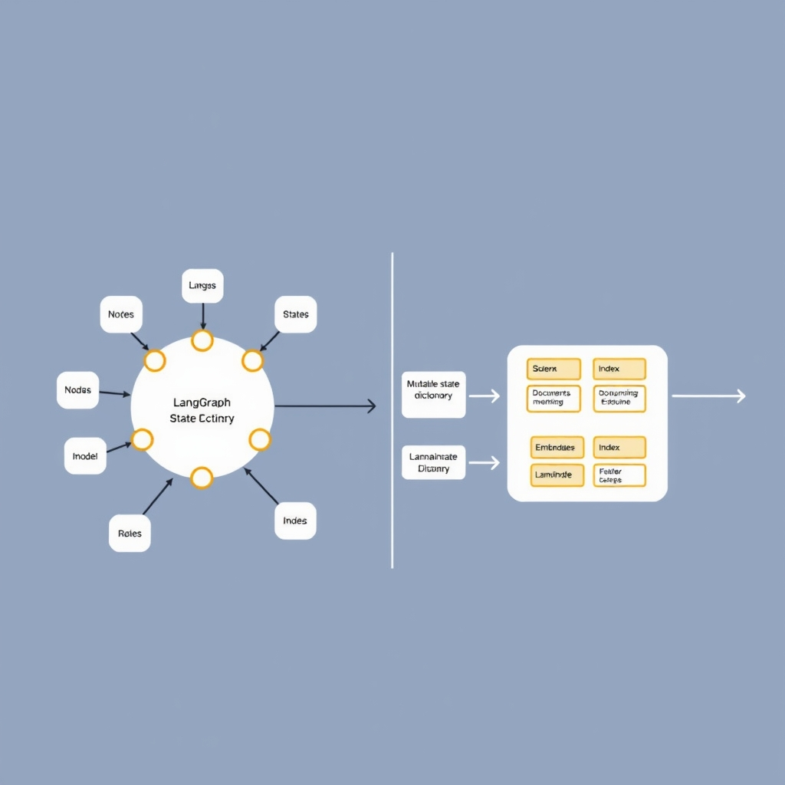
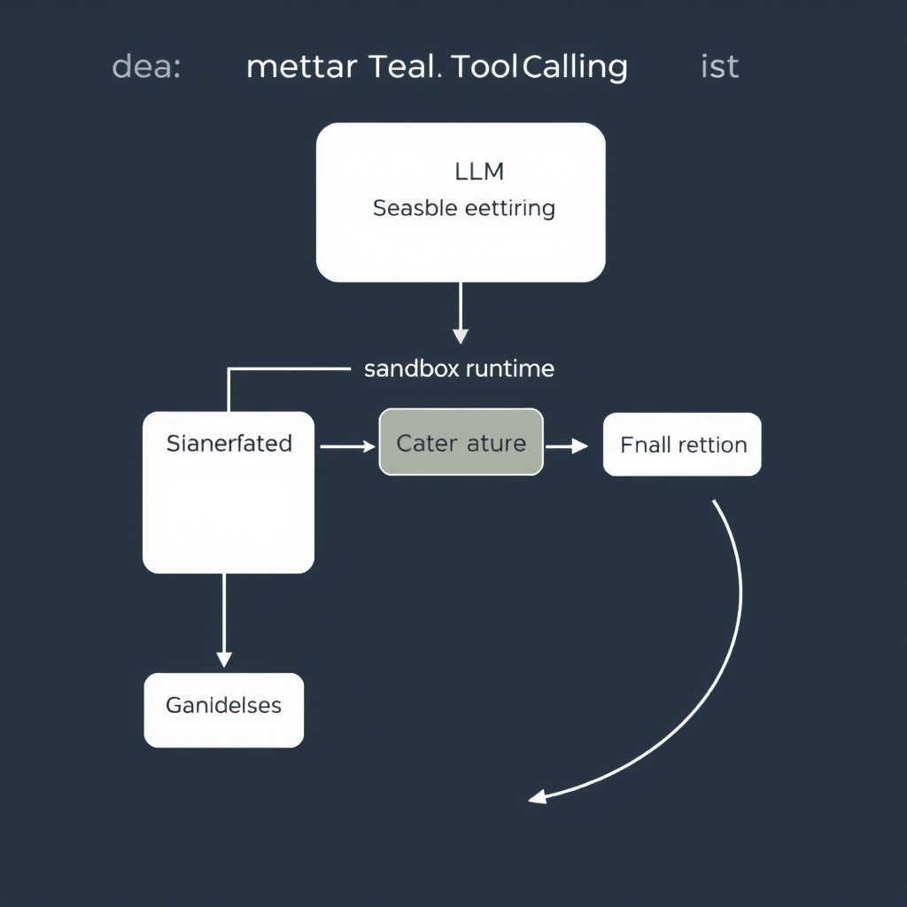
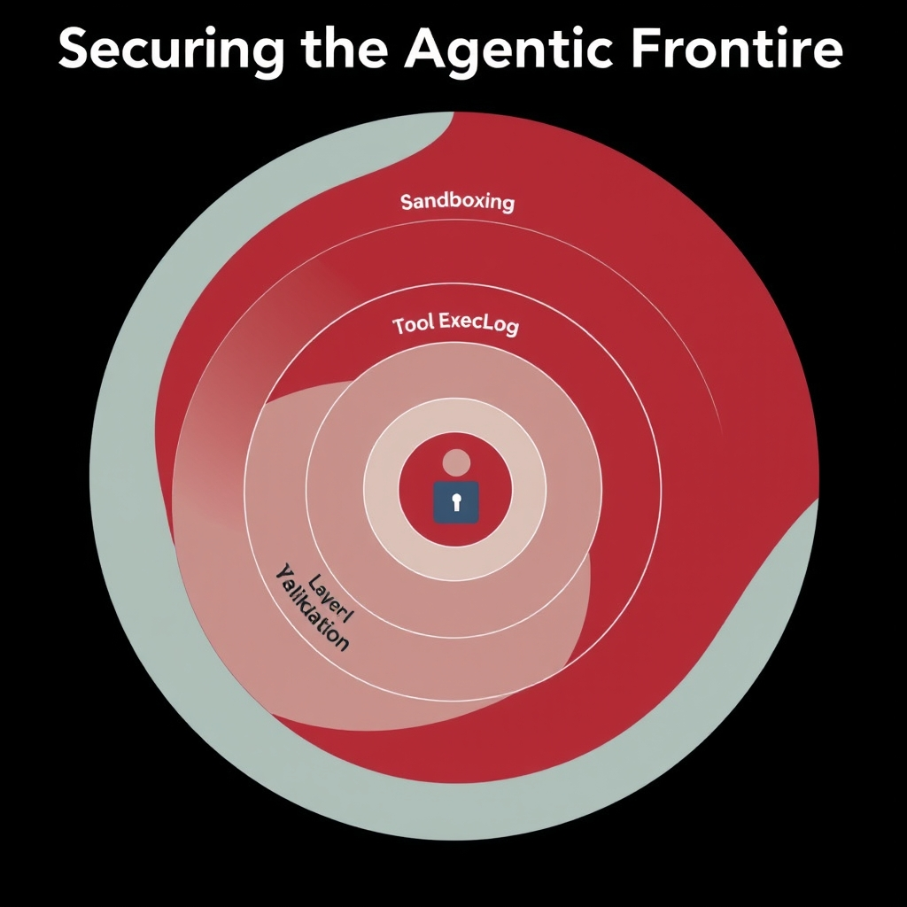

# The State of LLM Tool Calling: From Simple APIs to Stateful Agents

## The Evolution of Agentic Orchestration

The early days of LLM tool calling were dominated by *single-shot* API invocations: a prompt would request a function, the model would emit a JSON payload, and the surrounding application would execute the call. This pattern works for isolated tasks—e.g., fetching the current weather—but it quickly hits limits when the problem requires **sequencing**, **branching**, or **conditional retries**. Modern agents must stitch together dozens of tool calls, preserve intermediate results, and adapt their plan based on feedback. The shift from a stateless request/response model to a **stateful, multi‑step orchestration layer** is now the norm.


*LangGraph uses a mutable state dictionary for complex decision-making, while LlamaIndex focuses on data-centric transformation pipelines.*

### LangGraph vs. LlamaIndex Workflows

Two frameworks illustrate how the community has converged on distinct orchestration philosophies. **LangGraph** (the evolution of LangChain for production‑grade agents) treats the agent’s state as a **typed dictionary** that flows through a directed graph of nodes. Each node can read, mutate, or augment the dictionary, enabling deterministic propagation of context across steps. This design excels at **complex, conditional logic** where the same tool may be invoked multiple times with evolving parameters.

In contrast, **LlamaIndex Workflows** adopt a **data‑centric** approach. The framework emphasizes retrieval‑augmented generation (RAG) pipelines, where documents and embeddings are the primary carriers of state. Workflows are built around **data transformations**—splitting, indexing, and re‑ranking—rather than explicit mutable dictionaries. While LlamaIndex can also express multi‑step agents, its strength lies in **information‑driven** pipelines where the state is largely immutable data structures.

Both approaches have overlapping capabilities, but the choice often hinges on the problem domain: LangGraph for **procedural, decision‑heavy** agents; LlamaIndex for **retrieval‑heavy** pipelines. (Source: [LangChain vs LlamaIndex 2026 Comparison](https://www.premai.io/blog/langchain-vs-llamaindex-2026-complete-production-rag-comparison))

### Why Persistent State Matters

Persistent state enables agents to **remember** prior tool outputs, user preferences, and intermediate reasoning traces. Without it, each step would have to reconstruct context from scratch, inflating token usage and increasing the chance of inconsistency. Stateful dictionaries allow:

- **Incremental reasoning**: the model can reference earlier decisions when selecting the next tool.
- **Error recovery**: failed calls can be retried with adjusted parameters while preserving successful results.
- **Auditability**: a complete state snapshot provides a reproducible record for debugging and compliance.

These benefits are especially critical in production settings where latency, cost, and reliability are tightly coupled.

### The Rise of Small, Efficient Models

Benchmark studies from 2026 show that **compact models** such as **Qwen‑3.5 4B** and **Nemotron Nano 4B** now achieve pass rates above 95 % on tool‑calling evaluations, sometimes surpassing larger counterparts on specific agentic tasks. Their lower memory footprint and higher token throughput make them ideal for **edge deployments** and **high‑throughput orchestration**, where the overhead of maintaining state must be balanced against compute constraints. (Source: [Local LLM Tool‑Calling Eval 2026](https://www.jdhodges.com/blog/local-llms-on-tool-calling-2026-pt1-local-lm))

In summary, the evolution from simple API calls to stateful orchestration has reshaped the LLM tool‑calling landscape. LangGraph’s mutable dictionary and LlamaIndex’s data‑centric workflows represent the two leading paradigms, both of which rely on persistent state to manage complexity. Meanwhile, the emergence of efficient 4‑B‑class models democratizes production‑grade agents, allowing developers to build sophisticated, cost‑effective pipelines.

## Programmatic Tool Calling: Offloading Logic

### Defining programmatic tool calling

Programmatic tool calling is the practice of letting an LLM emit executable code—typically JavaScript or Python—that orchestrates external tools on the model's behalf. Instead of returning a static JSON payload that the host runtime must interpret, the model produces a self‑contained script that:

- Invokes multiple APIs or functions in parallel.
- Performs intermediate transformations (e.g., data aggregation, filtering) outside the model's token window.
- Returns a concise result that the host can inject back into the conversation.

The primary benefit is **context‑window economy**. By moving heavy‑weight data processing into a sandboxed runtime, the model only needs to reason about *what* to do, not *how* to shuffle large payloads. This reduces token consumption and speeds up end‑to‑end latency, especially when dealing with gigabytes of raw data or dozens of parallel calls.

______________________________________________________________________

### Orchestrating parallel calls with JavaScript or Python

Modern LLMs (e.g., GPT‑5.6) can generate JavaScript that leverages `Promise.all` to fire several tool calls simultaneously. A Python equivalent uses `asyncio.gather`. Below is a minimal JavaScript example that the model might emit to retrieve weather data from two providers and then compute an average:

```javascript
// Generated by the LLM
async function fetchAndAverage(location) {
  const urls = [
    `https://api.weather1.com/v1/current?city=${location}`,
    `https://api.weather2.com/v1/current?city=${location}`
  ];
  const responses = await Promise.all(urls.map(u => fetch(u).then(r => r.json())));
  const temps = responses.map(r => r.temperature);
  const avg = temps.reduce((a, b) => a + b, 0) / temps.length;
  return {location, averageTemperature: avg};
}

fetchAndAverage('San Francisco').then(console.log);
```

In a Python‑centric stack the same logic looks like:

```python
import asyncio, httpx

async def fetch(url):
    async with httpx.AsyncClient() as client:
        resp = await client.get(url)
        return resp.json()

async def fetch_and_average(city: str):
    urls = [
        f"https://api.weather1.com/v1/current?city={city}",
        f"https://api.weather2.com/v1/current?city={city}"
    ]
    results = await asyncio.gather(*[fetch(u) for u in urls])
    temps = [r["temperature"] for r in results]
    avg = sum(temps) / len(temps)
    return {"city": city, "avg_temp": avg}

# Example execution
if __name__ == "__main__":
    print(asyncio.run(fetch_and_average("Berlin")))
```

These snippets illustrate two key patterns:

1. **Parallelism** – multiple I/O‑bound calls are launched without waiting for each to finish sequentially.
1. **Post‑processing outside the LLM** – the averaging logic runs in the sandbox, not in the model's prompt.

______________________________________________________________________

### Shifting the model’s focus to judgment

When the heavy lifting is delegated to generated code, the LLM can concentrate on higher‑order decisions:

- **Tool selection** – deciding *which* APIs are relevant for a user query.
- **Parameter synthesis** – crafting the minimal set of arguments needed for each call.
- **Result interpretation** – applying domain knowledge to the aggregated output and producing a final answer.

Because the model no longer needs to embed large JSON payloads or intermediate tables in its response, it can allocate more of its limited context to reasoning steps, chain‑of‑thought prompts, or safety checks. This aligns with the observation from OpenAI’s August 2026 release that “the model is left to focus on what requires intelligence: applying judgment” [OpenAI Release Notes – August 2026](https://releasebot.io/updates/openai).

______________________________________________________________________

### Conceptual execution flow

1. **User query** arrives at the LLM.
1. **Prompt** instructs the model to emit a script that calls the necessary tools.
1. **Model output** → code block (JavaScript/Python).
1. **Host runtime** validates the script (static analysis, allow‑list checks) and executes it in an isolated sandbox.
1. **Tool calls** happen in parallel; results are collected.
1. **Post‑processing** inside the sandbox produces a compact payload.
1. **Payload** is fed back to the LLM (or directly to the user) for final answer generation.

This pipeline decouples *orchestration* from *reasoning*, enabling production‑grade agents to scale across many tools while keeping token usage predictable and security boundaries clear.


*Programmatic tool calling offloads execution logic to a sandboxed runtime, allowing the LLM to focus on high-level judgment.*

## Observability and Span-Level Evaluation

### Contrast: Final‑Output Evaluation vs. Span‑Level Observability

Traditional LLM assessments often reduce an agent's performance to a single metric—did the final answer match the ground truth? While simple, this approach masks failures that occur deep in the execution trace, such as selecting the wrong tool or passing malformed parameters. Span‑level observability, by contrast, records each discrete interaction (tool call, retrieval, reasoning step) and scores it independently. As Confident AI notes, *"effective evaluation of agentic tool calling requires span‑level scoring that assesses individual tool selection, parameter accuracy, and reasoning coherence rather than just final output"*【https://www.confident-ai.com/knowledge-base/compare/best-llm-evaluation-tools-for-ai-agents】.

| Evaluation Dimension    | Final‑Output Only     | Span‑Level Observability             |
| ----------------------- | --------------------- | ------------------------------------ |
| Tool selection accuracy | Not measured          | Directly scored per call             |
| Parameter correctness   | Implicit (via output) | Explicit validation of each argument |
| Reasoning coherence     | Inferred from answer  | Traced across multiple steps         |
| Debugging insight       | Low                   | High (step‑by‑step trace)            |

### Scoring Individual Tool Selection and Parameter Accuracy

1. **Tool selection** – Assign a binary or probabilistic score indicating whether the chosen function matches the intent inferred from the user query. For example, a weather‑query agent should select `get_current_weather` rather than `search_documents`.
1. **Parameter fidelity** – Compare the model‑generated arguments against a schema (e.g., JSON schema) and penalize mismatches. A missing `location` field or an out‑of‑range temperature unit (`Fahrenheit` vs. `Celsius`) reduces the span score.
1. **Aggregated trace score** – Combine per‑span scores using a weighted average (e.g., 0.5 for tool selection, 0.3 for parameters, 0.2 for reasoning) to produce a holistic trace quality metric.

### Tracing Reasoning Coherence Across Multiple Steps

Coherence is measured by linking the logical chain that leads from the initial user prompt to each subsequent tool invocation. Techniques include:

- **Dependency graphs** that map which prior spans inform the current decision.
- **Semantic similarity** between the model's internal rationale (often emitted as a `thought` field) and the expected reasoning pattern.
- **Temporal consistency checks** ensuring that state updates (e.g., a cumulative total) remain monotonic unless explicitly reset.

A concrete example: an itinerary‑planning agent first calls `search_flights`, then `lookup_hotel`, and finally `calculate_total_cost`. Span‑level evaluation verifies that the hotel search respects the dates returned by the flight search and that the final cost aggregates both components correctly. Any deviation—such as using a mismatched date range—triggers a coherence penalty.

### Role of Observability Tools in Debugging Agentic Loops

Observability platforms (e.g., OpenTelemetry, LangChain‑Tracer) ingest span data and expose dashboards where engineers can:

- **Filter by error type** (e.g., parameter validation failures) to spot systemic issues.
- **Replay traces** to reproduce bugs in a sandboxed environment.
- **Correlate latency** with tool performance, identifying bottlenecks that may affect downstream reasoning.

By integrating these tools into the development pipeline, teams gain actionable insights that go beyond pass/fail final‑output tests, enabling iterative refinement of both the LLM prompting strategy and the underlying tool implementations.

In sum, moving from monolithic output evaluation to fine‑grained, span‑level observability equips practitioners with the metrics needed to certify production‑grade agents, diagnose failures early, and continuously improve the orchestration logic.

## Securing the Agentic Frontier

### Strict Input Validation

Every tool call generated by an LLM must be treated as untrusted input. Before any function is invoked, the system should verify that:

- **Parameter types match the schema** (e.g., a numeric ID is not a string containing SQL).
- **Values fall within allowed ranges** (e.g., timestamps are not in the distant past or future).
- **No injection vectors are present** (e.g., escaping characters in shell commands).

A practical pattern is to deserialize the LLM's JSON payload into a strongly‑typed DTO and run it through a validation library such as `pydantic` (Python) or `zod` (JavaScript). If validation fails, the model receives a concise error message and can retry with corrected arguments. This defensive gate prevents accidental or malicious execution of malformed calls, a core recommendation from the security guide[^1].

### Allowlist‑Based Function Execution

Rather than exposing an entire codebase to the model, define an explicit **allowlist** of callable functions. Each entry includes:

1. **Function name** – the exact identifier the LLM may request.
1. **Signature** – accepted parameter names and types.
1. **Permission level** – whether the call is safe for autonomous execution or requires additional checks.

When a request arrives, the orchestrator checks the function name against the allowlist. If the name is absent, the call is rejected outright. This approach eliminates the risk of the model discovering or inventing new entry points, aligning with the best‑practice of “use allowlists for permitted functions and parameters”[^1].

### Sandboxing Execution Environments

Even with validation and allowlists, the code that runs the tool may still have bugs or unexpected side effects. Running each tool call inside a **sandbox** limits the blast radius:

- **Container isolation** – spin up a lightweight Docker container with a minimal OS image and drop all unnecessary capabilities (`--cap-drop ALL`).
- **Filesystem restrictions** – mount only the directories required for the tool (e.g., `/tmp` for temporary files) using read‑only bindings where possible.
- **Network egress control** – block outbound traffic unless the tool explicitly needs it, enforced via firewall rules or container network policies.

If a tool attempts to exceed its sandbox, the container runtime terminates the process, and the orchestrator logs the violation for later analysis. This mirrors the recommendation to “sandbox tool execution with minimal privileges”[^1].

### Human‑In‑The‑Loop for Sensitive Operations

Certain actions—such as modifying production databases, sending emails to external recipients, or triggering financial transactions—carry high risk. For these, the system must enforce a **human‑in‑the‑loop (HITL)** checkpoint:

1. **Flag the request** based on a sensitivity matrix (e.g., any call to `update_user_balance`).
1. **Present a concise summary** to an authorized operator, including the intended function, parameters, and the model’s confidence.
1. **Require explicit approval** (e.g., a button click or signed token) before the orchestrator proceeds.

The HITL step not only adds a safety net but also creates an audit trail linking the model’s suggestion to the human decision, satisfying compliance requirements for critical workflows.

______________________________________________________________________

By combining rigorous input validation, a tight allowlist, sandboxed execution, and mandatory human oversight for high‑impact calls, production‑grade LLM agents can operate safely at scale. These layers of defense are essential to mitigate the attack surface introduced by autonomous tool calling, as outlined in the Sourcery security category on insecure tool calls[^1].

\[^1\]: Insecure Tool Use & Function Calls | Security Categories. https://www.sourcery.ai/security/categories/insecure_tool_calls


*A defense-in-depth approach ensures that even if one layer is bypassed, the system remains protected against unauthorized tool execution.*