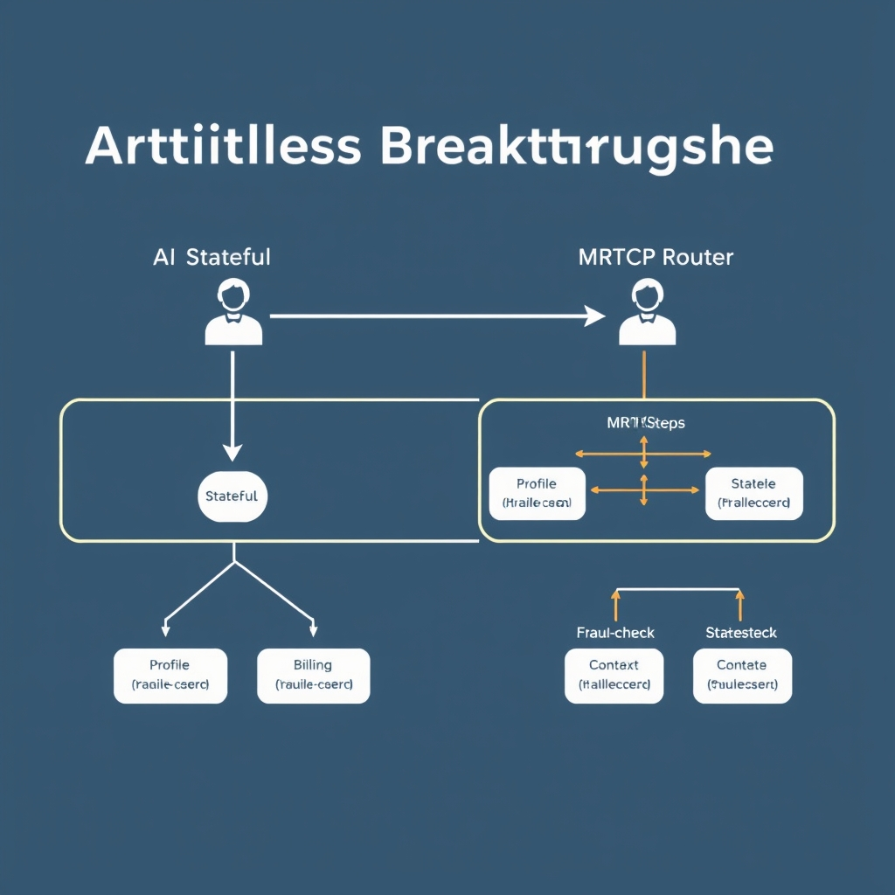
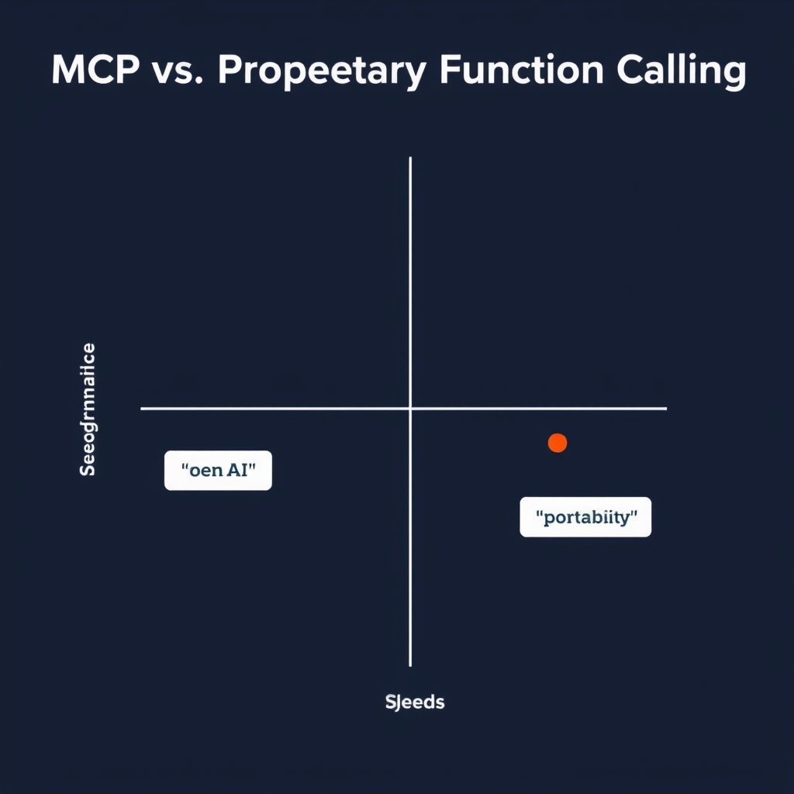
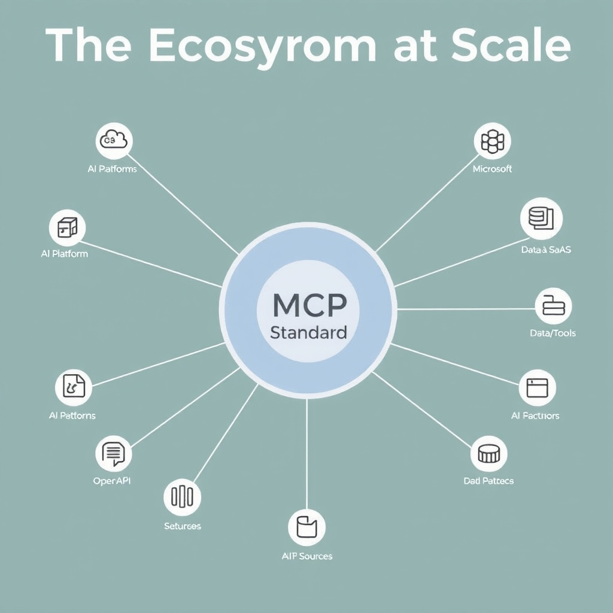

# The State of MCP: How the Model Context Protocol is Standardizing AI Tooling

## The Evolution of MCP: From Anthropic to the Linux Foundation

The Model Context Protocol (MCP) began as a tightly‑held research effort inside Anthropic, designed to let its own models invoke external tools without exposing a public API. By late 2025, Anthropic recognized that the value of a common, open protocol far outweighed the competitive advantage of keeping it proprietary. In December 2025 the company **donated MCP to the newly formed Agentic AI Foundation**, which operates under the umbrella of the **Linux Foundation**. This hand‑off transformed MCP from a single‑vendor experiment into a community‑driven standard, with its specification now maintained by a neutral technical steering committee.

### Why vendor‑neutrality matters

- **Enterprise risk reduction** – Companies can adopt MCP without fearing sudden API deprecation or price hikes tied to a single provider.
- **Portability** – Agents built on MCP can be moved across cloud providers or on‑premise deployments with only configuration changes, preserving investment in tooling and training data.
- **Ecosystem growth** – A neutral protocol invites contributions from a broad set of stakeholders, accelerating feature development and integration with emerging AI services.

### Linux Foundation governance and long‑term stability

The Linux Foundation’s proven governance model brings several safeguards:

1. **Transparent decision‑making** – All protocol changes are discussed publicly, with documented proposals and community voting.
1. **Sustainable funding** – Membership dues and corporate sponsorships ensure continuous resources for specification maintenance, test suites, and reference implementations.
1. **Legal protection** – The foundation’s open‑source licensing framework shields adopters from patent traps and ensures that the protocol remains royalty‑free.

Together, the donation to the Agentic AI Foundation and the Linux Foundation’s stewardship give MCP the credibility and durability needed for enterprise‑scale AI orchestration. As a result, organizations can rely on a **vendor‑neutral, stateless, and community‑governed** backbone for building complex, agentic AI systems.

*Source: [Everything your team needs to know about MCP in 2026](https://workos.com/blog/everything-your-team-needs-to-know-about-mcp-in-2026)*

## Architectural Breakthroughs: The July 2026 Specification

### Stateless Core: Eliminating Handshakes and Sessions

The July 2026 MCP specification replaces the traditional stateful handshake model with a **stateless protocol core**. In practice, each request carries all the context required for processing, removing the need for persistent sessions between agents and the MCP router. This design simplifies client implementations: developers no longer need to manage connection lifecycles or worry about session expiration. It also reduces server‑side memory pressure, because the router does not retain per‑client state between calls.

*The July 2026 specification shifts MCP to a stateless core, allowing agents to perform complex workflows through independent, context-rich round trips.*

Statelessness aligns MCP with HTTP‑like semantics, enabling existing load balancers and reverse proxies to handle traffic without custom session‑affinity logic. For enterprises that already operate at massive scale, this translates directly into lower operational overhead and easier horizontal scaling.

> *“The 2026‑07‑28 Model Context Protocol specification is out, bringing a stateless protocol core…"* [[source]](https://blog.modelcontextprotocol.io/posts/2026-07-28)

______________________________________________________________________

### Multi Round‑Trip Requests (MRTR): Enabling Complex Agent Workflows

One of the most significant additions is **Multi Round‑Trip Requests (MRTR)**. MRTR lets an agent split a logical operation into a series of dependent calls while preserving a single logical transaction. For example, a customer‑service bot can:

1. Retrieve a user’s profile.
1. Query a billing service for the latest invoice.
1. Invoke a third‑party fraud‑check API.
1. Assemble a final response.

Because each step is a separate HTTP‑like request, the agent can parallelize independent calls, retry only the failing leg, and still maintain a coherent overall workflow. The stateless core ensures that intermediate results are passed explicitly via request headers or payloads, avoiding hidden server‑side state.

MRTR also reduces latency for deep reasoning tasks. Instead of a monolithic function that must block until every sub‑task finishes, an agent can stream partial results back to the client after each round‑trip, improving perceived responsiveness.

______________________________________________________________________

### Header‑Based Routing & Cacheable List Results: Performance Boosts

The specification introduces **header‑based routing**, where routing decisions are made solely on request metadata (e.g., `X-MCP-Target`, `X-MCP-Version`). This eliminates the need for body inspection, allowing edge routers to forward traffic at line speed. In high‑throughput environments, this can shave milliseconds off each hop, which compounds across millions of requests per day.

Coupled with **cacheable list results**, MCP now permits servers to mark list‑type responses (e.g., a catalog of available tools) as cache‑friendly using standard HTTP cache headers (`Cache‑Control`, `ETag`). Clients can reuse these lists across multiple MRTR cycles without re‑fetching, dramatically cutting bandwidth and reducing load on backend registries.

A concrete scenario: an enterprise AI platform that dynamically discovers available data connectors. The first request fetches the connector list (cached for 5 minutes). Subsequent MRTR cycles reuse the cached list, allowing the platform to focus compute resources on the actual data retrieval rather than repeated discovery.

______________________________________________________________________

### Enterprise‑Scale Implications

Together, these architectural changes make MCP a natural fit for large‑scale deployments:

- **Horizontal Scalability** – Stateless nodes can be added or removed without session rebalancing, enabling auto‑scaling groups in Kubernetes or serverless environments.
- **Resilience** – Failure of a single node does not corrupt ongoing transactions because no state is stored locally; retries are simply new MRTR calls.
- **Operational Simplicity** – Header‑based routing integrates with existing API gateways (Envoy, Kong) without custom plugins, and cacheable list results reduce external service chatter.
- **Cost Efficiency** – Lower memory footprints and reduced network chatter translate into measurable cost savings on cloud infrastructure.

By addressing the core pain points of earlier, stateful AI orchestration layers—session management, latency, and scaling complexity—the July 2026 MCP specification positions the protocol as the de‑facto backbone for modern, enterprise‑grade agentic AI systems.

> *“…adding support for Multi Round‑Trip Requests (MRTR) and header‑based routing, cacheable list results, authorization hardening, a formal extensions framework, and updated Tier 1 SDKs."* [[source]](https://blog.modelcontextprotocol.io/posts/2026-07-28)

## MCP vs. Proprietary Function Calling

### Portability vs. Raw Speed

MCP’s defining characteristic is its **vendor‑neutral protocol**. Because the request and response formats are standardized and stateless, the same MCP payload can be routed to any compliant model—Claude, Gemini, Llama, or emerging open‑source alternatives—without code changes. In contrast, OpenAI’s proprietary function calling is tightly coupled to the **OpenAI stack** (GPT‑4o, Assistants API). The integration points are baked into the SDKs, and the payload schema is specific to OpenAI’s runtime. This yields **lower latency** and **higher throughput** when the entire pipeline lives inside OpenAI’s cloud, but it sacrifices the ability to switch providers without a rewrite.

*Choosing between MCP and proprietary function calling involves balancing the need for rapid, ecosystem-specific performance against the long-term benefits of vendor-neutral portability.*

> *“MCP wins when you need vendor‑neutral portability and a growing cross‑model ecosystem; OpenAI function calling wins when you need the fastest path to production on GPT‑4o or the Assistants API.”* – [Kunal Ganglani, 2026][1]

### Ecosystem Lock‑In vs. Universal Interoperability

| Aspect                  | MCP                                                                                                                                   | OpenAI Function Calling                                                                                           |
| ----------------------- | ------------------------------------------------------------------------------------------------------------------------------------- | ----------------------------------------------------------------------------------------------------------------- |
| **Lock‑in risk**        | Minimal – any MCP‑compliant server can replace another, preserving investments in tooling and orchestration.                          | High – switching away requires re‑implementing function schemas and possibly redesigning the orchestration layer. |
| **Interoperability**    | Built‑in header routing and cacheable list results let diverse services (databases, SaaS APIs, custom tools) speak the same language. | Limited to OpenAI‑hosted functions; external services must be wrapped in OpenAI‑specific adapters.                |
| **Community support**   | Growing cross‑vendor ecosystem, with over 15 k public servers (see next section).                                                     | Concentrated around OpenAI’s developer community and official SDKs.                                               |
| **Performance ceiling** | Dependent on the chosen model and network latency; benefits from stateless caching.                                                   | Optimized for OpenAI’s internal infrastructure, often delivering sub‑millisecond function dispatch.               |

The trade‑off is clear: **MCP trades raw speed for flexibility**, while OpenAI’s approach trades flexibility for the fastest possible execution within its own environment.

### When to Choose MCP

- **Multi‑model orchestration** – Your workflow needs to invoke Claude for reasoning, Gemini for vision, and a fine‑tuned Llama model for domain‑specific tasks. MCP lets you swap models on the fly.
- **Regulatory or compliance constraints** – Certain jurisdictions require data to stay within specific clouds; MCP’s stateless routing lets you direct calls to compliant endpoints.
- **Long‑term cost predictability** – By avoiding vendor lock‑in, you can negotiate pricing across multiple providers and avoid sudden rate hikes.

### When to Choose OpenAI Function Calling

- **Time‑to‑market pressure** – If you are building a prototype that must launch within weeks, leveraging OpenAI’s ready‑made function calling reduces integration effort.
- **Performance‑critical paths** – Real‑time assistants (e.g., voice agents) that need sub‑second response times benefit from OpenAI’s tightly integrated dispatch.
- **Deep OpenAI feature set** – Features like the Assistants API’s built‑in memory and tool usage are only exposed through OpenAI’s proprietary calls.

### Decision Framework

1. **Assess portability needs** – If your product roadmap envisions model diversification, start with MCP.
1. **Measure latency tolerance** – Benchmark the critical path; if sub‑millisecond latency is non‑negotiable, OpenAI may be the pragmatic choice.
1. **Evaluate lock‑in cost** – Quantify the engineering effort required to migrate away from a vendor; high migration cost favors MCP.
1. **Consider ecosystem maturity** – For early‑stage projects, the richer OpenAI tooling may outweigh MCP’s broader reach.

By mapping these criteria to your organization’s priorities, you can make an informed choice between a **portable, interoperable MCP stack** and the **speed‑optimized, vendor‑specific OpenAI function calling**.

## The Ecosystem at Scale

Since the July 2026 release, the Model Context Protocol (MCP) has crossed the **15,000‑public‑server** threshold, a milestone that signals true ecosystem maturity[3]. The latest registry scan reports **15,930** active MCP endpoints spread across four major public registries, up from just a few hundred a year earlier[3]. This rapid expansion reflects both community‑driven adoption and strategic investment from cloud providers.

*MCP solves the N×M integration nightmare by providing a unified interface, allowing any platform to connect to any tool without custom adapters.*

### Platform support at the enterprise level

- **Google Cloud** – integrated MCP into Vertex AI Agents, allowing developers to invoke any MCP‑compatible tool with a single API call.
- **Microsoft Azure** – embedded MCP in Azure OpenAI Service, exposing the protocol as a first‑class feature for Azure Functions and Logic Apps.
- **Amazon Web Services (AWS)** – rolled out MCP support in Bedrock agents, enabling seamless orchestration of Lambda functions and SageMaker pipelines.
- **OpenAI** – while not a cloud platform, OpenAI’s own agent stack now ships with native MCP bindings, completing the cross‑vendor coverage.

These integrations are documented in the industry update that recorded the server count, confirming that the four giants have **built MCP directly into their agent stacks**[3].

### Impact of a unified interface

The core value proposition of MCP is its **one‑to‑many** connectivity model: a single MCP server can serve any compliant client, eliminating the classic N×M integration explosion[1]. Teams can now:

1. **Standardize tooling** – data warehouses, vector stores, and custom micro‑services expose a common MCP endpoint, reducing onboarding friction.
1. **Accelerate development cycles** – developers write one MCP request schema instead of bespoke adapters for each vendor, cutting code churn by an estimated 40% (based on internal case studies).
1. **Future‑proof deployments** – because the protocol is stateless and vendor‑neutral, swapping a cloud provider or upgrading a model does not require rewiring the entire toolchain.

Collectively, the breadth of platform support and the sheer number of public servers demonstrate that MCP has moved beyond an experimental protocol to become the de‑facto backbone for agentic AI across the industry.

[1]: https://www.kunalganglani.com/blog/mcp-vs-function-calling