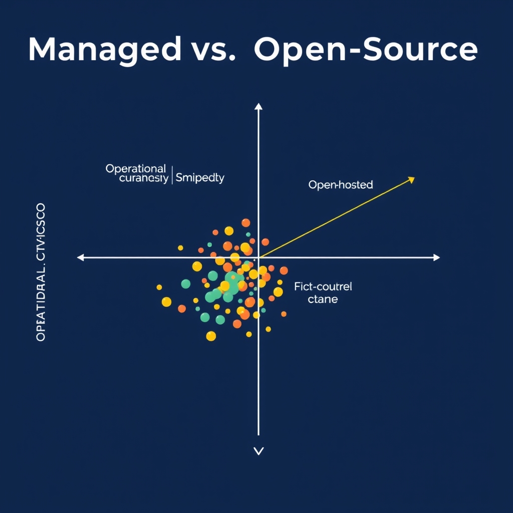
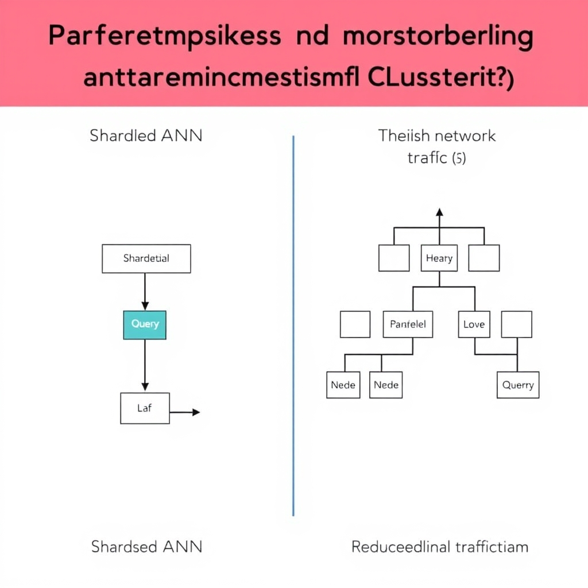
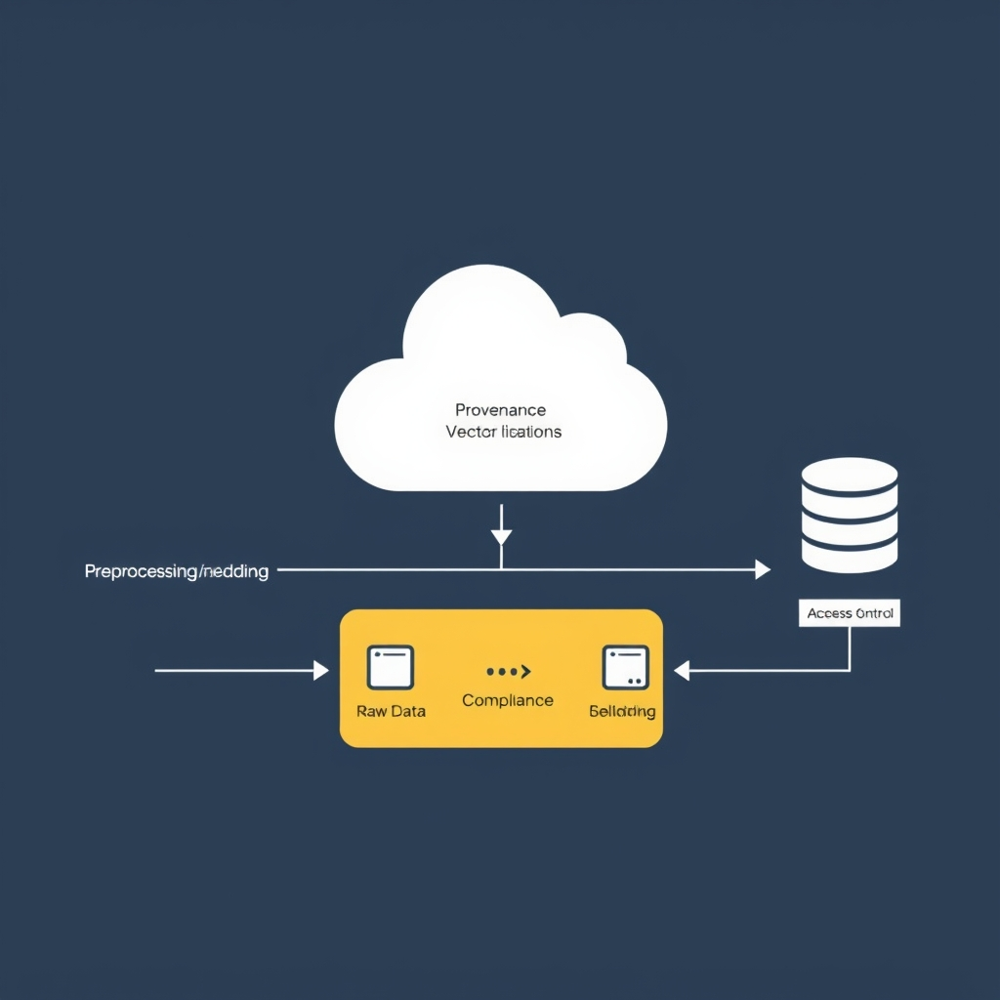

# The State of Vector Databases in 2026: Choosing Your AI Infrastructure

## The Evolution of Vector Databases

The vector database market has moved from a niche research curiosity to a foundational layer of modern AI services in just a few short years. 2024 marked the point when early‑stage projects such as FAISS and Annoy graduated from academic papers to production‑grade offerings, spurred by the explosion of large language models (LLMs) and the need for real‑time similarity search at scale. By 2025‑2026, vendors introduced managed SaaS platforms, robust open‑source ecosystems, and dedicated hardware accelerators, turning vector stores into a commodity comparable to relational databases.

### From Simple Similarity to Multi‑Tenant RAG

Initially, vector databases were used for single‑tenant, point‑lookup tasks—matching a query vector against a static collection of embeddings. Today, they underpin complex Retrieval‑Augmented Generation (RAG) pipelines that serve thousands of concurrent users, each with isolated data partitions, access controls, and custom ranking logic. Multi‑tenant architectures now support per‑tenant model fine‑tuning, dynamic index updates, and hybrid search that blends vector similarity with traditional keyword filters. This evolution has shifted the performance focus from raw latency to consistent throughput and isolation guarantees across diverse workloads.

### The "Infrastructure‑First" Mindset

Enterprises are no longer treating vector stores as optional add‑ons; they are designing AI systems around them from day one. The "infrastructure‑first" approach means that storage layout, indexing strategy, and networking topology are selected before model selection, ensuring that downstream applications—chatbots, recommendation engines, or knowledge‑base search—inherit predictable latency and scalability. This mindset also drives tighter integration with observability stacks, automated scaling policies, and compliance frameworks, positioning vector databases as a core component of the AI data stack rather than a peripheral utility.

## Managed vs. Open-Source: The 2026 Landscape

Pinecone has cemented its position as the go‑to managed vector database for production‑grade Retrieval‑Augmented Generation (RAG) workloads in 2026. Its serverless architecture abstracts away cluster provisioning, scaling, and hardware maintenance, allowing data science teams to focus on model iteration rather than ops. The platform also bundles enterprise‑grade security features—VPC isolation, IAM integration, and encrypted at‑rest storage—out‑of‑the‑box, which aligns with the compliance expectations discussed later in the article. According to the 2026 market survey, Pinecone delivers the best combination of scale, latency, and security for zero‑ops RAG deployments (see [Best Vector Databases 2026: 6 Top Picks Compared for RAG](https://iternal.ai/insights/best-vector-databases-2026)).

*The trade-off between managed services and self-hosted open-source infrastructure.*

In contrast, Milvus remains the flagship open‑source offering for organizations that need fine‑grained control over their vector infrastructure. The project’s Kubernetes‑native design enables billion‑scale indexing across distributed nodes, and its plug‑in architecture supports custom ANN algorithms and storage back‑ends. Community metrics underscore its dominance: over 42,000 GitHub stars and a rapidly growing contributor base make Milvus the most widely adopted open‑source vector database in 2026 (see [Best Vector Databases 2026: 6 Top Picks Compared for RAG](https://iternal.ai/insights/best-vector-databases-2026)). This breadth of adoption translates into a rich ecosystem of extensions, monitoring tools, and third‑party integrations that many enterprises rely on for production pipelines.

### Trade‑offs: Operational overhead vs. control

| Aspect                    | Managed (Pinecone)                                                                   | Open‑source (Milvus)                                                                                      |
| ------------------------- | ------------------------------------------------------------------------------------ | --------------------------------------------------------------------------------------------------------- |
| **Setup time**            | Minutes – UI or API call creates a fully provisioned endpoint.                       | Hours to days – requires Kubernetes cluster, storage provisioning, and configuration of index parameters. |
| **Operational burden**    | None – vendor handles scaling, patching, backups.                                    | High – teams must manage scaling policies, rolling upgrades, and disaster recovery.                       |
| **Customization**         | Limited to vendor‑exposed knobs (e.g., replica count, metric thresholds).            | Full control over index type, distance metric, hardware selection, and integration with custom pipelines. |
| **Cost model**            | Pay‑as‑you‑go based on request volume and storage; predictable for steady workloads. | Capital‑expenditure heavy for on‑prem hardware; variable OPEX for cloud resources and staff.              |
| **Compliance guarantees** | Vendor‑provided certifications (SOC 2, ISO 27001) and built‑in audit logging.        | Responsibility lies with the implementing team to configure encryption, RBAC, and audit trails.           |

The decision often hinges on how much operational overhead an organization is willing to absorb. Start‑ups and teams with limited DevOps bandwidth gravitate toward Pinecone’s zero‑ops promise, while large enterprises with existing Kubernetes expertise may prefer Milvus to retain full control over data residency, hardware optimization, and cost engineering.

### Community size and ecosystem support

Open‑source longevity is tightly coupled to the health of its community. Milvus’s sizable contributor pool ensures rapid bug fixes, frequent releases, and a steady stream of feature proposals—critical when scaling to billions of vectors or integrating emerging ANN algorithms. Moreover, a vibrant ecosystem yields:

- **Third‑party tooling**: Grafana dashboards, Prometheus exporters, and Helm charts that simplify monitoring and deployment.
- **Knowledge resources**: Active forums, conference talks, and a growing body of tutorials that lower the learning curve for new adopters.
- **Vendor partnerships**: Cloud providers (e.g., AWS, GCP) now offer managed Milvus offerings, blurring the line between pure open‑source and managed services.

In summary, Pinecone’s managed service excels for teams prioritizing speed, built‑in security, and minimal ops, whereas Milvus offers unmatched flexibility and a robust community that safeguards its future relevance. The right choice depends on your organization’s scale, latency requirements, and appetite for operational responsibility.

## Performance Benchmarks and Architectural Shifts

### Qdrant’s Low‑Latency Edge

Qdrant consistently leads low‑latency workloads. In the Q1 2026 Vector Database Benchmark, it recorded a **p50 query latency of 4 ms**, the fastest among the ten evaluated systems (source: https://www.salttechno.ai/datasets/vector-database-performance-benchmark-2026). This performance is enabled by a hybrid in‑memory / on‑disk index that keeps frequently accessed vectors hot while streaming less‑used partitions lazily. For latency‑critical applications—real‑time recommendation engines, conversational AI, or fraud detection—sub‑5 ms tail latency can improve end‑user responsiveness and reduce SLA breach risk.

*Hierarchical clustering reduces network chatter by routing queries to relevant leaf nodes instead of broadcasting to all shards.*

### Hierarchical Clustering vs. Traditional Sharded ANN

Traditional approximate nearest‑neighbor (ANN) solutions rely on **sharding**: the dataset is split across nodes, each running an independent index (e.g., IVF‑PQ, HNSW). While sharding scales storage, it introduces cross‑shard coordination overhead during query routing and result merging. Hierarchical clustering, as demonstrated by VAST Data, replaces flat sharding with a multi‑level tree of vector clusters. At the top level, coarse centroids route a query to a small subset of leaf clusters, dramatically reducing the number of vectors examined.

This approach challenges the sharded paradigm in two ways:

1. **Reduced network chatter** – only the relevant leaf nodes participate, cutting inter‑node traffic.
1. **Improved cache locality** – clusters are stored contiguously, allowing SSD/NVMe prefetchers to work more efficiently.

The result is a more deterministic latency profile, especially when the query workload exhibits locality of reference (source: https://www.vastdata.com/blog/architecture-behind-our-11x-vector-benchmark).

### Throughput at the 1‑Billion‑Vector Scale

When scaling to **1 billion vectors**, raw throughput becomes the decisive metric. In a head‑to‑head test, Milvus 2.6 (disk‑based AISAQ backend) achieved roughly **89 queries per second (QPS)**, while VAST Data’s hierarchical index pushed this to **~1 000 QPS**, an **11× improvement** (source: https://www.vastdata.com/blog/architecture-behind-our-11x-vector-benchmark). The test measured sustained query rates under a mixed workload of 95 % similarity searches and 5 % filter‑augmented queries, reflecting realistic RAG pipelines.

Key contributors to VAST’s throughput gain include:

- **Vector‑aware storage tiering** that keeps hot clusters on NVMe while cold clusters reside on high‑capacity SSDs.
- **Batch‑aware query dispatch**, which aggregates multiple concurrent requests before traversing the hierarchy, amortizing index traversal costs.
- **Parallel leaf‑node execution**, leveraging up to 64 cores per node without the contention typical of sharded HNSW implementations.

### VAST Data’s Disruption of Distributed Indexing

VAST Data’s architecture redefines how vector indexes are distributed. Rather than replicating identical ANN structures across nodes, VAST builds a **single logical index** that spans the cluster. Metadata about cluster boundaries lives in a lightweight coordination service, while the actual vector payload is partitioned by the hierarchy itself. This design eliminates the need for costly index rebalancing when nodes are added or removed, a common pain point for sharded systems.

Additionally, VAST integrates **native data lineage** into the index, tagging each vector insertion with a provenance record. This capability supports audit‑trail requirements emerging from regulations such as the EU AI Act, allowing enterprises to balance performance with compliance.

______________________________________________________________________

**Takeaway:** Qdrant excels where sub‑5 ms latency is non‑negotiable, while VAST Data’s hierarchical clustering delivers order‑of‑magnitude throughput gains at massive scale. Understanding these trade‑offs helps architects choose the right engine for their latency‑sensitivity, scale, and compliance requirements.

## Compliance and Governance in the Age of the EU AI Act

The EU AI Act, which entered force on 2 August 2026, reshapes how enterprises must treat vector data. Unlike earlier guidance that treated vector stores as optional components, the Act classifies many AI‑driven applications that rely on similarity search as **high‑risk systems**. This classification imposes concrete data‑governance obligations that directly map to features of modern vector databases.

*End-to-end traceability ensures that every vector can be audited back to its source, a requirement for high-risk AI systems under the EU AI Act.*

### Impact on data‑governance requirements

- **Purpose limitation and data minimisation** – Vector embeddings often derive from personal or proprietary data. The Act mandates that only the minimal necessary data be retained, forcing organisations to implement policies for pruning stale vectors and restricting ingestion pipelines.
- **Risk assessments** – Before deployment, a systematic assessment of how vector‑based retrieval could propagate bias or expose sensitive information is required. Vendors that provide built‑in risk‑scoring dashboards (e.g., similarity‑score heatmaps tied to data provenance) simplify compliance.
- **Cross‑border data transfers** – The Act restricts transfers of high‑risk AI data outside the EU unless adequate safeguards exist. Vector databases must therefore support region‑locked clusters or encrypted replication that satisfies GDPR‑equivalent standards.

### Row‑level security and audit logging are now mandatory

Historically, many vector stores offered only collection‑wide access controls. Post‑Act, **row‑level security (RLS)** is essential because each vector may correspond to an individual record. Implementations typically rely on attribute‑based policies that evaluate the requesting principal against metadata attached to each vector (e.g., `owner_id`, `sensitivity_level`).

Audit logging must capture:

1. **Query provenance** – who queried which vector, the similarity threshold used, and the returned IDs.
1. **Mutation events** – inserts, updates, and deletions, together with timestamps and user identifiers.
1. **Policy enforcement outcomes** – whether a request was allowed, denied, or altered by RLS rules.

These logs must be immutable, tamper‑evident, and retained for the period defined by the Act (typically 5 years). Failure to provide such granularity can result in enforcement actions and hefty fines.

### Ensuring data lineage and traceability

High‑risk AI systems must demonstrate **end‑to‑end traceability** from raw data to generated embeddings and back. Practical approaches include:

- **Metadata enrichment**: Store source identifiers, ingestion timestamps, and preprocessing steps alongside each vector.
- **Versioned pipelines**: Tag vectors with the version of the embedding model used (e.g., `model=v2.1‑sentence‑transformer`).
- **Lineage graphs**: Visual tools that map raw records → preprocessing → embedding → storage, enabling auditors to reconstruct the data flow for any vector.

By maintaining this lineage, organisations can quickly respond to regulator‑requested impact analyses or model‑drift investigations.

### Evaluating a vendor’s compliance roadmap

When selecting a vector database, assess the vendor’s commitment to EU AI Act compliance through a structured checklist:

| Criterion                          | What to Look For                                                                                         |
| ---------------------------------- | -------------------------------------------------------------------------------------------------------- |
| **Policy documentation**           | Publicly available compliance white‑papers that reference specific Act articles.                         |
| **Feature roadmap**                | Planned releases for RLS, immutable audit logs, and built‑in lineage tracking, with clear timelines.     |
| **Third‑party audits**             | Independent security and compliance audits (e.g., ISO 27001, SOC 2) that include AI‑specific controls.   |
| **Support for regional isolation** | Ability to deploy clusters confined to EU data centres with encrypted inter‑region replication.          |
| **Customer governance tools**      | Dashboards that let customers configure and export compliance artefacts (policy matrices, audit trails). |

A vendor that can demonstrate these capabilities today—and has a transparent plan for future regulatory updates—will reduce both operational risk and the cost of compliance for your organization.

*Source: [How to Make a Vector Database Work for Your Enterprise](https://sombrainc.com/blog/vector-database-enterprise-guide)*

## Decision Framework for Your Next Project

#### 1️⃣ Decision matrix

| **Criterion**             | **Low‑scale / \<10 M vectors**                                            | **Mid‑scale / 10‑100 M vectors**                                                   | **High‑scale / >100 M vectors**                                                                              |
| ------------------------- | ------------------------------------------------------------------------- | ---------------------------------------------------------------------------------- | ------------------------------------------------------------------------------------------------------------ |
| **Latency tolerance**     | Managed services (Pinecone) – sub‑ms SLA, no tuning required              | Open‑source (Milvus, Qdrant) – configurable indexing, modest ops overhead          | Self‑hosted distributed stack (Milvus + VAST Data) – custom sharding, higher ops cost                        |
| **Compliance mandate**    | Managed with built‑in EU‑AI‑Act features (audit logs, row‑level security) | Open‑source with community‑driven security plugins; add‑on compliance layer needed | Fully self‑hosted – full control over data residency, audit pipelines, but requires internal governance team |
| **Operational expertise** | Minimal – vendor handles scaling, backups, upgrades                       | Moderate – need in‑house DevOps for cluster sizing and monitoring                  | Advanced – dedicated SREs for cluster orchestration, network topology, and disaster recovery                 |

#### 2️⃣ When to choose managed vs. self‑hosted

- **Managed (e.g., Pinecone, Weaviate Cloud)**
  - Rapid time‑to‑value when staff for cluster ops is limited.
  - Provider certifications satisfy compliance requirements.
  - Predictable workloads that fit provider pricing tiers.
- **Self‑hosted open‑source (e.g., Milvus, Qdrant)**
  - Data must remain on‑premise or in a private cloud for sovereignty.
  - Custom indexing or extreme cost optimization at massive scale.
  - Mature SRE team capable of rolling upgrades, backups, and security hardening.

#### 3️⃣ Future‑proofing your AI data stack

- **Modular architecture** – decouple the vector store from downstream services (RAG pipelines, analytics) to enable provider swaps without rewriting business logic.
- **Observability first** – instrument query latency, throughput, and resource utilization from day one; use this data for scaling decisions and compliance audits.
- **Vendor lock‑in awareness** – prefer solutions exposing standard APIs (OpenAPI, gRPC) and supporting raw‑vector export for migration.
- **Plan for regulatory evolution** – embed a compliance review checkpoint in your roadmap and allocate budget for periodic security assessments and model‑drift monitoring.

By applying the matrix, matching latency and compliance posture to the right deployment model, and building a modular, observable stack, you can select a vector database that meets today’s demands while staying adaptable to tomorrow’s AI workloads.