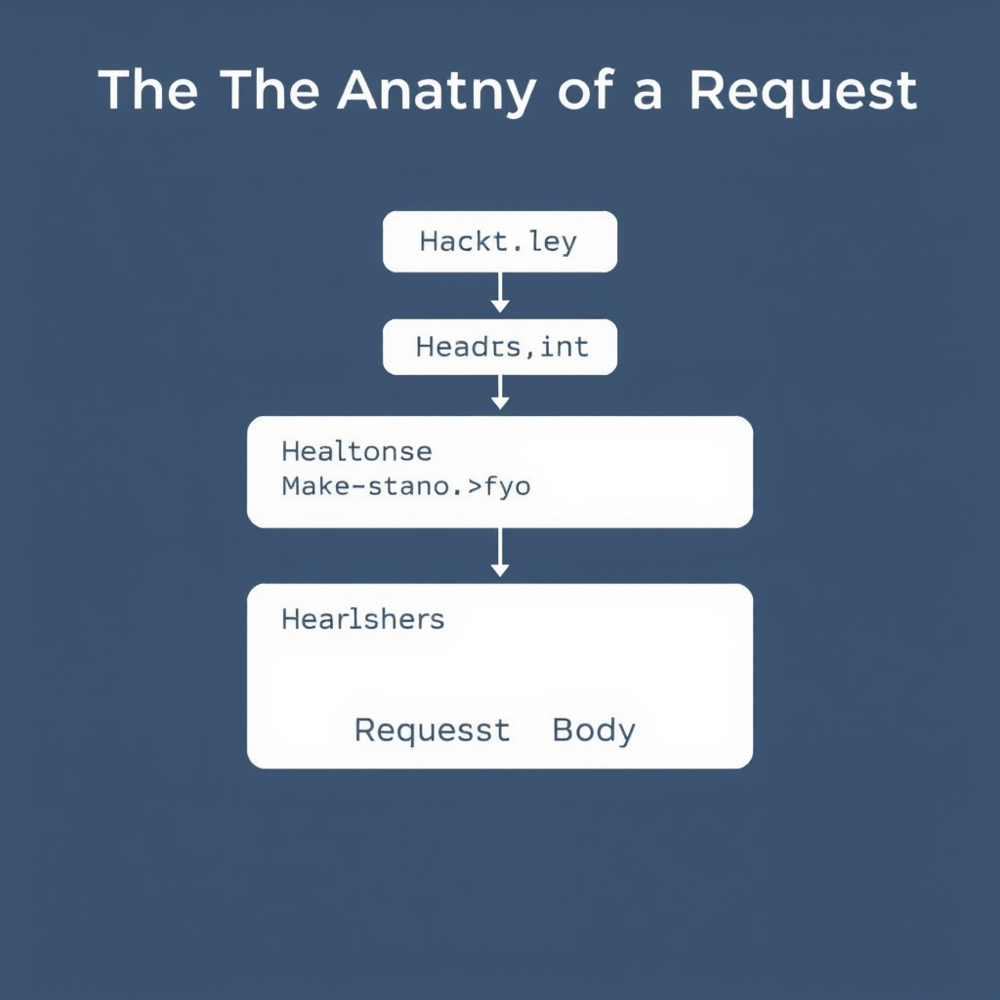
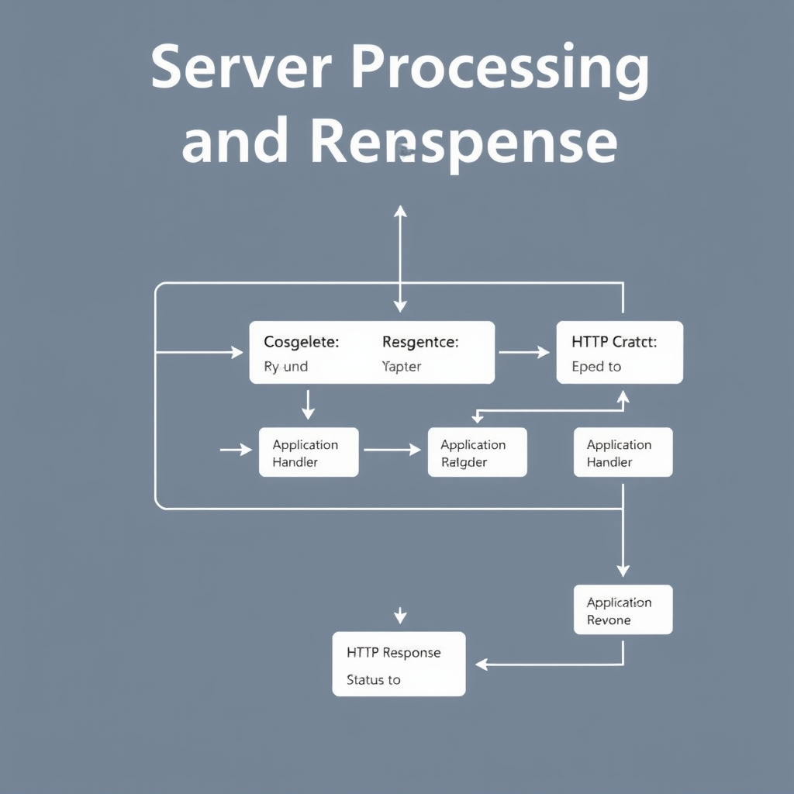

# Under the Hood: The Lifecycle of an HTTP Request

## The Anatomy of a Request

The HTTP request is the foundation of communication between a client and a server. It consists of several key components that define its structure and purpose.


*The anatomy of an HTTP request, consisting of the request line, headers, and an optional body.*

The request line is the first line of the request and contains three essential pieces of information: the Method (e.g., GET, POST, PUT), the URI (Uniform Resource Identifier), and the Protocol version (e.g., HTTP/1.1). For example, a request line might look like this: `GET /path/to/resource HTTP/1.1`.

HTTP headers play a crucial role in defining the context and content type of the request. They are key-value pairs that provide additional information about the request. Common headers include `Host`, `Accept`, and `Content-Type`.

The request body is used in operations like POST and PUT to send data to the server. It can contain various types of data, such as JSON, XML, or form data.

Understanding the difference between idempotent and non-idempotent methods is also important. Idempotent methods (like GET) can be safely repeated without changing the result, while non-idempotent methods (like POST) can have different outcomes when repeated.

Here is a simple example of an HTTP request in Python using the `requests` library:
```python
import requests

response = requests.get('https://example.com')
print(response.status_code)
```
This code sends a GET request to the specified URL and prints the status code of the response.
## The Handshake: Establishing the Connection

The process of establishing a connection between a client and a server involves several steps, each contributing to the overall latency of the request. 
* The DNS lookup process is the first step, where the client resolves the domain name of the server to its IP address. This process can be sped up through caching, reducing the time it takes to resolve the domain name.
* The TCP three-way handshake is the next step, where the client and server establish a connection. This involves a SYN packet sent by the client, a SYN-ACK packet sent by the server, and an ACK packet sent by the client. This process has a latency cost, as it requires three packets to be sent before data can be transmitted.
* The TLS handshake is then performed to secure the connection. This involves the client and server agreeing on a cipher suite, exchanging certificates, and establishing a shared secret key. This process adds additional latency, but provides end-to-end encryption for the data being transmitted.
* The impact of round-trip times (RTT) on initial load speed is significant, as each packet sent between the client and server must travel to its destination and back before the next packet can be sent. This can result in significant latency, especially for clients with high-latency connections.


*The connection lifecycle: DNS resolution, TCP handshake, and TLS negotiation must complete before the first byte of the HTTP request is sent.*
## Server Processing and Response


*The request-response cycle: The server parses the incoming request, routes it to the application logic, and returns a response with a status code.*
The server processing and response phase is crucial in the HTTP request-response cycle. Once the server receives the request, it begins to parse the request line, headers, and body. 
* The server parses the request and routes it to an application handler based on the URI and HTTP method.
* The significance of HTTP status codes (2xx, 3xx, 4xx, 5xx) lies in their ability to convey the outcome of the request. 
  * 2xx status codes indicate successful requests, 
  * 3xx status codes are used for redirection, 
  * 4xx status codes signify client-side errors, and 
  * 5xx status codes represent server-side errors.
The structure of the HTTP response includes headers and a body. 
* HTTP response headers provide metadata about the response, such as the content type, caching instructions, and cookies.
* The response body contains the actual data being sent back to the client, which can be in various formats like HTML, JSON, or images.
To reduce overhead for subsequent requests, connection persistence (Keep-Alive) is used. 
Here is an example of how a server might respond to a request using Python and the http.server module:
```python
from http.server import BaseHTTPRequestHandler, HTTPServer

class RequestHandler(BaseHTTPRequestHandler):
    def do_GET(self):
        self.send_response(200)
        self.send_header('Content-type', 'text/html')
        self.end_headers()
        self.wfile.write(b'Hello, world!')

server_address = ('', 8000)
httpd = HTTPServer(server_address, RequestHandler)
httpd.serve_forever()
```
This example illustrates a basic server setup that responds to GET requests with a simple 'Hello, world!' message.

## Common Failure Modes and Debugging
To effectively debug network issues, it's crucial to understand common failure modes and how to identify them. 
* Identifying symptoms of DNS resolution failures can be done by checking for errors in the browser's console or network logs, often indicated by a timeout or an inability to resolve the domain name.
* Browser DevTools can be used to inspect request timing, providing insights into where bottlenecks occur. This can be done by opening the Network tab in the browser's developer tools and analyzing the request's timeline.
* Common causes of 4xx errors include incorrect URLs, missing authentication, or invalid request bodies. 5xx errors, on the other hand, typically indicate server-side issues such as application crashes, database connectivity problems, or overload.
* To identify latency bottlenecks in the request lifecycle, developers can use the Waterfall view in the browser's Network tab. This view displays the sequence of events for a request, highlighting where time is being spent. By analyzing this, developers can pinpoint whether the issue lies in the DNS lookup, TCP connection establishment, TLS handshake, server processing, or the response download.

## Conclusion: Mastering the Request Lifecycle
Understanding the HTTP request lifecycle is crucial for optimizing performance, identifying bottlenecks, and ensuring the security of web applications. By grasping the concepts outlined in this article, developers can better design, debug, and maintain their applications. Key takeaways include:
* Understanding the handshake process (DNS, TCP, TLS) informs performance optimization strategies, such as reducing round-trip times and leveraging connection persistence.
* HTTP headers and status codes play a vital role in defining the context and content of requests and responses, respectively, and are essential for robust API design.
* Utilizing network inspection tools, such as browser DevTools, can help validate mental models of the request lifecycle and identify areas for improvement.
By applying these principles, engineers can create more efficient, scalable, and reliable web applications, ultimately enhancing the user experience.