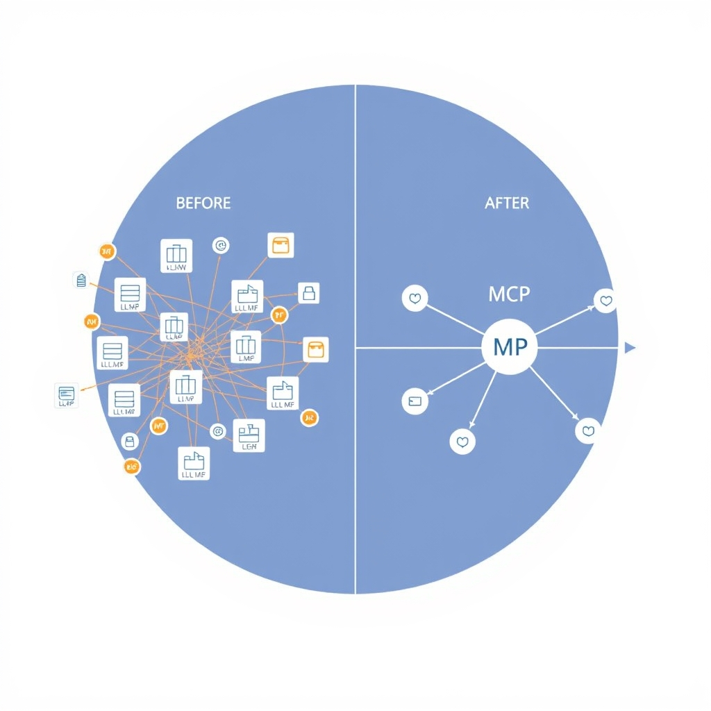
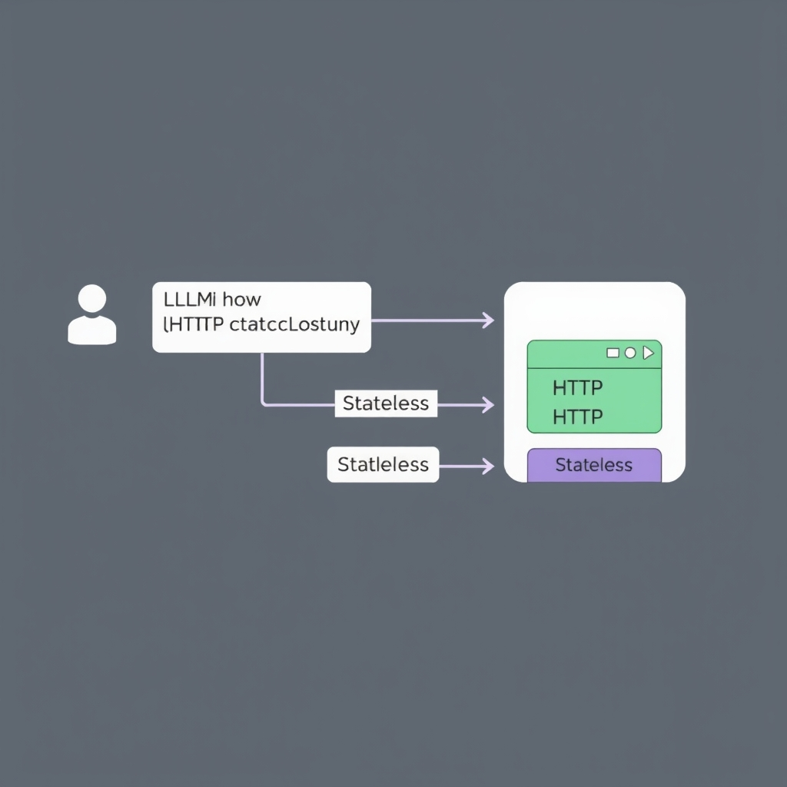
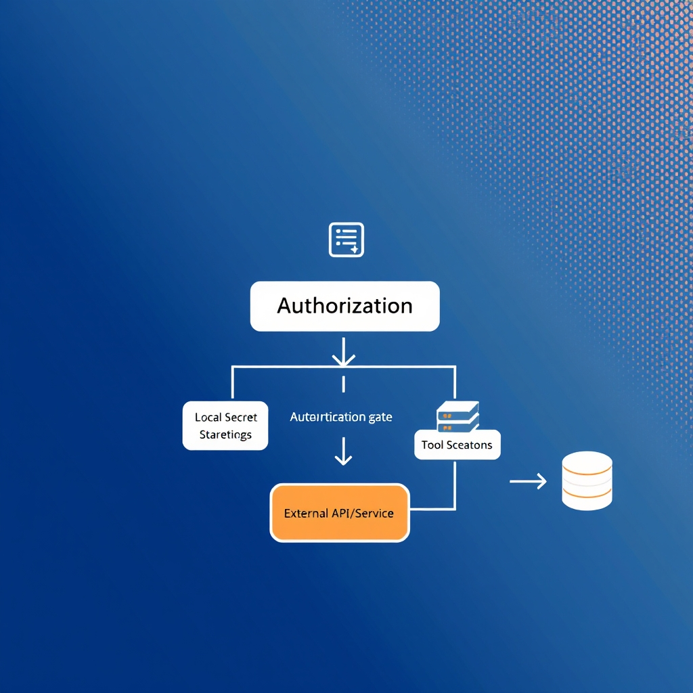

# Understanding the Model Context Protocol (MCP): The Future of AI Interoperability

## The Problem of AI Fragmentation

AI developers today face a classic **n‑to‑m integration nightmare**: each large language model (LLM) must be wired individually to every external data source, API, or tool it needs to invoke. If an organization uses three LLMs and ten distinct services, it must maintain thirty separate connectors, each with its own authentication, error handling, and versioning quirks. This combinatorial explosion drives up engineering overhead, introduces inconsistency, and makes scaling AI‑augmented applications brittle.

*The transition from fragmented, bespoke connectors (left) to a unified, standardized MCP architecture (right).*

**MCP as an open standard**

The Model Context Protocol (MCP) was created to break this cycle. It offers a vendor‑neutral specification that describes a single, uniform interface through which any LLM can request data or invoke functionality, regardless of the underlying service. In practice, an LLM sends a well‑defined request payload to an MCP‑compliant server, which then translates the call into the appropriate backend operation. This decouples model logic from integration code and eliminates the need for bespoke adapters for each tool.

**From proprietary connectors to a unified protocol**

Historically, AI platforms bundled their own proprietary connectors—often locked to a specific cloud provider or SDK. These silos prevented cross‑model reuse and forced teams to duplicate effort whenever they switched models or added new services. MCP replaces that patchwork with a single contract: developers implement the MCP server once, and every compliant LLM can consume it out‑of‑the‑box. The result is a dramatically reduced integration surface and a clearer path for ecosystem growth.

**Linux Foundation stewardship**

Recognizing the strategic importance of a neutral governance model, Anthropic donated MCP to the Agentic AI Foundation under the Linux Foundation in December 2025. This move anchors the protocol in a community‑driven organization, ensuring long‑term stability, transparent evolution, and broad industry adoption[^1][^2].

## Architectural Foundations of MCP

### Client‑Server Relationship

In the MCP model the large language model (LLM) functions as a **client** that issues standardized requests to an MCP **server**. The client embeds a lightweight SDK that formats calls according to the MCP schema, while the server implements the protocol endpoints and translates those calls into concrete operations on backend services (databases, APIs, file stores, etc.). This separation lets developers treat the LLM as a thin orchestrator rather than a monolithic integration point, mirroring the classic request‑response pattern used in web services.[^4]

*The 2026-07-28 stateless architecture: each request is self-contained, enabling horizontal scalability.*

### Server‑Side Abstraction of Backend Complexity

MCP servers encapsulate the heterogeneity of data sources behind a uniform API surface. Internally a server may maintain adapters for REST endpoints, gRPC services, or legacy SOAP interfaces, but the client only ever sees the MCP‑defined method signatures and JSON payloads. This abstraction reduces the cognitive load on prompt engineers: vendor‑specific authentication flows or data‑format transformations can be handled centrally by the server, which may also provide:

- Credential injection from a secure vault.
- Data normalization (e.g., converting CSV rows to JSON objects).
- Retry and back‑off logic for flaky external services.

By centralizing these concerns, organizations can evolve backend implementations without touching the LLM prompts, preserving prompt stability across deployments.

### Shift to the 2026‑07‑28 Stateless HTTP Specification

Earlier MCP drafts relied on session identifiers to maintain conversational context across multiple tool calls. The **2026‑07‑28 specification** replaced that model with a **stateless core**, declaring that every request must contain all information required for execution and that the server must not retain per‑client state between calls.[^3]

Key changes introduced by the stateless spec include:

1. **Pure HTTP workloads** – MCP endpoints can be deployed as ordinary HTTP services behind load balancers, without custom session stores.
1. **Idempotent request design** – With no server‑side session, requests are designed to be safely repeatable, simplifying error handling.
1. **Explicit context passing** – Contextual data (e.g., user identifiers, conversation IDs) is carried in request headers or payload fields, making the data flow transparent.

### Benefits for Cloud Scalability

While the specification does not prescribe operational outcomes, the stateless design *can* enable several scalability advantages for cloud‑native deployments:

- **Horizontal scaling** – Stateless services can be replicated arbitrarily; a load balancer can route any request to any replica without affinity constraints.
- **Reduced latency** – Eliminating look‑ups to session stores may cut round‑trip time, which is valuable for real‑time agentic workflows.
- **Simplified fault tolerance** – Failure of a single replica does not corrupt client state, supporting graceful degradation and rapid auto‑recovery.
- **Cost efficiency** – Without persistent session databases, infrastructure footprints shrink, potentially lowering compute and storage expenses.

These characteristics align MCP with modern serverless platforms (e.g., AWS Lambda, Google Cloud Run) where functions are invoked on demand and billed per request, making large‑scale AI agent deployments more economical.

______________________________________________________________________

\[^3\]: The 2026‑07‑28 Specification | Model Context Protocol Blog, https://blog.modelcontextprotocol.io/posts/2026-07-28
\[^4\]: Building AI Agents with Model Context Protocol: From Specification to Implementation, YouTube, https://www.youtube.com/watch?v=oSGVQIZxi7s

## Security and Governance

### Security‑First Design Principles

MCP was built around a *security‑first* mindset. Every external tool call is treated as a privileged operation that must be explicitly authorized before the LLM can invoke it. This design prevents accidental data exfiltration and ensures that downstream services cannot be accessed without the user’s consent.

*Security-first design: MCP servers isolate sensitive credentials from the LLM and require explicit authorization for every tool call.*

- **Explicit approval workflow** – The protocol mandates that a user or developer approve each tool invocation, typically via a prompt generated by the MCP client. The approval token is then attached to the request, and the server rejects any call lacking this token. The protocol requires explicit user or developer approval for each tool invocation and emphasizes local control over data【https://medium.com/@laowang_journey/model-context-protocol-mcp-real-world-use-cases-adoptions-and-comparison-to-functional-calling-9320b775845c】.
- **Least‑privilege secret handling** – Secret keys (API tokens, database credentials, etc.) never leave the MCP server. They are stored in a local secret store that the LLM cannot access directly. All secret keys remain with the MCP server under the user’s control, rather than being exposed to the cloud AI service【https://medium.com/@laowang_journey/model-context-protocol-mcp-real-world-use-cases-adoptions-and-comparison-to-functional-calling-9320b775845c】.

### Local Secret Management

MCP servers act as custodians of all sensitive material. When a tool needs a credential, the server injects it into the request at runtime, then discards it after the operation completes. This approach aligns with common best practices in zero‑trust architectures and helps meet compliance expectations such as GDPR and SOC 2.

### Governance via the Linux Foundation

In December 2025, Anthropic donated MCP to the **Agentic AI Foundation**, a project hosted by the Linux Foundation. This move established a vendor‑neutral, community‑governed body responsible for the protocol’s evolution【https://workos.com/blog/everything-your-team-needs-to-know-about-mcp-in-2026】.

- **Transparent spec development** – Changes to the protocol are discussed in open forums, with contributions from competing AI vendors, cloud providers, and enterprise users.
- **Long‑term stability** – The foundation’s neutral position reduces the risk of a single company dictating the roadmap, encouraging broader industry adoption.
- **Compliance alignment** – Governance policies enforce security audits and open‑source licensing, giving enterprises confidence that MCP will remain compatible with regulatory frameworks.

Together, these security mechanisms and the robust governance model make MCP a trustworthy bridge between large language models and the myriad data sources they need to interact with.

## Conclusion: The Path Forward

The Model Context Protocol’s vendor‑neutral stance eliminates the need for bespoke connectors, allowing any LLM to speak the same language as any data source. This openness not only reduces lock‑in risk but also creates a shared marketplace where tools and services can interoperate without custom adapters.

Stateless communication—formalized in the July 2026 HTTP specification—removes session‑state baggage from the protocol. Cloud providers can now scale MCP endpoints horizontally, and enterprises gain predictable latency and cost models because each request is self‑contained. The result is an architecture that fits naturally into serverless and micro‑service environments, accelerating adoption in production pipelines.

Developers eager to experiment can start today by importing the open‑source MCP client library and pointing it at any compliant server. The specification includes clear schema definitions, example payloads, and a sandbox environment hosted by the Linux Foundation’s Agentic AI Foundation. By building against this reference implementation, teams avoid proprietary pitfalls and contribute to a growing ecosystem.

Looking ahead, the combination of vendor neutrality and stateless design positions MCP as the de‑facto standard for agentic AI. As more organizations adopt the protocol, we can expect a vibrant plug‑and‑play marketplace, faster innovation cycles, and a more secure, interoperable AI landscape.

[^2]: https://workos.com/blog/everything-your-team-needs-to-know-about-mcp-in-2026