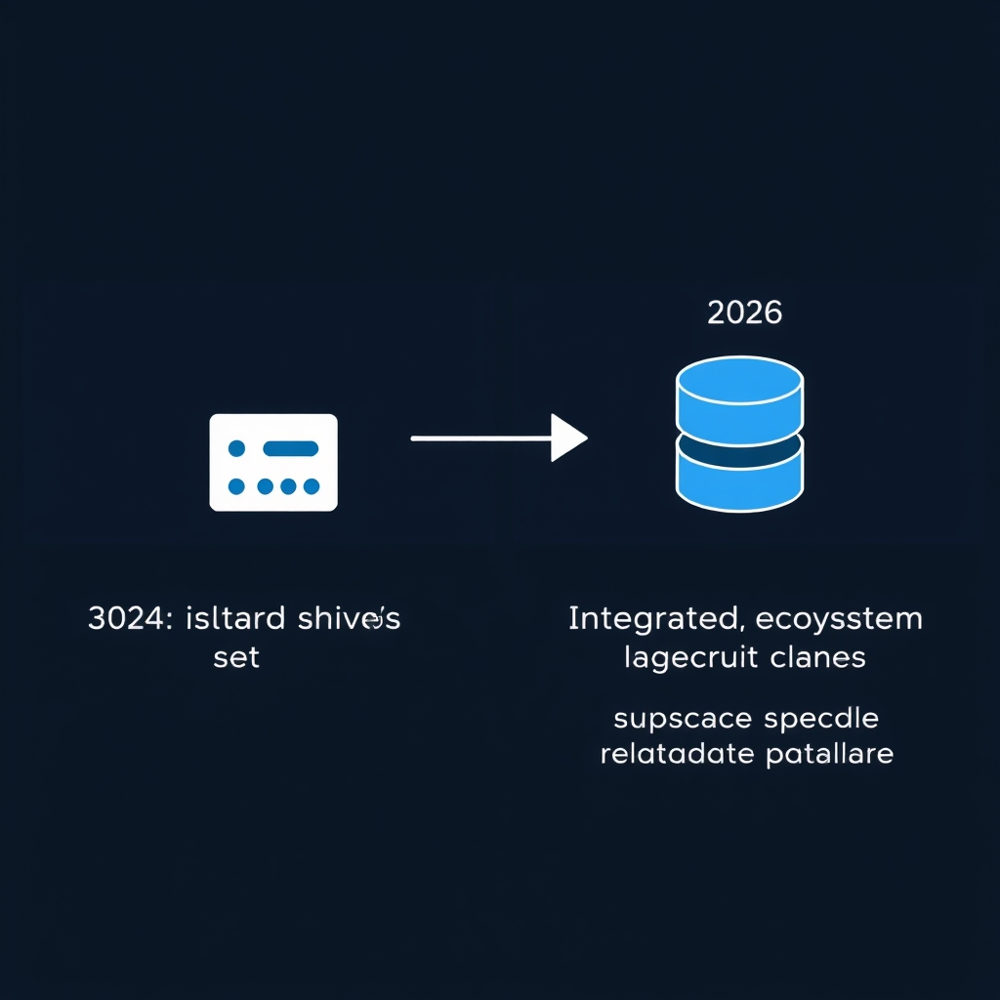
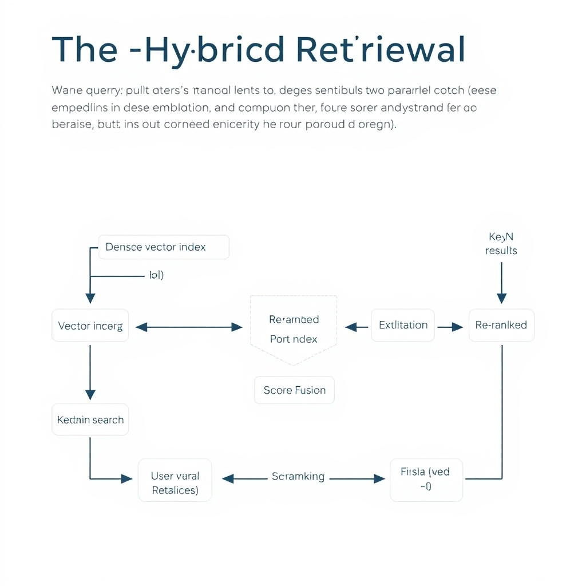
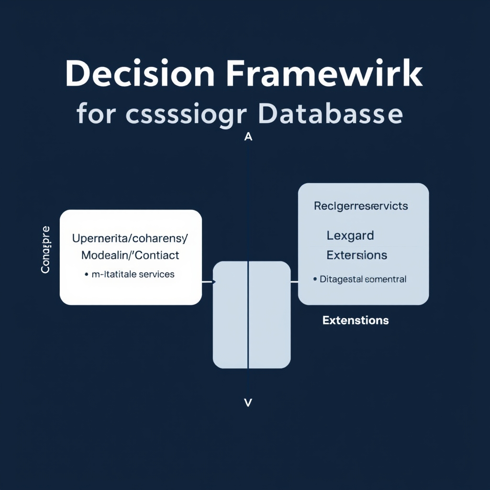

# Vector Databases in 2026: From Niche Tool to Infrastructure Standard

## The State of Vector Search in 2026

The past few years have seen vector search move from a research curiosity to a core component of production AI pipelines. Early adopters ran isolated services—often on single‑node clusters—to experiment with dense embeddings for semantic ranking. Those deployments were fragile: they required custom scaling logic, lacked SLAs, and offered limited observability. By 2025, vendors such as Pinecone, Qdrant, and cloud‑native offerings introduced auto‑scaling, multi‑zone replication, and built‑in monitoring, turning vector stores into **enterprise‑grade services** that meet latency budgets of \< 10 ms at tens of thousands of QPS.


*By 2026, vector search has shifted from a standalone microservice to an integrated capability within existing data platforms.*

Concurrently, the industry has embraced a **"vector‑as‑a‑capability"** model. Major cloud providers (e.g., AWS, Azure, GCP) and open‑source platforms have embedded dense‑vector indexes directly into their relational and document stores. Redis, for example, now ships a native vector index that can be queried alongside traditional data types, eliminating the need for a separate microservice. This integration reduces data movement, simplifies access control, and leverages existing backup/restore mechanisms, making vector search a first‑class feature rather than a bolt‑on.

Analysts predict that this trend will culminate in a **dominance of integrated data platforms** for GenAI applications. The Redis 2026 guide projects that by 2028, **80 % of GenAI apps** will be built on existing data‑management platforms rather than dedicated vector databases. The drivers are clear: lower operational overhead, tighter consistency guarantees, and the ability to combine keyword, graph, and vector queries within a single engine. As a result, organizations can focus on model engineering and prompt design, trusting the underlying platform to handle hybrid retrieval at scale.

## Market Leaders and Architectural Archetypes

### Pinecone – Managed, Zero‑Ops Serverless

Pinecone continues to dominate the managed‑service segment. It offers a fully‑hosted, serverless API that abstracts away index provisioning, scaling, and hardware maintenance. Users simply upload embeddings and query via a REST or gRPC endpoint, making it ideal for teams that want to focus on application logic rather than ops.

- **Operational model**: Fully managed SaaS; no cluster management required.
- **Performance**: Reported p50 query latency of ~8 ms, which is competitive for production RAG workloads while preserving the zero‑ops promise【2】.
- **Typical use case**: Rapid prototyping, startups, or enterprises that prefer predictable cost and SLAs over fine‑grained control.
- **Ecosystem hooks**: Native integrations with LangChain, LlamaIndex, and popular ML frameworks streamline retrieval pipelines.

______________________________________________________________________

### Qdrant – High‑Throughput Self‑Hosted Engine

Qdrant is the go‑to open‑source option when raw performance and on‑premises control are paramount. Its Rust‑based core and efficient storage layout enable sub‑5 ms p50 latencies in benchmark suites, the fastest among surveyed engines in Q1 2026【3】.

- **Operational model**: Self‑hosted (Docker, Kubernetes, or bare‑metal); supports both single‑node and distributed deployments.
- **Performance**: 4 ms p50 latency on typical 768‑dimensional vectors, making it suitable for high‑QPS applications such as real‑time recommendation or large‑scale semantic search.
- **Scalability**: Horizontal sharding and replication allow clusters to scale to billions of vectors while maintaining low latency.
- **Feature set**: Offers payload filtering, on‑disk and in‑memory storage modes, and a flexible REST/GRPC API.
- **Typical use case**: Organizations with strict data‑sovereignty requirements or workloads that demand sub‑millisecond response times.

______________________________________________________________________

### Weaviate – AI‑Native Ecosystem for Complex Data

Weaviate distinguishes itself by embedding a full‑text search engine, a GraphQL API, and a modular schema that can store heterogeneous data alongside vectors. Its “AI‑native” label reflects built‑in support for transformer‑based vectorizers (e.g., OpenAI, Hugging Face) and automatic schema generation.

- **Operational model**: Available as a managed cloud service and as a self‑hosted open‑source distribution.
- **Data model**: Supports objects with properties, references, and vector embeddings, enabling multi‑modal retrieval (text, images, metadata) in a single query.
- **Ecosystem**: Tight integration with LangChain, LlamaIndex, and the Weaviate Python client reduces boilerplate for RAG pipelines.
- **Typical use case**: Knowledge‑graph‑style applications, enterprise search over richly structured documents, and agentic AI that needs to reason over both semantic similarity and relational context.

______________________________________________________________________

### Milvus – Massive‑Scale Distributed Workloads

Milvus has matured into the de‑facto platform for billion‑scale vector storage. Its architecture separates query and storage nodes, allowing independent scaling of compute and data layers. Recent releases (v2.4) introduce a sharding mechanism that can distribute petabytes of vectors across dozens of nodes while preserving low latency.

- **Operational model**: Open‑source, primarily self‑hosted; cloud‑native offerings exist via partners (e.g., Zilliz Cloud).
- **Scale**: Proven to handle >10 billion vectors with linear throughput growth.
- **Performance**: While not the fastest per‑query, Milvus balances latency (≈10‑15 ms p50) with massive throughput, making it suitable for batch‑oriented analytics and large‑scale recommendation engines.
- **Extensibility**: Supports multiple index types (IVF, HNSW, ANNOY) and custom plug‑ins for emerging similarity metrics.
- **Typical use case**: Enterprises that already operate large data lakes and need to augment them with vector search without sacrificing scale.

______________________________________________________________________

### Quick Comparison Table

| Solution | Deployment Model             | p50 Latency (typical) | Scale Target                        | Primary Strength                   |
| -------- | ---------------------------- | --------------------- | ----------------------------------- | ---------------------------------- |
| Pinecone | Managed SaaS                 | ~8 ms                 | Millions of vectors                 | Zero‑ops, rapid time‑to‑value      |
| Qdrant   | Self‑hosted                  | 4 ms                  | Hundreds of millions                | Ultra‑low latency, on‑prem control |
| Weaviate | Managed & Self‑hosted        | 10‑12 ms              | Tens of millions (with rich schema) | Multi‑modal, AI‑native ecosystem   |
| Milvus   | Self‑hosted (cloud partners) | 10‑15 ms              | Billions of vectors                 | Massive distributed scale          |

Each of these engines occupies a distinct niche in the 2026 vector‑database ecosystem. Choosing the right one hinges on three practical dimensions: **operational overhead**, **performance envelope**, and **data complexity**. The next section will translate these dimensions into a decision framework that helps readers match their RAG or agentic AI architecture to the most appropriate platform.

## The Technical Standard: Hybrid Retrieval

**Synergy of dense vectors and BM25**


*Hybrid retrieval combines the semantic recall of dense vectors with the lexical precision of BM25 keyword search.*

Dense embeddings excel at capturing semantic similarity, but they treat a document as a single point in high‑dimensional space. Traditional inverted‑index techniques such as BM25, on the other hand, index individual terms and preserve exact lexical matches. By running both searches in parallel and merging the result sets, a system can retrieve passages that are *both* semantically relevant and contain the precise entities or keywords the user expects. In practice, the two scores are often combined with a weighted linear formula, e.g., `final_score = α·vector_score + (1‑α)·bm25_score`, where `α` is tuned per workload.

**Why pure vector search falls short**

Pure vector retrieval can miss queries that hinge on rare or out‑of‑vocabulary tokens. Consider a legal‑tech RAG system answering the question “What does *Section 12‑3* of the GDPR require?” The phrase *Section 12‑3* may appear in only a handful of documents. Its embedding will be dominated by surrounding context, making it indistinguishable from other sections. A BM25 lookup will instantly surface the exact clause because the term frequency‑inverse document frequency (TF‑IDF) weighting rewards the rare token. Similarly, product‑search scenarios that involve model numbers (e.g., *RTX 4090‑Ti*) or chemical identifiers (e.g., *C₆H₁₂O₆*) are reliably captured only by keyword search. Relying solely on vectors therefore leads to lower precision for entity‑heavy queries and can increase hallucination rates in downstream LLMs.

**Conceptual implementation in a production pipeline**

1. **Ingest & index**
   - Store raw documents in a persistent store (e.g., PostgreSQL, S3).
   - Generate dense embeddings with the same model used at query time (e.g., OpenAI `text-embedding-3-large`).
   - Insert embeddings into a vector engine (Milvus, Qdrant, etc.) and simultaneously push the original text into a BM25‑enabled engine (Elasticsearch, OpenSearch, or the built‑in BM25 of many vector stores).
1. **Query handling**
   - Receive a user prompt, extract the retrieval portion (often the same prompt sent to the LLM).
   - Compute the query embedding.
   - Issue two parallel searches:
     - `vector_results = vector_store.search(query_embedding, top_k=K)`
     - `bm25_results = bm25_store.search(raw_query, top_k=K)`
1. **Score fusion**
   - Normalize both score lists (e.g., min‑max scaling).
   - Apply a weighted blend: `combined = α·vector_norm + (1‑α)·bm25_norm`.
   - Re‑rank the union of document IDs by the combined score and select the final top‑N passages.
1. **RAG assembly**
   - Concatenate the selected passages, optionally adding source citations.
   - Feed the augmented context to the LLM for generation.

> *Evidence:* Teams increasingly treat hybrid retrieval, which combines dense vector search with keyword or Best Matching 25 (BM25) search, as the consensus enterprise strategy \[[Redis 2026 guide](https://redis.io/blog/vector-search-database-news-2026-guide)\].

The hybrid pattern balances recall (via vectors) and precision (via BM25), making it the de‑facto standard for production Retrieval‑Augmented Generation and agentic AI workloads in 2026.

## Integration and Ecosystem Maturity

### Seamless integration with LangChain and LlamaIndex

Modern RAG pipelines are built around orchestration libraries such as **LangChain** and **LlamaIndex**. A vector store that offers native adapters for these frameworks eliminates the need for custom glue code, letting developers focus on prompt engineering and retrieval logic. Both **Qdrant** and **Chroma** expose first‑class Python clients that register themselves as LangChain `VectorStore` back‑ends and as LlamaIndex `VectorStoreIndex` components, enabling one‑line retrieval calls:

```python
from langchain.vectorstores import Qdrant
vector_store = Qdrant(collection_name="docs", url="http://localhost:6333")
```

This tight coupling reduces latency overhead and guarantees that metadata handling (e.g., document IDs, timestamps) stays consistent across the stack.

### Ecosystem support accelerates agentic AI development

Agentic AI agents rely on rapid iteration between retrieval, reasoning, and action. When a vector database participates in the broader ecosystem—supporting streaming updates, hybrid search, and built‑in schema validation—developers can compose agents with fewer moving parts. For example, Qdrant’s built‑in payload filters map directly to LangChain’s `filter` argument, allowing an agent to prune results by entity type without writing extra SQL or NoSQL queries. According to the 2026 vector‑database survey, projects that adopted a database with strong LangChain/LlamaIndex integration reported **30‑40 % faster prototype cycles** compared to ad‑hoc integrations [GroovyWeb, 2026](https://www.groovyweb.co/blog/top-10-ai-vector-databases-2026).

### Developer experience with Chroma

Chroma positions itself as a developer‑first vector store. It ships with a zero‑config Docker image, automatic collection versioning, and a UI that visualizes embedding clusters in real time. These features lower the barrier for teams experimenting with retrieval‑augmented generation:

- **One‑click setup** – `docker run chromadb/chroma` starts a fully functional service.
- **Embedded metadata editor** – developers can edit payload fields directly from the UI, avoiding round‑trip API calls.
- **LangChain & LlamaIndex plugins** – pre‑built connectors expose Chroma collections as `VectorStore` objects, so switching between vector stores is a matter of changing a configuration flag.

Collectively, these integration points turn vector databases from isolated storage layers into cohesive components of the AI development stack, shortening time‑to‑value for both retrieval‑centric RAG systems and more complex agentic workflows.

## Decision Framework for Choosing Your Database

### Choosing the Right Vector Store for Your RAG or Agentic AI Project

When the primary concern is **operational simplicity**, a fully managed service is usually the safest bet. Pinecone, for example, offers a zero‑ops, serverless experience with consistent ~8 ms p50 latency and built‑in scaling, letting teams focus on prompt engineering rather than cluster maintenance. This aligns with the market trend toward embedding vector search directly into cloud data platforms, where managed offerings dominate the enterprise stack[^1].

If **raw performance and data sovereignty** are non‑negotiable, a self‑hosted engine gives you full control over hardware, networking, and security policies. Qdrant’s benchmarked 4 ms p50 latency in Q1 2026 demonstrates that on‑prem or dedicated cloud deployments can out‑pace managed services when tuned for high‑throughput workloads[^2]. Self‑hosting also satisfies regulatory requirements that forbid data leaving a specific jurisdiction.

For organizations that have already invested in a relational or document store, extending that platform with a vector extension can reduce integration friction. PostgreSQL’s `pgvector` adds embedding columns to an existing schema, allowing you to reuse familiar tooling (SQL, ORMs, backup pipelines) while still supporting hybrid retrieval patterns. This approach benefits teams that want to avoid a separate technology stack and leverage the maturity of their current database ecosystem.

#### Quick Decision Matrix

| Priority                        | Recommended Option                | Why                                                       |
| ------------------------------- | --------------------------------- | --------------------------------------------------------- |
| Minimal ops overhead            | Managed service (e.g., Pinecone)  | Zero‑ops, auto‑scaling, integrated with cloud AI services |
| Max throughput & control        | Self‑hosted engine (e.g., Qdrant) | Sub‑millisecond latency, full hardware & security control |
| Leverage existing DB investment | Vector extension (e.g., pgvector) | Reuse SQL tooling, simplify data pipelines                |

By matching your project's constraints to one of these three pathways, you can avoid over‑engineering while still meeting the performance and compliance demands of modern GenAI applications.


*A decision framework to help architects choose the right vector storage model based on operational and performance requirements.*

[^1]: https://redis.io/blog/vector-search-database-news-2026-guide
[^2]: https://www.salttechno.ai/datasets/vector-database-performance-benchmark-2026